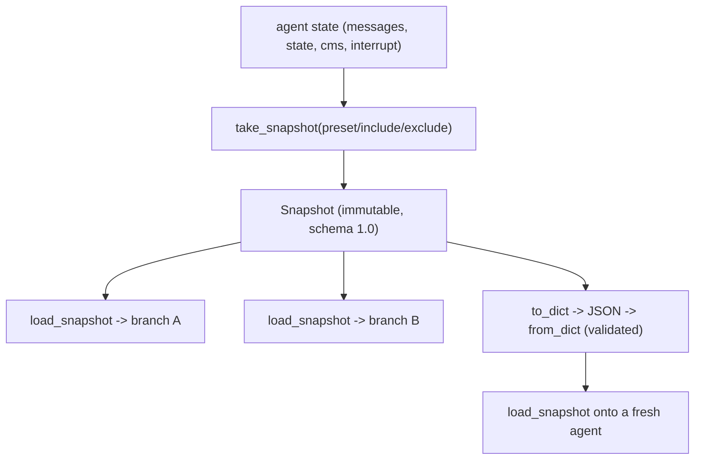

# Level 64: SDK Snapshots — Selective In-Memory State Capture / Restore
**Date:** 2026-06-02 | **File:** `13_state_persistence/sdk_snapshots.py`
**Depends on:** L5 / L57 (sessions & state — the auto-persist baseline)
**Unlocks:** L65 (Experimental Checkpoint — event-positioned AUTO snapshots)

---

## Part 1 — For Humans

### What We Built
A lesson on capturing an agent's state as a plain, versioned, JSON object you can
hold in your hand — `take_snapshot()` to grab it, `load_snapshot()` to put it back.
Unlike a session manager (which silently writes everything to disk every turn),
snapshots are explicit, selective, and immutable, so one saved point can branch
into many "what-if" futures with no storage backend at all.

### How It Works

```
        conversation so far
                |
                v
       [ take_snapshot ]  pick fields:
                |          messages? state? ...
                v
        +---------------+   immutable
        |   Snapshot    |   JSON object
        | data{...}     |
        +-------+-------+
                |  load_snapshot (many times)
       +--------+--------+
       v        v        v
   [branch A][branch B][to JSON -> wire]
```

### What Went Wrong
1. **Expected a "snapshot everything" default.** Calling `take_snapshot()` with no
   arguments doesn't grab the whole agent — it *raises* `SnapshotException`, because
   the resolved field set is empty. There is no default; you must name a preset or
   fields. (`exclude`-only also raises.) Once you know it, it's a feature: capture
   is always intentional.

### What Worked
1. **Drive the mechanics through `agent.state`, not the model.** A key-value store
   gives deterministic before/after values, so the round-trip, selective, and JSON
   iterations assert hard facts with zero LLM flakiness. One real turn powers only
   the branching demo, where the model's answer is the point.
2. **Branch off one immutable snapshot.** `take_snapshot` deepcopies at capture, so
   `load_snapshot(base)` in a loop spawns independent timelines and never mutates
   `base`. Restore, ask A; restore, ask B — two answers, one saved point.
3. **Treat the snapshot as a wire format.** `to_dict()`/`from_dict()` round-trip it
   through JSON onto a *different* agent instance, and `from_dict` version-gates the
   load — a tampered schema is rejected, not silently accepted.

### The Single Most Important Thing
A snapshot is not "save the agent" — it's "save exactly the slice of state I name,
as an immutable JSON value I own." That reframing is what unlocks branching,
selective rollback, and backend-free transfer: because the snapshot is a plain,
detached value (not a live handle into a session store), you can keep several of
them, restore any one onto any agent, and grow a different future from each.

---

## Part 2 — For LLMs

### Architecture



```
[agent state: messages,state,cms,interrupt]
                 |
                 v
   [take_snapshot(preset/include/exclude)]
                 |
                 v
   [Snapshot: immutable, schema 1.0]
        |        |          |
        v        v          v
   [branch A][branch B][to_dict->JSON->from_dict]
                              |
                              v
                  [load onto a fresh agent]
```

### Decision Log

| Decision | Why | Trade-off |
|----------|-----|-----------|
| `agent.state` for iters 1-3 | Deterministic asserts, no LLM variance | Less "realistic" than message-based state |
| One real turn only in iter4 | Branching answer is the payoff worth a call | Adds the sole network dependency |
| Assert no-args raises | Document the no-default behavior as a contract | — |
| Restore onto a *different* agent in iter3 | Prove the snapshot is detached/portable, not a live handle | — |
| Frame against L57 throughout | Snapshot only makes sense as the opt-in, selective contrast | Assumes L57 context |

### Pseudocode — Key Patterns

```
# Selective capture + partial restore
snap = take_snapshot(include=["state"])      # only state captured
... mutate messages AND state ...
load_snapshot(snap)                           # state rolled back; messages untouched

# Branch one snapshot into N timelines
base = take_snapshot(preset="session")
for prompt in prompts:
    load_snapshot(base)                       # rewind to the same point
    answer = agent(prompt)                    # diverge
# base is unchanged (immutable deepcopy)

# Backend-free transfer
wire = json.dumps(snap.to_dict())             # send anywhere
other_agent.load_snapshot(Snapshot.from_dict(json.loads(wire)))  # validates schema
```

### Observation Log

| # | Category | Topic | Observation |
|---|----------|-------|-------------|
| 1 | insight | snapshot-vs-session-contrast | Explicit, in-memory, selective, immutable, many-timeline — vs L57 auto/continuous/whole-state/one-timeline |
| 2 | mistake | take-snapshot-no-args-raises | No "everything" default; no preset+no include -> SnapshotException; order preset->include->exclude |
| 3 | insight | session-preset-omits-system-prompt | preset "session" = messages/state/cms/interrupt, NOT system_prompt (add via include) |
| 4 | pattern | partial-restore-by-design | load_snapshot restores only present fields; absent left unchanged -> surgical rollback |
| 5 | pattern | branch-from-one-immutable-snapshot | Deepcopy at capture; restore-and-ask loop spawns N timelines; base never mutated (ORCHID/DIHCRO) |
| 6 | insight | snapshot-is-plain-json-version-gated | to_dict/from_dict over JSON to a fresh agent; schema 9.9 -> SnapshotException; no backend |
| 7 | pattern | deterministic-asserts-via-agent-state | Use agent.state for hard asserts; reserve real turns for the conversational payoff |

### Forward Links

- **Unlocks L65 (Experimental Checkpoint):** same `Snapshot` machinery, but taken
  AUTOMATICALLY at event-loop positions (`after_model` / `after_tools`) instead of
  by an explicit call — checkpoint = snapshot fired by a hook.
- **Contrasts L57 (sessions):** when you need automatic, continuous, whole-state
  persistence on a single timeline, use a session manager; when you need explicit,
  selective, branchable, backend-free captures, use snapshots.
- **Revisit when:** you want rollback-before-risky-tool, what-if branching, or to
  move agent state across a process boundary as JSON without a session store.
