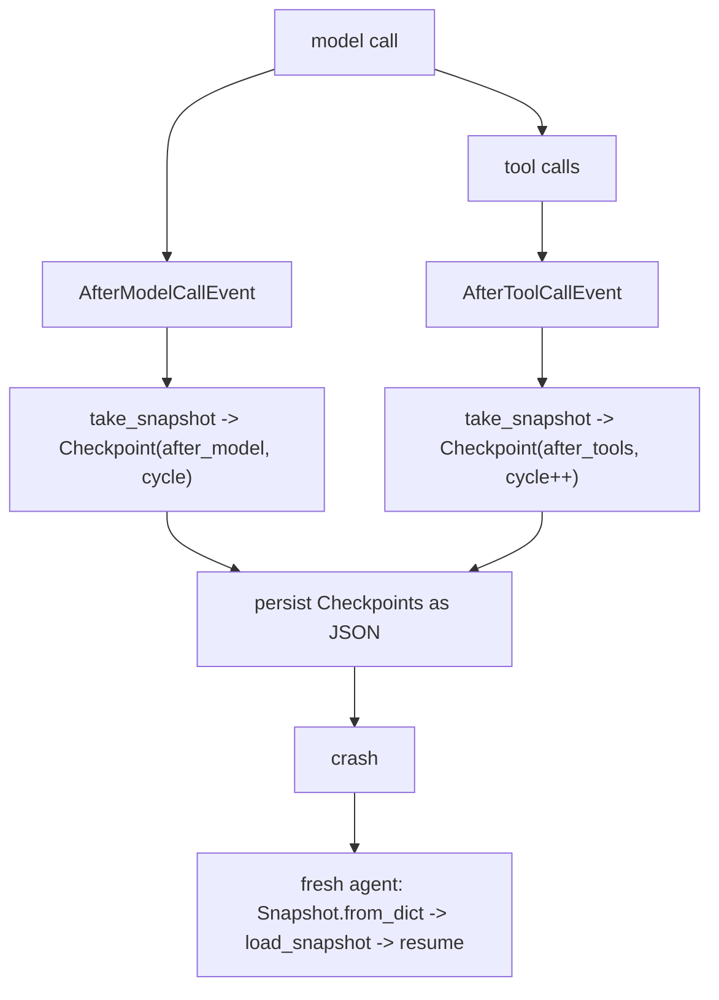

# Level 65: Experimental Checkpoint — Durable-Execution Contract + Hook Realization
**Date:** 2026-06-02 | **File:** `13_state_persistence/checkpoint.py`
**Depends on:** L64 (snapshots), L21/L28 (hooks), L57 (sessions baseline)
**Unlocks:** durable execution (swap hooks for Temporal when the auto-runtime ships)

---

## Part 1 — For Humans

### What We Built
A lesson on durable execution — checkpointing an agent at ReAct cycle boundaries so a
crashed run can resume where it left off. The catch we discovered: the SDK ships the
checkpoint *data contract* but not the machinery that auto-pauses and resumes. So we
proved what's missing, then built the same behaviour ourselves with lifecycle hooks —
and it actually works: an agent computes 12+30, "crashes," and a fresh agent resumes
and still remembers the answer.

### How It Works

```
agent loop (one ReAct cycle):
   model call ---> [after_model] snapshot -> Checkpoint
       |
   tool calls ---> [after_tools] snapshot -> Checkpoint
       |
   (crash here)
       |
   fresh agent <- load_snapshot(last Checkpoint) -> resume
```

### What Went Wrong
1. **The docstring promised a runtime that isn't there.** `strands.experimental.checkpoint`
   describes "pause via `stop_reason='checkpoint'`, state via `AgentResult.checkpoint`,
   resume via a `checkpointResume` block." Probing showed `AgentResult` has no
   `checkpoint` field, nothing sets that stop_reason, and `invoke` has no resume param.
   It's a types-only scaffold in 1.42; the auto path needs Temporal. Fix: don't fake it
   — prove the gap, then realize the pattern with hooks.

### What Worked
1. **Hooks at the two positions.** `after_model` ↔ `AfterModelCallEvent`,
   `after_tools` ↔ `AfterToolCallEvent`. Snapshotting inside each hook produces a real
   `Checkpoint` per cycle boundary using shipped machinery.
2. **Resume onto a fresh agent.** `Snapshot.from_dict(checkpoint.snapshot)` →
   `load_snapshot` rebuilds full history in a brand-new process. The resumed agent
   recalled "42" — durable execution, demonstrated, not asserted on faith.
3. **The probe as a test.** Iteration 2 asserts the live SDK surface, so "verify before
   you build" is an executable step that will flip green the day the runtime ships.

### The Single Most Important Thing
A reserved type and a hopeful docstring are not a working feature. The word
"checkpoint" appears as a `StopReason`, there's a `Checkpoint` dataclass, and the docs
describe a full pause/resume flow — yet none of the runtime exists in 1.42. The honest,
useful move is to separate the *contract* (real, JSON-serializable, version-gated) from
the *runtime* (deferred), verify the boundary empirically, and then deliver the value
with the machinery that does exist (snapshots + hooks). That separation is the lesson.

---

## Part 2 — For LLMs

### Architecture



```
   [model call]---->[AfterModelCallEvent]
        |                   |
        |                   v
        |        [snapshot -> Checkpoint(after_model)]
        v                   |
   [tool calls]--->[AfterToolCallEvent]
        |                   |
        |                   v
        |        [snapshot -> Checkpoint(after_tools, cycle++)]
        |                   |
        +--------+----------+
                 v
         [persist JSON] --> [crash]
                 |
                 v
   [fresh agent: from_dict -> load_snapshot -> resume]
```

### Decision Log

| Decision | Why | Trade-off |
|----------|-----|-----------|
| Prove "not wired" in-lesson | Empirical honesty; flips green if a future SDK ships it | One iteration spent on verification, not features |
| Realize with hooks vs skip L65 | Delivers durable execution with shipped machinery | Manual cycle tracking; not the official auto path |
| Track cycle_index on after_tools | The cycle boundary; events carry no cycle number | Caller-maintained counter |
| Resume onto a *fresh* agent | Proves true cross-process durability, not in-place reuse | Must reconstruct tools on the new agent |
| Use a tool turn (`add`) | Forces both positions to fire (model + tools) | Needs a tool-capable model |

### Pseudocode — Key Patterns

```
# Realize checkpoints with hooks (the two positions)
on AfterModelCallEvent:  checkpoints.append(Checkpoint("after_model", cycle, snapshot()))
on AfterToolCallEvent:   checkpoints.append(Checkpoint("after_tools", cycle, snapshot())); cycle += 1

# Durable resume (cross-process)
last = checkpoints[-1]
fresh_agent.load_snapshot(Snapshot.from_dict(last.snapshot))
fresh_agent(continue_prompt)        # full pre-crash history intact

# Verify a feature is wired before building on it
assert "checkpoint" not in AgentResult.__dataclass_fields__     # runtime field absent
assert "checkpoint" in get_args(StopReason)                     # type reserved
assert "checkpoint" not in signature(invoke_async).parameters   # no resume param
```

### Observation Log

| # | Category | Topic | Observation |
|---|----------|-------|-------------|
| 1 | insight | checkpoint-types-only-in-1.42 | Contract ships; auto runtime does not (no AgentResult.checkpoint, no stop_reason setter, no resume param) → Temporal |
| 2 | pattern | checkpoint-positions-map-to-hooks | after_model=AfterModelCallEvent, after_tools=AfterToolCallEvent; snapshot in each → Checkpoint per cycle |
| 3 | insight | checkpoint-snapshot-is-dict-not-object | Checkpoint.snapshot is Snapshot.to_dict() (JSON); from_dict raises ValueError vs Snapshot's SnapshotException |
| 4 | pattern | crash-resume-load-snapshot-fresh-agent | from_dict → load_snapshot onto a NEW agent; resumed agent recalled 42 (V0: metrics reset) |
| 5 | pattern | probe-as-lesson-iteration | Iteration 2 asserts the SDK surface to prove wiring; executable "verify before build" |
| 6 | insight | after-model-fires-before-message-commit | after_model snapshot lags the just-produced message by one (1→2→3 across positions) |

### Forward Links

- **Builds on L64 (snapshots):** a Checkpoint is an L64 snapshot dict tagged with a
  cycle position; resume is just `load_snapshot`.
- **Contrasts L57 (sessions):** session = continuous auto-persist on one timeline;
  checkpoint = explicit durable points for crash recovery / replay.
- **Uses L21/L28 (hooks):** the realization is pure lifecycle-hook plumbing.
- **Revisit when:** the Temporal-backed auto-runtime ships (`AgentResult.checkpoint`
  appears) — swap the manual hooks for it; or when you need crash-resilient long runs now.
