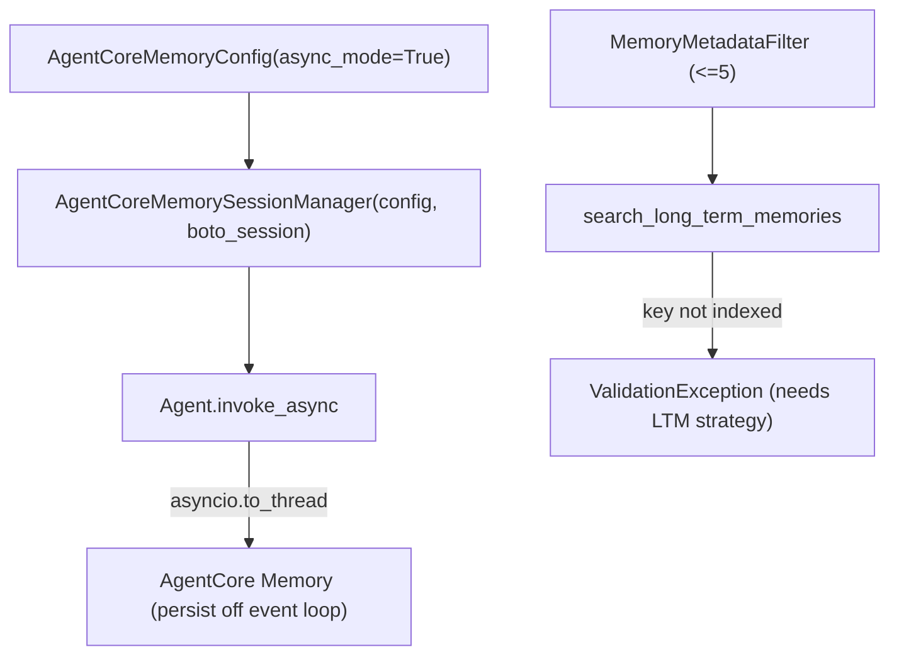

# Level 66: Async AgentCore Memory + LTM Metadata Filtering
**Date:** 2026-06-02 | **File:** `14_agentcore_platform/memory_async_ltm.py`
**Depends on:** L14 (long-term memory), L37 (AgentCore memory) | **Unlocks:** non-blocking memory-backed agents
**Versions:** bedrock-agentcore 1.12

> New level, born in v1.12. Reflected in the moment (right after the run).

---

## Part 1 — For Humans

### What We Built
Two new AgentCore Memory surfaces: (1) an **async** session manager that
offloads the blocking boto3 memory I/O to a worker thread so the event loop
isn't stalled, and (2) **MemoryMetadataFilter** — an indexed-metadata prefilter
for long-term-memory search.

### How It Works

```
  async_mode (config field):
    AgentCoreMemoryConfig(..., async_mode=True)
            |
            v
    agent.invoke_async(...)  --(persist via asyncio.to_thread)--> Memory
            |
    event loop keeps moving (boto3 write is OFF it)

  metadata filter:
    search_long_term_memories(query, namespace,
        metadata_filters=[{left:{metadataKey},operator,right:{metadataValue}}])
        (max 5; key must be an INDEXED metadata key)
```

### What Went Wrong
1. **`async_mode` is on the CONFIG, not the manager.** Plan said
   `AgentCoreMemorySessionManager(async_mode=True)`; reality is
   `AgentCoreMemoryConfig(async_mode=True)` passed as the manager's config.
2. **`MemorySessionManager` didn't inherit my SSO creds.** `boto_client=` is a
   `TypeError` (wrong kwarg); `region_name`-only built a default-chain client
   that 404'd (`UnrecognizedClientException`) despite `AWS_PROFILE`. **Fix: pass
   `boto3_session=<profile session>`.** (The strands manager worked because it
   got `boto_session=` explicitly.)
3. **The reused memory is STM-only** (no strategies) — so the filter can't show
   real results. The search returned `ValidationException: Filter key 'topic' is
   not valid`, which actually *proves* the point: the call + filter are
   well-formed; the key must be INDEXED by an LTM strategy.

### What Worked
1. async_mode end-to-end: `invoke_async` completed and persisted async. Verified.
2. The filter dict shape is correct, and the **≤5-filter `ValueError`** is
   enforced by the SDK. Verified.

### The Single Most Important Thing
Real LTM metadata filtering is **extraction-gated**: the filter API works
immediately, but a filter key only becomes valid once an LTM strategy has
extracted records carrying that indexed metadata. Don't conflate "the filter API
works" with "filtering returns results" — they're separated by async extraction
latency. (Verified the former; documented the latter rather than fake it.)

---

## Part 2 — For LLMs

### Architecture



```
 AgentCoreMemoryConfig(async_mode=True)
        |
   AgentCoreMemorySessionManager(config, boto_session=profile)
        |
   Agent.invoke_async  --asyncio.to_thread--> Memory (off event loop)

 MemoryMetadataFilter (<=5) -> search_long_term_memories
        |
   key not indexed -> ValidationException (LTM strategy required)
```

### Decision Log

| Decision | Why | Trade-off |
|----------|-----|-----------|
| `async_mode` on `AgentCoreMemoryConfig` | that's where the field lives | must use `invoke_async`/`stream_async` |
| `boto3_session=` on `MemorySessionManager` | default chain didn't get SSO creds | extra arg vs. relying on env |
| reuse STM-only memory | avoids slow LTM provisioning | can't show real filtered results |
| document extraction-gating | honest; no faked LTM results | lesson stops at the API + constraint |

### Pseudocode — Key Pattern

```
cfg = AgentCoreMemoryConfig(memory_id, actor_id, session_id, async_mode=True)
mgr = AgentCoreMemorySessionManager(cfg, region_name, boto_session=profile)
asyncio.run(Agent(model, session_manager=mgr).invoke_async("..."))   # off-loop persist

msm = MemorySessionManager(memory_id, boto3_session=profile)          # NOT region-only
f = {"left": MemoryRecordLeftExpression.build("topic"),
     "operator": OperatorType.EQUALS_TO.value,
     "right": MemoryRecordRightExpression.build_string("billing")}
msm.search_long_term_memories(query, namespace="/", metadata_filters=[f])  # <=5
```

### Observation Log

| # | Category | Topic | Observation |
|---|----------|-------|-------------|
| 1 | pattern | async-mode-verified | config-field async_mode + invoke_async; persists via asyncio.to_thread |
| 2 | mistake | memorysessionmanager-creds-not-inherited | `boto3_session=` required; region-only -> UnrecognizedClientException |
| 3 | insight | ltm-filter-key-must-be-indexed | filter well-formed but key must be indexed by an LTM strategy; <=5 enforced |

### Forward Links
- **Builds on L37**: AgentCore memory basics; adds async I/O + indexed prefilter.
- **Revisit when**: a high-throughput agent's event loop stalls on memory I/O, or you need to scope LTM search by indexed metadata (provision an LTM strategy first).
