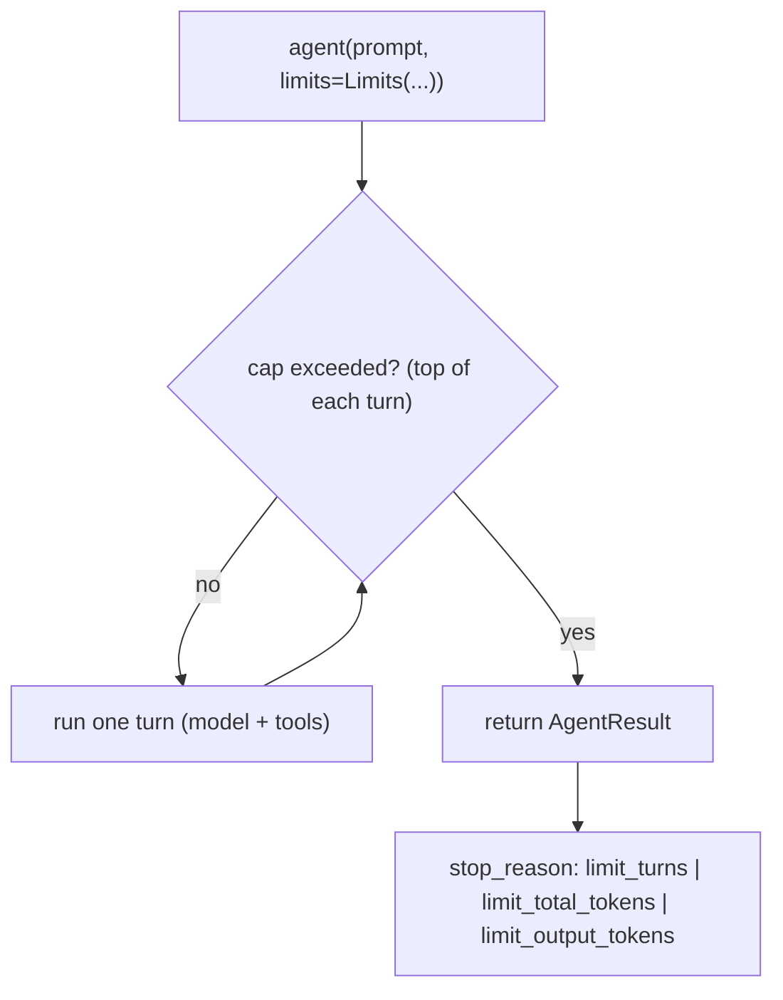

# Level 68: Invocation Limits — Cap an Agent Run by Turns or Tokens
**Date:** 2026-06-02 | **File:** `14_token_economics/invocation_limits.py`
**Depends on:** L21 (cost controls), L61 (token counting), L63 (tool offload) | **Unlocks:** L62 (cache TTL)
**Versions:** strands-agents 1.42 (`strands.types.Limits`)

> New level, born in v1.42. Verified on Gemini 2.5 Flash (the feature is
> model-agnostic; Anthropic budget was paused this session).

---

## Part 1 — For Humans

### What We Built
A lesson on `Limits` — a per-invocation budget on the agent loop. You cap a
single `invoke`/`stream` by `turns`, `output_tokens`, or `total_tokens`, and
when a cap is hit the run **stops gracefully** (a `stop_reason`, not an
exception) with the conversation left re-invokable.

### How It Works

```
   agent("prompt", limits=Limits(turns=3))
        |
        v
   loop iteration (checked at the TOP):
   +------------------------------------------+
   | budget exceeded?                         |
   |   no  -> run model + tools (one turn)    |
   |   yes -> STOP, set result.stop_reason    |
   +------------------------------------------+
        |
        v
   result.stop_reason in
   {limit_turns, limit_total_tokens, limit_output_tokens}
   (no exception; agent.messages still valid)
```

### What Went Wrong
1. The lesson wouldn't *run* at first — not a code bug, the **environment**: a
   `.pyc` import stall (see `sdk-v142-gemini-pivot-reflection.md`) and the
   Gemini-2.0-retired 404. Once `PYTHONDONTWRITEBYTECODE=1` + Gemini 2.5 were in
   place, it ran clean.

### What Worked
1. A **looping tool** (`take_step` that always says "call me again") + a
   system prompt that never self-terminates → the ONLY thing that stops the run
   is the limit. This makes the cap the star of the demo.
2. All four behaviors verified empirically on Gemini: graceful `stop_reason`,
   per-invocation reset (same agent, two runs both hit `turns=2`), priority
   (`turns=1 & output_tokens=1` → `limit_turns`), `TypeError` on `turns=0`.

### The Single Most Important Thing
`Limits` is the SDK-native backstop for the WHOLE loop — distinct from a
provider's `max_tokens` (which bounds one model call) and from your own cost
accounting (L21). It returns rather than raises, so "budget per step, then
continue" loops are trivial. Priority on simultaneous trip:
`turns > total_tokens > output_tokens`.

---

## Part 2 — For LLMs

### Architecture



```
 agent(prompt, limits=Limits(turns=3))
        |
        v
   +-----------------------------+
   | cap exceeded? (turn top)    |<---+
   |  no -> run one turn --------+----+
   |  yes-> return AgentResult        |
   +-----------------------------+
        |
        v
 result.stop_reason in
 {limit_turns, limit_total_tokens, limit_output_tokens}
```

### Decision Log

| Decision | Why | Trade-off |
|----------|-----|-----------|
| looping tool + non-terminating prompt | makes the cap the only stop condition | needs a tool-reliable model |
| Gemini 2.5 Flash | Anthropic budget paused; Limits is model-agnostic | thinking-model token overhead skews tiny output caps |
| assert each `stop_reason` | empirical proof, not docstring trust | model nondeterminism in exact turn counts |

### Pseudocode — Key Pattern

```
from strands.types import Limits
r = agent("Begin.", limits=Limits(turns=3))
assert r.stop_reason == "limit_turns"          # graceful, no exception
r2 = agent("Begin.", limits=Limits(turns=2))   # same agent -> counter RESET
agent("x", limits=Limits(turns=0))             # raises TypeError (positive int only)
```

### Observation Log

| # | Category | Topic | Observation |
|---|----------|-------|-------------|
| 1 | pattern | invocation-limits-verified | turns/output/total caps; graceful stop_reason; reset; priority turns>total>output |
| 2 | mistake | gemini-2.0-flash-retired-at-runtime | model alias 404'd at call time; → 2.5-flash |

### Forward Links
- **vs provider `max_tokens`**: that bounds one model call; `Limits` bounds the loop.
- **Pairs with L63 (offload)** + **L15-v142 (proactive compression)**: shrink each turn; `Limits` caps how many.
- **Revisit when**: building budget-bounded or step-metered agent loops.
