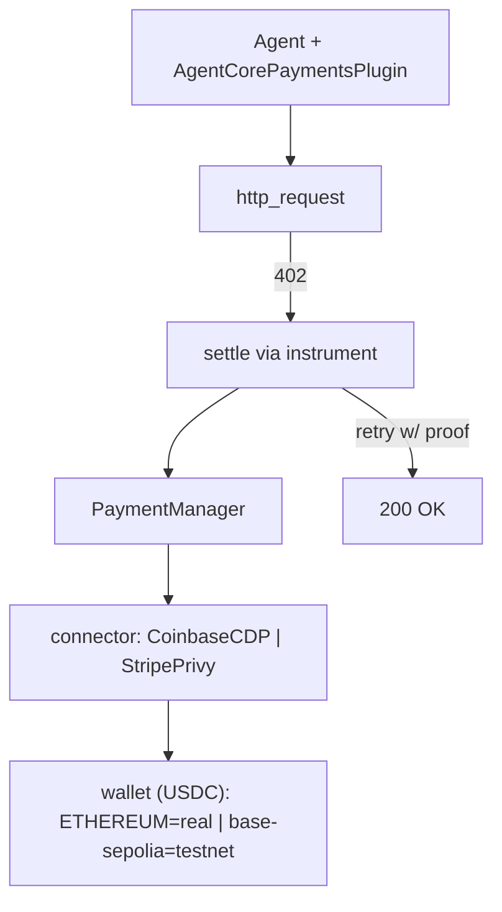

# Level 69: AgentCore Payments — Agentic x402 Micropayments (Guarded)
**Date:** 2026-06-02 | **File:** `14_agentcore_platform/payments.py`
**Depends on:** L27 (AgentCore runtime), L9 (tools) | **Unlocks:** autonomous pay-per-use agents
**Versions:** bedrock-agentcore 1.12

> New level, born in v1.12. Built cost-tiered after a user gate: Tier 0 (offline)
> + Tier 1 (provision, free) DONE; Tier 2 (testnet settlement) investigated +
> documented only (no Coinbase experience); Tier 3 (mainnet) never unsolicited.

---

## Part 1 — For Humans

### What We Built
A lesson on **agentic payments**: an agent that can pay for things over HTTP.
When it calls a paid endpoint and gets `402 Payment Required` (the x402 protocol),
the `AgentCorePaymentsPlugin` settles the payment (stablecoin) and retries —
autonomously. Built in cost tiers so we never spend real money by accident.

### How It Works

```
  agent -> http_request("https://paid.api/...")
              |
        402 Payment Required (x402 terms)
              |
   AgentCorePaymentsPlugin settles via a payment instrument
   (PaymentManager -> connector (Coinbase|Stripe) -> wallet, USDC)
              |
        retry with payment proof -> 200 OK
```

### What Went Wrong
1. **`user_id` required** — `AgentCorePaymentsPluginConfig` rejects construction
   without `user_id` (SigV4 auth) unless you pass a bearer token.
2. **Payment-manager name regex** is alphanumeric-only (`[a-zA-Z][a-zA-Z0-9]{0,47}`)
   — *no underscores* (datasets allowed them; this didn't).
3. **Execution role needs `bedrock-agentcore:CreateWorkloadIdentity`** — a bare
   trust policy isn't enough; `CreatePaymentManager` validates the role can manage
   workload identities. Plus an IAM-propagation wait before the service sees it.

### What Worked
1. **Cost gate before spending.** Verified via the AWS pricing page that AWS
   charges for **wallet operations only** (`CreateInstrument` + `ProcessPayment`),
   not for a PaymentManager existing — so Tier 1 `create → get → delete` is FREE.
   *Verified, not assumed.*
2. **Offline Tier 0** — construct the plugin (placeholder ARN, no AWS call) and
   inspect `plugin.tools` → 5 payment tools + 402 hooks. Proves the integration
   with zero cost.
3. **Self-cleaning Tier 1** — `try/finally` deletes the manager + role even on
   error; the manager reached `READY` then was deleted.

### The Single Most Important Thing
For a feature that can move real money, the discipline is: **verify the cost
model first, default to the zero-cost tier, and gate every escalation.** Tier 0
proves the SDK integration for free; control-plane provisioning is free;
settlement is testnet-only (free faucet tokens); mainnet needs an explicit cap.
The tiers aren't ceremony — they're how you let an agent hold a wallet safely.

---

## Part 2 — For LLMs

### Architecture



```
 Agent + AgentCorePaymentsPlugin
        | http_request -> 402
        v
   settle via instrument
        |
   PaymentManager -> connector(Coinbase|Stripe) -> wallet(USDC)
        |                                   ETHEREUM=real / base-sepolia=testnet
   retry with proof -> 200 OK
```

### Decision Log

| Decision | Why | Trade-off |
|----------|-----|-----------|
| tier by cost; default Tier 0 | feature moves real money | full settlement not shown (needs testnet + Coinbase) |
| verify pricing via docs first | "probably free != verified free" | one WebFetch |
| Tier 1 behind `--provision` | safe default run | provisioning is opt-in |
| role grants CreateWorkloadIdentity | `CreatePaymentManager` validates it | broad-ish `Resource:*` for the demo |

### Pseudocode — Key Pattern

```
# Tier 0 (offline): plugin = AgentCorePaymentsPlugin(config(arn=placeholder, user_id=...))
#   -> plugin.tools == [http_request, get/list_payment_instruments, get_payment_session]
# Tier 1 (free): role(+CreateWorkloadIdentity) -> create_payment_manager(name[alnum],
#   authorizerType="AWS_IAM", roleArn) -> get -> delete (self-clean)
# Tier 2 (testnet, documented): connector=CoinbaseCDP, instrument wallet on base-sepolia
# Tier 3 (mainnet): NEVER without an explicit per-amount cap
```

### Observation Log

| # | Category | Topic | Observation |
|---|----------|-------|-------------|
| 1 | pattern | payments-x402-plugin | 5 payment tools + 402 hooks; offline-safe construction; user_id required |
| 2 | insight | payments-pricing-is-wallet-ops-only | charges only on CreateInstrument/ProcessPayment; manager is free |
| 3 | pattern | payment-manager-provisioning | name alnum-only; role needs CreateWorkloadIdentity + IAM propagation |

### Forward Links
- **Builds on L27**: payment-capable deployed agents.
- **Tier 2 escalation**: needs a Coinbase CDP credential + a testnet x402 endpoint.
- **Revisit when**: giving an agent autonomous pay-per-use access (start on testnet).
