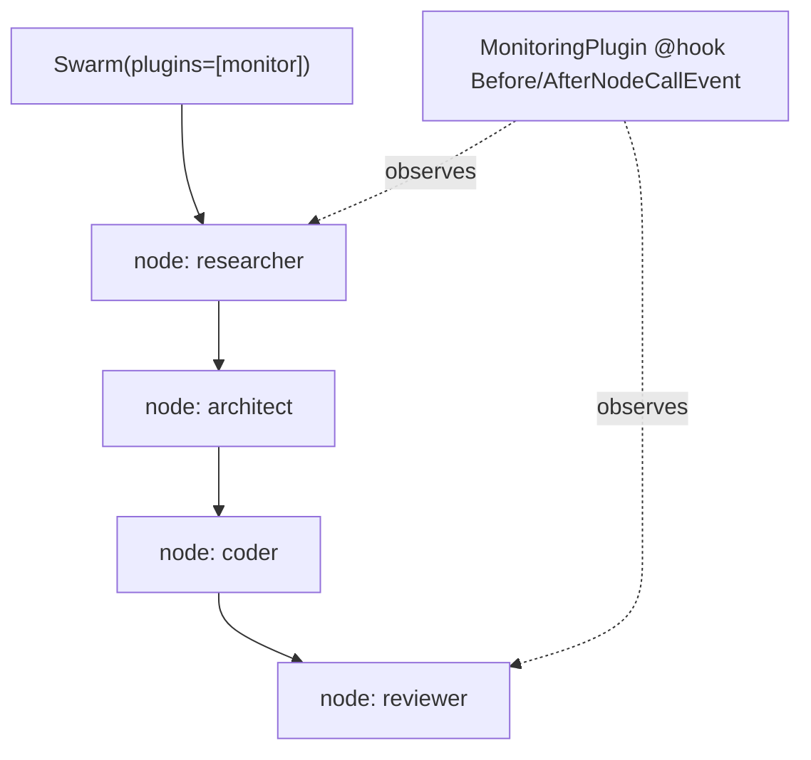

# Level 7 (v1.42): Swarm Monitoring via MultiAgentPlugin
**Date:** 2026-06-02 | **File:** `03_multi_agent/swarm_example.py`
**Depends on:** L7 (swarm basics), L30 (agent-level Plugin / AgentSkills) | **Unlocks:** L8 (same plugin on a Graph)

> v1.42 extension. Complements `level-7-reflection.md` (swarm fundamentals);
> this one is only about the new `MultiAgentPlugin` orchestrator hooks.

---

## Part 1 — For Humans

### What We Built
A **MonitoringPlugin** for the existing 4-agent dev-team swarm. It's an
*orchestrator-level* plugin: it changes nothing about any single agent — it
observes the **swarm itself**, firing a callback before and after each agent's
turn ("node"). You can now watch researcher → architect → coder → reviewer hand
off live, and you have a clean hook point for tracing/metrics/guardrails at the
orchestration layer.

### How It Works

```
        Swarm(plugins=[MonitoringPlugin()])
                     |
   per node turn:    v
   +---------------------------------+
   |  BeforeNodeCallEvent (node_id)  |--> [monitor] "-> researcher"
   +---------------------------------+
                     |
                     v   (agent runs its turn, may hand off)
   +---------------------------------+
   |  AfterNodeCallEvent  (node_id)  |--> [monitor] "<- researcher"
   +---------------------------------+
                     |
                     v
            next node / done
```

### What Went Wrong
1. **`AttributeError: '_hooks'` at swarm construction.** My plugin defined its
   own `__init__` (to hold a `timeline`) but did NOT call `super().__init__()`.
   The base `MultiAgentPlugin.__init__` is where `@hook` methods get
   auto-discovered into `self._hooks`; skipping it left `_hooks` unset and the
   registry crashed. The SDK docstring example omits `__init__`, so the
   requirement was invisible. **Fix: `super().__init__()` first.**
2. **Claude budget exhausted** — swap the four agents from `claude-3-5-haiku`
   (LiteLLM) to `get_model("gemini-2.5-flash")` (direct).

### What Worked
1. `event.node_id` is the entire API for lifecycle logging — fires for every
   node, identically on Swarm and Graph.
2. A stateful plugin instance accumulates the full timeline; after `swarm(...)`
   you print all 8 events (before+after × 4 nodes).

### The Single Most Important Thing
A `Plugin` (L30) extends ONE agent — hooks its invocation, may add `@tool`s.
A `MultiAgentPlugin` extends the ORCHESTRATOR — hooks each node's turn, and
canNOT add tools (orchestrators have no tool registry). Same `@hook` decorator,
different scope. Choose the layer that matches what you want to observe/change.

---

## Part 2 — For LLMs

### Architecture



```
+----------------------------+
| Swarm(plugins=[monitor])   |
+-------------+--------------+
              v
[researcher]->[architect]->[coder]->[reviewer]
     ^                                  ^
     |        MonitoringPlugin          |
     +----  @hook Before/After  --------+
              NodeCallEvent
           (observes each node)
```

### Decision Log

| Decision | Why | Trade-off |
|----------|-----|-----------|
| `super().__init__()` in plugin `__init__` | base discovers `@hook`s into `_hooks` | easy to forget; SDK example omits `__init__` |
| stateful `timeline` on the plugin | post-run inspection of the full sequence | instance is stateful — don't reuse across runs |
| Gemini 2.5 Flash direct | Claude budget paused; model is incidental | thinking-model latency per turn |

### Pseudocode — Key Pattern

```
class MonitoringPlugin(MultiAgentPlugin):
    name = "swarm-monitor"
    def __init__():
        super().__init__()            # MANDATORY: populates self._hooks
        self.timeline = []
    @hook BeforeNodeCallEvent(e): append "-> " + e.node_id
    @hook AfterNodeCallEvent(e):  append "<- " + e.node_id

Swarm([researcher, architect, coder, reviewer], plugins=[MonitoringPlugin()])
```

### Observation Log

| # | Category | Topic | Observation |
|---|----------|-------|-------------|
| 1 | mistake | multiagentplugin-missing-super-init | custom `__init__` w/o `super().__init__()` → `AttributeError '_hooks'` |
| 2 | insight | multiagentplugin-must-call-super-init | orchestrator-level (node lifecycle) vs L30 agent-level (invocation + tools) |
| 3 | pattern | gemini-direct-course-switch | swarm swapped to Gemini 2.5 Flash; the pattern is model-agnostic |

### Forward Links
- **Unlocks L8**: identical plugin attaches to a `Graph` via `GraphBuilder.set_plugins([...])`.
- **Contrast L30**: agent-level `Plugin` (`AgentSkills`) — `Agent(plugins=[...])`, `BeforeInvocationEvent`, may add `@tool`s.
- **Revisit when**: adding orchestration-layer tracing, cost metering, or per-node guardrails.
