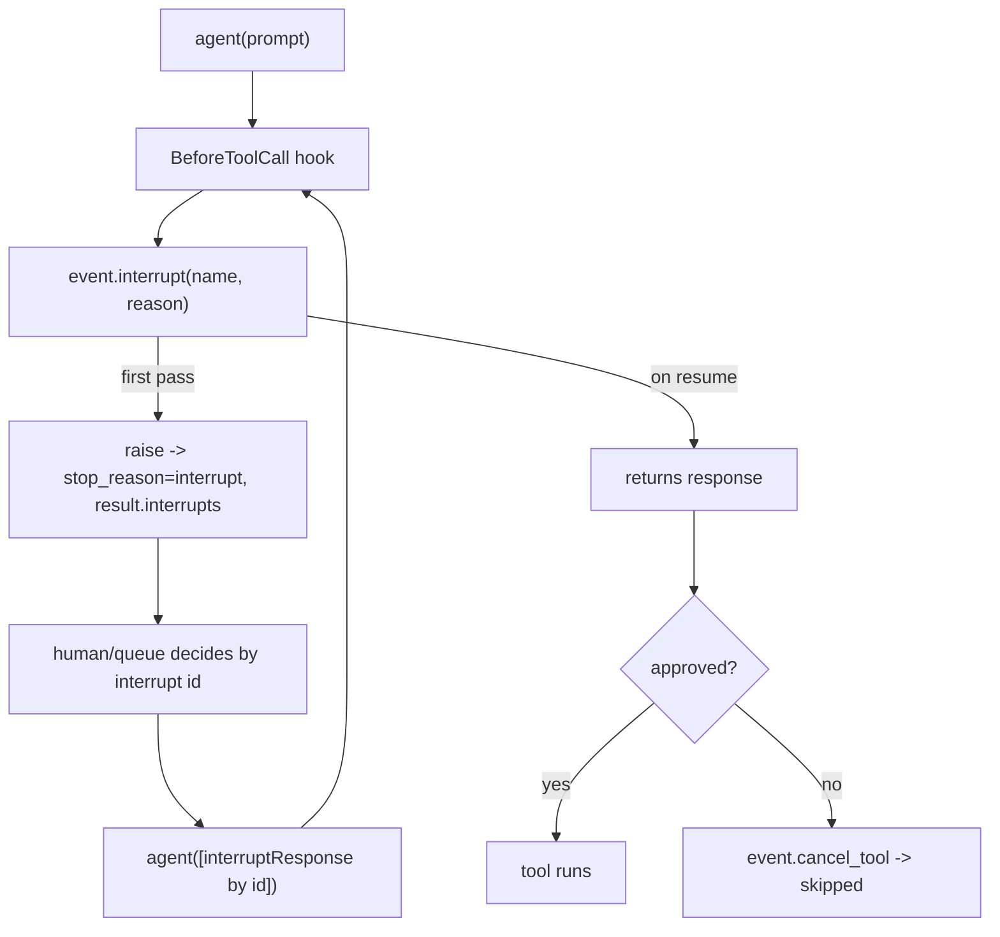

# Level 70: Native Interrupts — Human-in-the-Loop Approval Gates
**Date:** 2026-06-02 | **File:** `12_orchestration/interrupts_hitl.py`
**Depends on:** L21/L28 (hooks), L47 (hand-rolled HITL pattern), L22 (safety gates)
**Unlocks:** approval queues, async human review (pairs with L57 for durable resume)

---

## Part 1 — For Humans

### What We Built
A real approval gate: the agent goes to delete something, the loop *pauses* mid-tool,
a structured "approve this?" request comes back to our code, and once a human says yes
or no the agent resumes exactly where it stopped. It uses the SDK's native interrupt
primitive — no hand-rolled save-and-reconstruct like the older HITL pattern.

### How It Works

```
agent wants to call delete_object('prod-db')
            |
            v
   [BeforeToolCall hook]
   decision = event.interrupt(...)   <-- PAUSES here
            |
   stop_reason="interrupt" ---> human sees {key: prod-db}
            |
   resume agent([response by id])
            |
   same hook runs again; interrupt() RETURNS the answer
        approve -> tool runs    deny -> cancel_tool, skipped
```

### What Went Wrong
Nothing failed in the build — the probe-first check (run the approve AND deny paths
live before writing) meant the lesson worked on the first full run. The one thing I was
careful NOT to overclaim: resuming on a *fresh* agent in another process. Interrupt
state is in-memory, so true cross-process resume needs a session manager (L57). I framed
that as the documented extension rather than demonstrating something I hadn't tested.

### What Worked
1. **One hook line, two behaviours.** `decision = event.interrupt("approve_delete", reason=...)`
   raises (pausing) the first time and returns the human's answer on resume. The hook
   reads like ordinary code; the SDK hides the pause/resume.
2. **`cancel_tool` makes it a real gate.** On deny, setting `event.cancel_tool` skips the
   tool and tells the model — execution is controlled, not just logged.
3. **Resume by id.** The interrupt is JSON keyed by `id`; you can stash it in a queue and
   resume later with only that id. No live object required.

### The Single Most Important Thing
An interrupt turns "the agent loop" from a thing you must run to completion into a thing
you can *pause and hand to a human*, then continue — without rebuilding any state
yourself. The same hook code is both the question ("may I delete prod-db?") and the
continuation ("they said yes, proceed"), because the SDK re-enters the hook on resume and
makes `event.interrupt()` return the answer. That collapses the entire hand-rolled
stop/persist/reconstruct dance (L47) into one linear function.

---

## Part 2 — For LLMs

### Architecture



```
        [agent(prompt)]
              |
              v
     [BeforeToolCall hook]
              |
   [event.interrupt(name,reason)]
        |               ^
   first pass           | on resume -> returns response
        v               |
[raise: stop=interrupt, |
 result.interrupts]     |
        |               |
        v               |
[human decides by id]   |
        |               |
        v               |
[agent([response by id])]
        |
        v
   {approved?}--yes-->[tool runs]
        |
        no
        v
   [event.cancel_tool -> skipped]
```

### Decision Log

| Decision | Why | Trade-off |
|----------|-----|-----------|
| Gate via BeforeToolCallEvent | The natural choke point before a side effect | Per-tool; broad policy gates need more hooks |
| `cancel_tool` on deny | Turns approval into enforcement, not advice | Model must handle a cancelled tool gracefully |
| Resume same agent instance | Interrupt state is in-memory; honest + simple | Cross-process resume needs L57 (not shown) |
| Structured `reason` ({key}) | The approver sees *what* they're approving | Caller must design a useful reason payload |
| Probe approve+deny before writing | Fourth lesson where live-first avoided guesswork | One extra probe run |

### Pseudocode — Key Patterns

```
# Raise from a hook (pauses), resume returns the answer
on BeforeToolCallEvent(event):
    if event.tool_use.name == "delete_object":
        decision = event.interrupt("approve_delete", reason={key})   # raise then, return later
        if decision != "APPROVE":
            event.cancel_tool = "denied"

# Round-trip
paused = agent(prompt)
if paused.stop_reason == "interrupt":
    responses = [{"interruptResponse": {"interruptId": i.id, "response": ask_human(i)}}
                 for i in paused.interrupts]
    resumed = agent(responses)

# Out-of-band: enqueue {id, name, reason} as JSON; resume later by id only
```

### Observation Log

| # | Category | Topic | Observation |
|---|----------|-------|-------------|
| 1 | insight | interrupt-raises-then-returns | One hook line raises on pass 1 (pause), returns the response on resume; SDK keeps loop state |
| 2 | pattern | hitl-approval-gate-roundtrip | hook interrupt() -> stop_reason=interrupt + result.interrupts -> resume via interruptResponse blocks |
| 3 | pattern | cancel-tool-gates-execution | Deny sets event.cancel_tool -> tool skipped, model told; gated not advisory |
| 4 | insight | interrupt-is-portable-json-keyed-by-id | {interruptId,name,reason} JSON; enqueue + resume by id alone; no live object needed |
| 5 | insight | interrupt-state-in-memory-needs-session | In-memory state; durable cross-process resume layers L57 session manager |
| 6 | insight | interrupt-id-is-versioned-typed | id like "v1:before..." encodes version + originating hook position |

### Forward Links

- **Replaces L47 (HITL pattern):** the SDK does the stop/persist/reconstruct; you write a
  linear hook.
- **Contrasts L29 (steering):** steering auto-guides/blocks by policy; interrupts pause for
  a *human* and resume with their decision.
- **Contrasts L68 (invocation limits):** limits stop on budget; interrupts stop for approval
  and then continue the same run.
- **Revisit when:** any irreversible/side-effecting tool needs sign-off, or you want an async
  approval queue — add L57 to make the pause survive a process restart.
