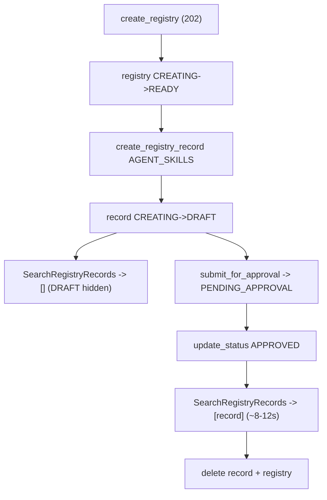

# Level 71: AgentCore Agent Registry — Publish & Discover an AGENT_SKILLS Bundle
**Date:** 2026-06-02 | **File:** `15_agentcore_registry/agent_registry.py`
**Depends on:** L30 (local AgentSkills plugin), L27/L33 (AgentCore control plane)
**Unlocks:** org-wide governed skill discovery (a cloud alternative to inline skills)

---

## Part 1 — For Humans

### What We Built
A round-trip through AWS's new Agent Registry: create a governed catalog, publish a
skill (as a real SKILL.md) into it, push it through an approval workflow, and then
discover it by semantic search — and watch that the skill is *invisible* to search
until an admin approves it. Then we delete everything so nothing lingers.

### How It Works

```
   create_registry (async)
        CREATING --> READY
              |
   publish AGENT_SKILLS record
        CREATING --> DRAFT
              |
   search  -> [] (hidden!)
              |
   submit -> PENDING_APPROVAL
   approve -> APPROVED
              |
   search  -> [invoice-extractor]  (~8-12s later)
              |
   delete record + registry
```

### What Went Wrong
1. **Assumed create was synchronous.** `create_registry` returns HTTP 202 and the
   registry sits in `CREATING`; my first teardown tried to delete it immediately and
   got `ConflictException`. Fix: poll `get_registry` until `READY` before using or
   deleting it (and `delete` is async too).
2. **Sent a bare markdown skill body.** `skillMd.inlineContent` must be a real
   SKILL.md with `---` YAML frontmatter, or you get a `ValidationException`. Fix: give
   it actual frontmatter.

### What Worked
1. **Two-phase probe.** First an *offline* `service_model` shape probe (no creds) to
   learn the ops and payload shapes, then a *live* self-tearing-down smoke probe to
   learn the async lifecycle and the approval-gates-search behaviour — all before
   writing the lesson. Zero guessing.
2. **Self-cleaning lesson.** Preflight creds check, cleanup-same-name at start, and a
   `finally` teardown that polls to `READY` before deleting. It left zero registries.
3. **Search before *and* after approval.** Running the identical query twice is what
   makes the governance gate visible rather than asserted.

### The Single Most Important Thing
Approval isn't a label here — it gates *discovery*. The exact same search query that
returns nothing while a skill is `DRAFT` returns it the moment it's `APPROVED`. That
turns "governance" from a status badge into a real access boundary: an unreviewed
skill simply doesn't exist as far as the rest of the org's agents can tell. That's the
difference between L30's local skills (you ship them, they run) and L71's registry
(you publish them, someone approves them, *then* they're findable).

---

## Part 2 — For LLMs

### Architecture



```
[create_registry (202)]
        |
        v
[registry CREATING -> READY]
        |
        v
[create_registry_record AGENT_SKILLS]
        |
        v
[record CREATING -> DRAFT]
   |              |
   v              v
[search -> []]  [submit -> PENDING_APPROVAL]
                   |
                   v
              [update_status APPROVED]
                   |
                   v
            [search -> [record] (~8-12s)]
                   |
                   v
            [delete record + registry]
```

### Decision Log

| Decision | Why | Trade-off |
|----------|-----|-----------|
| Offline shapes then live smoke | New AWS service; never guess API shape/behaviour | Two probe passes before any lesson code |
| autoApproval=False | Demonstrates the governance gate | Records need an explicit approve step |
| Poll READY before any use/delete | create/delete are async (202) | Adds polling loops everywhere |
| Search before AND after approval | Makes the gate observable, not asserted | One extra (empty) search call |
| try/finally + cleanup-same-name | Cost-safe, re-runnable, leaves nothing | More plumbing than a throwaway script |

### Pseudocode — Key Patterns

```
# Async resource: always poll out of the transient state
create_registry(...)                 # 202
wait_until(get_registry.status == "READY")

# Governance gate
record = create_registry_record(..., AGENT_SKILLS, skillMd=frontmatter+body)  # -> DRAFT
assert search(query) == []           # DRAFT is hidden
submit_for_approval(); update_status("APPROVED")
poll: search(query) eventually returns the record  # ~8-12s lag

# Always teardown
finally: delete_record; wait READY; delete_registry
```

### Observation Log

| # | Category | Topic | Observation |
|---|----------|-------|-------------|
| 1 | insight | registry-unified-governed-catalog | One catalog for MCP/A2A/CUSTOM/AGENT_SKILLS; control + data planes |
| 2 | insight | approval-gates-discovery | Search returns ONLY APPROVED; same query empty as DRAFT, found as APPROVED |
| 3 | mistake | create-registry-async-202 | create/delete are async (CREATING/DELETING); poll READY or hit ConflictException |
| 4 | mistake | skillmd-requires-frontmatter | skillMd.inlineContent must be '---'-frontmatter SKILL.md, else ValidationException |
| 5 | insight | search-eventually-consistent | ~8-12s lag between APPROVED and searchable; poll |
| 6 | pattern | record-governance-lifecycle | CREATING->DRAFT->PENDING_APPROVAL->APPROVED; ids from ARNs |
| 7 | pattern | two-phase-probe-new-aws-service | Offline service_model shapes + live smoke probe before writing |
| 8 | pattern | self-tearing-down-aws-lesson | Preflight + cleanup-same-name + finally teardown; left zero resources |

### Forward Links

- **Contrasts L30 (local AgentSkills):** L30 runs a skill in-process; L71 publishes,
  governs, and discovers one org-wide. Same concept ("a skill"), opposite lifecycle.
- **Builds on L27/L33 (AgentCore control plane):** same auth + control-plane idioms,
  new resource family (registries/records).
- **Revisit when:** you need a shared, reviewed catalog of skills/MCP/A2A for many
  agents, or to gate which capabilities are discoverable in an org.
