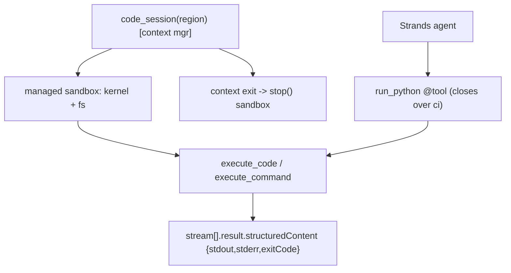

# Level 72: AgentCore Code Interpreter — A Managed Sandbox an Agent Can Run Code In
**Date:** 2026-06-02 | **File:** `16_agentcore_tools/code_interpreter.py`
**Depends on:** L24 (local/unsafe tool synthesis), L27 (AgentCore control plane)
**Unlocks:** L73 (AgentCore Browser — sibling managed tool), safe agentic code-run

---

## Part 1 — For Humans

### What We Built
A way to let an agent run arbitrary code safely. AgentCore's Code Interpreter is a
managed, isolated sandbox — a real Python kernel with state and a filesystem — that
you open with one `code_session(...)` context manager. We ran code, kept state across
calls, used the shell, and then handed the sandbox to a Strands agent that solved a
task by writing and running its own Python. None of it touched the local machine.

### How It Works

```
with code_session("us-east-1") as ci:
   ci.execute_code("...") --> AWS-managed sandbox
        |                        kernel + filesystem
        v
   {stdout, stderr, exitCode}  <-- structured result
        |
   (agent's run_python tool calls ci)
        |
   context exits --> sandbox stops
```

### What Went Wrong
1. **`InvalidClientTokenId` out of nowhere.** The pure-boto3 L71 worked, but L72 — which
   loads `LESSON_DOTENV` for the Gemini key — failed AWS auth. The `.env` injects static
   `AWS_*` keys that override the SSO profile (boto3 prefers env keys over `AWS_PROFILE`).
   Fix: after the import that loads the `.env`, drop those static keys when `AWS_PROFILE`
   is set, so the profile wins. This will bite *any* lesson that needs both Gemini and AWS.
2. **`pip install` silently did nothing.** `install_packages(['cowsay'])` returned without
   error but the package wouldn't import — the default sandbox has no network egress here.
   Soft-handled it (reported the truth) instead of asserting success.

### What Worked
1. **Structured results.** Every run returns `{stdout, stderr, exitCode}`. A sandbox error
   (`1/0`) comes back as `exitCode=1` + a traceback in `stderr` — *data*, not an exception
   in your process. That's exactly what makes it safe to feed an LLM.
2. **One `with` block for everything.** The sandbox, all four iterations, and the agent's
   tool share the same live session; the context manager tears it down on exit.
3. **Closure tool.** A `run_python` `@tool` closed over the live `ci` turned the sandbox
   into an agent capability in three lines.

### The Single Most Important Thing
The value isn't "run code" — it's that the result is **structured data in an isolated
place**. Because a crash is `exitCode != 0` rather than an exception on your box, and
because the kernel lives AWS-side, you can hand an LLM a `run_python` tool and let it
iterate on code it wrote without ever trusting that code near your machine. That's the
leap from L24's local subprocess (powerful but dangerous) to a managed sandbox
(powerful and contained).

---

## Part 2 — For LLMs

### Architecture



```
[code_session(region) context mgr]
        |
        v
[managed sandbox: kernel + filesystem]
        |
        v
[execute_code / execute_command]
        |
        v
[stream[].result.structuredContent {stdout,stderr,exitCode}]
        ^
        |
[run_python @tool (closes over ci)] <-- [Strands agent]

[context exit -> stop() sandbox]
```

### Decision Log

| Decision | Why | Trade-off |
|----------|-----|-----------|
| Drop env AWS keys when AWS_PROFILE set | LESSON_DOTENV injects static keys that break SSO | Lesson-specific env hygiene |
| One `code_session` for all iterations | State/filesystem persistence is part of the lesson | clear_context needed to show a reset |
| Soft-handle install_packages | Sandbox egress isn't guaranteed | Can't assert pip success |
| Agent tool closes over live `ci` | Share the running sandbox, no re-create | Tool lifetime tied to the `with` block |
| Default identifier (managed) | No custom resource to clean up | Less control than a custom interpreter |

### Pseudocode — Key Patterns

```
# Safe agentic code-run
with code_session(region) as ci:
    define run_python(code): return ci.execute_code(code).structuredContent.stdout
    agent(tools=[run_python])("solve X with code")   # writes+runs code in the sandbox

# Read a result
sc = first(resp["stream"]).result.structuredContent   # {stdout, stderr, exitCode, executionTime}
ok = (sc.exitCode == 0)

# Env hygiene for AWS + Gemini lessons
after import-that-loads-dotenv:
    if AWS_PROFILE set: del env AWS_ACCESS_KEY_ID / AWS_SECRET_ACCESS_KEY / AWS_SESSION_TOKEN
```

### Observation Log

| # | Category | Topic | Observation |
|---|----------|-------|-------------|
| 1 | mistake | lesson-dotenv-clobbers-aws-sso | LESSON_DOTENV static AWS keys override SSO -> InvalidClientTokenId; pop them when AWS_PROFILE set |
| 2 | insight | code-interpreter-managed-sandbox | code_session() context mgr; managed default; ephemeral sessions, no resource to delete |
| 3 | pattern | execute-code-structured-result | stream[].result.structuredContent {stdout,stderr,exitCode}; error is data not exception |
| 4 | insight | sandbox-stateful-kernel-and-fs | kernel state persists across calls; clear_context resets; filesystem persists in-session |
| 5 | insight | sandbox-no-pip-egress-default | install_packages ran but import failed — no egress here; soft-handle |
| 6 | pattern | sandbox-as-agent-tool | run_python @tool over live ci; Gemini computed fib(20)=6765 in the sandbox |

### Forward Links

- **Upgrades L24 (tool synthesis):** L24 ran generated code in a local subprocess/Docker;
  L72 runs it in an AWS-managed isolated sandbox with structured results.
- **Sibling L73 (Browser):** `browser_client` is the same managed-tool pattern for a
  headless Chrome over CDP.
- **Revisit when:** an agent must compute, transform data, or run untrusted code — give it
  a sandbox-backed `run_python` tool instead of `exec()` near your process.
