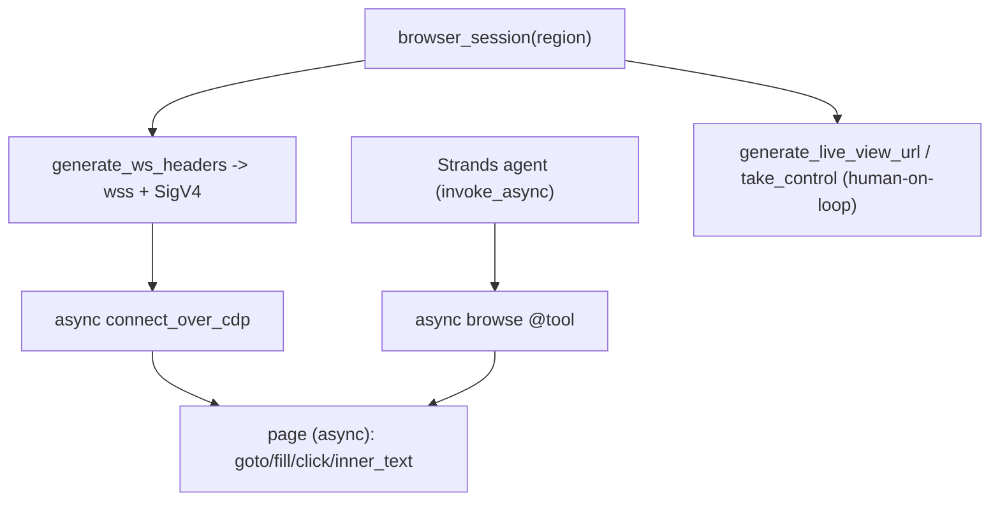

# Level 73: AgentCore Browser — A Managed Headless Chrome an Agent Can Drive
**Date:** 2026-06-02 | **File:** `16_agentcore_tools/browser.py`
**Depends on:** L72 (Code Interpreter — sibling managed tool), L27 (AgentCore plane)
**Unlocks:** safe agentic web browsing/scraping; human-on-the-loop via take_control

---

## Part 1 — For Humans

### What We Built
A way to give an agent a real web browser that runs in AWS, not on your laptop.
AgentCore's Browser is a managed headless Chrome; you open a session, get a signed
websocket, point Playwright at it, and drive the page — navigate, read, type, click.
Then we handed it to a Strands agent, which answered a question by browsing the live
page itself.

### How It Works

```
 browser_session("us-east-1")  --> managed Chrome (AWS)
        |
 generate_ws_headers() --> wss:// + SigV4 headers
        |
 playwright.connect_over_cdp(ws, headers)
        |
   page.goto / fill / click / inner_text
        |
   agent's browse tool calls page (async)
```

### What Went Wrong
1. **The agent + sync Playwright deadlocked.** Iterations 1–2 (just Playwright, no
   agent) worked perfectly. But the moment a Strands tool touched the *sync* Playwright
   page, it crashed: `greenlet.error: cannot switch to a different thread` +
   `TargetClosedError`. The cause: Strands runs the agent on its own asyncio loop, and
   sync Playwright runs its own loop in a greenlet — two loops, one collision. Fix:
   rewrite the whole lesson with **async Playwright + `agent.invoke_async` + an async
   tool**, so everything lives on one event loop.

### What Worked
1. **CDP to a remote browser.** `connect_over_cdp(ws_url, headers)` with the SigV4
   headers drives the AWS-hosted Chrome — no local browser binaries at all.
2. **`set_content` for the interaction demo.** Building the form inline instead of
   navigating to a third-party page kept iteration 2 deterministic and offline.
3. **Reusing the existing page.** `browser.contexts[0].pages[0]` — the managed session
   already has one; no need to spawn contexts.

### The Single Most Important Thing
When you mix two libraries that each own an event loop, pick *one* loop and make
everything async around it. The browser worked fine until an agent — itself an async
machine — reached into a synchronous browser object from its own loop. The lesson isn't
"Playwright is hard"; it's that **agent frameworks are async, so the tools you hand them
should be async too.** Going uniformly async (`async_playwright` + `invoke_async`) made
a crash-on-contact integration just work.

---

## Part 2 — For LLMs

### Architecture



```
[browser_session(region)]
        |
        v
[generate_ws_headers -> wss + SigV4]
        |
        v
[async connect_over_cdp]
        |
        v
[page (async): goto/fill/click/inner_text]
        ^
        |
[async browse @tool] <-- [Strands agent (invoke_async)]

[browser_session] --> [generate_live_view_url / take_control (human-on-loop)]
```

### Decision Log

| Decision | Why | Trade-off |
|----------|-----|-----------|
| Async Playwright + invoke_async | Sync Playwright's greenlet loop collides with Strands' loop | Whole lesson is async |
| connect_over_cdp (no local binaries) | The browser is remote (AWS) | Needs the playwright pip package |
| set_content for interaction | Deterministic, offline, no third-party flakiness | Not a "real site" demo |
| Reuse contexts[0].pages[0] | Managed session already has a page | Must guard for empty lists |
| Drop env AWS keys (AWS_PROFILE set) | LESSON_DOTENV static keys break SSO (L72) | Lesson-specific env hygiene |

### Pseudocode — Key Patterns

```
# Drive a remote managed browser
with browser_session(region) as client:
    ws, headers = client.generate_ws_headers()
    async with async_playwright() as p:
        browser = await p.chromium.connect_over_cdp(ws, headers=headers)
        page = browser.contexts[0].pages[0]
        await page.goto(url); text = await page.inner_text("body")

# Agent that browses (ONE event loop)
async def browse(url): await page.goto(url); return await page.inner_text("body")
await agent(tools=[browse]).invoke_async("what's on <url>?")   # async tool, async invoke
```

### Observation Log

| # | Category | Topic | Observation |
|---|----------|-------|-------------|
| 1 | insight | agentcore-browser-managed-cdp | browser_session -> generate_ws_headers (wss+SigV4) -> Playwright connect_over_cdp; no local binaries |
| 2 | mistake | sync-playwright-vs-strands-event-loop | sync Playwright greenlet loop vs Strands asyncio loop -> greenlet.error; fix = uniformly async |
| 3 | pattern | reuse-managed-context-page | Reuse browser.contexts[0].pages[0]; don't spawn new contexts |
| 4 | pattern | deterministic-browser-demo-set-content | page.set_content for offline, deterministic interaction demos |
| 5 | insight | browser-human-on-the-loop-surface | generate_live_view_url to watch; take_control/release_control to hand off |

### Forward Links

- **Sibling L72 (Code Interpreter):** same managed-tool-for-an-agent pattern; web vs REPL.
- **Reuses L70/L47 (human-on-the-loop):** live-view + take_control is HITL for browsing.
- **Revisit when:** an agent must read/act on the live web (research, forms, scraping)
  without a browser on your machine — and remember: async tools for an async agent.
