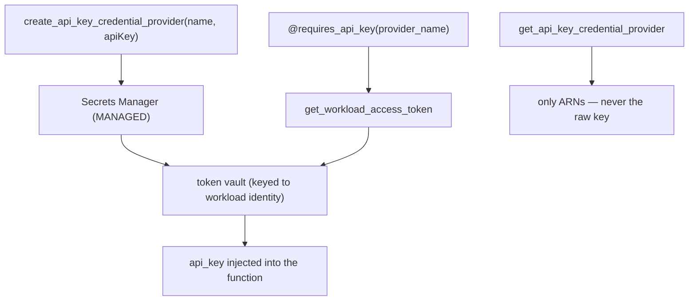

# Level 74: AgentCore Workload Identity — Agent Secrets in a Vault, Not in Code
**Date:** 2026-06-02 | **File:** `17_agentcore_identity/workload_identity.py`
**Depends on:** L27/L33 (AgentCore control plane), L22 (secret hygiene)
**Unlocks:** agents that call external APIs with no embedded secrets; OAuth (M2M / user)

---

## Part 1 — For Humans

### What We Built
A way for an agent to use an API key without the key ever being in its code. You
register the secret as a credential provider — it lands in AWS-managed Secrets
Manager — and the agent's function just declares `@requires_api_key(provider_name=…)`.
At call time the real key is fetched from the vault and injected. The control plane
never hands the plaintext back; your code holds a name and a decorator.

### How It Works

```
 create_api_key_credential_provider(name, apiKey)
        |  (raw key -> AWS Secrets Manager, MANAGED)
        v
   token vault  <-- keyed to a workload identity
        ^
        |  @requires_api_key(provider_name)
   def call_api(api_key=""):   <-- key injected at call time
```

### What Went Wrong
1. **Stale `.agentcore.json` → AccessDenied.** The decorator caches its workload
   identity + user id in a local `.agentcore.json`. An earlier probe cached an identity
   that I later deleted server-side, so L74's first run tried to reuse a dead identity:
   `AccessDeniedException: Workload Identity does not belong to caller account`. Fix:
   clear `.agentcore.json` at start (and gitignore it) so the decorator recreates one —
   crucial when you switch AWS accounts.

### What Worked
1. **The "no raw key" proof.** `Get` returns only `apiKeySecretArn` + `credentialProviderArn`;
   the plaintext never comes back. Asserting the secret is absent from the response is
   the whole security argument in one check.
2. **The decorator injected the real key locally.** The function received `…9931` (the
   real vaulted value) while referencing only its `api_key` parameter.
3. **Self-tearing-down identity.** Snapshot workload identities before, delete the new
   ones (decorator-auto + explicit) after, and clear the cache. Account left spotless.

### The Single Most Important Thing
The secret stops being something your code *has* and becomes something your code *asks
for*. `@requires_api_key(provider_name=…)` turns "where do I stash this key?" into a
runtime lookup against a vault keyed to the agent's identity. Rotate the value in one
place and every agent using that provider gets it — no env vars, no repo secrets, no
redeploy. That's the difference between a key in your code and a *capability* granted to
your agent's identity.

---

## Part 2 — For LLMs

### Architecture



```
[create_api_key_credential_provider(name, apiKey)]
        |
        v
[Secrets Manager (MANAGED)] --> [token vault (keyed to workload identity)]
        ^                                   ^
        |                                   |
[get_*_provider -> only ARNs,       [@requires_api_key -> get_workload_access_token]
 never raw key]                              |
                                             v
                                  [api_key injected into the function]
```

### Decision Log

| Decision | Why | Trade-off |
|----------|-----|-----------|
| API-key provider (not OAuth2) | Self-contained; no external IdP needed | Doesn't exercise the 3-legged flow |
| Assert raw key absent from Get | The security property made executable | — |
| Clear `.agentcore.json` at start | Stale cache → AccessDenied across accounts | A fresh workload identity per run |
| Snapshot-then-delete workload identities | Decorator auto-creates a byproduct one | Must diff before/after |
| Run on `<agentic-account-id>` | The correct (agentic) account | — |

### Pseudocode — Key Patterns

```
# Vault a secret; the plaintext never returns
create_api_key_credential_provider(name, apiKey)        # -> Secrets Manager ARN
assert "apiKey" not in get_api_key_credential_provider(name)

# Inject at runtime (secret out of code)
@requires_api_key(provider_name=name)
def call_api(api_key=""): use(api_key)   # key arrives injected

# Clean lifecycle
before = workload_identities()
... run (decorator auto-creates one) ...
finally: delete provider; delete (workload_identities() - before); rm .agentcore.json
```

### Observation Log

| # | Category | Topic | Observation |
|---|----------|-------|-------------|
| 1 | insight | workload-identity-vault-no-secret-in-code | provider stores key in MANAGED Secrets Manager; Get returns only references |
| 2 | pattern | requires-api-key-decorator-injects-at-runtime | @requires_api_key injects the vaulted key locally; requires_access_token for OAuth2 |
| 3 | mistake | agentcore-json-stale-cache-accessdenied | stale .agentcore.json -> AccessDenied; clear it + gitignore, esp. across accounts |
| 4 | insight | decorator-auto-creates-workload-identity | decorator auto-creates workload-<hash> for local dev; teardown must diff-and-delete |

### Forward Links

- **Pairs with L67 (payments):** the payment manager used a workload identity too; same
  identity directory, payment credential providers instead of API keys.
- **Secret hygiene for any external-API tool:** back a tool's key with a provider instead
  of an env var (relevant to L9 MCP, L72/L73 tools that call out).
- **Revisit when:** an agent must authenticate to an external service — vault the
  credential and inject it via the decorator instead of embedding it.
