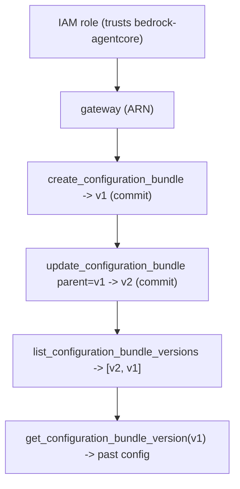

# Level 75: AgentCore Config Bundles — Git-Like Versioned Config for Agent Resources
**Date:** 2026-06-02 | **File:** `18_agentcore_config/config_bundles.py`
**Depends on:** L27/L33 (AgentCore control plane), L74 (resources to configure)
**Unlocks:** auditable, rollback-able agent config; config-as-data

---

## Part 1 — For Humans

### What We Built
A way to treat an agent's configuration like source code: every change to a gateway's
tool descriptions becomes a *commit* in a versioned bundle, with a message and a parent,
on a branch — so you can list the history, fetch any past version, and roll back. Built a
gateway, versioned its config twice, read the old version, and tore it all down.

### How It Works

```
 gateway (ARN)
     |
 create_configuration_bundle  -> v1 (commit "initial")
     |
 update_configuration_bundle  -> v2 (commit "refine", parent=v1)
     |
 list versions: [v2, v1]   get_version(v1) -> original config
```

### What Went Wrong
1. **Wrong component key.** A bundle's components are keyed by a real AgentCore resource
   ARN. A workload-identity ARN was rejected — it must be a **gateway** ARN.
2. **Wrong config shape (twice).** A gateway component's config is
   `{"toolOverrides": {tool: {"description": ...}}}` — and `toolOverrides` goes *directly*
   under `configuration`. I first omitted it, then wrapped it in a `"document"` key; both
   raised `ValidationException`. The error text ("must be a map of tool name to object
   with a description") was the key to the right shape.

### What Worked
1. **A minimal gateway is cheap.** Just `name + roleArn + AWS_IAM + MCP` (no target) →
   `CREATING → READY`. The role only needs to trust `bedrock-agentcore.amazonaws.com`.
2. **Reverse-order teardown.** Bundle → gateway → role, in `finally`, plus a same-name
   cleanup at start. Account left clean.
3. **Error-driven schema discovery.** Three smoke attempts, each error narrowing the
   shape, beat guessing — and the third worked.

### The Single Most Important Thing
Config Bundles turn configuration from a thing you *overwrite* into a thing you *commit*.
Because each change is a versioned point (message + parent) on a branch, "what did this
gateway's tools look like last week, and can I roll back?" becomes a `get_version` call
instead of a hope. That's Git semantics applied to live agent configuration.

---

## Part 2 — For LLMs

### Architecture



```
[IAM role (trusts bedrock-agentcore)]
        |
        v
[gateway (ARN)]
        |
        v
[create_configuration_bundle -> v1 (commit)]
        |
        v
[update_configuration_bundle parent=v1 -> v2 (commit)]
        |
        v
[list versions -> [v2, v1]] --> [get_version(v1) -> past config]
```

### Decision Log

| Decision | Why | Trade-off |
|----------|-----|-----------|
| Gateway as the component | Bundles key components by resource ARN; gateway accepted | Must stand up a gateway + role |
| Minimal gateway (no target) | Just need an ARN to configure | Not a functional MCP gateway |
| toolOverrides directly under configuration | The validated schema (no "document" wrapper) | Discovered via error, not docs |
| Reverse-order teardown + start cleanup | Multi-resource chain; re-runnable | More plumbing |

### Pseudocode — Key Patterns

```
# Versioned config (Git-like)
comp = {gateway_arn: {"configuration": {"toolOverrides": {tool: {"description": d}}}}}
v1 = create_configuration_bundle(name, components=comp(d1), commitMessage="v1").versionId
v2 = update_configuration_bundle(id, components=comp(d2), parentVersionIds=[v1],
                                 commitMessage="v2").versionId
history = list_configuration_bundle_versions(id)          # [v2, v1]
past    = get_configuration_bundle_version(id, v1)         # roll back / audit
```

### Observation Log

| # | Category | Topic | Observation |
|---|----------|-------|-------------|
| 1 | insight | config-bundles-git-like-versioned-config | create/update = commits (message+parent+branch); list/get versions for lineage + rollback |
| 2 | mistake | config-bundle-component-arn-and-schema | key must be a gateway ARN (not WI); toolOverrides directly under configuration, no "document" |
| 3 | insight | minimal-gateway-no-target | name+role+AWS_IAM+MCP, no target -> READY; role trusts bedrock-agentcore |
| 4 | pattern | self-tearing-down-multi-resource-lesson | create role→gateway→bundle; teardown reverse in finally; account left clean |

### Forward Links

- **Builds on L74/L27 (AgentCore resources):** bundles version the config OF those resources.
- **Config-as-data sibling of L62 (prompts/caching):** both move config out of code; L75
  adds versioned history + rollback.
- **Revisit when:** you need auditable, rollback-able config for gateways/agents — commit
  it as a bundle instead of editing in place.
