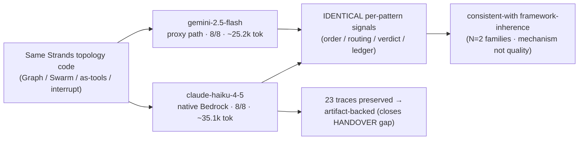

# L77 ADK Patterns — Cross-Model Validation (artifact-backed)

**Date:** 2026-06-03 | **Scope:** Re-ran the 8 ADK multi-agent patterns on **two providers in one session**
and **preserved the Bedrock traces** — closing the exact gap the HANDOVER flagged ("the Bedrock run is
**not artifact-backed**; traces overwrite in place").
**Files:** `artifacts/adk_patterns/{run_all,_harness,_trace,p1..p8}.py`,
`artifacts/adk_patterns/traces_bedrock_claude_haiku_2026-06-03/` (23 jsonl + `PROVENANCE.txt`)
**Depends on:** L77 (the ADK-pattern build) · L93 (Nova cross-model method) · `_model.py` provider switch
**Observations:** 904 → 910 (+6, all `level:77`: 2 pattern, 4 insight)

---

## Part 1 — For Humans

### What we did
The HANDOVER and the morning SESSION reflection both stated the Bedrock-Claude cross-model run as evidence
of *framework-inherence*, but commit `eb6cc6b` ("Correct HANDOVER overclaims surfaced by adversarial
review") had downgraded it to **"not artifact-backed... consistent with, not a proof"** — the traces had
been overwritten in place and Claude access on the test account is intermittent. This session **executes
that run for real, with the evidence persisted.**

Two full `run_all.py` passes, same code, same session:

| Provider (wire path) | pass | reproducible | tok/full-pass |
|---|---|---|---|
| `gemini-2.5-flash` (`OpenAIModel` → LiteLLM proxy `:4000`) | **8/8** | **8/8** | ~25,239 |
| `claude-haiku-4-5` (native `BedrockModel`, acct <agentic-account-id>, us-east-1) | **8/8** | **8/8** | ~35,071 |

### The result that matters: identical control-flow signal across two model families
"Reproducible" here = an **identical signal** (execution order / routing / typed verdict / ledger), not
output-text determinism. Every per-pattern signal was **byte-identical across the two providers**:

| # | Pattern | Signal (same on both) | Gemini tok | Claude tok |
|---|---|---|---|---|
| P1 | Sequential | `order=[extract, analyze, write]` | 2,146 | 447 |
| P2 | Coordinator | `bill→billing, tech→tech` | 2,380 | 5,604 |
| P3 | Parallel | `all5+gather, parallel_faster` | 3,204 | 952 |
| P4 | Hierarchical | `chain_ok` (see delta below) | 836 | 1,535 |
| P5 | Gen & Critic | `gen→critic→gen→critic, verdict=PASS` | 2,955 | 2,983 |
| P6 | Iterative | `reviser→critic×2, verdict=GOOD` | 3,682 | 2,966 |
| P7 | HITL | `approve=[49.99], deny=[]` | 1,286 | 5,720 |
| P8 | Composite | `nodes=[compose,research,triage], types_ok` | 8,750 | 14,864 |

Same `Graph`/`Swarm`/agents-as-tools/`interrupt` code drove identical topology, routing, typed verdicts,
and the HITL ledger on Google-Gemini and Anthropic-Claude → **the topology is model-agnostic Strands code.**

### Model-specific deltas (the honest texture)
1. **P4 nested tool-call.** Claude fired it **first attempt** (`attempts=1/4`); Gemini needed **two**
   (`attempts=2/4`). The bounded retry absorbs it → same `chain_ok`. Reproduces the documented finding
   exactly: the retry *need* is a Gemini tendency, not a topology requirement.
2. **Token cost is per-pattern, not a flat multiplier.** Claude ~39% pricier overall, but the gap lives
   in tool/handoff-heavy patterns (P2 2.4×, P7 4.4×, P8 1.7×). On terse sequential/parallel work Claude was
   **cheaper** (P1 447 vs 2,146; P3 952 vs 3,204). Budget per-pattern against the target model.
3. **P3 speedup ratio differed** (Claude `t_par/t_seq=74%`, Gemini `39%`) — both parallel-faster, no
   inversion this session, `samples=1` each. Confirms the documented "real but variable" latency caveat.

### Structured-output gate is provider-portable
The preserved P5 Bedrock trace shows the typed verdict surfacing as a **forced `Ballot` tool call** —
`REVISE` ("vague descriptors like 'lightning-fast'") → `PASS` ("concrete number '10x'"), each
`[success] Successfully validated Ballot structured output`. The loop exits on `ballot.verdict`, no
substring parse. Same mechanism the proxy→Gemini path showed → the review-gate's typed-verdict approach
holds on both wire paths.

---

## What this run upgrades — and what it does NOT

```
  BEFORE (HANDOVER + eb6cc6b):  "ran identically on a 2nd provider" — UNLOGGED, traces overwritten
  AFTER  (this run):            8/8 + 8/8, 23 traces preserved + summary — ARTIFACT-BACKED
```

**Upgraded:** the 2nd-provider run is now persisted evidence, not an in-session memory.
**Still standing (do not re-overclaim — the trap eb6cc6b just fixed):**
- **Mechanism, not quality** — asserts topology runs/routes/exits, not whether decisions are *good*.
- **Tiny sample** — 3 runs/pattern (P8 ×2), one task each, one session, one machine. No power analysis.
- **N=2 model families** — Gemini + Claude. "Framework-inherent" stays **consistent-with**, not universal.
- **Not the asking team's transport** — proxy→Gemini and native-Bedrock, not their first-party Gemini
  compat endpoint. The model-level findings still need re-confirming on their wire path.



## Full trace audit (8/8 mechanisms independently verified)

Not trusting the harness's self-report: every pattern's mechanism was re-checked against the preserved
Bedrock event logs.

| Pattern | Independently confirmed from the trace | Caveat the trace also exposed |
|---|---|---|
| P1 Sequential | 3 runs all strictly `extract→analyze→write` | codename **lineage not in trace** (0 tool calls) — harness-checked only |
| P2 Coordinator | `handoff→billing` (refund) & `handoff→tech` (err-500), **no ping-pong** | specialist replies not in trace (routing-only) |
| P3 Parallel | sources `invoke.start` within **1ms** (concurrency proven by timestamps) | synth content not in trace |
| P4 Hierarchical | `RA-7731` sentinel surfaces (lineage) | analyst never appears (inference); **content was a vacuous "insufficient data" punt** |
| P5 Gen/Critic | `Ballot` REVISE→PASS, real fix ("10x") | — |
| P6 Iterative | cycle + 2×`Ballot GOOD` + exit<cap | **GOOD on round 1; round 2 is `MIN_ROUNDS` theater, identical reason — no actual refinement** |
| P7 HITL | interrupt→`[success] Refund $49.99` / `[error] human denied` | mechanism only; not evasion-resistant |
| P8 Composite | triage(swarm)→research(parallel)→compose(gen/critic REVISE→PASS) | **run2: ~61s tail-latency stall on `academic` (ms86261 vs sibling 24866) — on Bedrock** |

**Two findings the audit forced out (both grounded in trace rows):**
1. **P6 "refinement" is hollow** — the first draft already passed (`run1 seq3 verdict=GOOD`); the second
   cycle ran only because `MIN_ROUNDS=2` forces it, and returned a byte-identical reason. Cycle mechanism
   real, refinement semantics theater. Same class as P4.
2. **Signal-reproducibility ≠ latency-reproducibility** — P8 run1 (~35s) and run2 (~100s) share an
   identical signal while a single agent stalled ~61s. The reproducibility check masks it entirely, and the
   stall was on **native Bedrock**, not the proxy — so "tail-latency-noisy" isn't a local-proxy artifact.

**Net:** the topology/plumbing is real and trace-verifiable on all 8 (P1 lineage + P4 depth by inference).
But 2 of 8 pass with hollow/degenerate content (P4, P6), and "8/8 reproducible" is a signal-level claim that
hides a 3× wall-clock spread. Read the green checks as "the wiring works," nothing stronger.

## Meta / process
- **Probe-first paid off.** Checked SSO + smoke-tested the Bedrock Claude path before the paid full run;
  the cached token had ~4 min left, so I asked for one `aws sso login` rather than letting it expire mid-suite.
- **Preserve before overwrite.** `run_all.py` writes traces by pattern-slug only, so the Bedrock run
  overwrote the Gemini JSONL. The Gemini *summary* was already captured in-session; the Bedrock *traces*
  were copied out immediately on completion → the cross-model leg is now reproducible from disk.
- **Reconciles two prior docs.** Supersedes the SESSION_2026-06-03 line "DONE — cross-model **proof**" and
  satisfies the HANDOVER's "re-run on a 2nd provider, artifact-backed" — while keeping the corrected
  "consistent-with" framing (no return to the overclaim).

## Open / next
- **HANDOVER.md + README.md are now factually stale** on the "not artifact-backed" point — a precise,
  hedge-preserving edit is warranted (proposed to the user; external-facing, so not auto-applied).
- **Still open from L77:** reasoning-trace capture through the compat path (actions-only today);
  `get_model`-native (direct `GeminiModel`) variants; OTel→Application Signals to un-gate native eval levels.
