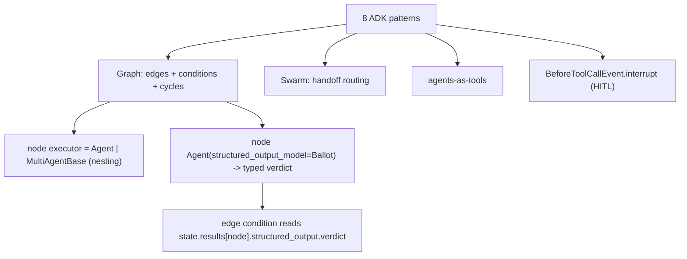

# Level 77: ADK Multi-Agent Patterns, Ported + Verified on Strands + Gemini
**Date:** 2026-06-03 | **File:** `artifacts/adk_patterns/` (p1–p8, _model/_harness/_trace, run_all)
**Depends on:** L7 (swarm) · L8 (graph) · L12 (structured output) · L70 (interrupts) · L46 (retry LLM calls)
**Unlocks:** cross-framework pattern porting · audit-reproducible gates · reusable trace harness

---

## Part 1 — For Humans

### What We Built
We took Google's 8 "ADK multi-agent patterns" (Sequential, Coordinator, Parallel, Hierarchical,
Generator-Critic, Iterative-Refinement, Human-in-the-Loop, Composite) and rebuilt each on **Strands**,
then **ran them live** on `gemini-2.5-flash` through the OpenAI-compat proxy. Each prototype self-checks,
runs 3×, reports reproducibility + token cost, and writes a per-run JSON trace. Result: 8/8 pass, 8/8
reproducible, ~26.8k tokens per full pass.

### How It Works
ADK ships one class per pattern. Strands ships three general primitives that absorb all of them:

```
   8 ADK patterns                 3 Strands primitives
+---------------------+        +-----------------------+
| Sequential          |--+     |  GRAPH                |
| Parallel            |--+---->|  (linear | fan-out |  |
| Generator-Critic    |--+     |   conditional cycle)  |
| Iterative-Refine    |--+     +-----------------------+
| Composite (nested)  |--+----> nodes can BE graphs/
+---------------------+         swarms (russian doll)
| Coordinator/Dispatch|------->|  SWARM (handoff)      |
+---------------------+        +-----------------------+
| Hierarchical        |------->|  AGENTS-AS-TOOLS      |
| Human-in-the-Loop   |--> BeforeToolCallEvent.interrupt
+---------------------+
```

The big upgrade to our own knowledge: a Strands **Graph is not just a DAG** — it has conditional edges
and real cycles (`reset_on_revisit`), so the two loop patterns are native, not hand-rolled.

### What Went Wrong
1. **Called the proxy "dead" twice.** I checked `docker` (it's **podman**) and truncated `podman ps`.
   The `litellm-proxy` container existed, just OOM-killed (exit 137) on the 2 GB machine. `podman start`
   fixed it. I then fixed the stale `CLAUDE.md` that told me to use docker at a path that doesn't exist.
2. **Shipped single-run tests; they lied.** P5 looped only by luck, P2's swarm secretly ping-ponged to
   FAILED, P3's "parallel is faster" inverted once. A 3× audit exposed all three.
3. **Mis-measured nesting.** I thought P4's nested call was flaky; really, a sub-agent's callback just
   doesn't fire when it runs as a tool. The chain ran fine — my probe was blind.
4. **Recommended observability but didn't build it** until asked. The token counter was the easy part;
   the actual trace was missing.

### What Worked
1. **Probe-before-code.** Confirming structured output + the interrupt API + hook fields up front
   avoided guesswork (the L33 "8 failures from guessing" lesson).
2. **Typed ballots.** `structured_output_model` at construction gives a typed verdict the loop condition
   reads directly — no regex, malformed output raises.
3. **Structural determinism over temperature.** Handoff guards, bounded retries, execution caps, typed
   outputs — that's what made runs reproducible. `temp 0` did not.
4. **Lineage beats callbacks** for proving a nested agent chain ran.
5. **best-of-2** to measure a noisy concurrency speedup honestly.

### The Single Most Important Thing
For an audit-reproducible gate on Gemini, **reproducibility is an architectural property, not a sampling
setting**. `temperature=0` does not pin the model; you get stable, auditable behavior by constraining the
*structure* (typed outputs, capped loops, handoff guards, bounded retries) and by capturing a per-run
action trace — not by turning the temperature down.

---

## Part 2 — For LLMs

### Architecture



```
            +----------------------+
            |    8 ADK patterns    |
            +----------+-----------+
              |     |      |     |
              v     v      v     v
         [GRAPH] [SWARM] [as-tools] [interrupt HITL]
            |
   +--------+---------+
   v                  v
[node = Agent or    [node Agent(structured_output_model)
 MultiAgentBase]      -> typed verdict]
   (nesting)               |
                           v
              [edge condition reads
               state.results[n].structured_output.verdict]
```

### Decision Log

| Decision | Why | Trade-off |
|----------|-----|-----------|
| OpenAIModel->proxy->gemini-2.5-flash | Matches the team's exact transport; Claude out of credits | Single model/transport; not the repo's native GeminiModel path |
| Graph cycle for loop patterns | Strands has no LoopAgent; conditional edge + reset_on_revisit is native | Must set max_node_executions or it can run forever |
| structured_output_model at construction | Typed verdict survives as a Graph node; kills regex parse | Implemented as a forced tool call (rides on function-calling) |
| Lineage (sentinel) for nested chains | Sub-agent callback doesn't fire as a tool | Needs a unique sentinel + bounded retry |
| best-of-2 on parallel timing | Tail latency bounds t_par by slowest concurrent call | Extra run only when first sample loses |
| Count-based loop guards (MIN_ROUNDS, handoff window) | Deterministic, not model-whim dependent | Slightly artificial vs emergent dynamics |

### Pseudocode — Key Patterns

```
# Generator-Critic as a Graph cycle with a typed exit
critic = Agent(structured_output_model = Ballot{verdict: PASS|REVISE})
edge gen -> critic
edge critic -> gen  IF state.results[critic].structured_output.verdict != PASS
entry = gen ; reset_on_revisit = true ; cap = N

# HITL via native interrupt/resume
hook BeforeToolCall(high_stakes):
    decision = event.interrupt("approve", reason={...})   # raises 1st pass, returns on resume
    if decision != APPROVE: event.cancel_tool = "denied"
run -> stop_reason == "interrupt"; resume(agent, [{interruptResponse:{id,response}}])

# Verify nested agent chain (callbacks unreliable as-tool)
deepest_agent emits SENTINEL ; assert SENTINEL in orchestrator.final_output
retry up to MAX_ATTEMPTS   # nested LLM tool-calls not guaranteed first try
```

### Observation Log

| # | Category | Topic | Observation |
|---|----------|-------|-------------|
| 1 | mistake | proxy-misdiagnosis | "down" was docker-vs-podman + truncated ps; container was OOM-stopped, podman start fixed it |
| 2 | insight | proxy-routes-gemini | OpenAIModel->proxy->gemini-2.5-flash = team transport; get_model routes gemini DIRECT |
| 3 | pattern | strands-subsumes-adk | No Sequential/Parallel/Loop classes; Graph(+conditions+cycles)+Swarm+as-tools cover all 8 |
| 4 | insight | adk-vs-strands | ADK=one class per pattern; Strands=few general primitives parameterized |
| 5 | pattern | structured-output-compat | structured_output_model works through compat AND as a Graph node; typed verdict |
| 6 | insight | structured-output-is-tool-call | trace shows it's a forced "Ballot" tool call |
| 7 | insight | callback-not-fired-as-tool | sub-agent callback_handler silent when run as a tool (framework-level) |
| 8 | pattern | lineage-detection | sentinel from deepest agent + bounded retry verifies nested chains |
| 9 | mistake | single-run-hides-flakiness | 3x audit caught P2 ping-pong, P3 timing inversion, P5 luck-loop |
| 10 | pattern | swarm-pingpong-guard | repetitive_handoff_detection_window + "don't hand off"; FAILED->COMPLETED, 8364->2325 tok |
| 11 | insight | temp0-not-pinned | reproducibility from structural guards, not temperature |
| 12 | insight | parallel-tail-latency | ~2x faster but bounded by slowest concurrent call; best-of-2 to measure |
| 13 | pattern | independent-panel-graph | Graph, no edges between reviewers = vote independence; Swarm = cross-talk |
| 14 | pattern | native-interrupt-resume | event.interrupt pause -> result.interrupts -> interruptResponse resume; cancel_tool denies |
| 15 | pattern | audit-harness-and-trace | _harness.py (repro+cost) + _trace.py (hook JSONL) ; promote to tools/ |
| 16 | question | model-vs-framework | re-run on gpt-5-nano to separate Gemini-specific from framework-inherent |
| 17 | question | reasoning-trace-audit | can reasoning be captured through compat? only actions captured today |

### Forward Links
- **Unlocks**: porting any framework's pattern catalog to Strands primitives; building audit-reproducible
  paid gates; reusing `_harness.py`/`_trace.py` across levels (promote to `tools/`).
- **Corrects**: the earlier "L8 Graph = DAG only" — Graph has conditional edges + cycles.
- **ANSWERED (cross-model)**: re-ran the full suite on AWS Bedrock `claude-haiku-4-5` → 8/8 pass + 8/8
  reproducible, same code. The patterns are framework-inherent; the nested tool-call miss is a *Gemini*
  tendency (Claude fired first attempt), absorbed by the bounded retry. (`ADK_MODEL_PROVIDER=bedrock`)
- **Revisit when**: a reasoning/thinking trace is needed for audit (currently actions-only); or a third
  model is wanted to widen the sample.
- **Cross-refs**: L7 swarm handoffs, L8 graph, L12 structured output, L21 OTel observability,
  L70 native interrupts, L46 retry-LLM-as-external-API.
