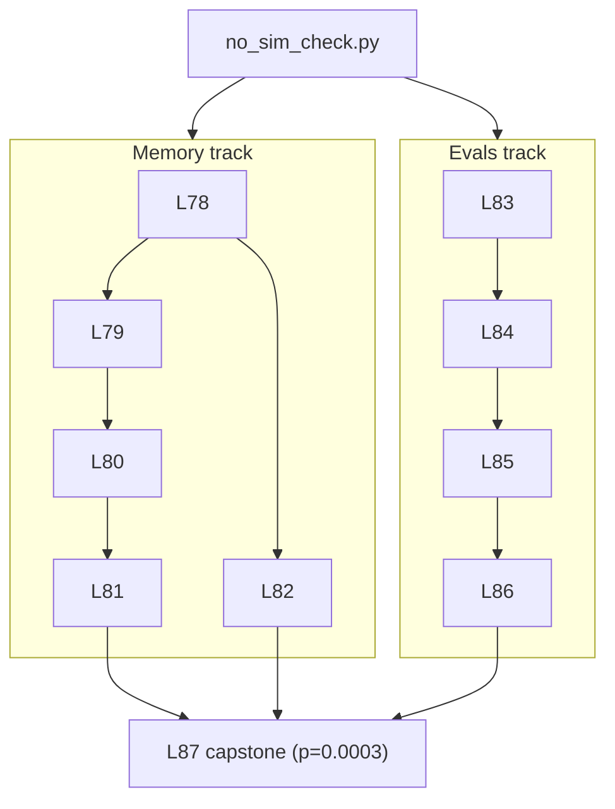

# Levels 78–92: Agentic Memory & Evals — Empirical Build-Out
<!-- core L78–L87 below; Extension section covers L88–L92 -->

**Date:** 2026-06-03 | **Files:** `06_memory/{shared_agent_memory,cross_session_memory,long_horizon_memory,memory_value_capstone}.py`, `13_state_persistence/durable_multiagent_resume.py`, `14_agentcore_platform/ltm_filtered_retrieval.py`, `13_quality/{trajectory_eval,goal_success_eval,eval_significance}.py`, `tools/{no_sim_check,eval_harness}.py`
**Depends on:** L7/L8 (swarm/graph) · L37/L66 (AgentCore memory) · L48/L65/L70 (durable/interrupt) · L35/L49/L51/L52 (evals)
**Unlocks:** production agentic memory + eval gates; L87 capstone

---

## Part 1 — For Humans

### What We Built
Ten lessons that close the two gaps a prior audit found: the repo had great *single-agent* memory and
*single-shot* evals, but the **agentic** layer of both was simulated or never run. We built and live-ran
agentic memory (shared across agents, persistent across sessions, real LTM extraction, long-horizon
dynamics, durable resume) and agentic evals (trajectory quality, goal-success, statistical significance,
one reusable harness) — plus a tripwire that makes "no simulation" mechanically enforceable.

### How It Works

```
            +-------------------------+
            |  no_sim_check.py (gate) |  <- every file must pass
            +-----------+-------------+
                        |
   +--------------------+--------------------+
   |                                         |
[MEMORY track]                          [EVALS track]
 L78 shared (store, edge-free)           L83 trajectory (sel/order/ARGS)
 L79 cross-session (DynamoDB, procs)     L84 goal-success (real state)
 L80 LTM filtered (AgentCore, async)     L85 significance (CI + perm test)
 L81 long-horizon (recall/conflict/evict) L86 unified harness (tools/)
 L82 durable resume (real crash)              |
   |                                          |
   +------------------> L87 capstone <--------+
        memory 1.00 vs memoryless 0.00, p=0.0003
```

### What Went Wrong
1. **AgentCore `create_event` arg order** — passed `(role, text)`; the SDK wants `(text, role)`. The
   first L80 run crashed; the fix was a one-line flip after reading the SDK source.
2. **Docstrings tripped my own gate** — words like "simulated stubs" in a *description* flagged
   `no_sim_check`. Correct behavior; I reworded the prose (never weakened the gate — adding "would" to
   its guard would let real `in production this would` stubs hide).
3. **LTM extraction is slow + async** — records didn't appear until ~poll 6–8 (~2 min); a naive
   "create then read" returns empty (this is exactly what made L66 look extraction-gated).

### What Worked
1. **Structurally un-fakeable tests** — mint the success token *inside* the real store and never expose
   it to the writer, so the only path to it is real recall. A stub physically cannot pass.
2. **Discrimination from real runs, not authored failures** — score the same real trajectory against a
   wrong spec; drive a second real run under degraded conditions; withhold a tool so a goal is genuinely
   unreachable. Never hand-write a "bad" case.
3. **Foundation-first** — provision the real LTM strategy / use a real store *before* the lesson that
   depends on it. The agentic gaps were all gated behind infra that was never stood up.
4. **Real crashes / real processes** — `os._exit` and subprocess boundaries prove durability and
   cross-session memory in a way in-process re-instantiation never can.

### The Single Most Important Thing
The agentic gaps weren't capability gaps — they were *un-stood-up infrastructure plus un-falsifiable
tests*. Standing up the real dependency (an LTM strategy, a DynamoDB table, a vector store) and writing
tests a stub cannot pass (runtime sentinels, real services, real discrimination, real crashes) turned
"claimed" into "proven" — capped by the capstone showing memory yields a **statistically significant**
goal-success gain (p=0.0003).

---

## Part 2 — For LLMs

### Architecture



```
[no_sim_check.py]
      |
      +--> Memory: L78 -> L79 -> L80 -> L81
      |            L78 -> L82
      +--> Evals:  L83 -> L84 -> L85 -> L86
                              |
   L81 ---+                   |
   L82 ---+--> [L87 capstone] <---- L86
                p=0.0003
```

### Decision Log

| Decision | Why | Trade-off |
|----------|-----|-----------|
| Mint sentinel inside the store, never return to writer | Makes cross-agent recall the ONLY path (un-fakeable) | Slightly contrived tool API |
| ChromaDB for L81 long-horizon (not AgentCore) | N=1000 real embeddings cheap+fast; AgentCore extraction too slow/costly at scale | Local vector store, not the managed one |
| Local goal-success (L84), not native ADOT evaluators | Un-gates goal-success without standing up OTel | Doesn't exercise the SDK's TRACE_LEVEL evaluators |
| subprocess + os._exit for L79/L82 | Real process boundary / real crash = real durability proof | More orchestration than in-process |
| Reuse `eval_harness.perm_test` in L87 | Proves the unified harness (L86) is actually reusable | Capstone depends on tools/ import path |
| Reword docstrings vs weaken the gate | Keep the tripwire strict for real code | Prose can't use stub-vocabulary affirmatively |

### Pseudocode — Key Patterns

```
# Un-fakeable cross-agent / cross-session memory test
token = mint_inside_store()        # never returned to writer / never in prompt
writer_runs()                      # writes token to REAL store
reader = fresh_agent_or_process()  # shares only the store
assert token in reader_output and token not in any_edge_or_prompt
assert empty_store -> reader_cannot_produce_token   # negative control

# Discriminate an eval without a faked-bad case
score(real_trajectory, correct_spec)  >  score(real_trajectory, wrong_spec)
degraded_real_run()  ->  scores lower than good_real_run

# Foundation-first for gated capability
provision_real_dependency()   # LTM strategy / table / store
poll_until(real_extraction_lands)   # async; empty != broken
assert filtered_retrieval_discriminates()
```

### Observation Log (references existing rows in observations.jsonl; not duplicated)

| Level | Cat | Topic | Headline |
|---|---|---|---|
| 78 | pattern | cross-agent-shared-memory-store-mediated | edge-free recall via store, 3/3 + neg-control |
| 79 | pattern | cross-session-memory-dynamodb-cross-process | recalled across real processes; self-cleaned |
| 80 | pattern | agentcore-ltm-filtered-retrieval-end-to-end | async extraction + namespace discrimination (closes L66) |
| 81 | insight | retrieval-scales-flat-policies-are-the-work | recall/latency flat to N=1000; conflict/dedup/evict are policy |
| 82 | pattern | durable-multiagent-resume-across-crash | real crash, no re-run, shared mem survived |
| 83 | pattern | trajectory-eval-selection-order-args | scores tool args, not just names; 2-way discrimination |
| 84 | pattern | goal-success-eval-local-no-otel | goal over real state; sabotage = withhold a tool |
| 85 | pattern | eval-statistical-rigor-cis-significance | Wilson/bootstrap/perm; honest null + sig branches |
| 86 | pattern | unified-reusable-eval-harness | one harness gates quality+significance+cost |
| 87 | pattern | capstone-memory-significant-goal-gain | memory 1.00 vs 0.00, p=0.0003 (causal) |
| — | pattern | no-sim-tripwire-tool | 0 on clean code; catches real historical stubs |

### Forward Links
- **Unlocks**: production-grade agentic memory + an eval gate (`tools/eval_harness.py`) that can sit in CI
  alongside `tools/no_sim_check.py`.
- **Revisit when**: standing up F2 (OTel→Application Signals) to also run the SDK's native TRACE_LEVEL
  `GoalSuccessRate`/`Faithfulness`; running on a 3rd model; or wiring AgentCore LTM behind the L78 shared
  memory port for managed cross-agent persistence.
- **Corrects**: L66 ("filtered LTM not demonstrated" → now demonstrated, L80) and the audit's
  "single-run, no significance" finding (→ L85/L86).

---

## Extension — L88–L91 (beyond the plan, same discipline)

| L | Lesson | Result |
|---|---|---|
| L88 | memory-faithfulness | runtime-random value lives only in memory; faithful=1.00, no-memory leak=0.00, faithful even under a wrong user claim |
| L89 | adversarial injection eval | positive control fires (detector has teeth); no false positives; **FINDING: gemini-2.5-flash robust** (hijack 0.00) |
| L90 | shared-memory PORT | one `SharedMemoryPort`, two real adapters (in-process + AgentCore LTM) pass the same cross-agent contract — the "adapters behind ports" recommendation, executable |
| L91 | native trace-level evaluators | run **locally** via `@eval_task(TracedHandler())`; plain dict→0.00 vs traced→1.0 — **corrects L35** (the requirement is a captured Session, not cloud ADOT) |
| L92 | ship-gate (synthesis) | one auditable **GO/NO-GO** over N real runs; good candidate ships, regressed is blocked with cited reasons + a JSON verdict — the original "paid, audit-reproducible gate" |

New meta-lessons:
1. A safety eval must NOT require the bug to exist — prove the detector with a **positive control** and report model resistance as the finding (L89).
2. LLM-judge evaluators score the semantics they were built for — verify them: `ToolSelectionAccuracy` judges *appropriateness*, not match-to-`expected_trajectory` (L91).
3. The architecture-doc "AgentCore services as adapters behind your own ports" is now empirically executable (L90).
4. The whole arc composes into ONE deliverable — `tools/ship_gate.py` (L92): quality + cost + permutation-significance over real runs → a reproducible, auditable GO/NO-GO. This IS the "paid, audit-reproducible gate" the original review-gate question asked for.

## Cross-model validation (L93) — `13_quality/crossmodel_validation.py`
Re-ran the 6 **model-sensitive** findings on **AWS Bedrock Nova Lite** (`amazon.nova-lite-v1:0`, an
Amazon-family model ≠ Gemini): **6/6 HOLD → framework-inherent.** Shared memory (L78), trajectory
tool-args (L83), goal-success (L84), memory-faithfulness (L88), tool-injection safety (L89), and a
native trace-level evaluator with a Nova judge (L91, score 1.0) all behave the same. The L89 safety
result is now **both-model** robust (Gemini + Nova hijack 0.00), not a single-model claim. Memory stores
(L79/L80/L81/L90) and stats (L85) are model-agnostic by construction → not re-run. Caveat: two models +
one injection ≠ a universal guarantee; capability-driven differences (not seen here) would read distinct
from framework findings.
