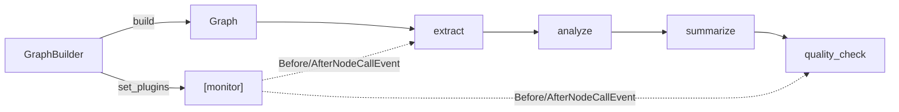

# Level 8 (v1.42): Graph Node-Lifecycle Monitoring via MultiAgentPlugin
**Date:** 2026-06-02 | **File:** `03_multi_agent/graph_workflow.py`
**Depends on:** L7-v142 (same plugin on a Swarm), L8 (graph basics) | **Unlocks:** orchestration-layer observability

> v1.42 extension. The plugin and its lesson are identical to L7-v142 — the ONE
> new thing here is how a `MultiAgentPlugin` attaches to a `Graph` vs a `Swarm`.

---

## Part 1 — For Humans

### What We Built
The same `MonitoringPlugin` from L7, now on the deterministic
extract → analyze → summarize → quality_check document-processing **Graph**.
Proves the orchestrator-level plugin is portable: one plugin class works for
both autonomous swarms and deterministic DAG graphs.

### How It Works

```
  Swarm:  Swarm([...agents...], plugins=[monitor])
  Graph:  builder = GraphBuilder()
          builder.add_node(...)  / add_edge(...)
          builder.set_plugins([monitor])   <-- the difference
          graph = builder.build()

  Both fire the SAME Before/AfterNodeCallEvent per node.
```

### What Went Wrong
Nothing new — the `super().__init__()` lesson from L7-v142 carried over (the
plugin already had the fix). Models swapped to Gemini 2.5 Flash like L7.

### What Worked
`GraphBuilder.set_plugins([...])` (fluent, returns the builder) is the Graph
equivalent of `Swarm(..., plugins=[...])`. Verified: 8 lifecycle events across
the 4 DAG nodes, `Status.COMPLETED`.

### The Single Most Important Thing
A `MultiAgentPlugin` is orchestrator-shaped, not orchestrator-specific. The
attach point differs (constructor arg for Swarm, builder method for Graph) but
the hook contract (`Before/AfterNodeCallEvent`, `event.node_id`) is identical.
Write the monitoring/tracing/guardrail plugin once, use it on either.

---

## Part 2 — For LLMs

### Architecture



```
GraphBuilder --set_plugins([monitor])--> (attached)
     |
   build()
     v
[extract] -> [analyze] -> [summarize] -> [quality_check]
    ^                                          ^
    +--- monitor @hook Before/AfterNodeCall ---+
```

### Decision Log

| Decision | Why | Trade-off |
|----------|-----|-----------|
| `GraphBuilder.set_plugins([...])` | Graph has no direct ctor like Swarm | must call before `.build()` |
| reuse L7's plugin verbatim | proves portability across orchestrators | tiny duplication across the two lesson files |

### Pseudocode — Key Pattern

```
builder = GraphBuilder()
builder.add_node(...) ; builder.add_edge(...) ; builder.set_entry_point(...)
builder.set_plugins([MonitoringPlugin()])   # <-- attach here
graph = builder.build()
graph("...")   # Before/AfterNodeCallEvent fire per node, same as Swarm
```

### Observation Log

| # | Category | Topic | Observation |
|---|----------|-------|-------------|
| 1 | pattern | multiagentplugin-portable | one plugin works on Swarm (`plugins=`) and Graph (`set_plugins`) |
| 2 | insight | graph-attach-point | `GraphBuilder.set_plugins([...])` before `.build()` is the Graph equivalent |

### Forward Links
- **Mirrors L7-v142**: same plugin, Swarm attach point.
- **Revisit when**: standardizing observability across mixed Swarm/Graph orchestrations.
