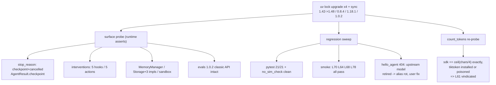

# Level 94: SDK v1.48 Upgrade + Regression Sweep
**Date:** 2026-07-18 | **Files:** `_sandbox/probe_l94_v148_surface.py`, `_sandbox/probe_l94_count_tokens.py`, `uv.lock`
**Depends on:** L61 (token counting), L65 (checkpoint), the v1.42→v1.48 delta report | **Unlocks:** L95 (checkpoint runtime), L96 (interventions), L97–L100

---

## Part 1 — For Humans

### What We Built
The foundation level for Tier 22: upgraded the whole stack six SDK minors in one move (strands
1.42.0 → 1.48.0, tools 0.8.4, agentcore 1.18.1, evals 1.0.2), proved the new v1.48 surface exists
at runtime, re-ran the regression suite and four representative lessons, and settled the L61
count_tokens dispute with a probe instead of an argument.

### How It Works

```
+---------------------------+
| uv lock --upgrade-package |
| (x4) + uv sync            |
+------------+--------------+
             |
             v
+---------------------------+
| surface probe: checkpoint |
| interventions, memory,    |
| storage, sandbox, evals   |
+------------+--------------+
             |
             v
+---------------------------+     +--------------------+
| regression sweep:         |---->| pytest 21/21       |
| pytest + no_sim_check +   |     | L70 L64 L68 L78 ok |
| 4 smoke lessons (Gemini)  |     | 1 env break found  |
+------------+--------------+     +--------------------+
             |
             v
+---------------------------+
| count_tokens re-probe:    |
| L61 was RIGHT all along   |
+---------------------------+
```

### What Went Wrong
1. **Probe assumed top-level sandbox exports** — `DockerSandbox`/`SshSandbox` live in
   `strands.sandbox.docker`/`.ssh` submodules. Probe bug; fixed by importing from submodules.
2. **Probe expected a DeprecationWarning at import time** — the steering shim uses module
   `__getattr__` (PEP 562), so the warning fires on *name access*, not import. Fixed by accessing
   `SteeringHandler`.
3. **`hello_agent.py` failed with an Anthropic 404** — not an SDK regression and not the old
   credit-balance failure: the upstream model `claude-sonnet-4-20250514` has been retired.
   The proxy and key are fine (`claude-haiku-4-5` answers). 46 lesson files use the
   `claude-sonnet-4` alias; the one-line fix is repointing the alias to
   `anthropic/claude-sonnet-4-6` in `litellm_config.yaml` + container restart (user action —
   session permissions block edits outside the repo).

### What Worked
1. **Lock-refresh upgrade** — all pyproject pins were `>=`, so four `--upgrade-package` flags and
   one `uv sync` did the whole jump; litellm stayed inside the SDK's `<=1.91.1` bound untouched.
2. **Probe-first on the new surface** — every API that L95/L96 will build on was asserted at
   runtime before any lesson code exists (checkpoint literals, interventions hooks/actions,
   MemoryManager, Storage, sandbox, evals classic API).
3. **Dependency-poisoning probe** — running the same measurement normally and in a child process
   with `sys.modules["tiktoken"] = None` proved the two modes are byte-identical, i.e. the
   tiktoken path never executes.
4. **Smoke-per-subsystem** — one cheap lesson each for interrupts, snapshots, limits, and shared
   memory; all four passed unchanged on 1.48, including L78's own negative control.

### The Single Most Important Thing
The count_tokens saga is the repo's core rule eating its own tail, in a good way. The SDK's
docstring says "uses tiktoken when available." My own delta-report reviewer read that docstring
and "corrected" L61. The runtime probe then showed the docstring is false at both 1.42 and 1.48 —
there is no tiktoken code path in the module at all, and L61's original chars/4 finding was right.
Docstring-versus-bytes failures happen at every layer, including inside your own review pipeline;
only a run settles it.

---

## Part 2 — For LLMs

### Architecture



```
+--------------------------------------+
| uv lock upgrade x4 + sync            |
| 1.42->1.48 / 0.8.4 / 1.18.1 / 1.0.2  |
+---+----------------+-------------+---+
    |                |             |
    v                v             v
[surface probe] [regression]  [count_tokens
    |            sweep         re-probe]
    v                |             |
 checkpoint+     pytest 21/21      v
 cancelled       smoke L70/64/  sdk == chars/4
 interventions   68/78 pass     exactly, both
 5x5, memory,    hello_agent    modes
 storage,        404 = alias    => L61 RIGHT
 sandbox, evals  rot (env)
 API intact
```

### Decision Log

| Decision | Why | Trade-off |
|----------|-----|-----------|
| No new lesson .py for L94 | Tier-18 precedent: pure upgrade levels leave probes + reflection as artifacts | Level has no runnable demo of its own |
| Fix proxy alias at the PROXY, not in 46 lesson files | One line heals everything; alias indirection is the point of an alias | Blocked by session perms → deferred to user |
| Correct the delta REPORT, not the L61 doc | Probe proved L61 right; the report's tiktoken claim was a docstring-read | Report carries a visible self-correction (feature, not bug) |
| Poison tiktoken in a child process, not in-process | Import caching makes in-process poisoning unreliable | Slightly slower probe |

### Pseudocode — Key Patterns

```
# dependency-poisoning probe
run probe normally                    -> counts_A
spawn child: sys.modules[dep] = None
run same probe in child               -> counts_B
if counts_A == counts_B for all inputs:
    the "uses dep when available" path never executes
```

```
# upgrade sweep gate
lock-refresh -> sync -> runtime surface probe
-> pytest -> no_sim_check -> 1 smoke lesson per subsystem
any failure: root-cause against the delta's behavior-change list
NEVER exclude to go green
```

### Observation Log

| # | Category | Topic | Observation |
|---|----------|-------|-------------|
| 1 | pattern | v148-upgrade-clean | Six-minor jump, zero lesson-code changes; 21/21 + 4 smoke lessons pass |
| 2 | insight | v148-surface-verified | checkpoint/cancelled literals, AgentResult.checkpoint, 5x5 interventions, memory/storage/sandbox, evals API intact — at runtime |
| 3 | insight | count-tokens-docstring-lie | No tiktoken code path exists; sdk == ceil(chars/4) exactly; L61 vindicated; report's first draft repeated the docstring |
| 4 | pattern | dependency-poisoning-probe | Normal vs sys.modules-poisoned child isolates optional-dep paths |
| 5 | mistake | sandbox-submodule-exports | Docker/Ssh sandboxes are in submodules, not top-level exports |
| 6 | mistake | module-getattr-deprecation | PEP-562 shims warn on name access, not import |
| 7 | mistake | model-retirement-alias-rot | claude-sonnet-4-20250514 retired upstream; alias rot ≠ SDK regression ≠ credit failure |
| 8 | question | l95-l96-open | Cross-process checkpointResume? Guide/Confirm on Gemini? cedarpy packaging? |

### Forward Links

- **Unlocks L95**: checkpoint runtime verified importable + literals present; resume contract known
- **Unlocks L96**: interventions hooks/actions verified; cedarpy packaging is the first probe there
- **Revisit when**: any lesson touches `count_tokens` (it is chars/4, whatever the docstring says), or when the user repoints the `claude-sonnet-4` proxy alias (then re-run `01_basics/hello_agent.py`)
