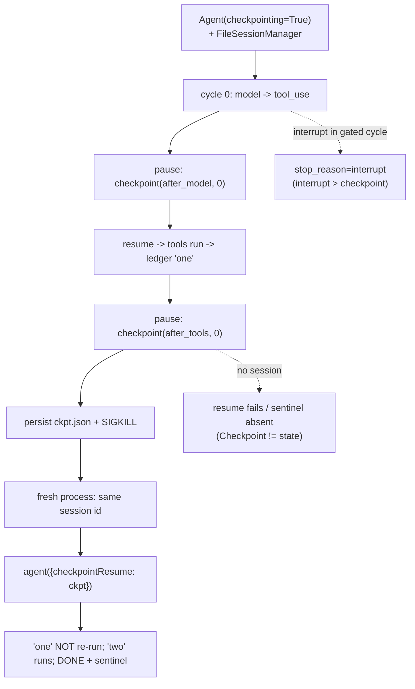

# Level 95: Checkpoint Runtime End-to-End
**Date:** 2026-07-18 | **File:** `13_state_persistence/checkpoint_runtime.py`
**Depends on:** L65 (1.42 checkpoint contract), L70 (interrupts), L94 (v1.48 surface) | **Unlocks:** L97+ (durable memory-backed harnesses on the wired runtime)

---

## Part 1 — For Humans

### What We Built
Proof that the checkpoint runtime the SDK wired in v1.43 actually survives a real crash. An agent
pauses at cycle boundaries, gets SIGKILLed mid-task, and a brand-new process picks up the exact
pause point, finishes the job without redoing completed work, and still remembers a secret only
the dead process ever saw. Plus the two claims the docs make but nobody tests: a checkpoint alone
carries no state, and an interrupt outranks a checkpoint.

### How It Works

```
+----------------------+
| Process A            |
| Agent(checkpointing) |
| + FileSession        |
+----+-----------------+
     | run: record 'one'
     v
[checkpoint after_tools]
     | save ckpt.json
     v
   SIGKILL (-9)          <- a real crash, no cleanup
     .
     .  new process
     v
+----------------------+
| Process B            |
| same session id      |
| resume(ckpt.json)    |
+----+-----------------+
     | 'one' NOT re-run
     | record 'two'
     v
 DONE <secret code>      <- state came from the session
```

### What Went Wrong
Nothing on the first live run — all four iterations passed. The design work that made that
possible happened in L94's probe (surface verified before a line of lesson code) and in reading
the installed `checkpoint.py` source rather than trusting the delta report.

### What Worked
1. **Worker-mode single file** — the lesson is its own crash harness: `worker-crash`,
   `worker-resume`, `worker-resume-nosession` argv modes, parent asserts on return codes
   (`-9` for the SIGKILL) and on a JSONL tool ledger.
2. **Runtime sentinel through the crash** — a random code given only to Process A must appear in
   Process B's final answer. That single assertion proves session-state continuity better than
   any amount of introspection.
3. **Ledger-based exactly-once** — every executed tool call appends `{step, pid}`; counting
   entries catches silent re-execution, and the pid column shows which process did what.
4. **Negative control as a first-class iteration** — resuming without the session must fail to
   produce the sentinel. It did (rc=1, sentinel absent).

### The Single Most Important Thing
A checkpoint is a bookmark, not a save file. The SDK's `Checkpoint` is three fields — position,
cycle index, schema version — and resuming one without its companion session gives you a
confused agent with no memory. Durability is a two-key system: checkpoint says WHERE to resume,
session says WHAT was true. Any durability design that persists only one of them is broken in a
way that works fine until the first real crash.

---

## Part 2 — For LLMs

### Architecture



```
[Agent(checkpointing=True) + FileSession]
     |
     v
[cycle 0: model -> tool_use]
     |                       \
     v                        \ (interrupt in cycle)
[ckpt after_model,0]           v
     |                    [stop=interrupt]
     v                    (beats checkpoint)
[resume -> tool 'one']
     |
     v
[ckpt after_tools,0] --> [persist + SIGKILL]
     |    \                    |
     |     \ (no session)      v
     |      v             [fresh process]
     |  [sentinel absent]      |
     |  (ckpt != state)        v
     |                    [checkpointResume]
     |                         |
     v                         v
[... cycle 1 ...]      ['one' x1, 'two' x1, DONE+code]
```

### Decision Log

| Decision | Why | Trade-off |
|----------|-----|-----------|
| SIGKILL via `os.kill(os.getpid(), SIGKILL)` inside the worker | No atexit/finally can run — the crash is honest | Slightly awkward: parent must assert rc == -9 |
| Persist checkpoint at `after_tools`, not `after_model` | Tool 1's side effect exists pre-crash → re-execution is detectable | after_model crash-resume is untested here (L97 candidate) |
| Sentinel in the PROMPT, asserted in the resumed FINAL answer | One assertion proves cross-process state continuity | Model must repeat the code (Gemini did, reliably) |
| Ledger counts as the exactly-once oracle | Side-effect-based, unfakeable by transcript inspection | Requires tools to be append-only writers |

### Pseudocode — Key Patterns

```
# two-key durability
on pause:  persist checkpoint.to_dict()          # WHERE to resume
           (session manager persists messages)   # WHAT was true
on resume: agent({"checkpointResume": {"checkpoint": dict}})
           with an Agent built on the SAME session id
invariant: resume without the session must NOT recover state
```

```
# resume loop
result = agent(task)
while result.stop_reason == "checkpoint":
    result = agent({"checkpointResume": {"checkpoint": result.checkpoint.to_dict()}})
```

### Observation Log

| # | Category | Topic | Observation |
|---|----------|-------|-------------|
| 1 | insight | checkpoint-runtime-wired | SIGKILL at after_tools; fresh-process resume; 'one' x1; sentinel survived |
| 2 | insight | checkpoint-is-not-state | No session ⇒ rc=1, sentinel absent; Checkpoint = {position, cycle_index, schema_version} only |
| 3 | pattern | interrupt-beats-checkpoint | stops=[checkpoint x3, interrupt] on the gated cycle |
| 4 | pattern | checkpointing-chattiness | 2 pauses per tool cycle; 2-tool task = 4 resume round-trips; no per-boundary opt-out |

### Forward Links

- **Unlocks L97**: the memory rematch can now include a durable-resume arm on the wired runtime
- **Revisit when**: a durability provider (Temporal/Step Functions, L48) should replace the
  hand resume-loop, or if the SDK adds per-boundary checkpoint filtering (watch `checkpointing`
  kwarg evolution)
