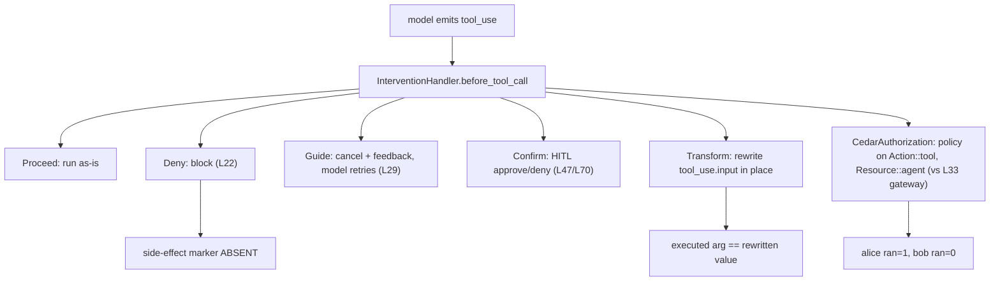

# Level 96: Interventions — The Control Plane Unified
**Date:** 2026-07-18 | **File:** `08_production/interventions_unified.py`
**Depends on:** L22 (guardrails), L29 (steering), L33 (gateway Cedar), L47/L70 (HITL), L94 (v1.48 surface) | **Unlocks:** L99 (attack the control plane), any production agent needing enforcement below the model

---

## Part 1 — For Humans

### What We Built
Four control techniques this repo taught as separate lessons — block a bad tool, nudge a
misdirected one, require human sign-off, sanitize an argument — collapsed into one first-party
`interventions` primitive, plus in-process Cedar policy authorization. Each proven live with a
runtime sentinel and a positive/negative control.

### How It Works

```
        model wants to call a tool
                 |
                 v
      +---------------------+
      | intervention hooks  |
      | before_tool_call    |
      +----------+----------+
                 |
   +----+--------+------+-------+--------+
   |    |        |      |       |        |
   v    v        v      v       v        v
Proceed Deny  Guide Confirm Transform  Cedar
 run   block  nudge  human   rewrite  policy
       (L22) (L29)  (L47/70)  arg     (vs L33)
```

### What Went Wrong
1. **`InterventionHandler` has an abstract `name` property** — a subclass without it won't
   instantiate. Added `name` to all three custom handlers.
2. **Cedar `principal` is a dict, not a tuple** — I passed `("User", "alice")`; the handler does
   `principal["id"]`, so a tuple raised inside the try/except and `on_error="deny"` turned it into
   an authorization denial. Alice got blocked for a config bug that *looked* like a policy result.
3. **Cedar action name is the tool name; resource is always `Resource::"agent"`** — my policy
   named a made-up action, so it matched nothing and denied everyone. Found by calling
   `cedarpy.is_authorized` directly (alice Allow, bob Deny — policy fine), which isolated the
   fault to the handler's request marshalling.
4. **`no_sim_check` flagged the word "stub" in a docstring** — false positive on prose describing
   the anti-simulation controls. Reworded.

### What Worked
1. **Side-effect sentinels** — each destructive tool writes a random-named marker file; the
   assertion is the file's presence/absence, which no transcript inspection can fake.
2. **Positive controls beside every negative** — Deny is only meaningful because the *unguarded*
   version of the same call provably fires; Confirm tests both approve and deny paths.
3. **Debugging under the abstraction** — when Cedar denied the permitted user, going straight to
   `cedarpy.is_authorized` proved the policy correct and pointed at the wrapper, not the engine.

### The Single Most Important Thing
Fail-closed security hides configuration bugs as denials. `on_error="deny"` is the right posture —
but it means a typo in your principal format and a wrong policy action produce the *identical*
symptom to a legitimate deny. You cannot debug an authorization layer from its verdicts alone; you
have to drop below it and ask the raw engine what it actually decided. Same evidence-based-debugging
lesson as distrusting a 200 OK, applied to "access denied."

---

## Part 2 — For LLMs

### Architecture



```
[model emits tool_use]
        |
        v
[before_tool_call handler]
   |   |    |    |    |    |
   v   v    v    v    v    v
Proceed Deny Guide Confirm Transform Cedar
   |    |    |     |       |        |
 run  marker nudge approve rewrite  alice=1
      ABSENT  ->  /deny    arg      bob=0
             retry
```

### Decision Log

| Decision | Why | Trade-off |
|----------|-----|-----------|
| Side-effect marker files as the oracle | Unfakeable by transcript; survives across the model's non-determinism | Needs filesystem cleanup between runs (random names avoid collisions) |
| `HumanInTheLoop(ask=lambda ctx: True/False)` for Confirm | Drives the human gate deterministically, both paths | Not the interrupt/resume path — that's L70's job; this tests the decision, not the pause |
| Fold a2a `agent_factory` iteration OUT | Needs a live A2AServer+client pair; heavier than in-process interventions | Multi-tenancy leak stays documented (delta §8), not demonstrated here |
| Cedar `on_error="deny"` | Correct fail-closed posture | Masks config bugs as denials — cost two debugging iterations |

### Pseudocode — Key Patterns

```
# each action, proven
positive control: run WITHOUT handler -> sentinel appears
apply handler    -> assert action's effect:
    Deny      -> sentinel ABSENT
    Guide     -> correct tool eventually ran
    Confirm   -> approve => ran; deny => absent
    Transform -> tool received the rewritten arg
    Cedar     -> permitted principal ran; forbidden did not
```

```
# debugging a fail-closed authz layer
symptom: permitted principal denied
DON'T trust the verdict -> call the raw engine directly
    cedarpy.is_authorized(request, policy, entities, schema)
if engine says Allow but wrapper denies -> fault is in marshalling
    (principal shape, action name, resource name)
```

### Observation Log

| # | Category | Topic | Observation |
|---|----------|-------|-------------|
| 1 | insight | interventions-unify-controls | One primitive = Deny/Guide/Confirm/Transform, each with sentinel + control |
| 2 | insight | cedar-in-process-vs-gateway | Same Cedar language as L33, enforced in-process; alice ran, bob denied |
| 3 | mistake | intervention-handler-contract | abstract `name`; principal is dict not tuple; action==tool name, resource==agent |
| 4 | insight | cedar-fail-closed-hides-config-bug | on_error=deny made two config bugs look like authz denials |
| 5 | pattern | no-sim-check-docstring-fp | "stub" in prose tripped the gate; keep anti-sim words out of docstrings |
| 6 | question | a2a-factory-deferred | agent_factory multi-tenancy deferred; needs live A2A pair |

### Forward Links

- **Unlocks L99**: the control plane is now a single attack surface — red-team it (do the
  interventions hold under Crescendo/GOAT, or can the model talk its way past Guide/Confirm?)
- **Backward L33**: same Cedar policy text, two enforcement points (gateway vs in-process) — a
  defense-in-depth pairing, not a replacement
- **Revisit when**: building the a2a `agent_factory` multi-tenancy demo (L96b / L32 revisit), or
  when interventions leaves `experimental`-adjacent status and the action set changes
