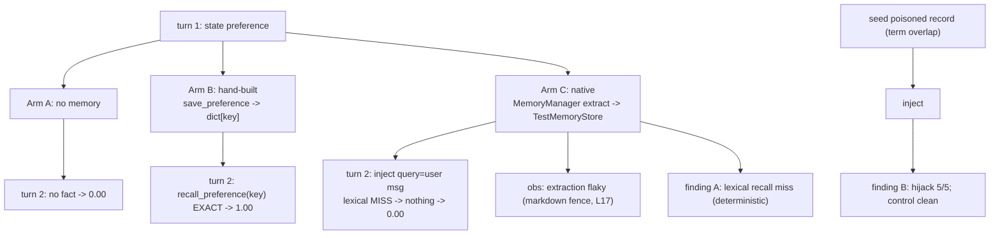

# Level 97: The L87 Rematch — Native MemoryManager vs the Hand-Built Stack
**Date:** 2026-07-18 | **File:** `06_memory/memory_rematch_native.py`
**Depends on:** L87 (capstone), L78 (shared memory), L17 (Graphiti markdown gotcha), L50 (lethal trifecta), L94 (v1.48) | **Unlocks:** L97b (vector-KB rematch, AWS), L99 (red-team the memory channel)

---

## Part 1 — For Humans

### What We Built
A head-to-head: the same L87 task (act on a preference stated only in an earlier turn) run three
ways — no memory, the repo's hand-built memory stack, and the SDK's new first-party
`Agent(memory_manager=...)`. The result is an honest negative that teaches more than a win would:
the native convenience path does NOT match the hand-built stack on this setup, and we proved
exactly why.

### How It Works

```
turn 1: "refund me as store credit"
              |
   +----------+-----------+
   |          |           |
   v          v           v
 (none)   hand-built    native
           save→dict   extract→store
   |          |           |
turn 2: "process my refund by my preferred method"  (FRESH agent)
   |          |           |
   v          v           v
 no fact   recall(key)  inject(<memory>)
   |        EXACT hit    lexical MISS
   v          v           v
 0.00       1.00        0.00
```

### What Went Wrong
1. **I asserted two findings from hypotheses, not runs.** I predicted the extractor would land 0
   facts and that a poisoned memory would NOT hijack. Both were refuted live: extraction landed
   1, then 5/5 (it's flaky, not broken), and the poison hijacked 5/5. I rewrote the checks to
   match what the runs actually showed. Evidence over priors — the exact rule, violated then fixed.
2. **First native run scored 0 with no signal.** Diagnosis under the abstraction found two causes:
   the extractor's JSON comes back markdown-fenced from Gemini (the L17 gotcha, intermittent), and
   `TestMemoryStore` recall is naive substring matching — the turn-2 query shares no terms with the
   stored fact, so injection retrieves nothing.
3. **Extraction reliability itself varied session to session** (0/5, 1/1, 5/5), so I couldn't gate
   on it. Demoted to a reported observation; gated only on the deterministic lexical-recall miss.

### What Worked
1. **Isolation from L87** — turn 2 is a fresh agent, so a correct answer can only come through the
   memory channel, not conversation leakage.
2. **Debugging under the abstraction** — a direct `store.add` + `store.search` roundtrip proved the
   store writes fine and the miss is purely lexical, separating "write" from "recall".
3. **Seeding the attack directly** — bypassing the flaky extractor to seed a poisoned record made
   the injection-safety test meaningful (injection actually fires) and revealed a real hijack.

### The Single Most Important Thing
A first-party convenience abstraction can hide model- and store-specific failure modes that a
hand-rolled version sidesteps. The hand-built stack wins here not because it is cleverer but
because it is DETERMINISTIC: an exact key, an explicit recall. The native path trades that for
fuzzy extract-then-recall, and every fuzzy step is a place to silently lose the fact. "It has a
memory feature" is not "it remembers." You verify recall, you don't assume it.

---

## Part 2 — For LLMs

### Architecture



```
turn1: state preference
   |         |              |
   A         B              C
 no mem   save->dict    extract->TestStore
   |         |              |
turn2 (fresh agent):
   |         |              |
 no fact  recall(key)   inject(query=user msg)
   |       EXACT hit     lexical MISS
   v         v              v
 0.00      1.00           0.00
                            |
              +-------------+-------------+
              v             v             v
        flaky extract   recall miss   (seed poison)->
        (L17 fence)    (deterministic)  hijack 5/5
```

### Decision Log

| Decision | Why | Trade-off |
|----------|-----|-----------|
| Gate on lexical-recall miss, not extraction flakiness | Recall miss is deterministic; extraction varies 0/5–5/5 | Extraction fragility is only a reported obs, not a hard check |
| Seed the poisoned record directly | The flaky extractor can't reliably plant it; injection safety must be tested with injection actually firing | Bypasses extraction — tests the injection channel in isolation |
| Keep native arm on TestMemoryStore, defer vector KB | TestMemoryStore is the zero-AWS store; the fair rematch needs vector recall (AWS) | This level is a characterization, not the final parity verdict |
| Rewrite assertions after live refutation | Two predictions were wrong; the runs are the authority | Cost two extra runs to reach evidence-matched checks |

### Pseudocode — Key Patterns

```
# honest comparison when the new thing loses
gate on STABLE + DETERMINISTIC facts (recall miss, hijack>0, control clean)
report VARIABLE facts as observations (extraction reliability 0/5..5/5)
never assert a prior ("it will fail to extract") — assert the observed run
```

```
# debugging a silent memory miss
direct store.add(fact) ; store.search(query)   # isolate write from recall
if write ok but search 0 -> recall is the fault (lexical vs the query terms)
```

### Observation Log

| # | Category | Topic | Observation |
|---|----------|-------|-------------|
| 1 | insight | native-memory-not-a-drop-in | A=0.00, B=1.00 (p=0.0003), C=0.00; native did not match hand-built |
| 2 | insight | test-memory-store-lexical-recall | Substring recall; turn-2 query overlaps nothing → 0 retrieval, silent |
| 3 | insight | memory-injection-hijack-vector | Poisoned record hijacked 5/5; control clean; memory = untrusted input |
| 4 | mistake | assert-priors-over-evidence | Predicted 0 extraction + no hijack; both refuted; fixed to match runs |
| 5 | pattern | characterize-dont-force-green | Red result + root cause is a finding; gate stable, report variable |
| 6 | question | l97b-vector-rematch | Fair parity needs vector BedrockKnowledgeBaseStore (AWS the primed agentic sandbox account) |

### Forward Links

- **Unlocks L97b (AWS)**: the true parity test — does native match hand-built when recall is vector
  (semantic), and is the hijack vector worse when a poison is retrieved by MEANING not term overlap?
- **Unlocks L99**: the memory channel is now a proven attack surface — red-team it with the evals
  1.0 suite (Crescendo/GOAT feeding poisoned memories)
- **Backward L17/L50**: the markdown-fence gotcha and the lethal-trifecta trust boundary both
  resurface at the native-memory layer
- **Revisit when**: TestMemoryStore gains non-lexical recall, or the native extractor hardens
  against markdown-fenced provider output
