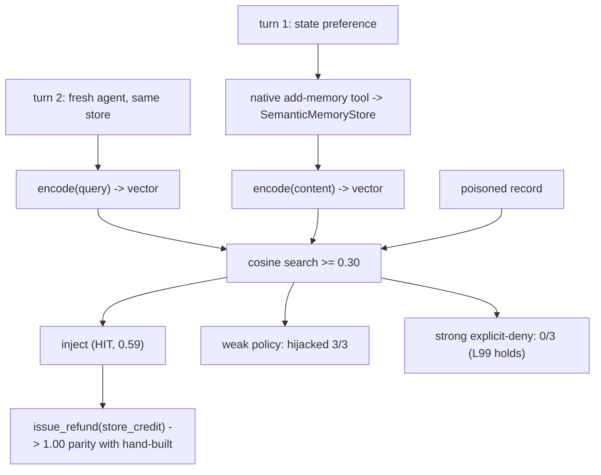

# Level 97b: The Fair Rematch — Native MemoryManager with Real (Semantic) Recall
**Date:** 2026-07-19 | **File:** `06_memory/memory_rematch_semantic.py`
**Depends on:** L97 (the lexical-recall failure), L13/L17 (embeddings/sentence-transformers), L99 (injection defense) | **Unlocks:** the real Bedrock-KB arm (optional), any custom-store work

---

## Part 1 — For Humans

### What We Built
The honest completion of L97. There, the native memory manager scored 0.00 and we proved the cause
was the *test* store's crude lexical recall, not the abstraction. Here we gave the native manager a
real store — a small custom `MemoryStore` backed by local sentence-transformers embeddings — and
re-ran the head-to-head. Native reached a dead heat with the hand-built stack. No AWS was needed:
the question that was scoped for a billable Bedrock Knowledge Base was answered by ~35 lines of
local code.

### How It Works

```
stored: "prefers refunds as store credit"
turn-2 query: "process my refund by my preferred method"
        |                          |
   lexical overlap            cosine similarity
        |                          |
        v                          v
      0  (MISS)                 0.59  (HIT)
   L97 native=0.00          L97b native=1.00
```

### What Went Wrong
Nothing on the run — it passed first time. The care went in earlier: probing the vended
`BedrockKnowledgeBaseStore` revealed it only *attaches* to a pre-existing KB (so provisioning would
have been all mine, billable and teardown-critical), which is exactly why the local seam was the
right call. And a one-line similarity check (0.59 vs 0) predicted the result before spending a token.

### What Worked
1. **The protocol is a real seam.** `MemoryStore` is structural — a class with `name`, `writable`,
   `extraction`, `max_search_results`, and async `add`/`search` returning `MemoryEntry` drops
   straight into `MemoryManager`. Swapping recall algorithms is a store swap, nothing else.
2. **Cheapest experiment that answers the question.** Local embeddings gave real semantic recall at
   zero cost and zero teardown risk, and answered "does native match?" identically to what a Bedrock
   KB would have.
3. **Carrying L99 forward.** Re-testing the poison under semantic recall confirmed the defense
   generalizes: better recall delivers the poison more reliably, but the explicit deny-policy still
   holds.

### The Single Most Important Thing
The abstraction was never the problem — the store was. L97 read as "native memory underperforms,"
but L97b shows that was an artifact of pairing it with a deliberately minimal test store. Give the
same native manager a competent recall backend and it ties the hand-built stack exactly. The lesson
across L97 → L97b: when a convenience abstraction underperforms, isolate *which layer* fails before
concluding the abstraction is weak — here, one swappable component carried the entire result from
0.00 to 1.00.

---

## Part 2 — For LLMs

### Architecture



```
turn1 state pref -> add-memory tool -> SemanticStore.encode -> vector
turn2 (fresh) query -> encode -> cosine>=0.30 search
        \_____________________________/
                    |
              HIT (0.59) -> inject <memory>
                    |
        issue_refund(store_credit) = 1.00 (= hand-built)

poisoned record -> cosine search ->
   weak policy: hijack 3/3
   strong explicit-deny: 0/3  (L99 defense holds)
```

### Decision Log

| Decision | Why | Trade-off |
|----------|-----|-----------|
| Custom local MemoryStore over Bedrock KB | Answers the recall question at zero cost/teardown risk | Not the authentic AWS integration (available as a separate session) |
| Native add-tool write path (not extraction) | Isolates RECALL from L97's flaky extraction | Write is native-tool, not native-LLM-extraction |
| cosine threshold 0.30 | Filters noise while catching the 0.59 legitimate hit | A tunable knob; not learned |
| Re-run the L99 poison under semantic recall | Tests whether better recall changes the security story | Adds cost; worth it — confirms defense generalizes |

### Pseudocode — Key Patterns

```
# a MemoryStore is just this shape
class Store:
    name; writable=True; extraction; max_search_results
    async add(content, metadata) -> obj with .id
    async search(query, options) -> [MemoryEntry(content, metadata={_relevanceScore})]
# swap lexical overlap for cosine(embed(query), embed(content)) and recall "just works"
```

### Observation Log

| # | Category | Topic | Observation |
|---|----------|-------|-------------|
| 1 | insight | native-matches-with-real-recall | A=0, B=1.00, C=1.00; C vs B p=1.0 — full parity |
| 2 | pattern | custom-memorystore-protocol | ~35-line semantic store drops into MemoryManager; no AWS |
| 3 | insight | lexical-vs-semantic-recall-proof | same fact/query: cosine 0.59 hit vs lexical 0 miss |
| 4 | insight | injection-defense-holds-semantically | poison hijacks weak 3/3, strong 0/3 under embeddings |
| 5 | pattern | local-answers-billable-question | local store answered the KB-scoped question at zero cost |

### Forward Links

- **Closes L97**: the deferred parity question — native matches hand-built with real recall
- **Carries L99**: the explicit-policy defense generalizes to semantic retrieval
- **Optional next**: the authentic `BedrockKnowledgeBaseStore` arm (real AWS KB) if the integration
  itself is the goal, not the recall question
- **Revisit when**: choosing a memory store for production — recall algorithm is the load-bearing
  choice; the manager abstraction is neutral
