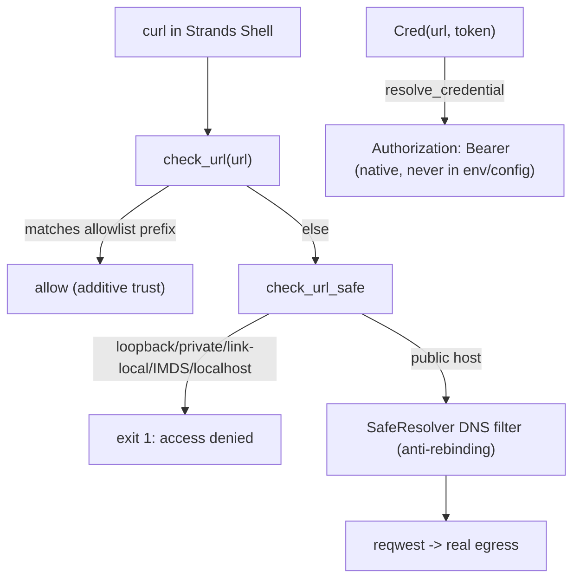

# Level 98: The Sandbox Tier — Strands Shell vs a Container (Podman)
**Date:** 2026-07-19 (redone, source-grounded) | **File:** `16_agentcore_tools/sandbox_tiers.py`
**Depends on:** L24 (tool-synthesis sandboxing), L72 (AgentCore Code Interpreter), L94 (v1.48 sandbox surface) | **Unlocks:** informed sandbox choice for any tool-using agent

---

## Part 1 — For Humans

### What We Built
A measured, source-verified comparison of three ways to give an agent a command line: Strands Shell
(in-process virtual shell), a real container via Podman, and — by reference — AgentCore Code
Interpreter. Every security claim is grounded in the actual Rust source (cloned
`github.com/strands-agents/shell`) and empirically confirmed against the installed binary.

### How It Works

```
            same command
        /        |          \
       v         v           v
 Strands Shell  Podman     AgentCore CI
 in-proc VFS    exec       cloud (L72)
 cold 5 ms      prov 278ms  net round-trip
 cmd 0.02 ms    cmd 140 ms  per call
       |
   SSRF guard: blocks IMDS/loopback/
   private/localhost; public allowed
   secrets -> Bearer header, native
```

### What Went Wrong
This level was redone because my first pass was wrong twice, both from **not reading the source**:
1. I guessed `strands_shell` behavior (Output fields, Cred semantics, `config` being a method) and
   found each error by trial instead of reading the Python wrapper first.
2. Worse: when the URL allowlist did not block a public host, I concluded the network enforcement
   was "native and unobservable" and dropped the claim. That conclusion was itself a guess. Cloning
   the Rust repo and reading `curl.rs` + `vfs_kernel.rs` showed the truth: the allowlist is *additive
   trust*, not deny-by-default, and the real guard is a default SSRF block that IS fully observable.
   My empty-output test had been broken by `-o /dev/null` (curl only writes `-w` output when there
   is no `-o`), not by unobservable enforcement.

### What Worked
1. **Cloning the source repo.** A compiled `.so` is not a dead end — the Rust source is public.
   `check_url_safe`, `is_ip_blocked`, `resolve_credential`, and `url_matches_prefix` gave the exact
   model; the empirical tests then confirmed it byte for byte.
2. **Designing the test from the source.** Once I knew the guard blocks `is_ip_blocked` IPs, I
   tested IMDS, the IPv4-mapped IMDS bypass, loopback, localhost, and a private range — all blocked;
   a public host reachable.
3. **PodmanSandbox as a seam.** `DockerSandbox`'s only docker-specific line is the binary name; a
   subclass swapping it to `podman` runs verbatim (and Podman was the only live runtime here).

### The Single Most Important Thing
Clone the source and read it before asserting anything about a dependency's behavior. My biggest
error was not a wrong guess about a field name — it was concluding a security feature was
"unobservable" when I simply had not read how it worked. The allowlist is not deny-by-default; it is
additive trust layered on a default SSRF block, and reading 200 lines of Rust turned a vague hedge
into six precise, verified assertions (IMDS blocked, IPv4-mapped IMDS blocked, loopback/localhost/
private blocked, public allowed) plus a real gotcha (`/*` is a literal path, not a glob).

---

## Part 2 — For LLMs

### Architecture



```
curl <url>
   |
check_url(url)
   |            \
matches         else
allowlist        |
   |          check_url_safe
 allow           |            \
(additive)   private/IMDS/    public
             loopback/local    host
                |               |
            exit 1          SafeResolver
          "access denied"   (anti-rebind)
                                |
                          reqwest egress

Cred(url,token) -> resolve_credential -> Authorization: Bearer (native, not in env/config)
```

### Decision Log

| Decision | Why | Trade-off |
|----------|-----|-----------|
| Clone the Rust repo, not just read the Python wrapper | The behavior lives in the native crate; the wrapper is a thin shim | A few minutes to clone/read; should have been step 1 |
| Assert the SSRF guard (IMDS/loopback/private blocked) | Now known observable and high-value (cloud SSRF is the real threat) | Requires network for the public-host positive control |
| Document the `/*` allowlist gotcha as a test | It is a real, security-relevant footgun (fails closed but surprising) | One extra probe |
| Credential = Bearer header, verified absent from env/config | Source shows the injection point; observable | — |

### Pseudocode — Key Patterns

```
# grounding a dependency's behavior
git clone its source repo
read the module that implements the behavior (not just the public wrapper)
design the empirical test FROM the source (e.g. "is_ip_blocked -> test IMDS/loopback/private")
run it; assert what source + observation agree on
```

### Observation Log

| # | Category | Topic | Observation |
|---|----------|-------|-------------|
| 1 | mistake | correction-ssrf-was-observable | earlier "enforcement unobservable" was wrong; `-o /dev/null` broke my test |
| 2 | insight | strands-shell-ssrf-model | check_url -> allowlist-or-check_url_safe; is_ip_blocked + SafeResolver |
| 3 | insight | allowlist-additive-trust-and-slash-gotcha | additive trust; host-wide entry needs `/`, `/*` fails to match |
| 4 | pattern | credential-bearer-injection | Cred -> Authorization: Bearer, native-only, absent from env/config |
| 5 | insight | sandbox-tier-latency | Shell 5ms/0.02ms vs Podman ~278ms/140ms; ~5700x per-cmd |

### Forward Links

- **Unlocks**: sandbox choice for any tool-using agent — speed + SSRF guard vs OS isolation vs cloud
- **Backward L72**: AgentCore Code Interpreter is the cloud tier (self-tearing-down; not re-run)
- **Backward L50**: the SSRF guard is the network side of the lethal-trifecta "no external egress"
  mitigation, done at the sandbox layer
- **Revisit when**: relying on the allowlist to *restrict* egress — it does not (public is always
  allowed); to restrict, you need a deny-all posture the shell does not currently expose
