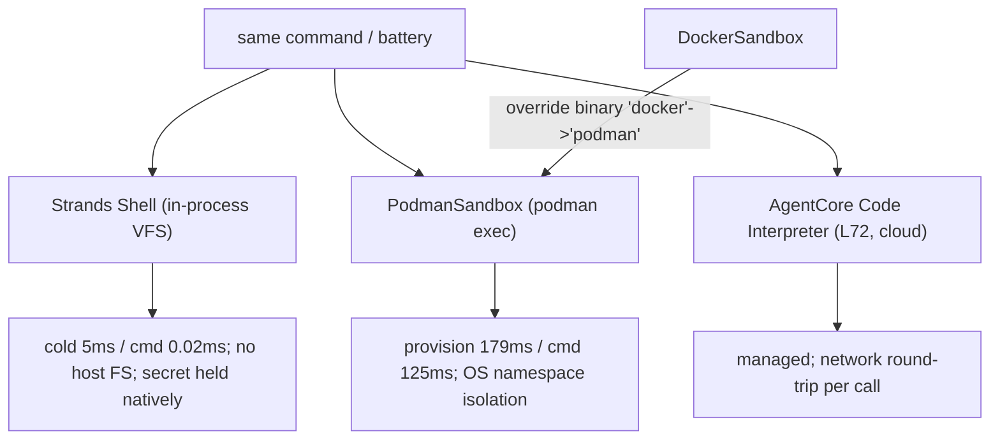

# Level 98: The Sandbox Tier — Strands Shell vs a Container (Podman)
**Date:** 2026-07-19 | **File:** `16_agentcore_tools/sandbox_tiers.py`
**Depends on:** L24 (tool-synthesis sandboxing), L72 (AgentCore Code Interpreter), L94 (v1.48 sandbox surface) | **Unlocks:** informed sandbox choice for any tool-using agent

---

## Part 1 — For Humans

### What We Built
A measured comparison of three ways to give an agent a command line: Strands Shell (an in-process
virtual shell), a real container via Podman, and — by reference — the managed AgentCore Code
Interpreter. Numbers, not marketing: Shell starts in ~5 ms and runs a command in ~0.02 ms; a Podman
exec costs ~125 ms. And a ~15-line `PodmanSandbox` shows the SDK's sandbox interface is a swappable
seam.

### How It Works

```
            same command
        /        |          \
       v         v           v
 Strands Shell  Podman     AgentCore CI
 in-proc VFS    exec       cloud (L72)
 cold 5 ms      prov 179ms  net round-trip
 cmd 0.02 ms    cmd 125 ms  per call
       |         |
   no OS         OS-level
   isolation     (namespace)
   (VFS + secret held natively)
```

### What Went Wrong
The real failure this level was mine, not the code: I repeatedly *guessed* how `strands_shell`
behaves — its `Output` fields, `Cred` semantics, whether the URL allowlist blocks — and found each
mistake by running experiments instead of reading the source first. The package is a thin
`__init__.py` over a native Rust library; the readable contract was one file I should have read
completely up front. Once I did, the design fell out cleanly and the false claims (a "working SSRF
guard" I could not actually observe) were dropped.

### What Worked
1. **Reading the whole source module.** Every real fact — VFS isolation, the token never appearing
   in `ConfigCred`, `Bind` `direct`/`copy` modes, `config` being a property — is in
   `strands_shell/__init__.py`. One full read replaced a dozen guessing experiments.
2. **Asserting only the observable.** Latency, VFS isolation (no-bind shell can't read
   `/etc/passwd`), and secret non-exposure are all directly checkable. The native network-allowlist
   enforcement is *not* observable in this harness, so it is reported as configured, never asserted.
3. **PodmanSandbox as a seam.** `DockerSandbox`'s only docker-specific line is the binary name;
   swapping it to `podman` is a tiny subclass — and here it was also the only working runtime
   (docker daemon down, podman up).

### The Single Most Important Thing
Ground every claim in bytes, never in training-knowledge priors about how a "shell" or "curl"
should behave. I assumed a shell's `head` supports `-c`, that a URL allowlist would visibly block a
request, that `config` was a method — each assumption was a small confident guess, and each was
wrong. For an unfamiliar dependency, the source module is the authority; read it fully before
writing a single assertion about its behavior. And when a behavior lives behind an unreadable
boundary you cannot exercise, scope the claim down to what you *can* observe rather than asserting a
green check you cannot defend.

---

## Part 2 — For LLMs

### Architecture



```
same command
   |          |            |
   v          v            v
Strands     Podman      AgentCore CI (L72)
Shell       exec        cloud
 5ms/0.02   179/125ms   net round-trip
 no host FS  OS-namespace
 secret native

DockerSandbox --(swap 'docker'->'podman')--> PodmanSandbox
```

### Decision Log

| Decision | Why | Trade-off |
|----------|-----|-----------|
| Read the full `__init__.py` before asserting | It is the authoritative readable contract | Should have been step 1, not step 5 |
| Drop the SSRF-block assertion | Enforcement is native + unobservable in this harness | The allowlist is only reported as configured |
| VFS-isolation + secret-non-exposure as the security checks | Both observable and source-guaranteed | Narrower than "full security demo" but honest |
| PodmanSandbox subclass, not a docker shim | Explicit, teachable; docker daemon was down anyway | A few lines duplicated from DockerSandbox |
| Battery uses POSIX-basic commands only | The Strands shell ships minimal builtins (no `head -c`) | Simpler battery than a full coreutils suite |

### Pseudocode — Key Patterns

```
# unfamiliar dependency:
read its source module FULLY
assert ONLY what the source documents AND you can observe
for behavior behind an unreadable boundary you can't exercise:
    report configuration, do NOT assert enforcement
```

### Observation Log

| # | Category | Topic | Observation |
|---|----------|-------|-------------|
| 1 | insight | sandbox-tier-latency | Shell 5ms/0.02ms vs Podman 179ms/125ms; ~5600x per-cmd |
| 2 | insight | podman-sandbox-swappable-seam | DockerSandbox's only docker line is the binary name |
| 3 | insight | strands-shell-source-grounded-claims | VFS isolation, token never in ConfigCred, minimal builtins |
| 4 | mistake | guessing-instead-of-reading-source | guessed behavior repeatedly; read the full source, then asserted |
| 5 | pattern | assert-only-observable | report native allowlist as configured, don't assert enforcement |

### Forward Links

- **Unlocks**: sandbox choice for any tool-using agent — speed vs OS-isolation vs managed-cloud
- **Backward L72**: the AgentCore Code Interpreter is the cloud tier (self-tearing-down; not re-run)
- **Backward L24**: tool-synthesis sandboxing now has three first-class options
- **Revisit when**: a harness can actually exercise the Strands Shell network layer (then the
  allowlist/SSRF enforcement can be asserted, not just reported)
