# AWS Strands Agents - Learning Plan

## Overview

Progressive learning path from basic agents to production multi-agent systems.

**Framework:** Strands Agents SDK (open-source, Apache 2.0)
**Why Strands:** Powers Amazon Q, Kiro, AWS Glue agents. Model-driven, minimal boilerplate.

**Status (2026-07):** L1–L93 complete. This file tracks L1–L76 plus the master index; L77 lives in
`artifacts/adk_patterns/`, L78–L93 in `LEARNING_PLAN_agentic_memory_evals.md`. Open work: `NEXT_STEPS_PLAN.md`.

---

## Progress Tracker

### Foundation (L1-10) ✅ Complete

| Level | Topic | Status | File |
|-------|-------|--------|------|
| 1 | Hello World Agent | Done | `01_basics/hello_agent.py` |
| 2 | Built-in Tools | Done | `01_basics/agent_with_tools.py` |
| 3 | Custom Tools (@tool) | Done | `01_basics/custom_tools.py` |
| 4 | System Prompts & Personas | Done | `02_intermediate/system_prompts.py` |
| 5 | Sessions & State | Done | `02_intermediate/sessions.py` |
| 6 | Agents-as-Tools (Updated v1.35: as_tool + auto-wrap) | Done | `03_multi_agent/agents_as_tools.py` |
| 7 | Swarm Pattern | Done | `03_multi_agent/swarm_example.py` |
| 8 | Graph Workflows | Done | `03_multi_agent/graph_workflow.py` |
| 9 | MCP Integration | Done | `04_production/mcp_integration.py` |
| 10 | AgentCore Deploy | Done | `04_production/agentcore_deploy.py` |

### Extended Syllabus (L11-27)

#### Tier 1: Enhanced Capabilities (L11-13)

| Level | Topic | Status | File |
|-------|-------|--------|------|
| 11 | Reflection Pattern | Done | `05_advanced/reflection_pattern.py` |
| 12 | Structured Outputs | Done | `05_advanced/structured_outputs.py` |
| 13 | RAG Integration | Done | `05_advanced/rag_integration.py` |

#### Tier 2: Memory Architecture (L14-17)

| Level | Topic | Status | File |
|-------|-------|--------|------|
| 14 | Long-term Memory | Done | `06_memory/longterm_memory.py` |
| 15 | Context Management | Done | `06_memory/context_management.py` |
| 16 | Memory Architecture | Done | `06_memory/unified_memory.py` |
| 17 | Graph Memory Deep Dive | Done | `06_memory/graph_memory_benchmark.py` |

#### Tier 3: Advanced Multi-Agent (L18-20)

| Level | Topic | Status | File |
|-------|-------|--------|------|
| 18 | Debate Pattern | Done | `07_advanced_multiagent/debate_pattern.py` |
| 19 | Planning Agents | Done | `07_advanced_multiagent/planning_agents.py` |
| 20 | Meta-Agents | Done | `07_advanced_multiagent/meta_agents.py` |

#### Tier 4: Production Hardening (L21-23)

| Level | Topic | Status | File |
|-------|-------|--------|------|
| 21 | Observability | Done | `08_production/observability.py` |
| 22 | Safety & Guardrails | Done | `08_production/safety_guardrails.py` |
| 23 | Error Recovery | Done | `08_production/error_recovery.py` |

#### Tier 5: Cutting Edge (L24-26)

| Level | Topic | Status | File |
|-------|-------|--------|------|
| 24 | Tool Synthesis | Done | `09_cutting_edge/tool_synthesis.py` |
| 25 | Self-Improving Agents | Done | `09_cutting_edge/self_improving.py` |
| 26 | Capstone: Research Agent | Done | `09_cutting_edge/research_agent.py` |

#### Tier 6: AWS Deployment (L27+)

| Level | Topic | Status | File |
|-------|-------|--------|------|
| 27 | AgentCore Deployment | Done | `10_production/l27agentcore/src/main.py` |

### 2026 Updates (L28+)

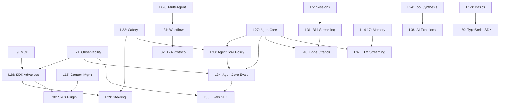

### Extensions (L41+) — all built (Tiers 12-15 below)
*Research basis: [2026-03-18 SOTA research report](docs/work/research/reports/2026-03-18_strands-sota-agent-orchestration.md)*

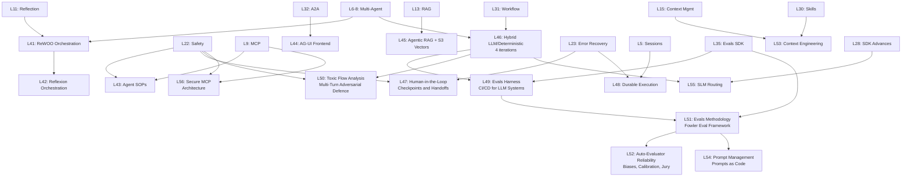

#### Tier 7: SDK Foundation & Plugins (L28-30)

| Level | Topic | Status | File |
|-------|-------|--------|------|
| 28 | SDK Advances: Concurrency, MCP Tasks, Hooks | Done | `11_platform/sdk_advances.py` |
| 29 | Strands Steering | Done | `11_platform/steering.py` |
| 30 | Skills Plugin | Done | `11_platform/skills_plugin.py` |

#### Tier 8: Multi-Agent Extended (L31-32)

| Level | Topic | Status | File |
|-------|-------|--------|------|
| 31 | Workflow Pattern | Done | `11_platform/workflow_pattern.py` |
| 32 | A2A Protocol | Done | `11_platform/a2a_protocol.py` |

#### Tier 9: Production Quality Chain (L33-35)

| Level | Topic | Status | File |
|-------|-------|--------|------|
| 33 | AgentCore Policy | Done | `11_platform/agentcore_policy.py` |
| 34 | AgentCore Evaluations | Done | `11_platform/agentcore_evaluations.py` |
| 35 | Strands Evals SDK | Done | `11_platform/evals_sdk.py` |

#### Tier 10: Real-Time, Memory & Labs (L36-38)

| Level | Topic | Status | File |
|-------|-------|--------|------|
| 36 | Bidirectional Streaming | Done | `11_platform/bidi_streaming.py` |
| 37 | AgentCore LTM Streaming | Done | `11_platform/ltm_streaming.py` |
| 38 | Strands Labs: AI Functions | Done | `11_platform/ai_functions.py` |

#### Tier 11: Platform Expansion (L39-40)

| Level | Topic | Status | File |
|-------|-------|--------|------|
| 39 | TypeScript SDK | Done | `11_platform/typescript/agent.ts` |
| 40 | Edge Strands + Cloud Orchestration | Done | `11_platform/edge_strands.py` |

#### Tier 12: Advanced Orchestration Patterns (L41-43)

| Level | Topic | Status | File |
|-------|-------|--------|------|
| 41 | Custom Orchestration — ReWOO | Done | `12_orchestration/rewoo.py` |
| 42 | Custom Orchestration — Reflexion | Done | `12_orchestration/reflexion.py` |
| 43 | Agent SOPs | Done | `12_orchestration/agent_sops.py` |

#### Tier 13: Agent-to-Frontend & Retrieval (L44-45)

| Level | Topic | Status | File |
|-------|-------|--------|------|
| 44 | AG-UI — Agent-to-Frontend Protocol | Done | `12_orchestration/agui_protocol.py` |
| 45 | Agentic RAG with S3 Vectors | Done | `12_orchestration/s3_vectors_rag.py` |

#### Tier 14: Hybrid Patterns & Reliability (L46-50)

| Level | Topic | Status | File |
|-------|-------|--------|------|
| 46 | Hybrid LLM/Deterministic Systems (4 iterations) | Done | `12_orchestration/hybrid_*.py` |
| 47 | Human-in-the-Loop — Checkpoints and Handoffs | Done | `12_orchestration/hitl_checkpoints.py` |
| 48 | Durable Execution | Done | `12_orchestration/durable_execution.py` |
| 49 | Evals Harness — CI/CD for LLM Systems | Done | `12_orchestration/evals_harness.py` |
| 50 | Toxic Flow Analysis — Multi-Turn Adversarial Defence | Done | `12_orchestration/toxic_flow.py` |

#### Tier 15: Quality Engineering for LLM Systems (L51-56)

| Level | Topic | Status | File |
|-------|-------|--------|------|
| 51 | Evals as Engineering Discipline — Fowler Eval Methodology | Done | `13_quality/evals_methodology.py` |
| 52 | Auto-Evaluator Reliability — Biases, Calibration, Jury | Done | `13_quality/auto_evaluator_reliability.py` |
| 53 | Context Engineering | Done | `13_quality/context_engineering.py` |
| 54 | Prompt Management Pipeline — Prompts as Code | Done | `13_quality/prompt_management.py` |
| 55 | Small Language Model Routing (Assess) | Done | `13_quality/slm_routing.py` |
| 56 | Secure MCP Architecture | Done | `13_quality/secure_mcp.py` |

#### Tier 16: SDK v1.35 Updates (L57-60)

*SDK delta: v1.30.0 → v1.35.0 (AgentAsTool, session providers, per_turn sliding window, service tiers, MCP elicitation)*

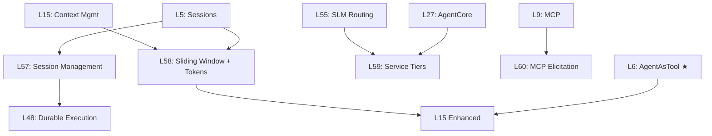

| Level | Topic | Status | File |
|-------|-------|--------|------|
| 57 | Session Management — Providers, Lifecycle Hooks | Done | `11_2026_updates/session_management.py` |
| 58 | Sliding Window Per-Turn + Token Tracking | Done | `11_2026_updates/sliding_window_tokens.py` |
| 59 | Bedrock Service Tiers — Cost/Latency Control | Done | `11_2026_updates/service_tiers.py` |
| 60 | MCP Elicitation — Server-Requested User Input | Done | `11_2026_updates/mcp_elicitation.py` |

#### Tier 17: SDK v1.36-1.38 + AgentCore Q2 2026 (L61-L67)

*SDK delta: v1.35.0 → v1.38.0 (snapshots, count_tokens, tool result offload, CachePoint TTL, strict_tools, experimental checkpoint).
AgentCore SDK delta: 1.1.x → 1.8.0 (native AG-UI runtime, memory branching + episodic, Strands session-manager bridge, on-demand evaluation runner, policy engine).*

Empirical reshape: the previously planned multi-tenant AG-UI ladder (3 lessons) collapsed to a single L67 because `bedrock_agentcore.runtime.ag_ui.serve_ag_ui(agent)` handles auth/session/scaling in one line. Managed Harness, AgentCore CLI deployment, Performance Optimization (recommendations + batch evals + A/B), and Filesystem Persistence are AWS-side previews not yet in the Python SDK — deferred until the API surfaces.

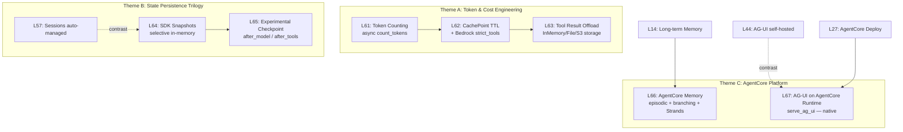

```
+--- Theme A: Token & Cost ---+
|  L61 count_tokens (async)   |
|         |                   |
|         v                   |
|  L62 CachePoint TTL +       |
|       strict_tools          |
|         |                   |
|         v                   |
|  L63 Tool Result Offload    |
+-----------------------------+

+--- Theme B: State Persistence Trilogy ---+
|  L57 Sessions (auto)                     |
|     |                                    |
|     v contrast                           |
|  L64 SDK Snapshots (selective in-mem)    |
|     |                                    |
|     v                                    |
|  L65 Experimental Checkpoint             |
|     (after_model / after_tools)          |
+------------------------------------------+

+--- Theme C: AgentCore Platform ---+
|  L14 Long-term Memory             |
|     |                             |
|     v                             |
|  L66 AgentCore Memory: episodic + |
|       branching + Strands bridge  |
|                                   |
|  L44 AG-UI self-hosted            |
|     |                             |
|     v contrast                    |
|  L67 AG-UI on AgentCore Runtime   |
|     (serve_ag_ui — native)        |
+-----------------------------------+
```

| Level | Topic | Status | File |
|-------|-------|--------|------|
| 61 | Token Counting + Pre-Call Estimate (async `count_tokens`) | Done | `14_token_economics/token_counting.py` |
| 62 | Bedrock Prompt Caching (TTL) + `strict_tools` on Claude — demonstrated live after the use-case form unlocked Claude | Done | `14_token_economics/cache_and_strict.py` |
| 63 | Tool Result Offload (`ContextOffloader` + 3 storage backends) | Done | `14_token_economics/tool_offload.py` |
| 64 | SDK Snapshots — selective in-memory state capture | Done | `13_state_persistence/sdk_snapshots.py` |
| 65 | Experimental Checkpoint — contract + hook realization (auto-runtime deferred, needs Temporal) | Done | `13_state_persistence/checkpoint.py` |
| 66 | AgentCore Memory — async session manager + LTM metadata filter (v1.42 facet) | Done | `14_agentcore_platform/memory_async_ltm.py` |
| 67 | AG-UI on AgentCore Runtime — `serve_ag_ui(agent)` | Realized as L76 | `19_agentcore_agui/agui_native.py` |

#### Deferred (status updated 2026-06; originally 2026-05-03)

| Topic | Source | Status |
|-------|--------|--------|
| Managed Harness (declarative agent → Strands export) | AgentCore preview, April 2026 | Still blocked on Python SDK availability |
| AgentCore CLI + CDK deployment | AgentCore CLI GA, April 2026 | **Unblocked 2026-06**: GA as the npm `@aws/agentcore` CLI (deprecates the Python starter-toolkit CLI) — no lesson yet |
| Performance Optimization (recommendations + batch + A/B) | AgentCore preview, May 2026 | **Unblocked 2026-06**: available via `@aws/agentcore` CLI (`run recommendation`, `run batch-evaluation`) — no lesson yet |
| Filesystem Persistence | AgentCore preview, April 2026 | Still blocked: not in `bedrock-agentcore` Python SDK |
| Protocol-level HITL Interrupts (`Interrupt` schema) | `ag-ui-protocol` PR #1569 merged 2026-04-30 | Still blocked on `ag-ui-protocol >= 0.1.19` PyPI publish (SDK-native interrupts covered by L70) |

---

#### Tier 18: SDK v1.42 + AgentCore 1.12 increment (2026-06-02) — DONE

*SDK delta: strands 1.38 → 1.42, tools 0.5.2 → 0.7.0, bedrock-agentcore 1.8 → 1.12, botocore → 1.43.19 (for the dataset API). All lessons verified on **Gemini 2.5 Flash** (Anthropic budget paused; `get_model` routes Gemini direct, no LiteLLM). Reflections: `sdk-v142-gemini-pivot-reflection.md` + per-level `level-{7,8,15,22,27}-v142` / `level-{66,68,69}`.*

**Numbering note:** the NEW lessons are **L68 (Invocation Limits)** and **L69 (Payments)** — they intentionally do NOT reuse the planned Tier-17 slots **L64 (SDK Snapshots)** / **L67 (AG-UI)**, which were open roadmap at the time (both since closed: L64 in Tier 19, the AG-UI slot as L76). **L66 (AgentCore Memory)** is realized here via its async + LTM-filter facet.

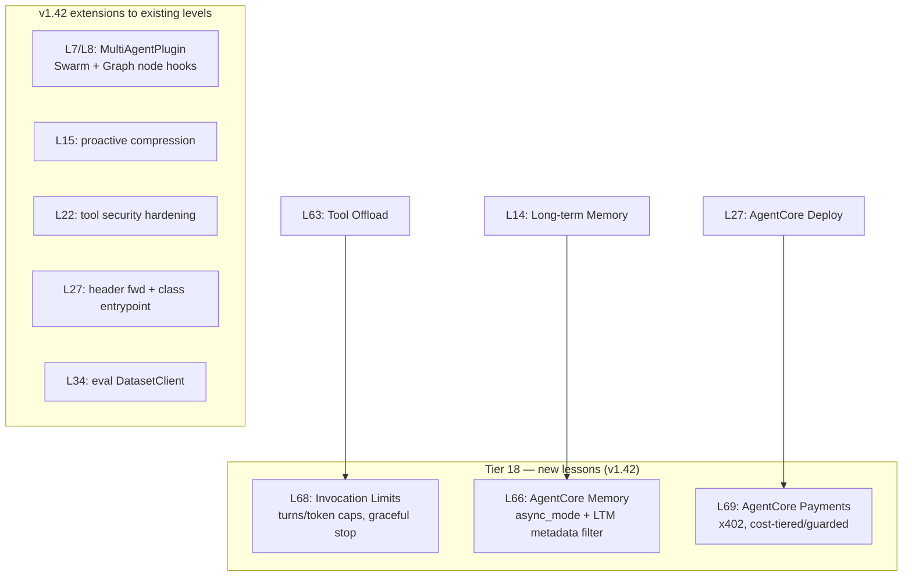

```
+--- Tier 18: new lessons (v1.42) ---------+
|  L68 Invocation Limits (turns/token caps)|  <- L63 Tool Offload
|  L66 AgentCore Memory (async + LTM filter)|  <- L14 Long-term Memory
|  L69 AgentCore Payments (x402, guarded)  |  <- L27 AgentCore Deploy
+------------------------------------------+
+--- v1.42 extensions (existing levels) ---+
|  L7/L8 MultiAgentPlugin (Swarm + Graph)  |
|  L15 proactive compression               |
|  L22 tool security hardening             |
|  L27 header fwd + class entrypoint       |
|  L34 eval DatasetClient                  |
+------------------------------------------+
```

| Level | Topic | Status | File |
|-------|-------|--------|------|
| 66 | AgentCore Memory — `async_mode` config + `MemoryMetadataFilter` (LTM prefilter, ≤5) | Done | `14_agentcore_platform/memory_async_ltm.py` |
| 68 | Invocation Limits — per-invocation `Limits(turns/output_tokens/total_tokens)`, graceful `stop_reason` | Done | `14_token_economics/invocation_limits.py` |
| 69 | AgentCore Payments — x402 agentic micropayments (Tier 0 offline + Tier 1 manager; testnet/mainnet documented) | Done | `14_agentcore_platform/payments.py` |

| Extended | v1.42 addition | File |
|----------|----------------|------|
| L7 / L8 | `MultiAgentPlugin` node-lifecycle monitoring (Swarm `plugins=`, Graph `set_plugins`) | `03_multi_agent/{swarm_example,graph_workflow}.py` |
| L15 | Iter 9 — `SummarizingConversationManager(proactive_compression=…)` (needs explicit `context_window_limit`) | `06_memory/context_management.py` |
| L22 | Iter 13 — tools 0.7.0: calculator AST sandbox, `use_aws` redaction, `cron` sanitize | `08_production/safety_guardrails.py` |
| L27 | runtime header forwarding (`is_forwardable_header`) + class-based `@entrypoint` | `04_production/agentcore_deploy.py` |
| L34 | Iter 4 — Evaluation `DatasetClient` (curated golden-set datasets) | `11_platform/agentcore_evaluations.py` |

**Roadmap unblocked by the 2026-06 release** (update to the Deferred table above):
- **AgentCore CLI + CDK deployment** — now GA as the npm **`@aws/agentcore`** CLI (TypeScript, framework-agnostic), which DEPRECATES the Python `bedrock-agentcore-starter-toolkit` CLI. See the note in `04_production/agentcore_deploy.py`.
- **Performance Optimization (recommendations + batch evals)** — now available via the `@aws/agentcore` CLI (`run recommendation`, `run batch-evaluation` [preview]).
- Note: the Strands SDK is now a **monorepo** (Python + TypeScript + WASM) — relevant to the L39 TypeScript framing.

---

#### Tier 19: State, Control & Token Economics (2026-06-02 session) — Gemini-verified

*Completed the model-agnostic zero-friction slots and added one net-new control-flow lesson. All verified live on Gemini 2.5 Flash. L62 (CachePoint TTL + Bedrock `strict_tools`) deferred — Anthropic/Bedrock-specific, not demoable while the Anthropic budget is paused.*

```
+--- Theme: pre-call cost + durable state + HITL ---+
|  L61 Token Counting   look-before-you-leap        |
|  L64 SDK Snapshots    selective in-mem capture     |
|  L65 Checkpoint       durable contract + hooks     |
|  L70 Interrupts       native human-in-the-loop     |
+----------------------------------------------------+
```

| Level | Topic | Status | File |
|-------|-------|--------|------|
| 61 | Token Counting — heuristic vs native `count_tokens`; chars/4 under-counts code/CJK/punct 40-75% | Done | `14_token_economics/token_counting.py` |
| 64 | SDK Snapshots — selective in-memory capture/restore, JSON round-trip, branching | Done | `13_state_persistence/sdk_snapshots.py` |
| 65 | Experimental Checkpoint — data contract + hook realization (auto-runtime types-only in 1.42, needs Temporal) | Done | `13_state_persistence/checkpoint.py` |
| 70 | Native Interrupts — HITL approval gates (`event.interrupt` / `result.interrupts` / resume by id) | Done | `12_orchestration/interrupts_hitl.py` |

**Empirical findings this session (probe-validated):**
- **L61:** base `count_tokens` docstring claims tiktoken cl100k_base but the v1.42 path is char heuristic (`ceil(chars/4)`); Gemini native count == actual billed `inputTokens` exactly; heuristic under-counts code (−40%), CJK (−50%), punctuation (−75%).
- **L65:** `strands.experimental.checkpoint` is TYPES-ONLY in 1.42 — `AgentResult` has no `checkpoint` field, nothing sets `stop_reason="checkpoint"`, no resume param. Realized durable execution via `AfterModelCallEvent`/`AfterToolCallEvent` hooks + L64 snapshots instead.
- **L70:** interrupts are fully wired — `event.interrupt(name, reason)` raises (pauses) then returns the human's response on resume; `event.cancel_tool` enforces a deny; the interrupt is portable JSON keyed by `id`.

---

#### Tier 20: AgentCore Platform — Cloud Catalog (2026-06-02 session) — live AWS

*AWS-backed lessons, **re-verified on the agentic sandbox account** — the correct agentic account — after an initial mis-run on the data-only sandbox account (see the account-migration note, `MIGRATION_*.md` in repo root). Each is self-tearing-down (leaves zero resources). Probe-first: offline `service_model` shapes + live smoke probe before writing. Use `AWS_PROFILE=<your-sso-profile>`.*

| Level | Topic | Status | File |
|-------|-------|--------|------|
| 71 | AgentCore Agent Registry — publish & discover an `AGENT_SKILLS` bundle; approval gates discovery | Done | `15_agentcore_registry/agent_registry.py` |
| 72 | AgentCore Code Interpreter — managed sandbox (`code_session`), stateful kernel + fs, wired to a Strands agent | Done | `16_agentcore_tools/code_interpreter.py` |
| 73 | AgentCore Browser — managed headless Chrome over CDP (`browser_session` + Playwright `connect_over_cdp`), agent drives it | Done | `16_agentcore_tools/browser.py` |
| 74 | AgentCore Workload Identity — vault a secret (no key in code); `@requires_api_key` injects it; token vault keyed to identity | Done | `17_agentcore_identity/workload_identity.py` |
| 75 | AgentCore Config Bundles — Git-like versioned config for resources (commits/branches/lineage); rollback via `get_configuration_bundle_version` | Done | `18_agentcore_config/config_bundles.py` |
| 76 | AG-UI Native — `serve_ag_ui`/`build_ag_ui_app` serve a Strands agent over the agent-to-frontend protocol (SSE+WS); entrypoint adapter | Done | `19_agentcore_agui/agui_native.py` |

**Empirical findings (L76, local — no AWS):** `build_ag_ui_app(entrypoint)` builds a Starlette app (`/invocations` SSE, `/ws`, `/ping`). Pass an ENTRYPOINT (async-gen `RunAgentInput`→AG-UI events), **not** a raw Agent (else `RUN_ERROR` "Input prompt must be of type…"). Adapter: `RunStarted → TextMessageStart → TextMessageContent(delta from `stream_async` `event["data"]`) → TextMessageEnd → RunFinished`. `RunAgentInput` requires `forwardedProps` et al. (missing → HTTP 400); mid-stream errors → `RunErrorEvent`. Test headlessly with Starlette `TestClient`. This realizes the long-open L67 AG-UI slot.

**Empirical findings (L75, live on the agentic sandbox account):** Config bundle components are keyed by a real resource ARN (gateway accepted; workload-identity ARN rejected); gateway component config is `{configuration:{toolOverrides:{tool:{description}}}}` (no `document` wrapper). create/update = commits (commitMessage + parentVersionIds + branchName) → version lineage; `get_configuration_bundle_version` reads any past version. A minimal gateway (name+role+AWS_IAM+MCP, no target) suffices; role trusts `bedrock-agentcore.amazonaws.com`.

**Empirical findings (L74, live on the agentic sandbox account):** `create_api_key_credential_provider` vaults the key in AWS-managed Secrets Manager; `Get` returns only ARNs (never the raw key). `@requires_api_key(provider_name=…)` injects the vaulted key at call time (works locally; sibling `requires_access_token` for OAuth2 M2M/user-federation). **Gotcha:** the decorator caches its workload identity in `./.agentcore.json` — a stale cache (deleted identity / different account) → `AccessDeniedException`; clear it (gitignored) when switching accounts.

**Empirical findings (L73, live-validated):** `browser_session(region)` → `generate_ws_headers()` (wss + SigV4) → Playwright `connect_over_cdp` (no local browser binaries); navigate/fill/click/JS all work; `generate_live_view_url` + `take_control`/`release_control` = human-on-the-loop. **Gotcha:** sync Playwright's greenlet loop collides with Strands' asyncio loop (`greenlet.error`) — go uniformly async (`async_playwright` + `invoke_async` + async `@tool`). Needs `playwright` (added via uv; package only).

**Empirical findings (L72, live-validated):** `code_session(region)` context manager → managed isolated sandbox (kernel+fs); `execute_code` returns `stream[].result.structuredContent {stdout,stderr,exitCode}` (errors are data, not exceptions); kernel state persists across calls (`clear_context` resets); default sandbox had **no pip egress**; a Gemini agent computed `fib(20)=6765` via a `run_python` tool. **Gotcha:** `LESSON_DOTENV` injects static `AWS_*` keys that override SSO → `InvalidClientTokenId`; drop them when `AWS_PROFILE` is set.

**Empirical findings (L71, live-validated):**
- Registry is a unified governed catalog: `DescriptorType` ∈ `MCP|A2A|CUSTOM|AGENT_SKILLS`; control plane `bedrock-agentcore-control` + data plane `bedrock-agentcore` (`SearchRegistryRecords`). Realizes the 2026-05-19 `NOTE_*agentcore_agent_registry.md`.
- **Approval gates discovery**: `SearchRegistryRecords` returns ONLY `APPROVED` records — the same query is empty while `DRAFT`, found once `APPROVED`.
- `create_registry`/`delete_registry` are async (202; `CREATING`→`READY`→`DELETING`); `skillMd.inlineContent` must be `---`-frontmatter SKILL.md; search is eventually consistent (~8-12s post-approval).
- Pairs with **L30** (local Strands `AgentSkills`): L30 runs a skill in-process; L71 publishes/governs/discovers one org-wide.

**Queue complete (user 2→1→3):** ✓ L71 Registry · ✓ L72 Code Interpreter + ✓ L73 Browser · ✓ L62 (Nova prompt caching). **Bedrock entitlement finding (validated live):** Claude is gated behind an unfilled use-case form (`Model use case details have not been submitted` / `GetUseCaseForModelAccess` "not filled out") — `agreementAvailability` metadata was misleading; a real Converse call is the truth. `strict_tools` is Claude-only (Nova/Llama/Mistral all reject). Filling the Bedrock model-access use-case form would unlock Claude + `strict_tools` + extended cache TTL.

---

#### Tier 21: Cross-Model Patterns + Agentic Memory & Evals (L77-93) — DONE

| Level | Topic | Status | Where |
|-------|-------|--------|-------|
| 77 | ADK multi-agent patterns ported to Strands, verified on Gemini + Bedrock Claude Haiku (8/8 both) | Done | `artifacts/adk_patterns/` |
| 78-92 | Agentic memory (shared, cross-session, LTM-filtered, long-horizon, durable resume) + agentic evals (trajectory, goal-success, significance, unified harness) + capstone | Done | `LEARNING_PLAN_agentic_memory_evals.md` (per-level detail) |
| 93 | Cross-model validation of L78-92 model-sensitive findings on Bedrock Nova Lite — all 6 held (framework-inherent) | Done | `13_quality/crossmodel_validation.py` |

Current open work lives in `NEXT_STEPS_PLAN.md`.

---

## Level Details

### Level 1: Hello World Agent
**Goal:** Understand the basic agent loop

```python
from strands import Agent
from strands.models.openai import OpenAIModel

model = OpenAIModel(
    model_id="claude-sonnet-4",
    client_args={"base_url": "http://localhost:4000", "api_key": "sk-local"}
)

agent = Agent(model=model)
agent("Hello! Tell me about AI agents.")  # Streams to stdout by default
```

**Key Concepts:**
- Agent loop: prompt -> LLM reasoning -> response
- Model provider abstraction (OpenAIModel for LiteLLM proxy)
- Default streaming via PrintingCallbackHandler

---

### Level 2: Built-in Tools
**Goal:** Understand tool calling

```python
from strands import Agent
from strands_tools import calculator, current_time

agent = Agent(model=model, tools=[calculator, current_time])
agent("What time is it and what is 42 * 17?")
```

**Key Concepts:**
- Tools extend agent capabilities
- LLM decides WHEN to use tools based on task
- Tool results feed back into reasoning loop

---

### Level 3: Custom Tools
**Goal:** Create domain-specific tools

```python
from strands import Agent, tool

@tool
def get_weather(city: str) -> dict:
    """Get current weather for a city."""
    return {"city": city, "temp": 72, "condition": "sunny"}

agent = Agent(model=model, tools=[get_weather])
agent("What's the weather in Seattle?")
```

**Key Concepts:**
- @tool decorator converts functions to tools
- Docstrings = LLM instructions (affects tool selection)
- Type hints enable parameter validation

---

### Level 4: System Prompts & Personas
**Goal:** Shape agent behavior with prompts

```python
agent = Agent(
    model=model,
    system_prompt="""You are an AWS Solutions Architect.
    Always consider cost, security, and scalability.
    Reference AWS Well-Architected Framework when appropriate."""
)
```

**Key Concepts:**
- Same model + different prompt = different behavior
- Constraints work ("be concise" -> concise output)
- Try better prompt before bigger model (high ROI)

---

### Level 5: Sessions & State
**Goal:** Maintain context across interactions

```python
from strands.session.file_session_manager import FileSessionManager

agent = Agent(
    model=model,
    session_manager=FileSessionManager(
        session_id="my-session",
        storage_dir="./sessions"
    )
)
```

**Key Concepts:**
- Agent is stateless; session_manager holds state
- Same session_id = continued conversation
- Production path: FileSessionManager -> S3SessionManager -> AgentCore Memory

---

### Level 6: Agents-as-Tools Pattern
**Goal:** Hierarchical agent delegation

```python
@tool
def research_agent(query: str) -> str:
    """Delegate research tasks to specialist."""
    researcher = Agent(
        model=model,
        system_prompt="You are a research specialist..."
    )
    return str(researcher(query))

orchestrator = Agent(model=model, tools=[research_agent, code_agent])
```

**Key Concepts:**
- Agents can call other agents as tools
- Specialization improves quality
- Orchestrator coordinates specialists

---

### Level 7: Swarm Pattern
**Goal:** Peer-to-peer agent collaboration

```python
from strands.multiagent import Swarm

swarm = Swarm(
    [agent1, agent2, agent3],        # positional list of agents
    entry_point=agent1,
    max_handoffs=10,
    repetitive_handoff_detection_window=5,   # prevents ping-pong loops
    repetitive_handoff_min_unique_agents=3,
)
result = swarm("Analyze this architecture...")
```

**Key Concepts:**
- No single orchestrator — agents hand off to each other
- Handoff caps and ping-pong detection keep the loop bounded
- Parallel execution

---

### Level 8: Graph Workflows
**Goal:** Structured agent workflows (DAG)

```python
from strands.multiagent import GraphBuilder

graph = GraphBuilder()
graph.add_node("planner", planner_agent)
graph.add_node("executor", executor_agent)
graph.add_node("reviewer", reviewer_agent)
graph.add_edge("planner", "executor")
graph.add_edge("executor", "reviewer")
```

**Key Concepts:**
- DAG-based workflows
- Conditional routing
- Complex task decomposition

---

### Level 9: MCP Integration
**Goal:** Leverage Model Context Protocol ecosystem

```python
from strands.tools.mcp import MCPClient
from mcp import stdio_client, StdioServerParameters

params = StdioServerParameters(command="uvx", args=["mcp-server-fetch"])
mcp_client = MCPClient(lambda: stdio_client(params))
with mcp_client:
    agent = Agent(model=model, tools=mcp_client.list_tools_sync())
```

**Key Concepts:**
- 1000s of pre-built MCP servers available
- Standardized tool protocol
- External service integration

---

### Level 10: Production with AgentCore
**Goal:** Deploy agents at scale

```python
from bedrock_agentcore.runtime import BedrockAgentCoreApp

agent = Agent(model=model, tools=[...])
app = BedrockAgentCoreApp()

@app.entrypoint
def invoke(payload):
    return str(agent(payload["prompt"]))
# Deploy via the AgentCore CLI or CDK
```

**Key Concepts:**
- Serverless deployment
- Session isolation
- Observability & monitoring
- Identity & access control

---

## Extended Level Details (L11-25)

### Level 11: Reflection Pattern
**Goal:** Agent self-critique and iterative improvement

**Patterns:**
- Inner critic (same agent reviews itself)
- External critic (separate critic agent)
- Iterative refinement (loop until quality threshold)

**Key Concepts:**
- Quality scoring approaches
- Convergence criteria
- Cost/latency tradeoffs

---

### Level 12: Structured Outputs
**Goal:** Type-safe agent responses with Pydantic

```python
from pydantic import BaseModel

class AnalysisResult(BaseModel):
    summary: str
    confidence: float
    sources: list[str]
```

**Key Concepts:**
- Schema-constrained generation
- Validation with retry
- Nested structured outputs

---

### Level 13: RAG Integration
**Goal:** Agent with local document knowledge base

**Local stack:** ChromaDB (embedded), sentence-transformers

**Key Concepts:**
- Vector embeddings
- Semantic search
- Document chunking strategies

---

### Level 14: Long-term Memory
**Goal:** Memory that persists across sessions

**Three Memory Layers:**
| Layer | What | Where | Persistence |
|-------|------|-------|-------------|
| Working | Current conversation | SessionManager | Session only |
| Episodic | Specific events | Graphiti/JSON | Cross-session |
| Semantic | Facts/knowledge | ChromaDB/Graphiti | Cross-session |

**6 Progressive Iterations:**
1. Local JSON (keyword search)
2. ChromaDB (semantic vector search)
3. Graphiti (graph + temporal facts)
4. Mem0 (SOTA comparison)
5. Memory-Augmented Agent
6. Cross-Session Persistence Demo

**Key Patterns:**
```python
# Episodic memory (events)
@tool
def remember_event(event: str, context: str = "") -> str:
    """Store interaction in episodic memory."""
    episodic_memory.store(event, context)

# Semantic memory (facts)
@tool
def learn_fact(entity: str, fact_type: str, value: str) -> str:
    """Store fact in semantic memory."""
    semantic_memory.store(entity, fact_type, value)

# Memory-augmented agent
agent = Agent(
    model=model,
    session_manager=FileSessionManager(...),  # Working
    tools=[remember_event, learn_fact, recall_*]  # Long-term
)
```

**Key Insight:** Search evolution matters:
- Keyword: Simple but limited ("Python" doesn't find "programming")
- Semantic: Meaning-based ("code bugs" finds "debugging")
- Graph: Relationships + temporal validity

---

### Level 15: Context Management
**Goal:** Efficient context window usage applying Horthy's 40% Rule

**Key Insight (Dexter Horthy / HumanLayer):**
- Optimal: <40% context utilization
- Warning: 40-60% (quality degrading)
- Dumb Zone: >60% (hallucinations, forgotten constraints)

**5 Iterations:**
1. Token Budget Tracker (tiktoken, utilization monitoring)
2. Rolling Summarization (sliding window + summary)
3. Hierarchical Summarization (verbatim → paragraphs → facts)
4. Selective Context Retrieval (importance scoring, budget-aware)
5. Context-Aware Agent (autonomous management)

**Key Patterns:**
```python
# Token budget (40% target)
budget = TokenBudget(model_id, target_utilization=0.4)
if budget.should_compress(messages):
    compressed = rolling_summarizer.rolling_context(messages)

# Hierarchical compression
# Recent (<10 turns): verbatim
# Medium (10-30): paragraph summaries
# Old (>30): key facts only

# Selective retrieval
# importance = relevance * recency_decay
# Fill token budget with highest-scored items
```

**XML Efficiency:** More token-efficient than JSON for structured prompts

---

### Level 16: Memory Architecture
**Goal:** Unified memory system

Combines L5 (sessions), L13 (RAG), L14 (Graphiti) into cohesive architecture.

---

### Level 17: Graph Memory Deep Dive
**Goal:** Test graph database strengths that vector DBs cannot match

**Infrastructure (SDK Approach - Recommended):**
| Component | Connection | Isolation | Notes |
|-----------|------------|-----------|-------|
| FalkorDB | `localhost:6379` | Named graphs | Direct Cypher OR via Graphiti SDK |
| Graphiti SDK | `pip install graphiti-core` | `group_id` | Connects to FalkorDB, adds temporal facts |
| LanceDB | Directory path | Directories | Baseline vector comparison |

**Critical Gotchas (from prior Graphiti benchmarking):**
- **LiteLLM incompatible** with Graphiti structured outputs (wraps JSON in markdown)
- Use **direct GeminiClient** for entity extraction (87% recall)
- Entity types must be **list, not dict**: `[PersonEntity, TechEntity]`
- Pass entity_types to `add_episode()`, NOT `Graphiti.__init__()`
- Embedding dimension **locked** once set (use 1536-dim consistently)

**5 Iterations:**

1. **Graphiti SDK Setup** - Direct FalkorDB connection via SDK
   ```python
   driver = FalkorDriver(host='localhost', port=6379)
   graphiti = Graphiti(graph_driver=driver, llm_client=GeminiClient(...))
   await graphiti.add_episode(..., group_id="l17_benchmark")
   ```
   - Learn: SDK vs MCP tradeoffs, async patterns

2. **Temporal Query Benchmark** - Test time-aware facts
   - "What was true before the LanceDB iteration?"
   - "Which facts have been superseded?"
   - Compare: Vector DBs have NO temporal awareness

3. **Multi-Hop Reasoning Benchmark** - 2-3 hop traversals
   - "What technologies are compared to ChromaDB and what are their tradeoffs?"
   - "Starting from 'memory architecture', what connects to it?"
   - Expected: Graphiti excels, vectors fail

4. **Knowledge Update Semantics** - Fact versioning
   - Add conflicting information, verify old facts marked `invalid_at`
   - Test graph consistency over time
   - Compare: Vectors overwrite, graphs version

5. **Graph-Augmented Agent** - Practical integration
   - Agent with Graphiti SDK tools (not MCP)
   - Demonstrate relationship reasoning in conversation

**Key Concepts:**
- Graphiti SDK async patterns (`await graphiti.add_episode()`)
- Direct GeminiClient for entity extraction
- Temporal fact validity (`valid_at`, `invalid_at`, `expired_at`)
- Multi-hop vs single-hop retrieval
- Graph memory vs vector memory tradeoffs

**Existing Data:**
- `benchmark-094640` group: 134 observations with extracted entities
- An unrelated personal graph shares the same FalkorDB in its own group (isolated, don't modify)

---

### Level 18: Debate Pattern
**Goal:** Adversarial agents for better decisions

**Flow:** Advocate ↔ Skeptic → Judge (synthesize)

**Use cases:** Decision analysis, risk assessment, code review

---

### Level 19: Planning Agents
**Goal:** Explicit plan-then-execute

**Flow:** Planner → Executor → Verifier

**Key Concepts:**
- Task decomposition
- Dependency tracking
- Plan revision on failure

---

### Level 20: Meta-Agents
**Goal:** Agents that create/modify other agents

**Patterns:**
- Agent factories
- Runtime prompt optimization
- Dynamic composition

---

### Level 21: Observability
**Goal:** Full visibility into agent operations

**Stack:** OpenTelemetry + Jaeger (Docker)

**Tracks:** Traces, metrics, logs, cost

---

### Level 22: Safety & Guardrails
**Goal:** Production-ready safety

**Patterns:**
- Input/output validation
- Rate limiting
- Capability sandboxing

---

### Level 23: Error Recovery
**Goal:** Graceful failure handling

**Patterns:**
- Retry with backoff
- Fallback chains
- Human escalation

---

### Level 24: Tool Synthesis
**Goal:** Agents that create tools at runtime

**Safety:** Sandboxed execution (Docker/subprocess)

---

### Level 25: Self-Improving Agents
**Goal:** Learn from feedback

**Mechanisms:**
- Prompt optimization
- Tool usage learning
- Example curation

---

### Level 26: Capstone - Research Agent
**Goal:** Combine all patterns

Autonomous research assistant with RAG, long-term memory, self-critique, planning, and tool creation.

---

### Level 27: AgentCore Deployment
**Goal:** Deploy Research Agent to AWS Bedrock AgentCore

Adapts L26 capstone for production AWS deployment:

**Infrastructure:**
- DynamoDB tables for session memory and checkpoints
- Bedrock models (Claude Sonnet/Haiku) instead of LiteLLM
- FastAPI wrapper with `/invocations` and `/ping` endpoints
- Docker container for AgentCore (linux/arm64)

**Files:**
| File | Purpose |
|------|---------|
| `bedrock_models.py` | Bedrock model wrapper with auto-detection |
| `dynamodb_persistence.py` | DynamoDB session/checkpoint storage |
| `l27_agentcore_research_agent.py` | Main AgentCore wrapper |
| `Dockerfile` | Container for AgentCore deployment |
| `setup_aws.sh` | AWS CLI script for infrastructure setup |
| `teardown_aws.sh` | Cleanup script |
| `deploy_config.yaml` | Environment configuration template |

**Key Patterns:**
- Environment auto-detection (AWS vs local)
- DynamoDB persistence with TTL
- Graceful degradation for Graphiti/Perplexity
- FastAPI endpoints compatible with AgentCore

**Run locally:**
```bash
uv run python 10_production/l27_agentcore_research_agent.py --demo
```

---

### Level 28: SDK Advances — Concurrency, MCP Tasks, Hooks
**Goal:** Parallel tool execution, MCP Tasks, simpler hook API, declarative agent config

**Depends on:** L9 (MCP), L21 (hooks/observability)
**Unlocks:** L29 (Steering uses plugins API), L30 (Skills uses plugins API)

SDK v1.26 (Feb 11) + v1.27 (Feb 19, 2026).

```
# Parallel tool execution
agent = Agent(tools=[A, B, C], concurrent_invocation_mode=ON)
  → LLM returns [call_A, call_B] in same response
  → SDK dispatches both to thread pool simultaneously
  → results merged before next reasoning step

# Hook registration (simplified API)
agent.add_hook(event="before_tool_call", handler=my_fn)
  # event options: before_tool_call | after_tool_call | before_model | after_model

# Declarative config (experimental)
agent = config_to_agent({ model: "...", prompt: "..." })
  → same as Agent() constructor but driven by dict/JSON
```

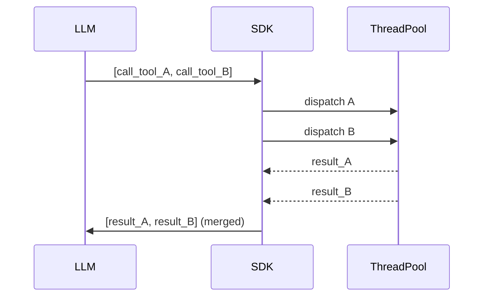

**Implementation file:** `11_platform/sdk_advances.py`

**Key Concepts:**
- `concurrent_invocation_mode=True`: independent tools no longer block each other
- `add_hook()` replaces verbose manual hook registration from L21
- MCP Tasks = async work units (vs Resources = data, Prompts = templates); min dep 1.23.0
- `config_to_agent()`: declarative JSON/dict agent creation (experimental)
- Breaking change (pre-v1.25): `max_parallel_tools` removed — SDK manages thread pools

**Sources:**
- [sdk-python releases](https://github.com/strands-agents/sdk-python/releases) ✓
- [v1.27.0 notes](https://newreleases.io/project/github/strands-agents/sdk-python/release/v1.27.0) ✓

---

### Level 29: Strands Steering
**Goal:** Inject context-aware guidance at lifecycle points without modifying agent code

**Depends on:** L28 (plugins API), L22 (Safety — know what you're steering away from)
**Unlocks:** L30 (both use plugins=[...])

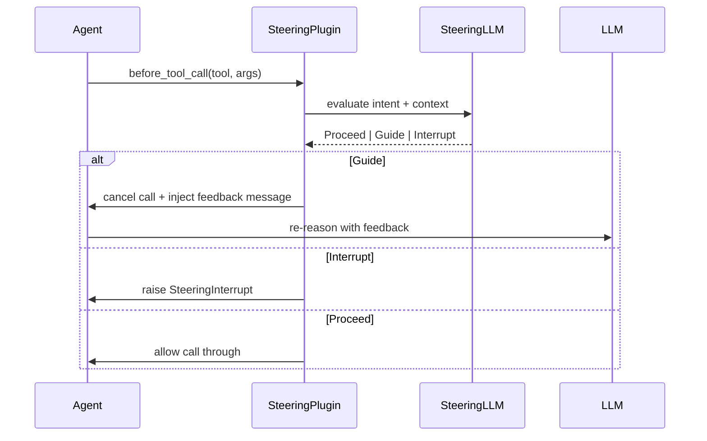

```
# Setup
handler = LLMSteeringHandler(system_prompt="<behavioral policy>")
agent = Agent(tools=[...], plugins=[handler])

# Handler fires at two lifecycle points:
#   before_tool_call  → validate intent before execution
#   after_model       → validate output before returning to user
# LedgerProvider tracks history + timing for context-aware decisions
```

**Implementation file:** `11_platform/steering.py`

**Key Concepts:**
- Two lifecycle injection points: before-tool (validate call), after-model (validate output)
- Three actions: Proceed (pass through), Guide (cancel + inject feedback), Interrupt
- `LedgerProvider` tracks tool call history + timing for context-aware decisions
- vs L22 Safety: L22 = hard block, L29 = contextual guidance that steers behavior
- vs Graph/Swarm: Steering = dynamic guardrails without restructuring the agent

**Sources:**
- [Steering docs](https://strandsagents.com/docs/user-guide/concepts/plugins/steering/) ✓
- [Plugins overview](https://strandsagents.com/docs/user-guide/concepts/plugins/) ✓

---

### Level 30: Skills Plugin
**Goal:** On-demand specialized knowledge for agents — progressive disclosure without prompt bloat

**Depends on:** L28 (plugins API), L15 (Context Management — why bloat is a problem)
**Unlocks:** Better pattern for any agent handling multiple knowledge domains

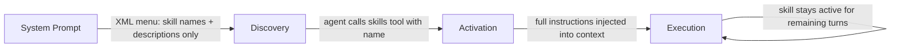

```
# Define skills
skill = Skill(name="...", description="...", instructions="full step-by-step guide")
plugin = AgentSkills(skills=["./skills/dir/", skill])  # mix files + programmatic

# At runtime:
#   1. Discovery: agent sees XML menu with names only (lean)
#   2. Activation: agent calls skills("invoice-processing")
#   3. Execution: full instructions loaded into context, persist for session
agent = Agent(plugins=[plugin], tools=[file_read, shell])
```

**Implementation file:** `11_platform/skills_plugin.py`

**Key Concepts:**
- Three phases: Discovery (XML menu in system prompt) → Activation (skills tool call) → Execution
- Skills ≠ Tools: skills = instruction packages, tools = executable functions
- Progressive disclosure keeps context lean; activated skills persist across turns
- vs L15 context management: Skills are a structural solution to context bloat
- Use case: agents handling PDF, data analysis, code review without loading all instructions

**Sources:**
- [Skills docs](https://strandsagents.com/docs/user-guide/concepts/plugins/skills/) ✓

---

### Level 31: Workflow Pattern
**Goal:** Deterministic DAG-based pipelines with automatic parallel execution and dependency resolution

**Depends on:** L6 (Agents-as-Tools), L7 (Swarm), L8 (Graph) — understand all patterns before choosing
**Unlocks:** L32 (A2A agents can be workflow tasks)

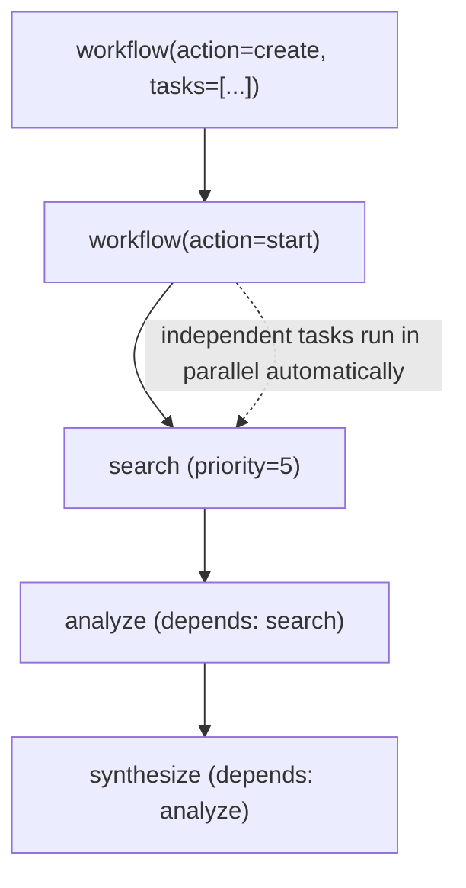

```
# Lifecycle actions: create → start → status | pause | resume | delete
# Tasks: { task_id, description, dependencies[], priority }
# Dependencies are edges in the DAG — engine resolves execution order
# Independent tasks (no shared deps) run in parallel automatically

# Pattern selector:
#   freeform collaboration   → Swarm (L7)
#   agent decides at runtime → Graph (L8)
#   fixed deterministic DAG  → Workflow (L31)  ← this level
```

**Implementation file:** `11_platform/workflow_pattern.py`

**Key Concepts:**
- Workflow = pre-defined DAG in `strands_tools` (not core SDK)
- vs Graph (L8): Graph = agent decides path at runtime; Workflow = fixed DAG, deterministic
- vs Swarm (L7): Swarm = autonomous handoff; Workflow = explicit task order + dependencies
- Parallel execution of independent tasks is automatic
- Pattern decision tree: freeform → Swarm; structured decisions → Graph; fixed pipeline → Workflow

**Critical Gotcha — Task Tool Inheritance:**
- Tasks with no `tools` key (or `tools: []`) inherit ALL parent agent tools
- If parent has `workflow`, tasks get it too → LLM creates recursive sub-workflows
- Fix: specify `"tools": ["calculator"]` (or any real non-workflow tool) in every task
- `"tools": []` does NOT prevent inheritance — empty list is falsy in Python check

**Sources:**
- [Workflow docs](https://strandsagents.com/docs/user-guide/concepts/multi-agent/workflow/) ✓
- [Multi-agent patterns](https://strandsagents.com/docs/user-guide/concepts/multi-agent/multi-agent-patterns/) ✓

---

### Level 32: A2A Protocol
**Goal:** Expose Strands agents as network services; consume remote agents as local objects

**Depends on:** L31 (Workflow patterns), L8 (Graph — A2AAgent works as graph node)
**Unlocks:** Distributed agent architectures; remote specialist agents

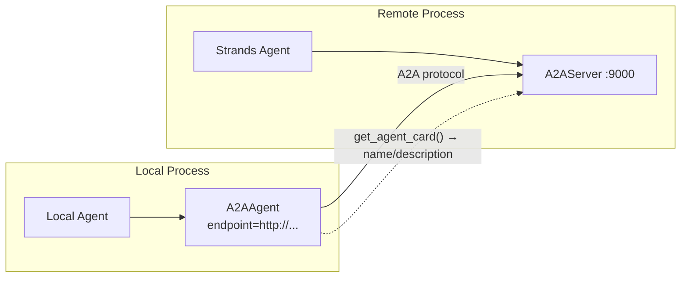

```
# SERVER side
server_agent = Agent(name="...", description="...", tools=[...])
A2AServer(agent=server_agent).serve()   # exposes /a2a endpoint

# CLIENT side (same API as local Agent)
remote = A2AAgent(endpoint="http://host:9000")
result = remote("natural language task")

# Graph integration: A2AAgent is just another node
graph.add_node("remote-specialist", remote)

# Install extras:
#   pip install strands-agents[a2a]           # server + client
#   pip install strands-agents-tools[a2a_client]  # tool-based client
```

**Implementation file:** `11_platform/a2a_protocol.py`

**Key Concepts:**
- A2A = open standard for agent discovery, communication, collaboration
- `A2AAgent` handles: card resolution, HTTP client, protocol messages, response parsing
- `get_agent_card()` for discovery (name/description caching)
- Works as node in Graph workflows — transparently mix local + remote agents
- Extras: `strands-agents[a2a]` (server+client), `strands-agents-tools[a2a_client]` (tool)
- Not yet supported in TypeScript SDK

**Sources:**
- [A2A Protocol docs](https://strandsagents.com/docs/user-guide/concepts/multi-agent/agent-to-agent/) ✓

---

### Level 33: AgentCore Policy
**Goal:** Define agent governance boundaries in natural language; Cedar enforcement at the Gateway

**Depends on:** L22 (Safety & Guardrails), L27 (AgentCore Deployment)
**Unlocks:** L34 (Evaluations — measure what policy protects)

GA March 3, 2026.

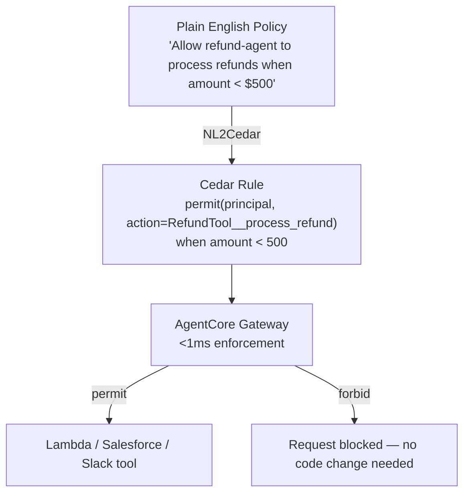

```
# Policy authoring (natural language, no Cedar syntax needed):
#   "Allow principal X to perform action Y when condition Z"
#   "Forbid all principals from deleting records"
#
# Three elements: WHO (principal) + WHAT (action) + WHEN (conditions)
# Semantics: Forbid always wins. Default deny — at least one permit must match.
# Conditions: numeric (<, >, =), string (equals, contains), boolean, existence
# Scope: any tool — Lambda, API, SaaS integration — no agent code changes
```

**Implementation file:** `11_platform/agentcore_policy.py`

**Key Concepts:**
- NL2Cedar: plain English → Cedar; enforced by Gateway (<1ms, thousands req/sec)
- Controls: Lambda tools, Salesforce, Slack, any API integration — no agent code changes
- L22 = in-process code guardrails; L33 = infrastructure policy layer (complementary)
- Permit / Forbid semantics; conditions support numeric, string, boolean, existence checks

**Sources:**
- [Policy GA](https://aws.amazon.com/about-aws/whats-new/2026/03/policy-amazon-bedrock-agentcore-generally-available/) ✓
- [Writing policies in natural language](https://docs.aws.amazon.com/bedrock-agentcore/latest/devguide/policy-natural-language.html) ✓

---

### Level 34: AgentCore Evaluations
**Goal:** Measure agent quality on live production traffic via AgentCore's cloud-side evaluation service

**Depends on:** L21 (Observability), L27 (AgentCore), L33 (Policy — know what you're evaluating against)
**Unlocks:** L35 (Evals SDK — local complement to cloud evaluations)

Preview (not GA in all regions).

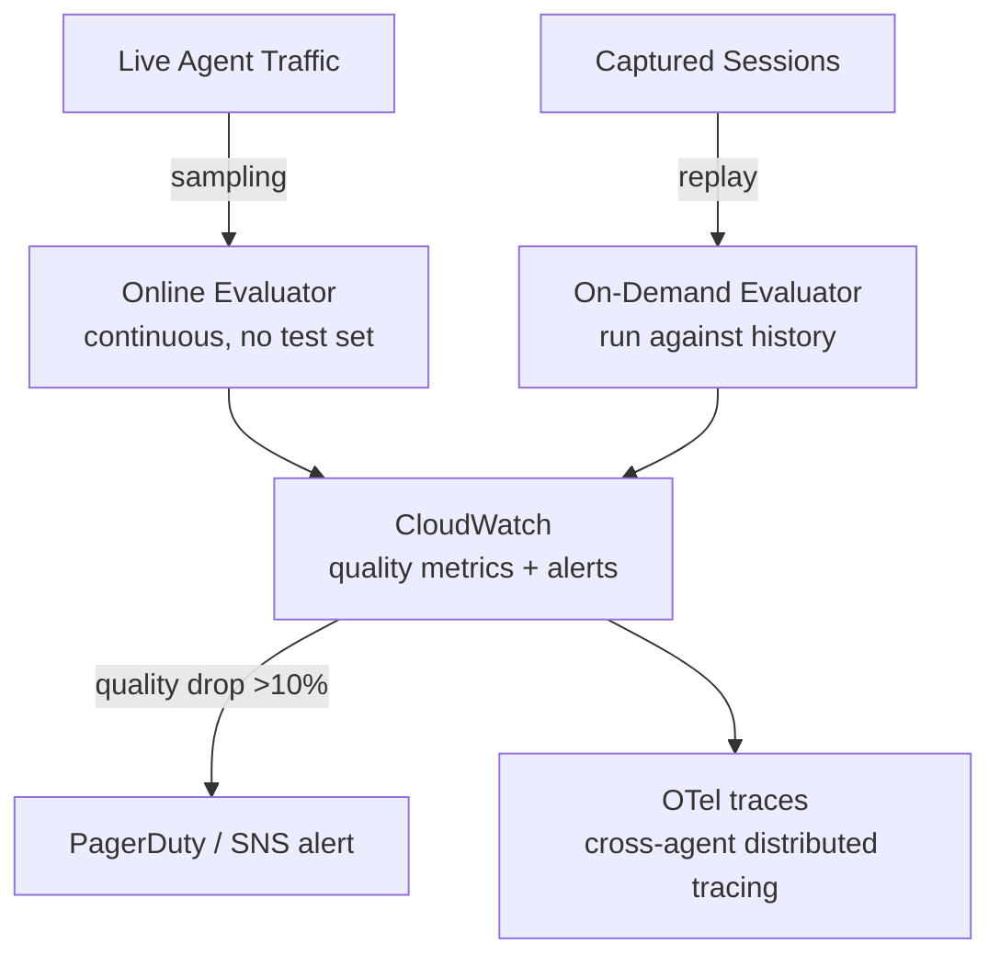

```
# Evaluator types:
#   Built-in: Builtin.Helpfulness | Builtin.Faithfulness | Builtin.Safety
#   Custom:   LLM-as-judge with domain-specific rubric

# Two modes:
#   Online    → samples live traffic continuously (no test set required)
#   On-demand → runs against previously captured sessions

# L21 vs L34:
#   L21 = what happened (metrics, traces, latency)
#   L34 = how well (semantic quality, helpfulness, goal success)
```

**Implementation file:** `11_platform/agentcore_evaluations.py`

**Key Concepts:**
- Built-in evaluators + custom LLM evaluators for domain quality
- Online vs on-demand; CloudWatch dashboards for tokens/latency/error rates/quality
- vs L35 Evals SDK: L34 = cloud/production sampling, L35 = local/CI testing
- Extends L21: L21 = metrics/traces (what happened), L34 = semantic quality (how well)

**Sources:**
- [Evaluations docs](https://docs.aws.amazon.com/bedrock-agentcore/latest/devguide/evaluations.html) ✓

---

### Level 35: Strands Evals SDK
**Goal:** Structured local evaluation experiments with auto-generated test cases and 8 evaluator types

**Depends on:** L21 (Observability), L34 (AgentCore Evals — understand cloud vs local distinction)
**Unlocks:** Validates output quality of any other level

**Evaluator taxonomy:**

| Layer | Evaluators | Measures |
|-------|-----------|---------|
| OUTPUT | Helpfulness, Faithfulness, Output (custom rubric) | Response quality |
| TRACE | ToolSelection, ToolParameter, Trajectory | Tool usage correctness |
| SESSION | Interactions, GoalSuccessRate | Conversation flow + goal |

```
# AI-powered eval SOP (4 phases):
#   1. Plan   → TopicPlanner generates topic distribution
#   2. Generate → ExperimentGenerator creates cases (30% easy / 50% medium / 20% complex)
#   3. Execute  → run agent on each case, collect traces
#   4. Report   → evaluators score results, produce metrics

# Persistence:
#   experiment.to_file("baseline_v1.json")       → version/share/CI artifact
#   Experiment.from_file("baseline_v1.json")     → reload for comparison

# L34 vs L35:
#   L34 = cloud, continuous production sampling (no manual test sets)
#   L35 = local, structured CI experiments with explicit cases
```

**Implementation file:** `11_platform/evals_sdk.py`

**Key Concepts:**
- 8 evaluators across 3 levels: OUTPUT (quality), TRACE (tool usage), SESSION (flow + goal)
- `ExperimentGenerator` + `TopicPlanner`: LLM-driven test case gen with difficulty distribution
- Eval SOP: AI-powered 4-phase (plan → generate → execute → report) via MCP or agent
- Serialization: `to_file()`/`from_file()` for versioning, sharing, CI/CD integration
- vs L34 AgentCore Evals: local = fast iteration and CI; cloud = continuous production monitoring

**Sources:**
- [Evals SDK quickstart](https://strandsagents.com/docs/user-guide/evals-sdk/quickstart/) ✓
- [Evaluators](https://strandsagents.com/docs/user-guide/evals-sdk/evaluators/) ✓
- [ExperimentGenerator](https://strandsagents.com/docs/user-guide/evals-sdk/experiment_generator/) ✓

---

### Level 36: Bidirectional Streaming
**Goal:** Real-time voice and text conversations with automatic interruption handling

**Depends on:** L5 (Sessions — multi-turn state), L1-3 (basic agent patterns)
**Unlocks:** L40 (Edge Strands — voice on device)

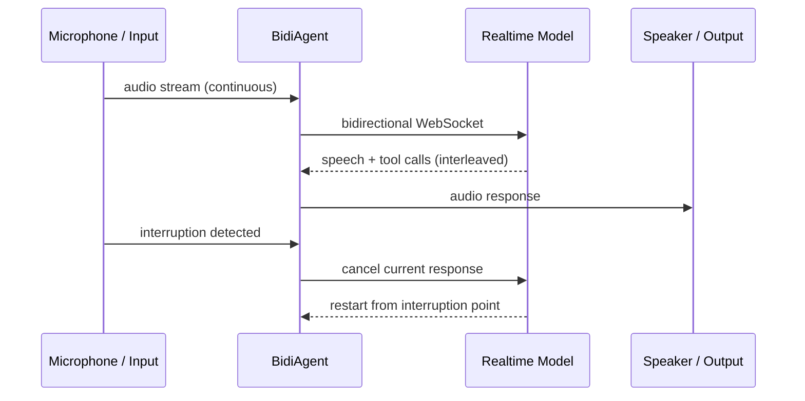

```
# Provider options:
#   BidiNovaSonicModel      → AWS Nova Sonic (8-min session max)
#   BidiOpenAIRealtimeModel → OpenAI Realtime (60-min session)
#   BidiGeminiLiveModel     → Gemini Live

# Setup pattern:
#   model  = BidiNovaSonicModel()
#   agent  = BidiAgent(model, system_prompt="...")
#   io     = BidiAudioIO()  # or custom I/O handler
#   await agent.run(inputs=[io.input()], outputs=[io.output()])

# Deployment targets: Lambda, Fargate, EKS, Docker, Kubernetes
# Module: strands.experimental.bidi
```

**Implementation file:** `11_platform/bidi_streaming.py`

**Key Concepts:**
- Three providers: Nova Sonic (8-min max), OpenAI Realtime (60-min), Gemini Live
- Natural speech interruptions handled automatically; tools execute concurrently during voice
- Custom I/O handlers: deploy to Lambda, Fargate, EKS, Docker, Kubernetes
- Status: `strands.experimental.bidi`
- General-purpose (not edge-only); edge voice uses this as foundation (L40)

**Sources:**
- [Bidirectional streaming quickstart](https://strandsagents.com/docs/user-guide/concepts/bidirectional-streaming/quickstart/) ✓

---

### Level 37: AgentCore LTM Streaming + Kinesis
**Goal:** Event-driven memory pipelines via Kinesis push — eliminate polling for LTM changes

**Depends on:** L14-17 (Memory Architecture), L27 (AgentCore Deployment)
**Unlocks:** Real-time personalization, audit, cross-agent memory sync patterns

GA March 12, 2026.

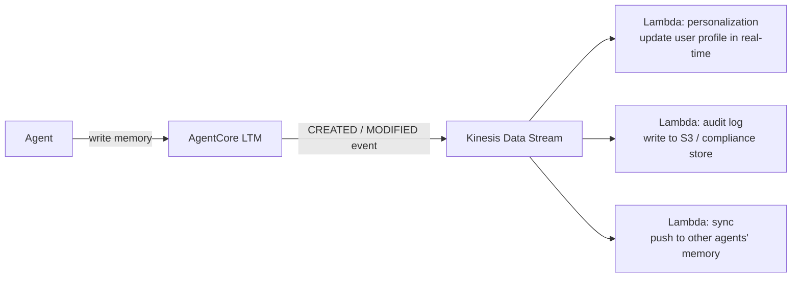

```
# Event payload modes:
#   METADATA_ONLY  → record ID + timestamp + event type (lightweight)
#   FULL_CONTENT   → complete memory record (heavier, more useful downstream)

# Event types: CREATED | MODIFIED
# Each Kinesis record: { eventType, memoryId, timestamp, [fullContent] }

# Lambda handler pattern:
#   for each record in event.Records:
#     decode kinesis data → parse JSON payload
#     branch on eventType → CREATED or MODIFIED handler
#     act: update cache, write audit log, notify downstream

# Availability: 15 AWS regions (GA March 12, 2026)
```

**Implementation file:** `11_platform/ltm_streaming.py`

**Key Concepts:**
- Kinesis Data Stream as push event bus for LTM (vs polling)
- Episodic Memory GA: structured episodes (context/reasoning/actions/outcomes) + pattern learning
- Extends L14-17: custom memory layers → managed AgentCore LTM with streaming events
- Use cases: real-time personalization updates, compliance audit logs, cross-agent memory sync

**Sources:**
- [LTM Streaming GA](https://aws.amazon.com/about-aws/whats-new/2026/03/agentcore-memory-streaming-ltm/) ✓
- [Memory record streaming docs](https://docs.aws.amazon.com/bedrock-agentcore/latest/devguide/memory-record-streaming.html)
- [Hands-on walkthrough](https://dev.classmethod.jp/en/articles/agentcore-memory-kinesis-streaming/)

---

### Level 38: Strands Labs — AI Functions
**Goal:** Define tool behavior in natural language via `@ai_function`; agent loop generates + self-corrects

**Depends on:** L24 (Tool Synthesis — understand the production approach before the simplified one)
**Unlocks:** Rapid prototyping path for trusted environments

Strands Labs, launched Feb 23, 2026. Experimental — separate from core SDK.

```
# Define an AI function via docstring spec:
#   @ai_function
#   def load_invoices(file_path):
#     """
#     WHAT:       Load invoice data from file_path
#     RETURNS:    DataFrame with columns: vendor(str), amount(float), date(datetime), line_items(list)
#     VALIDATES:  amount is always positive
#     """
#     (body left empty — agent generates implementation)

# Runtime loop:
#   1. Generate  → LLM writes implementation from docstring spec
#   2. Execute   → run generated code in controlled sandbox
#   3. Validate  → check conditions from docstring
#   4. Auto-retry if validation fails (no manual iteration needed)

# L24 vs L38:
#   L24 Tool Synthesis  = Docker sandbox, explicit security controls, production-grade
#   L38 @ai_function    = simpler API, faster iteration, trusted environments only
```

**Repo:** [strands-labs/ai-functions](https://github.com/strands-labs/ai-functions) (v0.1.0, Apache 2.0)
**Implementation file:** `11_platform/ai_functions.py`

**Key Concepts:**
- Docstring = implementation spec; conditions = validation contract
- Agent loop: generate → validate → auto-retry on condition failure (no manual iteration)
- Built-in guardrails: controlled code execution, restricted imports
- vs L24: `@ai_function` for rapid prototyping; L24 for security-hardened production tools
- SDK 14M+ downloads; Labs decoupled to allow faster experimentation

**Sources:**
- [strands-labs/ai-functions](https://github.com/strands-labs/ai-functions) ✓ (228★, v0.1.0, Apache 2.0)
- [Introducing Strands Labs](https://strandsagents.com/blog/introducing-strands-labs/) ✓
- [AWS OSS Blog](https://aws.amazon.com/blogs/opensource/introducing-strands-labs-get-hands-on-today-with-state-of-the-art-experimental-approaches-to-agentic-development/) ✓

---

### Level 39: TypeScript SDK
**Goal:** Build Strands agents in TypeScript for Lambda and serverless deployments

**Depends on:** L1-3 (understand Python SDK patterns to transfer knowledge)
**Unlocks:** Node.js/Lambda deployment track (parallel to Python)

⚠️ **Status: Experimental** — "does not yet support all features available in the Python SDK." A2A not supported.

```
# Key structural differences from Python SDK:
#   Tool input schema:  Zod schema objects  (vs Python type hints + docstring)
#   Tool handler:       async function       (vs sync function with @tool decorator)
#   Agent invocation:   agent.invoke(prompt) (vs agent(prompt))
#   Lambda deployment:  native handler export pattern built-in

# Patterns available (same as Python):
#   Single agent, Agents-as-Tools, Swarm, Graph, MCP, Streaming, Hooks

# Feature gaps vs Python (experimental status):
#   A2A Protocol       → not yet supported
#   Some advanced features pending parity
```

**When to choose TypeScript over Python:**

| Criterion | TypeScript | Python |
|-----------|-----------|--------|
| Existing infra | Node.js / Lambda-first | General purpose |
| API contracts | Typed (Zod) preferred | Flexible |
| A2A support | No | Yes |
| Maturity | Experimental | Stable |

**Repo:** [strands-agents/sdk-typescript](https://github.com/strands-agents/sdk-typescript) (experimental)
**Implementation file:** `11_platform/typescript/agent.ts`

**Key Concepts:**
- Zod schemas for type-safe tool input (vs Python type hints + docstrings)
- Native Lambda handler exports for serverless deployment
- MCP, streaming, lifecycle hooks — same concepts as Python
- Feature gap vs Python: A2A unsupported; some advanced features pending
- When to choose: existing Node.js infra, Lambda-first, typed API contracts

**Sources:**
- [TypeScript SDK preview](https://aws.amazon.com/about-aws/whats-new/2025/12/typescript-strands-agents-preview/) ✓
- [strands-agents/sdk-typescript](https://github.com/strands-agents/sdk-typescript) ✓ (524★, experimental)
- [TypeScript Quickstart](https://strandsagents.com/docs/user-guide/quickstart/typescript/) ✓
- [TypeScript API Reference](https://strandsagents.com/docs/api/typescript/) ✓

---

### Level 40: Edge Strands + Cloud Orchestration
**Goal:** Run agents on edge devices with local models (llama.cpp server), cloud delegation for complex reasoning

**Depends on:** L36 (Bidirectional Streaming — voice on edge), L27 (AgentCore — cloud side)
**Unlocks:** (terminal — end of learning path)

GA December 3, 2025.

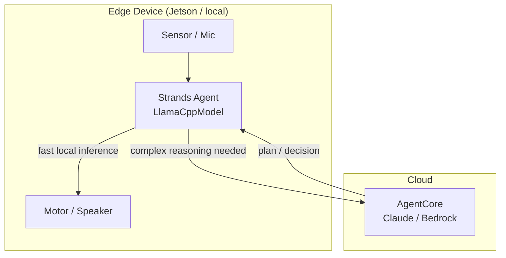

```
# LlamaCppModel connects to a RUNNING llama.cpp HTTP server — does NOT load models directly
#   base_url = "http://localhost:8080"   # llama.cpp server must be started separately
#   model_id = "default"                 # as registered in the server
#   Supports: GBNF grammar constraints, structured output, prompt caching

# Cloud delegation pattern:
#   edge agent handles: sensor reads, local actuation, fast loop (50Hz for robots)
#   cloud agent handles: multi-step planning, reasoning, memory retrieval

# Robotics extension (Strands Labs):
#   GR00T VLA model → visual-language-action for SO-100/101 arms
#   robots-sim      → physics-based 3D testing (Libero environments) before real hardware
#   Bidi (L36) + Edge (L40) = voice-controlled robots with cloud reasoning
```

**Repos:** [strands-labs/robots](https://github.com/strands-labs/robots) · [strands-labs/robots-sim](https://github.com/strands-labs/robots-sim)
**Implementation file:** `11_platform/edge_strands.py`

**Key Concepts:**
- `LlamaCppModel` requires a running llama.cpp HTTP server at base_url
- Supports GBNF grammar constraints, structured output, prompt caching
- NVIDIA Jetson: edge VLA (GR00T) runs at 50Hz for robot control
- Strands Labs Robots: natural language → SO-100/101 arms via GR00T + LeRobot
- Robots Sim: physics-based 3D testing (Libero environments) before real hardware
- L36 bidi streaming + L40 edge = voice-controlled robots with cloud reasoning

**Sources:**
- [llama.cpp provider](https://strandsagents.com/docs/user-guide/concepts/model-providers/llamacpp/) ✓
- [strands-labs/robots](https://github.com/strands-labs/robots) ✓
- [strands-labs/robots-sim](https://github.com/strands-labs/robots-sim) ✓

---

## Local Development Setup

### LiteLLM Proxy (localhost:4000)

| Alias | Model | Use Case |
|-------|-------|----------|
| `claude-sonnet-4` | Claude Sonnet 4 | General, tool-use |
| `claude-opus-4` | Claude Opus 4 | Complex reasoning |
| `haiku` | Claude Haiku 4.5 | Fast iterations |
| `gemini-flash` | Gemini 2.5 Flash | Fast alternative |

```bash
# Start proxy (podman container; see CLAUDE.md)
podman start litellm-proxy

# Run examples
uv run python 01_basics/hello_agent.py
```

### Model Helper

```python
from tools import get_model

model = get_model("claude-sonnet-4")  # or haiku, opus, gemini-flash
```

---

## Key Resources

**Documentation:**
- [Strands Agents Docs](https://strandsagents.com/docs/)
- [Multi-Agent Patterns](https://strandsagents.com/docs/user-guide/concepts/multi-agent/multi-agent-patterns/)

**GitHub:**
- [strands-agents/sdk-python](https://github.com/strands-agents/sdk-python)
- [strands-agents/samples](https://github.com/strands-agents/samples)

**AWS Blogs:**
- [Introducing Strands Agents 1.0](https://aws.amazon.com/blogs/opensource/introducing-strands-agents-1-0-production-ready-multi-agent-orchestration-made-simple/)
- [Technical Deep Dive](https://aws.amazon.com/blogs/machine-learning/strands-agents-sdk-a-technical-deep-dive-into-agent-architectures-and-observability/)
- [Multi-Agent Patterns](https://aws.amazon.com/blogs/machine-learning/multi-agent-collaboration-patterns-with-strands-agents-and-amazon-nova/)

### 2026 Updates

- [Strands SDK Releases](https://github.com/strands-agents/sdk-python/releases) — v1.26–v1.29+ changelogs
- [Strands Labs org](https://github.com/strands-labs) — ai-functions, robots, robots-sim
- [Introducing Strands Labs](https://strandsagents.com/blog/introducing-strands-labs/) — blog post
- [Steering plugin](https://strandsagents.com/docs/user-guide/concepts/plugins/steering/)
- [Skills plugin](https://strandsagents.com/docs/user-guide/concepts/plugins/skills/)
- [A2A Protocol](https://strandsagents.com/docs/user-guide/concepts/multi-agent/agent-to-agent/)
- [Workflow pattern](https://strandsagents.com/docs/user-guide/concepts/multi-agent/workflow/)
- [AgentCore Policy](https://docs.aws.amazon.com/bedrock-agentcore/latest/devguide/policy-natural-language.html) — NL2Cedar guide
- [AgentCore Evaluations](https://docs.aws.amazon.com/bedrock-agentcore/latest/devguide/evaluations.html)
- [AgentCore LTM Streaming](https://aws.amazon.com/about-aws/whats-new/2026/03/agentcore-memory-streaming-ltm/)
- [Evals SDK](https://strandsagents.com/docs/user-guide/evals-sdk/quickstart/)
- [Bidirectional streaming](https://strandsagents.com/docs/user-guide/concepts/bidirectional-streaming/quickstart/)
- [llama.cpp provider](https://strandsagents.com/docs/user-guide/concepts/model-providers/llamacpp/)
- [TypeScript SDK](https://github.com/strands-agents/sdk-typescript) — experimental
- **OSS (third-party):** [Agent Control by Galileo](https://strandsagents.com/blog/strands-agents-with-agent-control/) — runtime guardrails plugin; not official AWS

### Proposed L51-55 Resources (Fowler + ThoughtWorks Vol.33)

- [Martin Fowler: Engineering Practices for LLM Application Development](https://martinfowler.com/articles/engineering-practices-llm.html) — example-based/property-based/auto-evaluator/adversarial testing, inference-testing decoupling, prompt refactoring
- [Martin Fowler: Patterns for Building LLM-based Systems & Products](https://martinfowler.com/articles/gen-ai-patterns.html) — guardrails, eval pipeline, query rewriting, hybrid retrieval, reranking
- [ThoughtWorks Technology Radar Vol.33 (2026) Techniques](https://www.thoughtworks.com/radar/techniques) — Context Engineering (Assess), Small Language Models (Trial), Naive API-to-MCP Conversion (Hold), LLM as a Judge (Assess), Toxic Flow Analysis (Assess), Structured Output from LLMs (Trial), AGENTS.md (Trial)

### Proposed L41+ Resources

- [Customize agent workflows — AWS ML Blog](https://aws.amazon.com/blogs/machine-learning/customize-agent-workflows-with-advanced-orchestration-techniques-using-strands-agents/) — ReWOO + Reflexion deep dive
- [strands-agents/samples: 15-custom-orchestration-airline-assistant](https://github.com/strands-agents/samples/blob/main/02-samples/15-custom-orchestration-airline-assistant/src/reWoo-reAct_singleTurn.ipynb) — ReWOO vs ReAct notebook
- [Introducing Strands Agent SOPs](https://aws.amazon.com/blogs/opensource/introducing-strands-agent-sops-natural-language-workflows-for-ai-agents/)
- [strands-agents/agent-sop](https://github.com/strands-agents/agent-sop) — Agent SOPs repo
- [AG-UI Protocol](https://docs.ag-ui.com/) — Agent-to-Frontend event standard
- [AWS Strands + AG-UI integration](https://www.copilotkit.ai/blog/aws-strands-agents-now-compatible-with-ag-ui)
- [S3 Vectors + multimodal agents — DEV.to](https://dev.to/aws/dev-track-spotlight-build-multi-modal-ai-agents-with-strands-agents-and-amazon-s3-vectors-dev332-4jp5)
- [strands-agents/samples: 05-agentic-rag](https://github.com/strands-agents/samples) — agentic RAG examples
- [Research report: SOTA + community adoption](docs/work/research/reports/2026-03-18_strands-sota-agent-orchestration.md)

---

## Level Details — Proposed L41+

### Level 41: Custom Orchestration — ReWOO
**Goal:** Override the default ReAct loop with a plan-first (ReWOO) strategy for deterministic, auditable execution

**Depends on:** L11 (Reflection — understand loop-level vs prompt-level), L6-8 (multi-agent patterns)
**Unlocks:** L42 (Reflexion is the adaptive complement to ReWOO)

**What makes this different from L11:**
L11 reflection = prompt-level self-critique (agent talks to itself). ReWOO = replacing the *execution loop itself*. You override how Strands dispatches tool calls, not just what the LLM says.

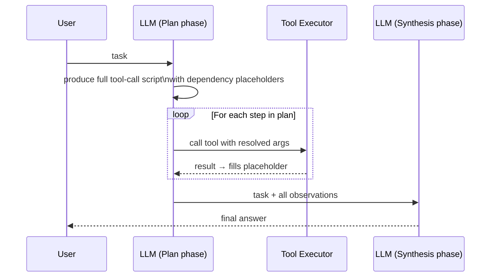

```
# Pseudocode
plan = llm.plan(task)           # one LLM call: full script of steps + placeholders
results = {}
for step in plan.steps:
    args = resolve_placeholders(step.args, results)
    results[step.id] = execute_tool(step.tool, args)
answer = llm.synthesize(task, results)  # one LLM call: final answer from all evidence
```

**Key Concepts:**
- Plan-then-execute vs interleaved ReAct (observe after every step)
- Dependency placeholder resolution between steps
- When to use: ordered dependencies, audit trail requirements, policy gates before mutations
- When NOT to use: tasks where mid-flight observations should change the plan
- Strands custom orchestrator hook: override `_run_loop()` or use `before_tool_call` plugin

**Sources:**
- [AWS ML Blog — custom orchestration](https://aws.amazon.com/blogs/machine-learning/customize-agent-workflows-with-advanced-orchestration-techniques-using-strands-agents/) ✓
- [samples/02-samples/15-custom-orchestration-airline-assistant](https://github.com/strands-agents/samples/blob/main/02-samples/15-custom-orchestration-airline-assistant/src/reWoo-reAct_singleTurn.ipynb) ✓

---

### Level 42: Custom Orchestration — Reflexion
**Goal:** Override the loop with self-critique cycles that iterate until an objective quality threshold is met

**Depends on:** L41 (custom orchestration — know how to override the loop)
**Unlocks:** Principled quality gates for any level's output

**What makes this different from L11:**
L11 = one critique pass in a prompt chain. Reflexion = structured loop with objective stopping criteria, score tracking, and retry budget. The agent can fail gracefully when budget is exhausted.

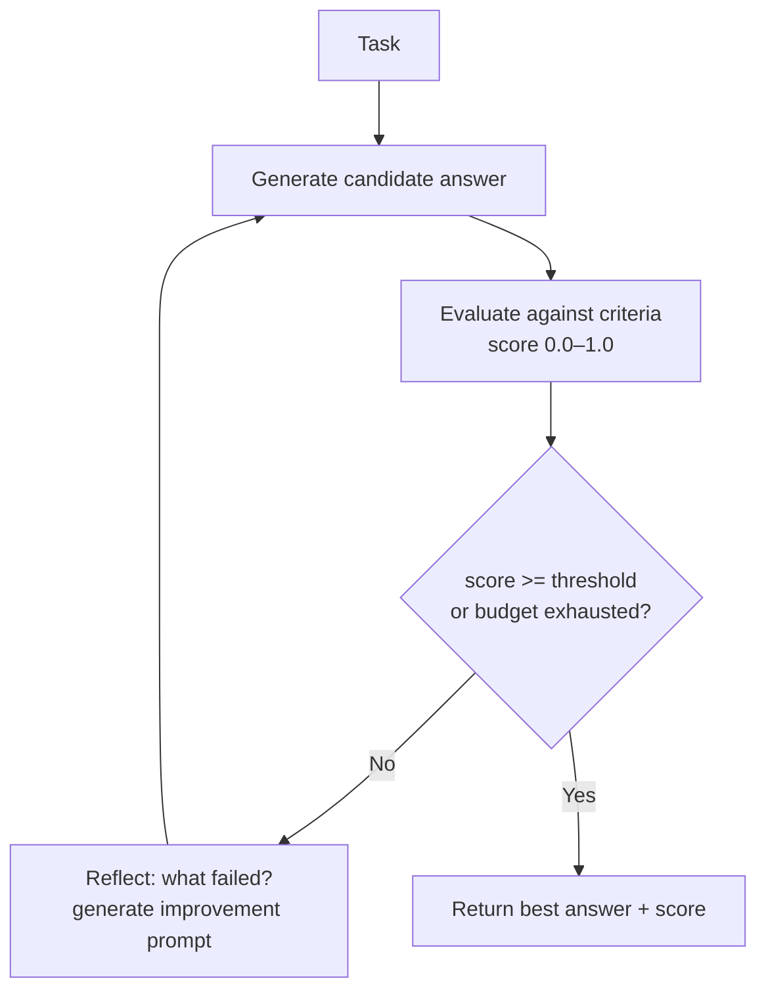

```
# Pseudocode
budget = max_iterations (e.g. 3)
best = None
for attempt in range(budget):
    candidate = agent.generate(task + reflection_context)
    score = evaluator.score(candidate, criteria)
    best = candidate if score > best.score else best
    if score >= threshold: break
    reflection_context = critic.reflect(candidate, score, criteria)
return best
```

**Key Concepts:**
- Objective stopping criteria (score threshold, not just "LLM says it's done")
- Retry budget prevents infinite loops
- Reflection context accumulates across attempts — each try improves on previous failure
- Cost/latency tradeoff: deliberation depth vs response time
- vs ReWOO: ReWOO = no mid-flight adaptation; Reflexion = iterative adaptation

**Sources:**
- [AWS ML Blog — custom orchestration](https://aws.amazon.com/blogs/machine-learning/customize-agent-workflows-with-advanced-orchestration-techniques-using-strands-agents/) ✓

---

### Level 43: Agent SOPs — Natural Language Workflow Specs
**Goal:** Define reusable, portable agent workflows in markdown using RFC 2119 constraints; share across agents and IDEs

**Depends on:** L22 (Safety — SOPs are a production reliability tool), L9 (MCP — SOPs ship via MCP Server)
**Unlocks:** Structured approach to the "prompt engineering is high-maintenance" problem

**What it solves:**
Model-driven reasoning is unpredictable at production scale. Agent SOPs use `MUST` / `SHOULD` / `MAY` to constrain agent behaviour without rewriting code. Decoupled from any specific agent — the same SOP runs in Kiro, Claude Code, or Cursor.

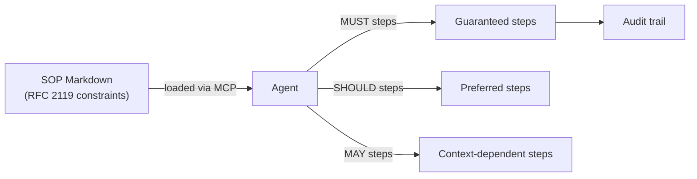

```
# Pseudocode — SOP structure
sop:
  name: "Deploy Web App"
  parameters:
    - name: framework
      constraint: MUST be one of [react, vue, nextjs]
  steps:
    - id: 1
      action: generate CDK infrastructure
      constraint: MUST complete before any deployment step
    - id: 2
      action: run security checks
      constraint: SHOULD run; MAY skip if --fast flag set
    - id: 3
      action: create CI/CD pipeline
      constraint: MAY create if user requests
```

**Key Concepts:**
- RFC 2119 semantics: MUST = non-negotiable, SHOULD = strong preference, MAY = optional
- SOPs are portable: same file works in any MCP-compatible IDE
- Parameterised inputs allow reuse across contexts
- vs Skills plugin (L30): Skills = inject instructions at runtime; SOPs = constrain the entire task workflow
- vs Agent Steering (L29): Steering = dynamic guardrails per tool call; SOPs = static workflow contract

**Sources:**
- [Introducing Strands Agent SOPs](https://aws.amazon.com/blogs/opensource/introducing-strands-agent-sops-natural-language-workflows-for-ai-agents/) ✓
- [strands-agents/agent-sop](https://github.com/strands-agents/agent-sop) ✓
- [AWS MCP Server — Deployment SOPs](https://docs.aws.amazon.com/aws-mcp/latest/userguide/agent-sops.html) ✓

---

### Level 44: AG-UI — Agent-to-Frontend Protocol
**Goal:** Connect a Strands agent to a live frontend using the AG-UI event protocol; stream agent state to a React UI without custom WebSockets

**Depends on:** L32 (A2A — understand agent protocols; AG-UI is the UI complement)
**Unlocks:** Production-quality agent UIs without bespoke state-sync infrastructure

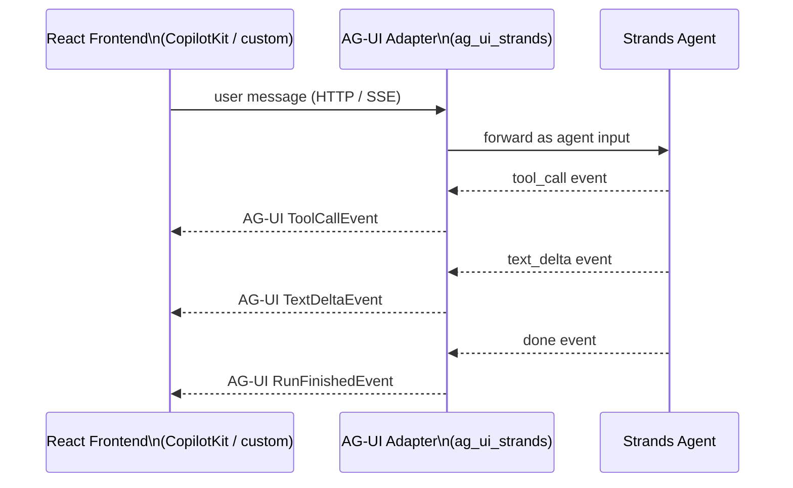

```
# Pseudocode
adapter = AGUIStrandsAdapter(agent)  # wraps Strands agent in AG-UI event emitter
server = AGUIServer(adapter, port=8000)

# Frontend consumes standard AG-UI SSE stream:
# EventSource("/agent") → receives RunStarted, TextDelta, ToolCall, RunFinished events
# Same frontend works with any AG-UI-compatible backend (swap Strands for LangGraph etc.)
```

**Key Concepts:**
- AG-UI = open event standard (like A2A but agent→UI instead of agent→agent)
- Events: `RunStarted`, `TextDelta`, `ToolCallStart`, `ToolCallEnd`, `RunFinished`, `StateSnapshot`
- `ag_ui_strands` is the official Strands adapter (in `ag-ui-protocol/ag-ui` repo)
- Replaces: custom WebSocket handlers, manual SSE wiring, polling loops
- Stack: Strands agent → AG-UI adapter → SSE → React + CopilotKit (or any AG-UI consumer)

**Sources:**
- [AG-UI Protocol docs](https://docs.ag-ui.com/) ✓
- [AWS Strands + AG-UI — CopilotKit blog](https://www.copilotkit.ai/blog/aws-strands-agents-now-compatible-with-ag-ui) ✓
- [ag-ui-protocol/ag-ui](https://github.com/ag-ui-protocol/ag-ui) — includes `integrations/aws-strands/` ✓

---

### Level 45: Agentic RAG with Amazon S3 Vectors
**Goal:** Build a multimodal retrieval-augmented agent using S3 Vectors — AWS's native billion-scale vector store — replacing the local ChromaDB from L13

**Depends on:** L13 (RAG — understand retrieval fundamentals before scaling them)
**Unlocks:** Production RAG without self-managed vector infrastructure

**Why this supersedes L13:**

| Dimension | L13 (ChromaDB) | L45 (S3 Vectors) |
|-----------|---------------|-----------------|
| Scale | Single-machine | Billion vectors, managed |
| Modalities | Text only | Text + images + video |
| Infra | Local process | AWS-managed, no ops |
| Cross-session memory | Explicit persistence | Native, durable |
| Cost model | Free (local) | Pay-per-query |

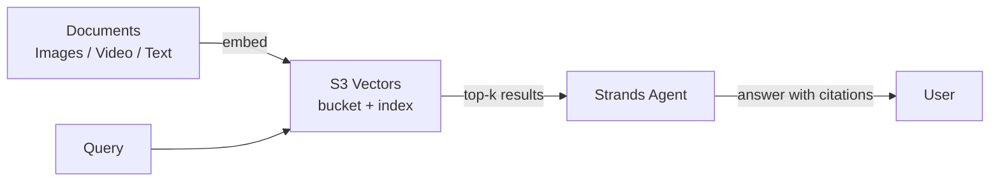

```
# Pseudocode
# Ingest
s3v = S3VectorsClient(bucket="my-vectors")
for doc in corpus:
    embedding = embed_model.encode(doc.content)  # text or multimodal
    s3v.put_vectors(key=doc.id, vector=embedding, metadata=doc.metadata)

# Query
agent_tool:
    def retrieve(query: str) -> list[str]:
        q_vec = embed_model.encode(query)
        results = s3v.query_vectors(vector=q_vec, top_k=5)
        return [r.metadata["text"] for r in results]
```

**Key Concepts:**
- S3 Vectors: native AWS vector store (no separate DB), announced re:Invent 2025
- Multimodal embeddings: same index holds text chunks, image embeddings, video keyframes
- Agentic RAG pattern: agent decides *when* and *what* to retrieve (vs naive always-retrieve)
- Cross-session memory: vectors persist across agent restarts automatically

**Sources:**
- [Build multi-modal agents with Strands + S3 Vectors — DEV.to](https://dev.to/aws/dev-track-spotlight-build-multi-modal-ai-agents-with-strands-agents-and-amazon-s3-vectors-dev332-4jp5) ✓
- [strands-agents/samples: 05-agentic-rag](https://github.com/strands-agents/samples) ✓

---

### Level 46: Hybrid LLM/Deterministic Systems — 4 Iterations
**Goal:** Four angles on the same problem — how do you reliably embed LLM judgment into deterministic production code without sacrificing correctness, security, or auditability?

**Depends on:** L31 (Workflow DAG), L8 (Graph routing), L6 (Agents-as-Tools), L40 (thread safety)
**Unlocks:** L47 (Human-in-the-Loop), L49 (Evals Harness)

**Research basis:** ThoughtWorks Radar — LLM Guardrails (Languages & Frameworks, Vol.31, Oct 2024, Trial); Structured Output from LLMs (Techniques, Vol.33, Nov 2025, Trial — moved from Assess)

**Files (4 iterations):**

| Iter | File | Pattern |
|------|------|---------|
| L46a | `hybrid_dag_graph.py` | `@tool` as layer boundary — LLM routes, Workflow executes |
| L46b | `hybrid_llm_in_deterministic.py` | Typed output + confidence gate + minimize LLM surface |
| L46c | `hybrid_plan_execute.py` | Constrained op vocabulary — LLM configures, code executes |
| L46d | `hybrid_trust_boundaries.py` | Input guardrails + LLM-invisible signals + fitness functions |

```mermaid
flowchart TD
    subgraph "L46a: Routing direction"
        R[Router LLM] -->|@tool boundary| W1[Workflow DAG]
        R --> W2[Workflow DAG]
    end
    subgraph "L46b: Embedding direction"
        CODE[Deterministic code] -->|judgment slot| LLM1[classify/quality LLM]
        LLM1 -->|typed dataclass| CODE
    end
    subgraph "L46c: Planning direction"
        LLM2[LLM generates plan] -->|constrained vocab| EXEC[Deterministic executor]
    end
    subgraph "L46d: Trust boundary"
        RAW[Raw input] -->|guardrail| Z1[Zone 1 only → LLM]
        Z1 -->|hard gates + fitness fns| FINAL[Final decision]
    end
```

```
# L46a: @tool as layer boundary
@tool
def run_ingest_pipeline(source: str) -> str:
    """Docstring is all LLM sees. DAG steps are invisible."""
    return _run_workflow(ingest_tasks, new_uuid())

# L46b: LLM as typed function with confidence gate
clf = classify_document(text)     # → Classification(category, confidence, reason)
if clf.confidence < 0.60: return flagged(clf.category)
qa = assess_quality(text)         # → QualityAssessment(score, recommendation)
route(qa.recommendation)

# L46c: Constrained op vocabulary
plan = llm(f"Return ops from: {OP_REGISTRY.keys()}")
ops = parse_and_repair(plan)      # fuzzy match, enum fix, drop unknowns
validate(ops)                      # reject empty / excess / missing
for op in ops: records = execute_op(op, records)

# L46d: Trust zones
request = sanitize_zone1(raw)     # strip 8 injection patterns + PII
llm_view = filter_zone2(request)  # remove fraud_flag, compliance_hold, frozen
rec = llm(risk_prompt + llm_view)
final = apply_hard_gates(rec, request)
final = apply_fitness(final, pipeline_state)
log(delta(rec, final))            # monitor override rate
```

**Key Concepts:**
- `@tool` is an architectural boundary, not just a capability hook (L46a)
- Treat LLM calls like external API calls: retry + typed output + fallback (L46b)
- Constrained op vocabulary : LLM code gen :: parameterized SQL : string concat (L46c)
- LLM-invisible signals (structural filter) > "please ignore X in prompt" (L46d)
- Fitness functions catch system-level invariants no per-call check can see (L46d)
- Decision delta log: override rate is the primary health metric for hybrid systems (L46d)

**Sources:**
- [Understanding Multi-Agent Patterns — DEV.to](https://dev.to/aws-builders/understanding-multi-agent-patterns-in-strands-agent-graph-swarm-and-workflow-4nb8) ✓
- [ThoughtWorks Radar: LLM Guardrails](https://www.thoughtworks.com/radar/languages-and-frameworks/llm-guardrails) ✓ — Trial, Languages & Frameworks, Vol.31 (Oct 2024); external validation for L46d input guardrails pattern
- [ThoughtWorks Radar: Structured Output from LLMs](https://www.thoughtworks.com/radar/techniques/structured-output-from-llms) ✓ — Trial (moved from Assess), Techniques, Vol.33 (Nov 2025); external validation for L46b typed output contract

---

### Level 47: Human-in-the-Loop — Checkpoints and Handoffs
**Goal:** Use Strands' built-in `handoff_to_user` tool for synchronous human checkpoints and terminal handoffs; understand the autonomy spectrum and when each mode applies

**Depends on:** L23 (Error Recovery — graceful failure), L22 (Safety — know what needs human oversight)
**Unlocks:** Production pattern for high-stakes agent actions with documented Strands SDK support

**Strands built-in: `handoff_to_user` from `strands_tools`**

The SDK ships with a `handoff_to_user` tool. Two modes (from source):

| Parameter | Behaviour | When to use |
|-----------|-----------|-------------|
| `breakout_of_loop=False` | Pauses agent, waits for user input, returns response to agent, continues | Mid-workflow approval: "Type 'confirm' to proceed" |
| `breakout_of_loop=True` | Sets `stop_event_loop=True`, terminates agent gracefully | Final handoff: "Task complete. Please review results." |

```mermaid
sequenceDiagram
    participant Agent as Strands Agent
    participant Tool as handoff_to_user
    participant Human as Human

    Note over Agent,Human: Mode 1: Synchronous checkpoint
    Agent->>Tool: handoff_to_user(message, breakout_of_loop=False)
    Tool->>Human: display message + prompt
    Human->>Tool: typed response
    Tool->>Agent: return user response
    Agent->>Agent: continue with response

    Note over Agent,Human: Mode 2: Terminal handoff
    Agent->>Tool: handoff_to_user(message, breakout_of_loop=True)
    Tool->>Human: display message
    Tool->>Agent: set stop_event_loop=True
    Note over Agent: execution terminates gracefully
```

```
# From strands_tools/handoff_to_user.py — the actual built-in tool
from strands import Agent
from strands_tools import handoff_to_user

agent = Agent(tools=[handoff_to_user])

# Mode 1: checkpoint — agent pauses, waits, continues
# agent calls: handoff_to_user(message="...", breakout_of_loop=False)
# → user types response → agent receives it → continues

# Mode 2: terminal — agent hands off and stops
# agent calls: handoff_to_user(message="...", breakout_of_loop=True)
# → stop_event_loop=True → graceful termination
```

**Autonomy spectrum** (Deloitte, 2026): "humans in the loop, on the loop, and out of the loop—will emerge based on task complexity, business domain, workflow design, and outcome criticality."

| Mode | Strands support | Description |
|------|----------------|-------------|
| Human-in-the-loop | `breakout_of_loop=False` | Agent pauses at checkpoint, waits for human input |
| Human-out-of-the-loop | `breakout_of_loop=True` | Agent completes task, hands off result to human |
| Human-on-the-loop | Not built-in | Async review queue (requires external infrastructure: SQS, DynamoDB) |

**Confidence-based routing** (Orkes pattern): Route to human review when agent confidence is below threshold. In Strands, the agent itself decides whether to call `handoff_to_user` based on its own assessment — the LLM calls the tool when it encounters a decision it cannot make with sufficient confidence.

**Anthropic design principle** (from "Building Effective Agents"): "Agents can then pause for human feedback at checkpoints or when encountering blockers." Also: "it's also common to include stopping conditions (such as a maximum number of iterations) to maintain control."

**Key Concepts:**
- `handoff_to_user` is a built-in strands_tools tool — not something to build from scratch
- Two modes: synchronous checkpoint (`breakout_of_loop=False`) vs terminal handoff (`breakout_of_loop=True`)
- True "on-the-loop" (agent continues while human reviews asynchronously) is not built into Strands — requires external queue infrastructure
- The LLM decides when to call `handoff_to_user` based on its assessment of uncertainty or risk
- vs Steering (L29): Steering = automated policy evaluation before tool calls; HITL = explicit human judgment requested by the agent
- Anthropic: human oversight is a design feature, not a binary choice — "agents are built to accept human input at multiple touchpoints while maintaining operational independence between interventions"

**Sources:**
- `strands_tools/handoff_to_user.py` ✓ — built-in Strands tool; two modes (`breakout_of_loop`); synchronous checkpoint and terminal handoff
- [Anthropic: Building Effective Agents](https://www.anthropic.com/research/building-effective-agents) ✓ — "pause for human feedback at checkpoints or when encountering blockers"; stopping conditions for agent control
- [Orkes: Human-in-the-Loop in Agentic Workflows](https://orkes.io/blog/human-in-the-loop/) ✓ — definition: "strategically inserting a person into an automated workflow at the moments that matter most"; confidence-based routing pattern
- [Deloitte: AI Agent Orchestration 2026](https://www.deloitte.com/us/en/insights/industry/technology/technology-media-and-telecom-predictions/2026/ai-agent-orchestration.html) ✓ — autonomy spectrum: "humans in the loop, on the loop, and out of the loop"
- [LangGraph interrupt docs](https://docs.langchain.com/oss/python/langgraph/interrupts) — reference implementation of async `interrupt()` pattern (LangGraph-specific, not Strands)

---

### Level 48: Durable Execution — Long-Running Agents That Survive Crashes
**Goal:** Understand the two primary platform approaches to durable execution for long-running agents (Temporal and AWS Step Functions), how they differ from Strands' native session persistence, and when each is the right choice

**Depends on:** L5 (Sessions — understand what Strands session managers do and don't persist), L23 (Error Recovery — understand failure modes)
**Unlocks:** Long-running multi-day agent workflows; production reliability for agentic pipelines

**The architecture selection question** (StackAI, p.6): *"Will the task finish in one sitting, or does it need to run for minutes or hours with checkpoints?"* — one of five questions for choosing the right workflow architecture. StackAI (p.15): "Runtimes and orchestration layers are maturing too. **Checkpointing**, tracing, and policy enforcement are becoming standard building blocks. The direction is to make agents behave more like dependable software, even as the model does more of the reasoning."

**What Strands SessionManager does (and doesn't do):** Strands' `SessionManager` persists conversation history and agent state across process restarts — `FileSessionManager` for local dev, `S3SessionManager` for production. This is *conversation-level* persistence. Step-level execution checkpointing (resume at step 27 of 30 tool calls after a crash) is not a built-in Strands feature.

**Approach 1 — Temporal: Durable Execution as platform**

From the Temporal blog: *"We call this Durable Execution."* If the application crashes, it picks up where it left off when restarted. Key mapping to AI agents:

| AI Agent concept | Temporal primitive | What you get |
|---|---|---|
| LLM call / tool invocation | Activity | Automatic retry on failure, rate limiting handled |
| Agent orchestration loop | Workflow | State in workflow variables, event-sourced |
| Checkpointing | Event History | Implicit — no code needed |
| Memory | Workflow variables | Durable by design |
| Human-in-the-loop | Signals & Updates | First-class primitive |

*"Checkpointing keeps the application from having to start from the beginning and rerun previous steps in the workflow... As the developer, you are not responsible for implementing any part of this protocol."*

**Approach 2 — AWS Step Functions Standard Workflows**

AWS-native alternative (from the docs):
- Duration: up to **1 year**
- Execution semantics: **exactly-once** (a state never runs more than once unless `Retry` is specified)
- State internally persists between every state transition
- Automatically handles idempotency for duplicate execution names
- Suited for non-idempotent actions (payments, cluster creation, approvals)
- Express Workflows (at-least-once, 5-minute max) require idempotent steps

```mermaid
stateDiagram-v2
    [*] --> Running
    Running --> EventRecorded: Activity/Step completes
    EventRecorded --> Running: next step dispatched
    Running --> Crashed: process failure / timeout
    Crashed --> Running: restart replays Event History to last recorded point
    Running --> Completed: all steps done
    Completed --> [*]
```

```
[*] --> Running
Running --> EventRecorded: Activity/Step completes
EventRecorded --> Running: next step dispatched
Running --> Crashed: process failure / timeout
Crashed --> Running: restart replays to last Event
Running --> Completed: all steps done
Completed --> [*]
```

```
# Temporal model — pseudocode (from Temporal blog)
# LLM calls are Activities: automatic retry + event-sourced state
workflow research_agent(task):
    results = {}
    for step in plan:
        result = Activity(llm_call(step))   # retried on failure automatically
        results[step.id] = result           # state in workflow vars (durable)
        # Event History updated after each Activity
        # crash here → replay Event History on restart → resume from here
    return synthesize(results)

# Step Functions model — pseudocode
state_machine (Standard Workflow):
    steps: [extract, validate, draft, submit]   # each is a State
    execution_semantics: exactly-once            # non-idempotent actions safe
    max_duration: 1 year
    state_persists: between every transition     # built-in durability
```

**Key Concepts:**
- Strands `SessionManager` = conversation/state persistence (not step-level execution checkpointing)
- Temporal = wrap LLM calls as Activities, orchestration as Workflow; crash recovery via event replay; zero checkpoint code
- Step Functions Standard Workflows = AWS-native exactly-once execution, state persists between transitions, 1-year duration
- Idempotency: Standard Workflows handle automatically; Express Workflows require idempotent steps because at-least-once
- Architecture decision: "will the task run for minutes or hours with checkpoints?" — determines whether session persistence (Strands) is sufficient or a durable execution platform (Temporal / Step Functions) is needed

**Sources:**
- [Temporal: Durable Execution meets AI](https://temporal.io/blog/durable-execution-meets-ai-why-temporal-is-the-perfect-foundation-for-ai) ✓ — Activities for LLM calls; Workflows for orchestration; crash recovery via event sourcing; HITL via Signals; "you never have to think about checkpoints"
- [AWS Step Functions: Standard vs Express Workflows](https://docs.aws.amazon.com/step-functions/latest/dg/concepts-standard-vs-express.html) ✓ — exactly-once semantics; state persists between transitions; 1-year duration; idempotency handling documented explicitly
- [StackAI: The 2026 Guide to Agentic Workflow Architectures](https://www.stackai.com/blog/the-2026-guide-to-agentic-workflow-architectures) ✓ — "checkpointing...becoming standard building blocks" (p.15); architecture selection question "will the task run for minutes or hours with checkpoints?" (p.6)
- Strands `SessionManager` source ✓ — `FileSessionManager` (local), `S3SessionManager` (production); conversation/state persistence; concurrency limitation on `FileSessionManager`

---

### Level 49: Evals Harness — Automated Testing for LLM Judgment Layers
**Goal:** Build an automated test harness that detects regression in the LLM judgment layer — so a model update, prompt change, or config drift doesn't silently degrade production behaviour

**Depends on:** L46 (Hybrid patterns — you need a judgment layer before you can test it), L35 (Evals SDK — Strands-specific evals)
**Unlocks:** Confident iteration on any level; production deployment gates

**The gap L35 doesn't fill:**
L35 (Strands Evals SDK) tests agent output quality. L49 tests the *boundary contracts* in a hybrid system: does the LLM still return parseable JSON? Does confidence calibration hold? Does the override rate drift? Does plan repair still cover the LLM's output distribution?

**Fowler on automated testing for LLM applications** (engineering-practices-llm.html):
*"You should decouple inference and testing, so that you can run inference, which is time-consuming even when done via LLM services, once and run multiple property-based tests on the results."* — Run inference once per test case, cache output, apply all test types to the cached result. Every additional test type costs zero additional LLM calls.

*"Every code change can be tested within a few minutes and any regressions caught right away"* — the goal is test execution fast enough to run on every change, which requires the inference-testing decoupling above.

*"Aided by our automated tests, refactoring our prompts was a safe and efficient process"* — tests gates prompt changes the same way tests gate code changes: red-green-refactor cycles.

**Applying L46 boundary contracts as test targets** (design pattern, derived from L46):
The four LLM/deterministic boundaries from L46 each produce a measurable contract. Thresholds below are design choices — set them from your own baseline, not from external sources:

```mermaid
flowchart TD
    Change[Model / prompt / config change] --> Harness[Evals Harness]
    Harness --> J1[JSON parse rate\nL46b boundary contract]
    Harness --> J2[Confidence calibration\nL46b confidence gate]
    Harness --> J3[Override rate delta\nL46d hard gates]
    Harness --> J4[Plan repair rate\nL46c constrained vocab]
    J1 --> Gate{All gates pass?}
    J2 --> Gate
    J3 --> Gate
    J4 --> Gate
    Gate -->|Yes| Deploy[Deploy]
    Gate -->|No| Block[Block + alert]
```

```
[Model/prompt/config change]
          |
          v
   [Evals Harness]
    /    |    |    \
   v     v    v     v
[parse][cal][ovr][repair]
   \     |    |    /
    \    v    v   /
     --> [Gate] -->
          |      \
         [Yes]  [No]
          |       |
       [Deploy] [Block]
```

```
# Pseudocode — inference-testing decoupling (from Fowler)
# Run inference once; apply all test types to cached outputs

# Step 1: run inference once per test case
cached = {case.id: classify_document(case.text) for case in test_corpus}

# Step 2: apply multiple property-based tests to cached outputs (zero extra LLM calls)
parse_rate = count(r for r in cached.values() if r.category != "unknown") / len(cached)
# assert parse_rate >= YOUR_BASELINE_THRESHOLD

confidence_calibration = compute_ece(cached)
# assert confidence_calibration < YOUR_BASELINE_THRESHOLD

override_delta = current_override_rate(cached) - load_baseline_override_rate()
# assert abs(override_delta) < YOUR_BASELINE_THRESHOLD

repair_rate = count(p for p in generate_plans(test_requests) if p.was_repaired) / len(test_requests)
# assert repair_rate < YOUR_BASELINE_THRESHOLD
```

**On using LLMs as judges in your harness** (ThoughtWorks Vol.33): LLM as a Judge moved from Trial to Assess. "Evaluations are prone to position bias, verbosity bias and low robustness." More serious: scaling contamination — "self-enhancement bias" (a model family favours its own outputs) and "preference leakage" (blurring training and testing). Prefer objective, structural metrics (parse rate, override delta, repair rate) in automated harnesses. Reserve LLM-as-judge for qualitative checks with human verification.

**Structured output as a testable data contract** (ThoughtWorks Vol.33, Trial): *"transforming the LLM's typically unpredictable text into a machine-readable, deterministic data contract."* Structured output from L46 is what makes parse rate a testable metric — without it, there is no boundary contract to assert against.

**Key Concepts:**
- Decouple inference from testing: run LLM once, apply all test types to cached result (Fowler)
- Test *boundary contracts* derived from L46, not just output helpfulness (vs L35)
- Baseline capture: run harness on known-good state → store as `baseline_v{N}.json`; regression = metric crossing threshold vs baseline
- Structured output (L46b/L46c) is what makes boundary contracts mechanically testable
- Avoid LLM-as-judge for primary regression gates: position bias + scaling contamination (ThoughtWorks)
- TDD applies to prompts: automated tests make prompt refactoring safe (Fowler)

**Sources:**
- [Martin Fowler: Engineering Practices for LLM Application Development](https://martinfowler.com/articles/engineering-practices-llm.html) ✓ — "decouple inference and testing"; "every code change can be tested within a few minutes"; TDD red-green-refactor for prompts; inference caching
- [ThoughtWorks Radar Vol.33: LLM as a Judge](https://www.thoughtworks.com/radar/techniques/llm-as-a-judge) ✓ — Assess tier (moved from Trial); position bias, verbosity bias, scaling contamination, self-enhancement bias, preference leakage
- [ThoughtWorks Radar Vol.33: Structured Output from LLMs](https://www.thoughtworks.com/radar/techniques/structured-output-from-llms) ✓ — Trial tier; "deterministic data contract"; constraint tools (Outlines, Instructor)

---

### Level 50: Toxic Flow Analysis — Unsafe Data Paths in Agentic Systems
**Goal:** Apply toxic flow analysis to detect unsafe data paths in multi-agent architectures where the "lethal trifecta" is present — private data, untrusted content, and external communication all in scope

**Depends on:** L46d (Trust Boundaries — single-turn guardrails), L22 (Safety), L56 (Secure MCP — where the attack surface sits)
**Unlocks:** Architecture-level security analysis for multi-agent and MCP-connected systems

**What ThoughtWorks means by "toxic flow analysis"** (Vol.33, Assess, Nov 2025):

*"When agents communicate with one another — through tool invocation or API calls — they can quickly encounter what's become known as the lethal trifecta: access to private data, exposure to untrusted content and the ability to communicate externally. Agents with all three are highly vulnerable. Because LLMs tend to follow instructions in their input, content that includes a directive to exfiltrate data to an untrusted source can easily lead to data leaks. One emerging technique to mitigate this risk is toxic flow analysis, which examines the **flow graph of an agentic system** to identify potentially unsafe data paths for further investigation."*

This is **architecture-level analysis** of agent graphs — not session-level conversation monitoring. The question is: in the agent's tool-call graph, can untrusted content reach a code path that also has access to private data and an outbound channel?

**The lethal trifecta** (ThoughtWorks Vol.33; also Agentic AI Handbook):

```mermaid
flowchart TD
    PD[Private data\neg. customer records, secrets] --> Agent
    UC[Untrusted content\neg. web pages, user uploads, MCP responses] --> Agent
    Agent --> EXT[External channel\neg. outbound HTTP, email, storage write]
    style PD fill:#fee
    style UC fill:#fee
    style EXT fill:#fee
```

```
+------------------+   +--------------------+   +------------------+
| Private data     |   | Untrusted content  |   | External channel |
| (customer records|   | (web pages, user   |   | (outbound HTTP,  |
|  secrets, keys)  |   |  uploads, MCP resp)|   |  email, write)   |
+--------+---------+   +---------+----------+   +--------+---------+
         \                       |                       /
          \                      v                      /
           +---------------> [Agent] <----------------+
                               |
                    All three present = lethal trifecta
                    LLM follows instructions in untrusted content
                    → directive to exfiltrate private data via external channel
```

**Mitigation** (Agentic AI Handbook, nibzard.com): *"Production move: remove at least one circle — no external network egress, no direct access to secrets, strict input separation."*

**Flow graph analysis — what to check:**
Examine the agent's tool-call graph for paths where all three trifecta elements intersect:
- Which tools read from untrusted sources? (web fetch, file read, MCP tool results)
- Which tools have access to private data? (database reads, secret retrieval, session context)
- Which tools write externally? (HTTP POST, email send, storage write, MCP tool calls)
- Does any reachable path connect all three? That path is a toxic flow.

```
# Pseudocode — flow graph audit for lethal trifecta

# Build tool-call graph from agent definition
graph = build_tool_graph(agent.tools)

# Classify each tool node
untrusted_sources = [t for t in graph.nodes if reads_external_input(t)]
private_data_nodes = [t for t in graph.nodes if accesses_private_data(t)]
exfil_channels    = [t for t in graph.nodes if writes_externally(t)]

# Find paths that traverse all three categories
toxic_paths = []
for src in untrusted_sources:
    for priv in private_data_nodes:
        for dst in exfil_channels:
            if graph.has_path(src, priv) and graph.has_path(priv, dst):
                toxic_paths.append((src, priv, dst))

# Each toxic_path is a candidate for architectural remediation:
# - remove the exfil channel (most common fix)
# - isolate private data to a separate agent with no external tools
# - treat all MCP tool responses as untrusted (structural, not prompt-based)
```

**Note:** ThoughtWorks describes this as "still in its early stages" and "one of several promising approaches." There are no established tools or standard implementations as of Vol.33 (Nov 2025).

**Key Concepts:**
- Toxic flow analysis = flow graph inspection, not session-level conversation monitoring
- The "lethal trifecta": private data + untrusted content + external channel, all reachable by the same agent
- LLMs follow instructions: untrusted content can contain directives to exfiltrate private data via external channel
- Mitigation: remove at least one element of the trifecta architecturally — structural, not prompt-based
- Connection to L56: MCP tool responses are untrusted content by definition; MCP-connected agents face the trifecta
- Connection to L46d: L46d strips injection patterns from a single request; L50 analyses whether the agent *architecture* allows the data path to exist at all — a different layer

**Sources:**
- [ThoughtWorks Radar Vol.33: Toxic Flow Analysis](https://www.thoughtworks.com/radar/techniques/toxic-flow-analysis) ✓ — Assess tier; "lethal trifecta"; flow graph analysis; "still in its early stages"; MCP and agentic attack vectors
- [Agentic AI Handbook (nibzard.com)](https://www.nibzard.com/agentic-handbook) ✓ — lethal trifecta defined; mitigation: "remove at least one circle — no external network egress, no direct access to secrets, strict input separation"

---

---

### Level 51: Evals as Engineering Discipline — Fowler Eval Methodology
**Goal:** Apply three named test types to LLM systems and decouple inference from testing so model/prompt changes can be evaluated without proportional API cost

**Depends on:** L35 (Strands Evals SDK — understand the Strands-specific tooling first), L49 (Evals Harness — boundary contract testing)
**Unlocks:** L54 (Prompt refactoring — Fowler explicitly ties the two together)

**How this differs from L35 and L49:**
L35 = how to run evals using the Strands SDK. L49 = testing hybrid system boundary contracts (parse rate, override rate). L51 = the *methodology*: what test types to apply to probabilistic systems, and how to run many tests without paying for repeated LLM inference.

**Research basis:** Martin Fowler, ["Engineering Practices for LLM Application Development"](https://martinfowler.com/articles/engineering-practices-llm.html) (martinfowler.com). Martin Fowler, ["Patterns for Building LLM-based Systems & Products"](https://martinfowler.com/articles/gen-ai-patterns/) (martinfowler.com). ThoughtWorks Technology Radar Vol.33 (2026): LLM as a Judge.

**Three test types named in the source:**

| Type | Fowler's description |
|------|---------------------|
| Example-based | Structured JSON output; open-closed principle for scaling by adding test data |
| Auto-evaluator | "using an LLM to test an LLM, and also a type of property-based test" — checks properties/characteristics, not specific output |
| Adversarial | "identified as many failure modes as possible"; OWASP Top 10 for LLM Applications; comprehensive Threat Modelling |

*Note: Fowler describes auto-evaluator as "a type of property-based test" — they are not separate categories in the source.*

**Inference-testing decoupling** (directly quoted from source): "decouple inference and testing, so that you can run inference...once and run multiple property-based tests"

```mermaid
flowchart TD
    Suite[Eval Suite] --> EB[Example-Based\ngolden set: input→expected]
    Suite --> AE[Auto-Evaluator\na type of property-based test\nLLM-as-judge]
    Suite --> ADV[Adversarial\nfailure mode inputs\nOWASP Top 10]

    EB --> Cache[Inference Cache\nrun LLM once, test N times]
    AE --> Cache
    ADV --> Cache

    Cache --> Report[Eval Report\npass/fail + score distribution]
```

```
# Inference-testing decoupling (Fowler)
outputs = {}
for input in test_corpus:
    outputs[input.id] = llm(input.text)   # ONE LLM call per test case

# Apply all test types to cached outputs — no additional LLM inference calls
example_results = [check_structured_output(o, e.expected) for o, e in zip(outputs, examples)]
auto_results    = [auto_eval_llm(o) for o in outputs.values()]   # LLM-as-judge
adv_results     = [check_adversarial(o, attack) for o, attack in adversarial_pairs]
```

**Prompt refactoring** (Fowler, same article): "Periodic refactoring...is equally crucial when developing LLM applications." "aided by our automated tests, refactoring our prompts was a safe and efficient process." "red-green-refactor cycles." The eval suite enables safe prompt changes — the two practices are explicitly coupled in the source.

**LLM-as-Judge caveats** (ThoughtWorks Vol.33, moved from Trial to Assess): "often fails as a reliable proxy for human judgment" — susceptibility to position bias, verbosity bias, and scaling contamination where "a model family favors its own outputs." ThoughtWorks recommends "LLMs as a jury (employing multiple models for consensus)" but notes this increases costs and complexity. Verdict: "Treat this technique with caution — ensuring human verification, transparency and ethical oversight."

**Key Concepts:**
- Three test types, not four: Fowler describes auto-evaluator as "a type of property-based test" — they are not separate categories
- Inference-testing decoupling: run LLM once per test case, apply all test types to cached output
- "testing may convincingly demonstrate the presence of bugs, but can never demonstrate their absence" (Dijkstra, cited by Fowler in engineering-practices-llm.html)
- Prompt refactoring is paired with eval coverage — automated tests make refactoring safe and efficient
- LLM-as-judge is useful but unreliable as sole evaluator; combine with human eval per Fowler gen-ai-patterns

**Sources:**
- [Martin Fowler: Engineering Practices for LLM Application Development](https://martinfowler.com/articles/engineering-practices-llm.html) ✓ — three test types, inference-testing decoupling, prompt refactoring
- [Martin Fowler: Patterns for Building LLM-based Systems & Products](https://martinfowler.com/articles/gen-ai-patterns/) ✓ — Evals pattern: build pipeline integration, LLM-as-judge + human eval combination, production monitoring
- [ThoughtWorks Radar Vol.33: LLM as a Judge — Assess](https://www.thoughtworks.com/radar/techniques/llm-as-a-judge) ✓ — position bias, verbosity bias, scaling contamination ([arxiv:2502.01534](https://arxiv.org/abs/2502.01534), [arxiv:2404.18796](https://arxiv.org/abs/2404.18796))

---

### Level 52: Auto-Evaluator Reliability — Biases, Calibration, Jury
**Goal:** Empirically test the failure modes of LLM-as-judge (verbosity bias, self-preference bias, calibration against a quality spectrum) and show whether a jury of multiple judges reduces variance enough to be trusted in production

**Depends on:** L51 (Evals Methodology — auto-evaluator is the test type this level probes)
**Unlocks:** L54 (Prompt Refactoring — cannot trust the refactoring safety net until the judge itself is calibrated)

**Why this level exists:**
L51 proved the auto-evaluator detects *obvious* quality failures. ThoughtWorks Radar Vol.33 says to "treat this technique with caution" because of position bias, verbosity bias, and self-preference ("a model family favors its own outputs"). Fowler says "evaluate the Evaluator." L52 tests these claims empirically.

**Four hypotheses to prove:**

| Hypothesis | Test |
|-----------|------|
| Verbosity bias: longer responses score higher regardless of quality | Generate equal-accuracy summaries at 3 length tiers; measure score vs length |
| Self-preference bias: same-model judge inflates its own outputs | Compare haiku-judges-haiku vs gemini-judges-haiku scores on same outputs |
| Calibration: judge ranking matches a constructed quality ladder | Build 5-tier quality spectrum with known ranking; verify judge respects it |
| Jury reduces variance: N judges agree more than 1 judge alone | Run 3 judges, measure variance of individual scores vs consensus score |

**Key concepts:**
- ThoughtWorks (Vol.33): "a model family favors its own outputs — and preference leakage, blurring the boundary between training and testing"
- ThoughtWorks (Vol.33): "using LLMs as a jury (employing multiple models for consensus)"
- Fowler: "evaluate the Evaluator to check for false positives and false negatives"
- Evaluator calibration = does the judge's 4/5 reliably mean better than 3/5? Without calibration, scores are ordinal labels, not measurements

**Sources:**
- [ThoughtWorks Radar Vol.33: LLM as a Judge — Assess](https://www.thoughtworks.com/radar/techniques/llm-as-a-judge) ✓ — position bias, verbosity bias, self-preference, jury approach
- [Martin Fowler: Engineering Practices for LLM Application Development](https://martinfowler.com/articles/engineering-practices-llm.html) ✓ — "evaluate the Evaluator"
- [arxiv:2502.01534](https://arxiv.org/abs/2502.01534) — scaling contamination
- [arxiv:2404.18796](https://arxiv.org/abs/2404.18796) — LLMs as jury

---

### Level 53: Context Engineering
**Goal:** Systematically design the information provided to an LLM during inference — addressing three areas ThoughtWorks identifies as distinct from prompt engineering

**Depends on:** L15 (Context Management — understand the token budget), L30 (Skills Plugin — on-demand context loading is one application)
**Unlocks:** Higher output reliability from any downstream level without changing model or code

**How this differs from L15:**
L15 = managing the token budget (compression, summarization). L53 = deciding *what* information fills that budget, and how it is structured.

**Research basis:** ThoughtWorks Technology Radar Vol.33 (2026), Assess tier, published November 5, 2025. Definition: "Context engineering is the systematic design and optimization of the information provided to a large language model during inference to reliably produce the desired output." The entry distinguishes this from prompt engineering: it considers "the entire configuration of context: how relevant knowledge, instructions and prior context are organized and delivered."

**Three areas identified by ThoughtWorks:**

| Area | What it covers |
|------|---------------|
| Context Setup | Minimal system prompts, few-shot examples, token-efficient tools |
| Context Management for Long-Horizon Tasks | Summarization, structured note-taking, sub-agent architectures to handle finite context windows |
| Dynamic Information Retrieval | "Agents autonomously load external data only when immediately relevant" — just-in-time context retrieval |

```mermaid
flowchart TD
    CE[Context Engineering] --> CS[Context Setup\nminimal system prompts\nfew-shot examples\ntoken-efficient tools]
    CE --> CM[Context Management\nfor long-horizon tasks\nsummarization\nstructured note-taking\nsub-agent architectures]
    CE --> DR[Dynamic Information Retrieval\nagents load external data\nonly when immediately relevant]

    CS --> Window[Context Window]
    CM --> Window
    DR --> Window
    Window --> LLM[LLM → reliable output]
```

```
# Three areas from ThoughtWorks (pseudocode, not from source)

# Area 1: Context Setup
agent = Agent(
    system_prompt=minimal_system_prompt,   # minimal per ThoughtWorks
    tools=token_efficient_tools,            # token-efficient tool descriptions
    few_shot_examples=examples,
)

# Area 2: Context Management for Long-Horizon Tasks
# (connects to L15 compression + L30 skills plugin on-demand loading)
if context_too_long:
    context = summarize(older_turns) + structured_notes + recent_turns

# Area 3: Dynamic Information Retrieval
# (connects to L45 Agentic RAG — retrieve only when needed, not always)
if agent_needs_external_data:
    context += retrieve_just_in_time(query)
```

**Key Concepts:**
- ThoughtWorks definition distinguishes context engineering from prompt engineering by scope: prompt engineering addresses one component; context engineering addresses the full configuration
- Three areas per ThoughtWorks: setup, long-horizon management, dynamic retrieval
- Connects to L15 (compression = context management), L30 (skills = on-demand setup), L45 (agentic RAG = dynamic retrieval)
- ThoughtWorks verdict: Assess — evaluate for your situation; the practice is emerging and not yet standardised

**Sources:**
- [ThoughtWorks Radar Vol.33: Context Engineering — Assess](https://www.thoughtworks.com/radar/techniques/context-engineering) ✓ — definition, three areas, distinction from prompt engineering
- References cited in ThoughtWorks entry: Anthropic engineering documentation, LangChain blog on context engineering

---

### Level 54: Prompt Management — Prompt Refactoring
**Goal:** Apply refactoring discipline to prompts, using automated eval coverage as the safety net — the same way tests enable safe code refactoring

**Depends on:** L51 (Evals Methodology — automated tests are the precondition Fowler states explicitly)
**Unlocks:** Safe prompt iteration without manual regression testing

**Research basis:** Martin Fowler, ["Engineering Practices for LLM Application Development"](https://martinfowler.com/articles/engineering-practices-llm.html). Fowler's stated point: "aided by our automated tests, refactoring our prompts was a safe and efficient process." He applies the red-green-refactor cycle to prompts: write tests first, refactor against them, verify the tests still pass.

**What the source says:**

Fowler states: "LLM prompts can easily become messy over time, and often more rapidly so." "Periodic refactoring...is equally crucial when developing LLM applications." "Refactoring keeps our cognitive load at a manageable level." "aided by our automated tests, refactoring our prompts was a safe and efficient process." He notes: "different LLMs may require slightly varied prompt syntaxes" — meaning prompt changes aren't always transferable across models.

The coupling is explicit: the eval suite from L51 is what makes prompt refactoring safe. Without automated test coverage, prompt changes carry unquantified regression risk.

From Fowler's gen-ai-patterns: the Evals pattern includes "running regular evaluations on deployed production systems to detect performance decline" — this is the production monitoring complement to the development-time refactoring cycle.

```mermaid
flowchart TD
    Tests[Eval Test Suite\nfrom L51] --> Refactor[Prompt Refactoring\nred-green-refactor cycle]
    Refactor --> Verify[Run evals against\nrefactored prompt]
    Verify --> Pass{tests pass?}
    Pass -->|Yes| Deploy[Deploy refactored prompt]
    Pass -->|No| Fix[Fix regression\nrevert or iterate]
    Deploy --> Monitor[Production evals\ndetect performance decline]
```

```
# Pseudocode based on Fowler's red-green-refactor for prompts

# Precondition: eval suite exists (L51)
baseline_pass_rate = run_evals(current_prompt, test_corpus)

# Refactor the prompt (e.g. restructure sections, rename variables, clarify constraints)
refactored_prompt = refactor(current_prompt)

# Verify evals still pass — same cycle as code refactoring
new_pass_rate = run_evals(refactored_prompt, test_corpus)
assert new_pass_rate >= baseline_pass_rate, "Regression detected"

# Note (Fowler): different LLMs may require different prompt syntax —
# test against the target model, not a proxy
```

**Key Concepts:**
- Automated test coverage is the stated precondition for safe prompt refactoring (Fowler)
- Red-green-refactor applies to prompts: write tests → change prompt → verify tests pass
- "LLM prompts can easily become messy over time" — same entropy as code, requires same discipline
- Different LLMs may require different prompt syntax — Fowler explicitly warns about this
- Scope: Fowler describes the refactoring practice; a full prompt CI/CD pipeline (canary, rollback) is not described in the available source material

**Sources:**
- [Martin Fowler: Engineering Practices for LLM Application Development](https://martinfowler.com/articles/engineering-practices-llm.html) ✓ — prompt refactoring, red-green-refactor cycle, automated tests as safety net
- [Martin Fowler: Patterns for Building LLM-based Systems & Products](https://martinfowler.com/articles/gen-ai-patterns/) ✓ — Evals pattern: production monitoring for performance decline

---

### Level 55: Small Language Model Routing
**Goal:** Use SLMs (3.5B–10B parameters) as the default model for narrow, repetitive agentic tasks; escalate to frontier LLMs only for tasks requiring advanced reasoning

**Depends on:** L28 (SDK Advances — parallel tool dispatch), L46 (Hybrid LLM/Deterministic — routing is a hybrid pattern)
**Unlocks:** Cost-efficient production architecture where SLM is the default, frontier LLM is the exception

**Research basis:** ThoughtWorks Technology Radar Vol.33 (2026), **Assess** tier, published November 5, 2025. ThoughtWorks states SLMs have "fewer weights and less precision, usually between 3.5 billion and 10 billion parameters." They note: "recent research suggests that, in the right context, when set up correctly, SLMs can perform as well as or even outperform LLMs." They explicitly recommend: "consider SLMs as the default choice for agentic workflows." Qualifying condition: "narrow, repetitive tasks that don't require advanced reasoning."

**Models mentioned in ThoughtWorks entry:** Phi-3, SmolLM2, DeepSeek (distilled Qwen/Llama variants), Meta Llama 3.2 (1B and 3B), Microsoft Phi-4 (14B), Google PaliGemma 2 (3B/10B/28B vision-language), Gemini Nano.

```mermaid
flowchart TD
    Request[Incoming request] --> Assess{narrow and repetitive?\nno advanced reasoning needed?}
    Assess -->|Yes| SLM[SLM\n3.5B-10B params\nlower cost + latency]
    Assess -->|No| LLM[Frontier LLM\nadvanced reasoning\ncomplex multi-step]
    SLM --> Result[Result]
    LLM --> Result
```

```
# Pseudocode based on ThoughtWorks guidance

# ThoughtWorks: "consider SLMs as the default choice for agentic workflows"
# Qualifying condition: "narrow, repetitive tasks that don't require advanced reasoning"

# L40 connection: LlamaCppModel can run SLMs locally (3B-8B range)
slm_model  = get_model("phi-3")           # local via LlamaCppModel (L40)
llm_model  = get_model("claude-sonnet-4") # frontier for complex tasks

# The routing decision itself is a narrow, repetitive task
# — SLM as its own router is consistent with ThoughtWorks guidance
```

**Key Concepts:**
- ThoughtWorks ring is **Assess** (not Trial): evaluate for your situation; it's not yet in Trial
- Stated qualifying condition: "narrow, repetitive tasks that don't require advanced reasoning"
- ThoughtWorks recommendation: SLM as default, not exception
- Parameter range per ThoughtWorks: "usually between 3.5 billion and 10 billion parameters" (note: Phi-4 at 14B exceeds this range — ThoughtWorks lists it as an example regardless)
- Connection to L40: `LlamaCppModel` enables local SLM inference — SLMs at edge + frontier LLM in cloud is the L40 two-tier architecture

**Sources:**
- [ThoughtWorks Radar Vol.33: Small Language Models — Assess](https://www.thoughtworks.com/radar/techniques/small-language-models) ✓ — definition, parameter range, model examples, recommendation as default for agentic workflows
- [Strands llama.cpp provider docs](https://strandsagents.com/docs/user-guide/concepts/model-providers/llamacpp/) ✓ — local SLM inference via L40 pattern

---

### Level 56: Secure MCP Architecture
**Goal:** Architect a dedicated MCP server for agentic access instead of naively converting existing internal APIs — addressing the specific failure modes ThoughtWorks identifies

**Depends on:** L9 (MCP Integration — understand the protocol), L22 (Safety & Guardrails — understand the threat model)
**Unlocks:** Production-safe agentic integrations with external services

**Research basis:** ThoughtWorks Technology Radar Vol.33 (2026), **Hold** tier, published November 5, 2025. ThoughtWorks on the anti-pattern: "APIs are typically designed for human developers and often consist of granular, atomic actions that, when chained together by an AI, can lead to excessive token usage, context pollution, and poor agent performance." On security: "when APIs are naively exposed to agents via MCP, there's no reliable, deterministic way to prevent an autonomous AI agent from misusing such endpoints." Recommended approach: "architect a dedicated, secure MCP server specifically tailored for agentic workflows, built on top of your existing APIs." Related tool mentioned: FastAPI-MCP.

**The anti-pattern and its consequences (per ThoughtWorks):**

```mermaid
flowchart TD
    NaiveConvert[Naive API-to-MCP\nconvert all endpoints directly] --> T[Excessive token usage]
    NaiveConvert --> C[Context pollution]
    NaiveConvert --> P[Poor agent performance]
    NaiveConvert --> S[No deterministic way to\nprevent misuse of endpoints]

    Dedicated[Dedicated MCP server\ntailored for agentic workflows\nbuilt on top of existing APIs] --> Safe[Appropriate scope\nfor agentic use]
```

```
# ANTI-PATTERN per ThoughtWorks:
# "granular, atomic actions that, when chained together by an AI,
#  can lead to excessive token usage, context pollution,
#  and poor agent performance"
naive_mcp = convert_all_endpoints(internal_api)   # exposes full API surface

# RECOMMENDED per ThoughtWorks:
# "architect a dedicated, secure MCP server specifically tailored
#  for agentic workflows, built on top of your existing APIs"
dedicated_mcp = MCPServer()
dedicated_mcp.add_tool(agent_appropriate_tool_1)
dedicated_mcp.add_tool(agent_appropriate_tool_2)
# Built on top of internal_api, not a direct conversion of it
```

**Key Concepts:**
- ThoughtWorks names three specific consequences of naive conversion: excessive token usage, context pollution, poor agent performance — not just security
- The security concern is specific: "no reliable, deterministic way to prevent an autonomous AI agent from misusing" endpoints when they are naively exposed
- ThoughtWorks recommended pattern: dedicated MCP server *tailored for agentic workflows*, built *on top of* existing APIs — not a wrapper around them
- FastAPI-MCP is mentioned as a related tool in the ThoughtWorks entry
- vs L9: L9 shows how to consume existing MCP servers; L56 is about how to design one correctly for agents
- ThoughtWorks verdict: **Hold** — do not do this; the design mismatch between APIs-for-humans and APIs-for-agents is fundamental

**Sources:**
- [ThoughtWorks Radar Vol.33: Naive API-to-MCP Conversion — Hold](https://www.thoughtworks.com/radar/techniques/naive-api-to-mcp-conversion) ✓ — full description, three failure modes, recommended approach, FastAPI-MCP reference
- [Strands MCP Integration docs](https://strandsagents.com/docs/user-guide/concepts/tools/mcp-tools/) ✓

---

## Reflection Workflow

After completing each level, run:
```bash
/reflect N  # where N is the level number
```

This captures observations to `.claude/learnings/` without bloating CLAUDE.md.
