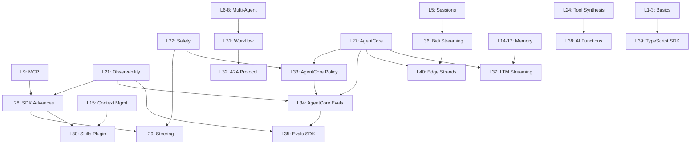
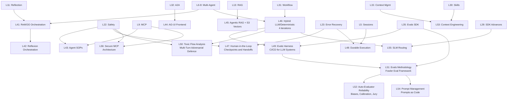
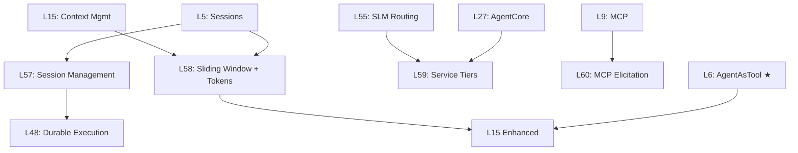
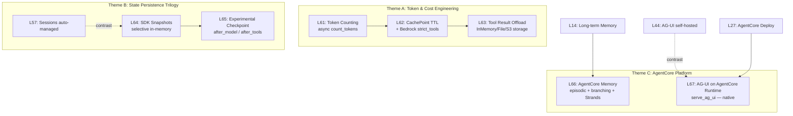
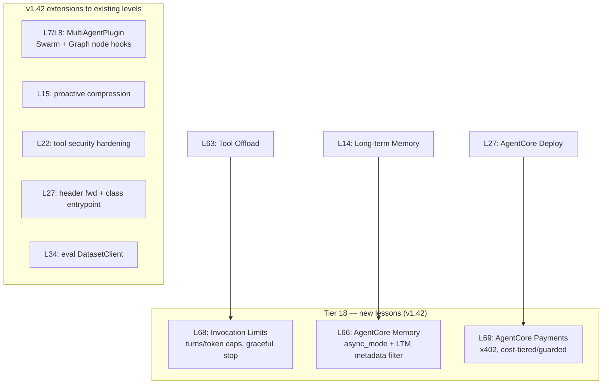

# AWS Strands Agents - Learning Plan

## Overview

Progressive learning path from basic agents to production multi-agent systems.

**Framework:** Strands Agents SDK (open-source, Apache 2.0)
**Why Strands:** Powers Amazon Q, Kiro, AWS Glue agents. Model-driven, minimal boilerplate.

**Status (2026-07):** L1–L93 complete. This file tracks L1–L76 plus the master index; L77 lives in
`artifacts/adk_patterns/`, L78–L93 in `LEARNING_PLAN_agentic_memory_evals.md`. Open work: `NEXT_STEPS_PLAN.md`.
Proposed next tier (L94–L100, post-v1.48 ecosystem delta): `LEARNING_PLAN_v148_impact.md`.

---

## Progress Tracker

**Per-level detail:** one file per lesson in [`docs/levels/`](docs/levels/) (`L01` – `L93`). Level numbers in the tables below link to them.

### Foundation (L1-10) ✅ Complete

| Level | Topic | Status | File |
|-------|-------|--------|------|
| [1](docs/levels/L01-hello-world-agent.md) | Hello World Agent | Done | `01_basics/hello_agent.py` |
| [2](docs/levels/L02-built-in-tools.md) | Built-in Tools | Done | `01_basics/agent_with_tools.py` |
| [3](docs/levels/L03-custom-tools.md) | Custom Tools (@tool) | Done | `01_basics/custom_tools.py` |
| [4](docs/levels/L04-system-prompts-personas.md) | System Prompts & Personas | Done | `02_intermediate/system_prompts.py` |
| [5](docs/levels/L05-sessions-state.md) | Sessions & State | Done | `02_intermediate/sessions.py` |
| [6](docs/levels/L06-agents-as-tools-pattern.md) | Agents-as-Tools (Updated v1.35: as_tool + auto-wrap) | Done | `03_multi_agent/agents_as_tools.py` |
| [7](docs/levels/L07-swarm-pattern.md) | Swarm Pattern | Done | `03_multi_agent/swarm_example.py` |
| [8](docs/levels/L08-graph-workflows.md) | Graph Workflows | Done | `03_multi_agent/graph_workflow.py` |
| [9](docs/levels/L09-mcp-integration.md) | MCP Integration | Done | `04_production/mcp_integration.py` |
| [10](docs/levels/L10-production-with-agentcore.md) | AgentCore Deploy | Done | `04_production/agentcore_deploy.py` |

### Extended Syllabus (L11-27)

#### Tier 1: Enhanced Capabilities (L11-13)

| Level | Topic | Status | File |
|-------|-------|--------|------|
| [11](docs/levels/L11-reflection-pattern.md) | Reflection Pattern | Done | `05_advanced/reflection_pattern.py` |
| [12](docs/levels/L12-structured-outputs.md) | Structured Outputs | Done | `05_advanced/structured_outputs.py` |
| [13](docs/levels/L13-rag-integration.md) | RAG Integration | Done | `05_advanced/rag_integration.py` |

#### Tier 2: Memory Architecture (L14-17)

| Level | Topic | Status | File |
|-------|-------|--------|------|
| [14](docs/levels/L14-long-term-memory.md) | Long-term Memory | Done | `06_memory/longterm_memory.py` |
| [15](docs/levels/L15-context-management.md) | Context Management | Done | `06_memory/context_management.py` |
| [16](docs/levels/L16-memory-architecture.md) | Memory Architecture | Done | `06_memory/unified_memory.py` |
| [17](docs/levels/L17-graph-memory-deep-dive.md) | Graph Memory Deep Dive | Done | `06_memory/graph_memory_benchmark.py` |

#### Tier 3: Advanced Multi-Agent (L18-20)

| Level | Topic | Status | File |
|-------|-------|--------|------|
| [18](docs/levels/L18-debate-pattern.md) | Debate Pattern | Done | `07_advanced_multiagent/debate_pattern.py` |
| [19](docs/levels/L19-planning-agents.md) | Planning Agents | Done | `07_advanced_multiagent/planning_agents.py` |
| [20](docs/levels/L20-meta-agents.md) | Meta-Agents | Done | `07_advanced_multiagent/meta_agents.py` |

#### Tier 4: Production Hardening (L21-23)

| Level | Topic | Status | File |
|-------|-------|--------|------|
| [21](docs/levels/L21-observability.md) | Observability | Done | `08_production/observability.py` |
| [22](docs/levels/L22-safety-guardrails.md) | Safety & Guardrails | Done | `08_production/safety_guardrails.py` |
| [23](docs/levels/L23-error-recovery.md) | Error Recovery | Done | `08_production/error_recovery.py` |

#### Tier 5: Cutting Edge (L24-26)

| Level | Topic | Status | File |
|-------|-------|--------|------|
| [24](docs/levels/L24-tool-synthesis.md) | Tool Synthesis | Done | `09_cutting_edge/tool_synthesis.py` |
| [25](docs/levels/L25-self-improving-agents.md) | Self-Improving Agents | Done | `09_cutting_edge/self_improving.py` |
| [26](docs/levels/L26-capstone-research-agent.md) | Capstone: Research Agent | Done | `09_cutting_edge/research_agent.py` |

#### Tier 6: AWS Deployment (L27+)

| Level | Topic | Status | File |
|-------|-------|--------|------|
| [27](docs/levels/L27-agentcore-deployment.md) | AgentCore Deployment | Done | `10_production/l27agentcore/src/main.py` |

### 2026 Updates (L28+)



### Extensions (L41+) — all built (Tiers 12-15 below)
*Research basis: [2026-03-18 SOTA research report](docs/work/research/reports/2026-03-18_strands-sota-agent-orchestration.md)*



#### Tier 7: SDK Foundation & Plugins (L28-30)

| Level | Topic | Status | File |
|-------|-------|--------|------|
| [28](docs/levels/L28-sdk-advances-concurrency-mcp-tasks-hooks.md) | SDK Advances: Concurrency, MCP Tasks, Hooks | Done | `11_platform/sdk_advances.py` |
| [29](docs/levels/L29-strands-steering.md) | Strands Steering | Done | `11_platform/steering.py` |
| [30](docs/levels/L30-skills-plugin.md) | Skills Plugin | Done | `11_platform/skills_plugin.py` |

#### Tier 8: Multi-Agent Extended (L31-32)

| Level | Topic | Status | File |
|-------|-------|--------|------|
| [31](docs/levels/L31-workflow-pattern.md) | Workflow Pattern | Done | `11_platform/workflow_pattern.py` |
| [32](docs/levels/L32-a2a-protocol.md) | A2A Protocol | Done | `11_platform/a2a_protocol.py` |

#### Tier 9: Production Quality Chain (L33-35)

| Level | Topic | Status | File |
|-------|-------|--------|------|
| [33](docs/levels/L33-agentcore-policy.md) | AgentCore Policy | Done | `11_platform/agentcore_policy.py` |
| [34](docs/levels/L34-agentcore-evaluations.md) | AgentCore Evaluations | Done | `11_platform/agentcore_evaluations.py` |
| [35](docs/levels/L35-strands-evals-sdk.md) | Strands Evals SDK | Done | `11_platform/evals_sdk.py` |

#### Tier 10: Real-Time, Memory & Labs (L36-38)

| Level | Topic | Status | File |
|-------|-------|--------|------|
| [36](docs/levels/L36-bidirectional-streaming.md) | Bidirectional Streaming | Done | `11_platform/bidi_streaming.py` |
| [37](docs/levels/L37-agentcore-ltm-streaming-kinesis.md) | AgentCore LTM Streaming | Done | `11_platform/ltm_streaming.py` |
| [38](docs/levels/L38-strands-labs-ai-functions.md) | Strands Labs: AI Functions | Done | `11_platform/ai_functions.py` |

#### Tier 11: Platform Expansion (L39-40)

| Level | Topic | Status | File |
|-------|-------|--------|------|
| [39](docs/levels/L39-typescript-sdk.md) | TypeScript SDK | Done | `11_platform/typescript/agent.ts` |
| [40](docs/levels/L40-edge-strands-cloud-orchestration.md) | Edge Strands + Cloud Orchestration | Done | `11_platform/edge_strands.py` |

#### Tier 12: Advanced Orchestration Patterns (L41-43)

| Level | Topic | Status | File |
|-------|-------|--------|------|
| [41](docs/levels/L41-custom-orchestration-rewoo.md) | Custom Orchestration — ReWOO | Done | `12_orchestration/rewoo.py` |
| [42](docs/levels/L42-custom-orchestration-reflexion.md) | Custom Orchestration — Reflexion | Done | `12_orchestration/reflexion.py` |
| [43](docs/levels/L43-agent-sops-natural-language-workflow-spe.md) | Agent SOPs | Done | `12_orchestration/agent_sops.py` |

#### Tier 13: Agent-to-Frontend & Retrieval (L44-45)

| Level | Topic | Status | File |
|-------|-------|--------|------|
| [44](docs/levels/L44-ag-ui-agent-to-frontend-protocol.md) | AG-UI — Agent-to-Frontend Protocol | Done | `12_orchestration/agui_protocol.py` |
| [45](docs/levels/L45-agentic-rag-with-amazon-s3-vectors.md) | Agentic RAG with S3 Vectors | Done | `12_orchestration/s3_vectors_rag.py` |

#### Tier 14: Hybrid Patterns & Reliability (L46-50)

| Level | Topic | Status | File |
|-------|-------|--------|------|
| [46](docs/levels/L46-hybrid-llm-deterministic-systems-4-itera.md) | Hybrid LLM/Deterministic Systems (4 iterations) | Done | `12_orchestration/hybrid_*.py` |
| [47](docs/levels/L47-human-in-the-loop-checkpoints-and-handof.md) | Human-in-the-Loop — Checkpoints and Handoffs | Done | `12_orchestration/hitl_checkpoints.py` |
| [48](docs/levels/L48-durable-execution-long-running-agents-th.md) | Durable Execution | Done | `12_orchestration/durable_execution.py` |
| [49](docs/levels/L49-evals-harness-automated-testing-for-llm.md) | Evals Harness — CI/CD for LLM Systems | Done | `12_orchestration/evals_harness.py` |
| [50](docs/levels/L50-toxic-flow-analysis-unsafe-data-paths-in.md) | Toxic Flow Analysis — Multi-Turn Adversarial Defence | Done | `12_orchestration/toxic_flow.py` |

#### Tier 15: Quality Engineering for LLM Systems (L51-56)

| Level | Topic | Status | File |
|-------|-------|--------|------|
| [51](docs/levels/L51-evals-as-engineering-discipline-fowler-e.md) | Evals as Engineering Discipline — Fowler Eval Methodology | Done | `13_quality/evals_methodology.py` |
| [52](docs/levels/L52-auto-evaluator-reliability-biases-calibr.md) | Auto-Evaluator Reliability — Biases, Calibration, Jury | Done | `13_quality/auto_evaluator_reliability.py` |
| [53](docs/levels/L53-context-engineering.md) | Context Engineering | Done | `13_quality/context_engineering.py` |
| [54](docs/levels/L54-prompt-management-prompt-refactoring.md) | Prompt Management Pipeline — Prompts as Code | Done | `13_quality/prompt_management.py` |
| [55](docs/levels/L55-small-language-model-routing.md) | Small Language Model Routing (Assess) | Done | `13_quality/slm_routing.py` |
| [56](docs/levels/L56-secure-mcp-architecture.md) | Secure MCP Architecture | Done | `13_quality/secure_mcp.py` |

#### Tier 16: SDK v1.35 Updates (L57-60)

*SDK delta: v1.30.0 → v1.35.0 (AgentAsTool, session providers, per_turn sliding window, service tiers, MCP elicitation)*



| Level | Topic | Status | File |
|-------|-------|--------|------|
| [57](docs/levels/L57-session-management-providers-lifecycle.md) | Session Management — Providers, Lifecycle Hooks | Done | `11_2026_updates/session_management.py` |
| [58](docs/levels/L58-sliding-window-per-turn-token-tracking.md) | Sliding Window Per-Turn + Token Tracking | Done | `11_2026_updates/sliding_window_tokens.py` |
| [59](docs/levels/L59-bedrock-service-tiers.md) | Bedrock Service Tiers — Cost/Latency Control | Done | `11_2026_updates/service_tiers.py` |
| [60](docs/levels/L60-mcp-elicitation.md) | MCP Elicitation — Server-Requested User Input | Done | `11_2026_updates/mcp_elicitation.py` |

#### Tier 17: SDK v1.36-1.38 + AgentCore Q2 2026 (L61-L67)

*SDK delta: v1.35.0 → v1.38.0 (snapshots, count_tokens, tool result offload, CachePoint TTL, strict_tools, experimental checkpoint).
AgentCore SDK delta: 1.1.x → 1.8.0 (native AG-UI runtime, memory branching + episodic, Strands session-manager bridge, on-demand evaluation runner, policy engine).*

Empirical reshape: the previously planned multi-tenant AG-UI ladder (3 lessons) collapsed to a single L67 because `bedrock_agentcore.runtime.ag_ui.serve_ag_ui(agent)` handles auth/session/scaling in one line. Managed Harness, AgentCore CLI deployment, Performance Optimization (recommendations + batch evals + A/B), and Filesystem Persistence are AWS-side previews not yet in the Python SDK — deferred until the API surfaces.



```
+--- Theme A: Token & Cost ---+
|  L61 count_tokens (async)   |
|         |                   |
|         v                   |
|  L62 CachePoint TTL +       |
|       strict_tools          |
|         |                   |
|         v                   |
|  L63 Tool Result Offload    |
+-----------------------------+

+--- Theme B: State Persistence Trilogy ---+
|  L57 Sessions (auto)                     |
|     |                                    |
|     v contrast                           |
|  L64 SDK Snapshots (selective in-mem)    |
|     |                                    |
|     v                                    |
|  L65 Experimental Checkpoint             |
|     (after_model / after_tools)          |
+------------------------------------------+

+--- Theme C: AgentCore Platform ---+
|  L14 Long-term Memory             |
|     |                             |
|     v                             |
|  L66 AgentCore Memory: episodic + |
|       branching + Strands bridge  |
|                                   |
|  L44 AG-UI self-hosted            |
|     |                             |
|     v contrast                    |
|  L67 AG-UI on AgentCore Runtime   |
|     (serve_ag_ui — native)        |
+-----------------------------------+
```

| Level | Topic | Status | File |
|-------|-------|--------|------|
| [61](docs/levels/L61-token-counting.md) | Token Counting + Pre-Call Estimate (async `count_tokens`) | Done | `14_token_economics/token_counting.py` |
| [62](docs/levels/L62-bedrock-prompt-caching-strict-tools.md) | Bedrock Prompt Caching (TTL) + `strict_tools` on Claude — demonstrated live after the use-case form unlocked Claude | Done | `14_token_economics/cache_and_strict.py` |
| [63](docs/levels/L63-tool-result-offload.md) | Tool Result Offload (`ContextOffloader` + 3 storage backends) | Done | `14_token_economics/tool_offload.py` |
| [64](docs/levels/L64-sdk-snapshots.md) | SDK Snapshots — selective in-memory state capture | Done | `13_state_persistence/sdk_snapshots.py` |
| [65](docs/levels/L65-experimental-checkpoint.md) | Experimental Checkpoint — contract + hook realization (auto-runtime deferred, needs Temporal) | Done | `13_state_persistence/checkpoint.py` |
| [66](docs/levels/L66-agentcore-memory-async-ltm-filter.md) | AgentCore Memory — async session manager + LTM metadata filter (v1.42 facet) | Done | `14_agentcore_platform/memory_async_ltm.py` |
| [67](docs/levels/L67-agui-slot-realized-as-l76.md) | AG-UI on AgentCore Runtime — `serve_ag_ui(agent)` | Realized as L76 | `19_agentcore_agui/agui_native.py` |

#### Deferred (status updated 2026-06; originally 2026-05-03)

| Topic | Source | Status |
|-------|--------|--------|
| Managed Harness (declarative agent → Strands export) | AgentCore preview, April 2026 | **GA announced** at Summit NY 2026 (delta report §9); Python SDK surface still unverified — probe before building |
| AgentCore CLI + CDK deployment | AgentCore CLI GA, April 2026 | **Unblocked 2026-06**: GA as the npm `@aws/agentcore` CLI (deprecates the Python starter-toolkit CLI) — no lesson yet |
| Performance Optimization (recommendations + batch + A/B) | AgentCore preview, May 2026 | **Unblocked 2026-06**: available via `@aws/agentcore` CLI (`run recommendation`, `run batch-evaluation`) — no lesson yet |
| Filesystem Persistence | AgentCore preview, April 2026 | Still blocked: not in `bedrock-agentcore` Python SDK |
| Protocol-level HITL Interrupts (`Interrupt` schema) | `ag-ui-protocol` PR #1569 merged 2026-04-30 | Still blocked on `ag-ui-protocol >= 0.1.19` PyPI publish (SDK-native interrupts covered by L70) |

---

#### Tier 18: SDK v1.42 + AgentCore 1.12 increment (2026-06-02) — DONE

*SDK delta: strands 1.38 → 1.42, tools 0.5.2 → 0.7.0, bedrock-agentcore 1.8 → 1.12, botocore → 1.43.19 (for the dataset API). All lessons verified on **Gemini 2.5 Flash** (Anthropic budget paused; `get_model` routes Gemini direct, no LiteLLM). Reflections: `sdk-v142-gemini-pivot-reflection.md` + per-level `level-{7,8,15,22,27}-v142` / `level-{66,68,69}`.*

**Numbering note:** the NEW lessons are **L68 (Invocation Limits)** and **L69 (Payments)** — they intentionally do NOT reuse the planned Tier-17 slots **L64 (SDK Snapshots)** / **L67 (AG-UI)**, which were open roadmap at the time (both since closed: L64 in Tier 19, the AG-UI slot as L76). **L66 (AgentCore Memory)** is realized here via its async + LTM-filter facet.



```
+--- Tier 18: new lessons (v1.42) ---------+
|  L68 Invocation Limits (turns/token caps)|  <- L63 Tool Offload
|  L66 AgentCore Memory (async + LTM filter)|  <- L14 Long-term Memory
|  L69 AgentCore Payments (x402, guarded)  |  <- L27 AgentCore Deploy
+------------------------------------------+
+--- v1.42 extensions (existing levels) ---+
|  L7/L8 MultiAgentPlugin (Swarm + Graph)  |
|  L15 proactive compression               |
|  L22 tool security hardening             |
|  L27 header fwd + class entrypoint       |
|  L34 eval DatasetClient                  |
+------------------------------------------+
```

| Level | Topic | Status | File |
|-------|-------|--------|------|
| [66](docs/levels/L66-agentcore-memory-async-ltm-filter.md) | AgentCore Memory — `async_mode` config + `MemoryMetadataFilter` (LTM prefilter, ≤5) | Done | `14_agentcore_platform/memory_async_ltm.py` |
| [68](docs/levels/L68-invocation-limits.md) | Invocation Limits — per-invocation `Limits(turns/output_tokens/total_tokens)`, graceful `stop_reason` | Done | `14_token_economics/invocation_limits.py` |
| [69](docs/levels/L69-agentcore-payments-x402.md) | AgentCore Payments — x402 agentic micropayments (Tier 0 offline + Tier 1 manager; testnet/mainnet documented) | Done | `14_agentcore_platform/payments.py` |

| Extended | v1.42 addition | File |
|----------|----------------|------|
| L7 / L8 | `MultiAgentPlugin` node-lifecycle monitoring (Swarm `plugins=`, Graph `set_plugins`) | `03_multi_agent/{swarm_example,graph_workflow}.py` |
| L15 | Iter 9 — `SummarizingConversationManager(proactive_compression=…)` (needs explicit `context_window_limit`) | `06_memory/context_management.py` |
| L22 | Iter 13 — tools 0.7.0: calculator AST sandbox, `use_aws` redaction, `cron` sanitize | `08_production/safety_guardrails.py` |
| L27 | runtime header forwarding (`is_forwardable_header`) + class-based `@entrypoint` | `04_production/agentcore_deploy.py` |
| L34 | Iter 4 — Evaluation `DatasetClient` (curated golden-set datasets) | `11_platform/agentcore_evaluations.py` |

**Roadmap unblocked by the 2026-06 release** (update to the Deferred table above):
- **AgentCore CLI + CDK deployment** — now GA as the npm **`@aws/agentcore`** CLI (TypeScript, framework-agnostic), which DEPRECATES the Python `bedrock-agentcore-starter-toolkit` CLI. See the note in `04_production/agentcore_deploy.py`.
- **Performance Optimization (recommendations + batch evals)** — now available via the `@aws/agentcore` CLI (`run recommendation`, `run batch-evaluation` [preview]).
- Note: the Strands SDK is now a **monorepo** (Python + TypeScript + WASM) — relevant to the L39 TypeScript framing.

---

#### Tier 19: State, Control & Token Economics (2026-06-02 session) — Gemini-verified

*Completed the model-agnostic zero-friction slots and added one net-new control-flow lesson. All verified live on Gemini 2.5 Flash. L62 (CachePoint TTL + Bedrock `strict_tools`) deferred — Anthropic/Bedrock-specific, not demoable while the Anthropic budget is paused.*

```
+--- Theme: pre-call cost + durable state + HITL ---+
|  L61 Token Counting   look-before-you-leap        |
|  L64 SDK Snapshots    selective in-mem capture     |
|  L65 Checkpoint       durable contract + hooks     |
|  L70 Interrupts       native human-in-the-loop     |
+----------------------------------------------------+
```

| Level | Topic | Status | File |
|-------|-------|--------|------|
| [61](docs/levels/L61-token-counting.md) | Token Counting — heuristic vs native `count_tokens`; chars/4 under-counts code/CJK/punct 40-75% | Done | `14_token_economics/token_counting.py` |
| [64](docs/levels/L64-sdk-snapshots.md) | SDK Snapshots — selective in-memory capture/restore, JSON round-trip, branching | Done | `13_state_persistence/sdk_snapshots.py` |
| [65](docs/levels/L65-experimental-checkpoint.md) | Experimental Checkpoint — data contract + hook realization (auto-runtime types-only in 1.42, needs Temporal) | Done | `13_state_persistence/checkpoint.py` |
| [70](docs/levels/L70-native-interrupts-hitl.md) | Native Interrupts — HITL approval gates (`event.interrupt` / `result.interrupts` / resume by id) | Done | `12_orchestration/interrupts_hitl.py` |

**Empirical findings this session (probe-validated):**
- **L61:** base `count_tokens` docstring claims tiktoken cl100k_base but the v1.42 path is char heuristic (`ceil(chars/4)`); Gemini native count == actual billed `inputTokens` exactly; heuristic under-counts code (−40%), CJK (−50%), punctuation (−75%).
- **L65:** `strands.experimental.checkpoint` is TYPES-ONLY in 1.42 — `AgentResult` has no `checkpoint` field, nothing sets `stop_reason="checkpoint"`, no resume param. Realized durable execution via `AfterModelCallEvent`/`AfterToolCallEvent` hooks + L64 snapshots instead.
- **L70:** interrupts are fully wired — `event.interrupt(name, reason)` raises (pauses) then returns the human's response on resume; `event.cancel_tool` enforces a deny; the interrupt is portable JSON keyed by `id`.

---

#### Tier 20: AgentCore Platform — Cloud Catalog (2026-06-02 session) — live AWS

*AWS-backed lessons, **re-verified on the agentic sandbox account** — the correct agentic account — after an initial mis-run on the data-only sandbox account (see the account-migration note, `MIGRATION_*.md` in repo root). Each is self-tearing-down (leaves zero resources). Probe-first: offline `service_model` shapes + live smoke probe before writing. Use `AWS_PROFILE=<your-sso-profile>`.*

| Level | Topic | Status | File |
|-------|-------|--------|------|
| [71](docs/levels/L71-agentcore-agent-registry.md) | AgentCore Agent Registry — publish & discover an `AGENT_SKILLS` bundle; approval gates discovery | Done | `15_agentcore_registry/agent_registry.py` |
| [72](docs/levels/L72-agentcore-code-interpreter.md) | AgentCore Code Interpreter — managed sandbox (`code_session`), stateful kernel + fs, wired to a Strands agent | Done | `16_agentcore_tools/code_interpreter.py` |
| [73](docs/levels/L73-agentcore-browser.md) | AgentCore Browser — managed headless Chrome over CDP (`browser_session` + Playwright `connect_over_cdp`), agent drives it | Done | `16_agentcore_tools/browser.py` |
| [74](docs/levels/L74-agentcore-workload-identity.md) | AgentCore Workload Identity — vault a secret (no key in code); `@requires_api_key` injects it; token vault keyed to identity | Done | `17_agentcore_identity/workload_identity.py` |
| [75](docs/levels/L75-agentcore-config-bundles.md) | AgentCore Config Bundles — Git-like versioned config for resources (commits/branches/lineage); rollback via `get_configuration_bundle_version` | Done | `18_agentcore_config/config_bundles.py` |
| [76](docs/levels/L76-ag-ui-native.md) | AG-UI Native — `serve_ag_ui`/`build_ag_ui_app` serve a Strands agent over the agent-to-frontend protocol (SSE+WS); entrypoint adapter | Done | `19_agentcore_agui/agui_native.py` |

**Empirical findings (L76, local — no AWS):** `build_ag_ui_app(entrypoint)` builds a Starlette app (`/invocations` SSE, `/ws`, `/ping`). Pass an ENTRYPOINT (async-gen `RunAgentInput`→AG-UI events), **not** a raw Agent (else `RUN_ERROR` "Input prompt must be of type…"). Adapter: `RunStarted → TextMessageStart → TextMessageContent(delta from `stream_async` `event["data"]`) → TextMessageEnd → RunFinished`. `RunAgentInput` requires `forwardedProps` et al. (missing → HTTP 400); mid-stream errors → `RunErrorEvent`. Test headlessly with Starlette `TestClient`. This realizes the long-open L67 AG-UI slot.

**Empirical findings (L75, live on the agentic sandbox account):** Config bundle components are keyed by a real resource ARN (gateway accepted; workload-identity ARN rejected); gateway component config is `{configuration:{toolOverrides:{tool:{description}}}}` (no `document` wrapper). create/update = commits (commitMessage + parentVersionIds + branchName) → version lineage; `get_configuration_bundle_version` reads any past version. A minimal gateway (name+role+AWS_IAM+MCP, no target) suffices; role trusts `bedrock-agentcore.amazonaws.com`.

**Empirical findings (L74, live on the agentic sandbox account):** `create_api_key_credential_provider` vaults the key in AWS-managed Secrets Manager; `Get` returns only ARNs (never the raw key). `@requires_api_key(provider_name=…)` injects the vaulted key at call time (works locally; sibling `requires_access_token` for OAuth2 M2M/user-federation). **Gotcha:** the decorator caches its workload identity in `./.agentcore.json` — a stale cache (deleted identity / different account) → `AccessDeniedException`; clear it (gitignored) when switching accounts.

**Empirical findings (L73, live-validated):** `browser_session(region)` → `generate_ws_headers()` (wss + SigV4) → Playwright `connect_over_cdp` (no local browser binaries); navigate/fill/click/JS all work; `generate_live_view_url` + `take_control`/`release_control` = human-on-the-loop. **Gotcha:** sync Playwright's greenlet loop collides with Strands' asyncio loop (`greenlet.error`) — go uniformly async (`async_playwright` + `invoke_async` + async `@tool`). Needs `playwright` (added via uv; package only).

**Empirical findings (L72, live-validated):** `code_session(region)` context manager → managed isolated sandbox (kernel+fs); `execute_code` returns `stream[].result.structuredContent {stdout,stderr,exitCode}` (errors are data, not exceptions); kernel state persists across calls (`clear_context` resets); default sandbox had **no pip egress**; a Gemini agent computed `fib(20)=6765` via a `run_python` tool. **Gotcha:** `LESSON_DOTENV` injects static `AWS_*` keys that override SSO → `InvalidClientTokenId`; drop them when `AWS_PROFILE` is set.

**Empirical findings (L71, live-validated):**
- Registry is a unified governed catalog: `DescriptorType` ∈ `MCP|A2A|CUSTOM|AGENT_SKILLS`; control plane `bedrock-agentcore-control` + data plane `bedrock-agentcore` (`SearchRegistryRecords`). Realizes the 2026-05-19 `NOTE_*agentcore_agent_registry.md`.
- **Approval gates discovery**: `SearchRegistryRecords` returns ONLY `APPROVED` records — the same query is empty while `DRAFT`, found once `APPROVED`.
- `create_registry`/`delete_registry` are async (202; `CREATING`→`READY`→`DELETING`); `skillMd.inlineContent` must be `---`-frontmatter SKILL.md; search is eventually consistent (~8-12s post-approval).
- Pairs with **L30** (local Strands `AgentSkills`): L30 runs a skill in-process; L71 publishes/governs/discovers one org-wide.

**Queue complete (user 2→1→3):** ✓ L71 Registry · ✓ L72 Code Interpreter + ✓ L73 Browser · ✓ L62 (Nova prompt caching). **Bedrock entitlement finding (validated live):** Claude is gated behind an unfilled use-case form (`Model use case details have not been submitted` / `GetUseCaseForModelAccess` "not filled out") — `agreementAvailability` metadata was misleading; a real Converse call is the truth. `strict_tools` is Claude-only (Nova/Llama/Mistral all reject). Filling the Bedrock model-access use-case form would unlock Claude + `strict_tools` + extended cache TTL.

---

#### Tier 21: Cross-Model Patterns + Agentic Memory & Evals (L77-93) — DONE

| Level | Topic | Status | Where |
|-------|-------|--------|-------|
| [77](docs/levels/L77-adk-patterns-cross-model.md) | ADK multi-agent patterns ported to Strands, verified on Gemini + Bedrock Claude Haiku (8/8 both) | Done | `artifacts/adk_patterns/` |
| 78-92 | Agentic memory (shared, cross-session, LTM-filtered, long-horizon, durable resume) + agentic evals (trajectory, goal-success, significance, unified harness) + capstone | Done | `LEARNING_PLAN_agentic_memory_evals.md` (per-level detail) |
| [93](docs/levels/L93-cross-model-validation-nova-lite.md) | Cross-model validation of L78-92 model-sensitive findings on Bedrock Nova Lite — all 6 held (framework-inherent) | Done | `13_quality/crossmodel_validation.py` |

Current open work lives in `NEXT_STEPS_PLAN.md`.

#### Tier 22: Platform Convergence — post-v1.48 (L94+, in progress)

*Plan: `LEARNING_PLAN_v148_impact.md`. Stack: strands 1.48.0 / tools 0.8.4 / agentcore 1.18.1 / evals 1.0.2.*

| Level | Topic | Status | Where |
|-------|-------|--------|-------|
| [94](docs/levels/L94-v148-upgrade-regression-sweep.md) | SDK v1.48 upgrade + regression sweep; L61 count_tokens vindicated by re-probe | Done | `_sandbox/probe_l94_*.py` |
| [95](docs/levels/L95-checkpoint-runtime-end-to-end.md) | Checkpoint runtime end-to-end: SIGKILL + fresh-process resume, exactly-once, Checkpoint≠state, interrupt>checkpoint | Done | `13_state_persistence/checkpoint_runtime.py` |
| [96](docs/levels/L96-interventions-unified.md) | Interventions: control plane unified (Deny/Guide/Confirm/Transform + in-process Cedar) | Done | `08_production/interventions_unified.py` |
| [97](docs/levels/L97-memory-rematch-native.md) | L87 rematch: native MemoryManager vs hand-built — native underperforms (lexical-recall miss); memory-injection hijack vector found | Done (local) | `06_memory/memory_rematch_native.py` |
| [97b](docs/levels/L97b-memory-rematch-semantic.md) | Fair rematch with a custom semantic MemoryStore — native reaches FULL parity (1.00=1.00); L97's gap was the test store, not the abstraction; zero AWS | Done | `06_memory/memory_rematch_semantic.py` |
| [99](docs/levels/L99-redteam-memory-channel.md) | Red-team the memory channel: explicit deny-policy defends against memory poison (weak 4/4 hijack vs strong 0/4); evals-1.0 red-team suite | Done | `13_quality/redteam_memory_channel.py` |
| 98, 100 | sandbox tier · agentic context mgmt | Planned | see `LEARNING_PLAN_v148_impact.md` |

---

## Local Development Setup

### LiteLLM Proxy (localhost:4000)

| Alias | Model | Use Case |
|-------|-------|----------|
| `claude-sonnet-4` | Claude Sonnet 4 | General, tool-use |
| `claude-opus-4` | Claude Opus 4 | Complex reasoning |
| `haiku` | Claude Haiku 4.5 | Fast iterations |
| `gemini-flash` | Gemini 2.5 Flash | Fast alternative |

```bash
# Start proxy (podman container; see CLAUDE.md)
podman start litellm-proxy

# Run examples
uv run python 01_basics/hello_agent.py
```

### Model Helper

```python
from tools import get_model

model = get_model("claude-sonnet-4")  # or haiku, opus, gemini-flash
```

---

## Key Resources

**Documentation:**
- [Strands Agents Docs](https://strandsagents.com/docs/)
- [Multi-Agent Patterns](https://strandsagents.com/docs/user-guide/concepts/multi-agent/multi-agent-patterns/)

**GitHub:**
- [strands-agents/sdk-python](https://github.com/strands-agents/sdk-python)
- [strands-agents/samples](https://github.com/strands-agents/samples)

**AWS Blogs:**
- [Introducing Strands Agents 1.0](https://aws.amazon.com/blogs/opensource/introducing-strands-agents-1-0-production-ready-multi-agent-orchestration-made-simple/)
- [Technical Deep Dive](https://aws.amazon.com/blogs/machine-learning/strands-agents-sdk-a-technical-deep-dive-into-agent-architectures-and-observability/)
- [Multi-Agent Patterns](https://aws.amazon.com/blogs/machine-learning/multi-agent-collaboration-patterns-with-strands-agents-and-amazon-nova/)

### 2026 Updates

- [Strands SDK Releases](https://github.com/strands-agents/sdk-python/releases) — v1.26–v1.29+ changelogs
- [Strands Labs org](https://github.com/strands-labs) — ai-functions, robots, robots-sim
- [Introducing Strands Labs](https://strandsagents.com/blog/introducing-strands-labs/) — blog post
- [Steering plugin](https://strandsagents.com/docs/user-guide/concepts/plugins/steering/)
- [Skills plugin](https://strandsagents.com/docs/user-guide/concepts/plugins/skills/)
- [A2A Protocol](https://strandsagents.com/docs/user-guide/concepts/multi-agent/agent-to-agent/)
- [Workflow pattern](https://strandsagents.com/docs/user-guide/concepts/multi-agent/workflow/)
- [AgentCore Policy](https://docs.aws.amazon.com/bedrock-agentcore/latest/devguide/policy-natural-language.html) — NL2Cedar guide
- [AgentCore Evaluations](https://docs.aws.amazon.com/bedrock-agentcore/latest/devguide/evaluations.html)
- [AgentCore LTM Streaming](https://aws.amazon.com/about-aws/whats-new/2026/03/agentcore-memory-streaming-ltm/)
- [Evals SDK](https://strandsagents.com/docs/user-guide/evals-sdk/quickstart/)
- [Bidirectional streaming](https://strandsagents.com/docs/user-guide/concepts/bidirectional-streaming/quickstart/)
- [llama.cpp provider](https://strandsagents.com/docs/user-guide/concepts/model-providers/llamacpp/)
- [TypeScript SDK](https://github.com/strands-agents/sdk-typescript) — experimental
- **OSS (third-party):** [Agent Control by Galileo](https://strandsagents.com/blog/strands-agents-with-agent-control/) — runtime guardrails plugin; not official AWS

### Proposed L51-55 Resources (Fowler + ThoughtWorks Vol.33)

- [Martin Fowler: Engineering Practices for LLM Application Development](https://martinfowler.com/articles/engineering-practices-llm.html) — example-based/property-based/auto-evaluator/adversarial testing, inference-testing decoupling, prompt refactoring
- [Martin Fowler: Patterns for Building LLM-based Systems & Products](https://martinfowler.com/articles/gen-ai-patterns.html) — guardrails, eval pipeline, query rewriting, hybrid retrieval, reranking
- [ThoughtWorks Technology Radar Vol.33 (2026) Techniques](https://www.thoughtworks.com/radar/techniques) — Context Engineering (Assess), Small Language Models (Trial), Naive API-to-MCP Conversion (Hold), LLM as a Judge (Assess), Toxic Flow Analysis (Assess), Structured Output from LLMs (Trial), AGENTS.md (Trial)

### Proposed L41+ Resources

- [Customize agent workflows — AWS ML Blog](https://aws.amazon.com/blogs/machine-learning/customize-agent-workflows-with-advanced-orchestration-techniques-using-strands-agents/) — ReWOO + Reflexion deep dive
- [strands-agents/samples: 15-custom-orchestration-airline-assistant](https://github.com/strands-agents/samples/blob/main/02-samples/15-custom-orchestration-airline-assistant/src/reWoo-reAct_singleTurn.ipynb) — ReWOO vs ReAct notebook
- [Introducing Strands Agent SOPs](https://aws.amazon.com/blogs/opensource/introducing-strands-agent-sops-natural-language-workflows-for-ai-agents/)
- [strands-agents/agent-sop](https://github.com/strands-agents/agent-sop) — Agent SOPs repo
- [AG-UI Protocol](https://docs.ag-ui.com/) — Agent-to-Frontend event standard
- [AWS Strands + AG-UI integration](https://www.copilotkit.ai/blog/aws-strands-agents-now-compatible-with-ag-ui)
- [S3 Vectors + multimodal agents — DEV.to](https://dev.to/aws/dev-track-spotlight-build-multi-modal-ai-agents-with-strands-agents-and-amazon-s3-vectors-dev332-4jp5)
- [strands-agents/samples: 05-agentic-rag](https://github.com/strands-agents/samples) — agentic RAG examples
- [Research report: SOTA + community adoption](docs/work/research/reports/2026-03-18_strands-sota-agent-orchestration.md)
- [Research report: ecosystem delta v1.42 → v1.48, 2026-06 → 2026-07](docs/work/research/reports/2026-07-18_strands-ecosystem-delta-v142-to-v148.md) — input to the L94+ extension decision

---

## Reflection Workflow

After completing each level, run:
```bash
/reflect N  # where N is the level number
```

This captures observations to `.claude/learnings/` without bloating CLAUDE.md.
