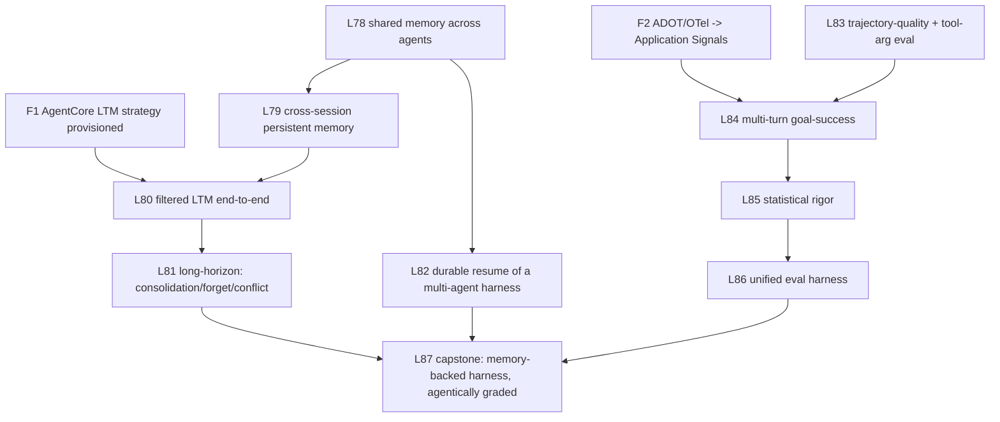

# Learning Plan Addendum — Agentic Memory & Agentic Evals (L78–L87)

Closes the two gaps surfaced by the 2026-06-03 audit: the repo nails **single-agent memory** and
**single-shot eval methodology**, but the **agentic** layer of both is simulated, archived, or
API-shape-only. Each lesson below has a **falsifiable empirical success criterion** and an
**anti-simulation guardrail** — because the repo's recurring failure mode was mocking these exact
integrations (L14/L16/L26 all required full rewrites after simulation was caught).

## The gaps (cited)

- **Agentic memory:** shared-across-agents memory has **zero usage** (grep `shared_context`/`GraphState`
  in multi-agent dirs = 0); multi-agent→persistent memory is **simulated stubs**
  (`debate_pattern.py:483-528`, `meta_agents.py:764-877`); the one real cross-session store is
  **quarantined** (`_archive_hallucinated_l27/dynamodb_persistence.py`); AgentCore filtered LTM is
  **extraction-gated** (`memory_async_ltm.py:16-23`). No consolidation/forgetting/conflict/long-horizon.
- **Agentic evals:** trajectory captured as a **flat set of tool names** losing order+args
  (`evals_sdk.py:124`); tool-accuracy evaluators **imported but never run** (`evals_sdk.py:61`);
  `GoalSuccessRate`/`Faithfulness` are **ADOT-gated, never executed**; **zero statistical significance**
  anywhere; curriculum evals are **single-run**; **no unified harness** (4+ bespoke).

## Root cause → Foundation-first principle

Both holes share one cause: **the agentic capability is gated behind infrastructure the repo never
stood up** (a provisioned AgentCore LTM *strategy*; ADOT/OTel → Application Signals). So **F1 and F2
below are prerequisites** — do them first or the new levels repeat the API-shape-only failure.

## Empirical guardrails (apply to every lesson)

1. **Probe-first** — `_sandbox/probe_<level>_shapes.py` + `_state.py` before coding (CLAUDE.md rule).
2. **No simulation** — no hardcoded memory strings, no mock MCP/boto. Prove with a **runtime-generated
   sentinel**, never a literal. A lesson that can pass with a stub is mis-designed.
3. **No "assume-good" defaults** — fail loud. (Trap: `s3_vectors_eval.py:263` returns faithfulness=1.0
   on parse failure.) Every metric must distinguish a deliberately-bad input from a good one.
4. **Multi-run** — N≥5; report reproducibility + a noise floor. Single-run "findings" are inadmissible
   (the repo's own rule, `observations.jsonl` L50/L53).
5. **Capture** — `/reflect` after each: observations.jsonl rows citing the actual run + a reflection.

## Curriculum map



```
 F1 ---------------------> L80
 F2 ---------------------> L84
 L78 -> L79 -> L80 -> L81 ----------+
 L78 -> L82 -----------------------+ \
 L83 -> L84 -> L85 -> L86 --------+  \ \
                                  |   v v
                                  +-> L87 (capstone)
```

---

## FOUNDATION (do first)

### F1 — Provision AgentCore Memory **with an LTM extraction strategy**
- **Closes:** the L66 extraction-gated wall (filtered retrieval impossible on an STM-only store).
- **Builds on:** `14_agentcore_platform/memory_async_ltm.py`, `11_platform/ltm_streaming.py` (L37 proved
  *unfiltered* retrieval works live).
- **Empirical objective:** create a Memory resource with a configured LTM strategy; write 20 episodic
  events; **after extraction completes, `RetrieveMemoryRecords` returns extracted LTM records** (not the
  `ValidationException: Filter key not valid` from L66).
- **Verify:** assert ≥1 LTM record exists post-extraction AND its `memoryStrategyId` matches the
  provisioned strategy. **Guardrail:** poll for real extraction; do not assert against injected records.

### F2 — Stand up ADOT/OTel → Application Signals (or a local OTel span store)
- **Closes:** the wall blocking `GoalSuccessRate`/`Faithfulness`/tool-accuracy (L34/L35 never executed).
- **Builds on:** `08_production/observability.py` (L21 OTel), `artifacts/adk_patterns/_trace.py`.
- **Empirical objective:** an instrumented agent emits OTel spans a trace-level evaluator can read.
- **Verify:** assert a Session/trace exists with ≥1 tool span; a TRACE_LEVEL evaluator instantiates
  without the "requires OTel Session" error. **Guardrail:** real spans, not a hand-built fixture.

---

## TRACK A — Agentic Memory (L78–L82)

### L78 — Shared working memory across a multi-agent team
- **Closes:** zero usage of `Swarm.shared_context` / `GraphState` for real cross-agent memory.
- **Builds on:** `03_multi_agent/swarm_example.py`, `graph_workflow.py`, `artifacts/adk_patterns/p2,p3`.
- **Empirical objective:** Agent A writes a fact to shared memory; Agent B (no prompt-chain edge to A)
  reads it and uses it.
- **Iterations:** (1) `Swarm.shared_context` read/write; (2) `GraphBuilder` shared state across
  non-adjacent nodes; (3) a `SharedMemoryPort` adapter (in-platform) both wrap.
- **Verify:** generate a unique sentinel at runtime, have A write it to the store, assert it appears in
  **B's input + the store** but **not** on any A→B edge. **Guardrail:** sentinel is runtime-random, so a
  hardcoded pass is impossible; assert there is NO direct edge carrying it.

### L79 — Cross-session persistent memory for an agentic harness
- **Closes:** simulated multi-agent persistence; the quarantined DynamoDB design.
- **Builds on:** un-archive `_archive_hallucinated_l27/dynamodb_persistence.py` **OR** AgentCore Memory
  (F1) + `RepositorySessionManager` (`session_management.py:184-332`).
- **Empirical objective:** a 3-agent task writes memory in **process 1**, which is then **killed**;
  **process 2 (fresh)** recalls it without re-doing the work.
- **Verify:** process 1 writes sentinel + partial result, `kill -9`; process 2 asserts recall of the
  sentinel from the live store. **Guardrail:** separate OS processes (not in-process re-instantiation —
  the `unified_memory.py:1126` trap); store must be external (DynamoDB/AgentCore), not a local dict.

### L80 — Filtered LTM retrieval, end-to-end (depends on F1)
- **Closes:** `memory_async_ltm.py` extraction-gated gap.
- **Empirical objective:** write episodic events tagged to two cohorts; after extraction, a
  **metadata-filtered** `RetrieveMemoryRecords(filter={cohort=X})` returns only cohort-X records.
- **Verify:** assert filter **discriminates** — returns ≥1 cohort-X record and **zero** cohort-Y.
  **Guardrail:** must fail if the filter is ignored (i.e., a no-op filter returning everything fails).

### L81 — Long-horizon memory dynamics: consolidation, forgetting, conflict
- **Closes:** no accumulation-at-scale, consolidation, eviction, or cross-source conflict resolution.
- **Builds on:** `graph_memory_benchmark.py` (L17 temporal invalidation), F1.
- **Empirical objective:** at N=10/100/1000 memories, measure recall@k + p50/p95 retrieval latency;
  apply consolidation/importance-weighted eviction; inject a contradicting fact.
- **Verify:** (a) plot/record recall+latency vs N (answers the repo's open Q `level-16-reflection.md:163`);
  (b) post-consolidation recall maintained with fewer records; (c) after a contradiction, the **stale
  fact is not returned** (superseded). **Guardrail:** real store growth, real timings — no synthetic curves.

### L82 — Durable resume of a multi-agent harness
- **Closes:** durable resume proven only for a single agent (L65/L70/L48), never a swarm/graph.
- **Builds on:** `checkpoint.py` (L65), `interrupts_hitl.py` (L70), `durable_execution.py` (L48), L78.
- **Empirical objective:** kill a 5-node graph at node 3; resume; nodes 1–3 are **not** re-run and node 4
  sees shared memory from nodes 1–2.
- **Verify:** assert idempotent skip of completed nodes (via an execution ledger) AND shared-memory
  presence in node 4's input. **Guardrail:** real crash (process kill or raised mid-run), not a flag.

---

## TRACK B — Agentic Evals (L83–L86)

### L83 — Trajectory-quality + tool-argument-correctness eval
- **Closes:** flat-tool-name trajectory; unused `ToolSelectionAccuracy`/`ToolParameterAccuracy`.
- **Builds on:** `artifacts/adk_patterns/_trace.py` (rich JSONL: tool name+input+result+order+timing),
  `11_platform/evals_sdk.py`.
- **Empirical objective:** score tool **selection**, tool **arguments**, and decision order over the
  trajectory — not just reproducibility.
- **Verify:** build 10 golden trajectories incl. ones with **wrong tool args** and **wrong order**; the
  judge ranks good > bad (rank-corr ≥ threshold) and **flags the wrong-argument call**. **Guardrail:**
  include a trajectory that's structurally complete but semantically wrong — it must score low.

### L84 — Multi-turn goal-success + faithfulness eval (depends on F2)
- **Closes:** `GoalSuccessRate`/`Faithfulness` referenced but never executed.
- **Empirical objective:** on a 5-turn agentic task with a known goal, run `GoalSuccessRate` +
  `Faithfulness` over real OTel spans (F2).
- **Verify:** evaluator **fails** a deliberately-sabotaged run (goal not met / unfaithful claim) and
  **passes** a good one. **Guardrail:** if ADOT proves too heavy, build a local trace-based goal judge on
  L83's JSONL — but it must read the **real trace**, not a summary.

### L85 — Statistical rigor for LLM evals
- **Closes:** zero significance testing; single-run curriculum evals.
- **Builds on:** `evals_methodology.py` (L51), `auto_evaluator_reliability.py` (L52), `evals_harness.py` (L49).
- **Empirical objective:** re-run prior eval comparisons at N≥30 with bootstrap 95% CIs + a significance
  test; add a power analysis (runs needed to detect a given effect).
- **Verify:** report which prior single-run "findings" are significant; **assert at least one prior claim
  is shown NON-significant** (honest negative). **Guardrail:** CIs from real repeated runs, not assumed σ.

### L86 — Unified, reusable eval harness (in `tools/`)
- **Closes:** 4+ non-composable bespoke harnesses.
- **Builds on:** `adk_patterns/_harness.py` (multi-run+tokens), L49 baseline-diff, L51/L52 judges, L45f RAG.
- **Empirical objective:** one composable harness = datasets + pluggable evaluators + multi-run +
  significance (L85) + cost/latency gating + regression baseline.
- **Verify:** run it over L49+L51+L52 datasets and **reproduce their headline numbers within CI**; assert
  it **gates** a deliberately-regressed prompt on **both** quality and cost. **Guardrail:** must consume
  existing level datasets unmodified (proves generality, not a fresh bespoke fit).

---

## CAPSTONE

### L87 — Memory-backed multi-agent harness, agentically graded
- **Ties both tracks together** — the real proof the original pain is resolved.
- **Builds on:** L78–L82 (memory) + L83–L86 (evals).
- **Empirical objective:** an agentic harness using shared + cross-session memory, graded by the
  trajectory + goal-success + significance stack.
- **Verify:** assert the memory-backed harness **beats a memoryless baseline on goal-success at p<0.05**
  (L85) AND its trajectory quality is judged higher (L83) — across N runs, with the full audit trace
  (L82/`_trace.py`) attached. **Guardrail:** the baseline must be identical except memory disabled.

---

## Suggested execution order & sizing
1. **F1, F2** (foundation; unblock the gated capabilities) — small each, mostly provisioning + probes.
2. **L78 → L79 → L80 → L81** (memory depth), **L82** can run in parallel after L78.
3. **L83 → L84 → L85 → L86** (eval depth).
4. **L87** capstone last.

Each is one level-sized unit (multi-iteration `.py`, run live, then `/reflect`). Do **F1+L80** and
**F2+L84** as pairs — the foundation only earns its keep when the dependent level proves it end-to-end.
