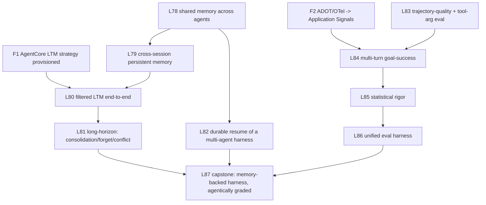

# Track Overview — Agentic Memory & Agentic Evals (L78–L93)

**Status: COMPLETE.** All levels built, run live, gate-clean, and reflected. Capstone result (L87):
memory-backed harness 1.00 goal-success vs 0.00 memoryless, p = 0.0003 by permutation test. All six
model-sensitive findings re-validated on Bedrock Nova Lite and labeled framework-inherent (L93).
Per-level detail: the table below. This overview preserves the track's rationale and discipline.

The track closed the two gaps surfaced by the 2026-06-03 audit: the repo nailed **single-agent
memory** and **single-shot eval methodology**, but the **agentic** layer of both was simulated,
archived, or API-shape-only. Each lesson carried a **falsifiable empirical success criterion** and an
**anti-simulation guardrail** — because the repo's recurring failure mode was mocking these exact
integrations (L14/L16/L26 all required full rewrites after simulation was caught).

## The gaps the audit found (all since closed)

- **Agentic memory:** shared-across-agents memory had **zero usage** (grep `shared_context`/`GraphState`
  in multi-agent dirs = 0); multi-agent→persistent memory was **simulated stubs**
  (`debate_pattern.py:483-528`, `meta_agents.py:764-877`); the one real cross-session store was
  **quarantined** (`_archive_hallucinated_l27/dynamodb_persistence.py`); AgentCore filtered LTM was
  **extraction-gated** (`memory_async_ltm.py:16-23`). No consolidation/forgetting/conflict/long-horizon.
- **Agentic evals:** trajectory captured as a **flat set of tool names** losing order+args
  (`evals_sdk.py:124`); tool-accuracy evaluators **imported but never run** (`evals_sdk.py:61`);
  `GoalSuccessRate`/`Faithfulness` were **ADOT-gated, never executed**; **zero statistical significance**
  anywhere; curriculum evals were **single-run**; **no unified harness** (4+ bespoke).

## Root cause → Foundation-first principle

Both holes shared one cause: **the agentic capability was gated behind infrastructure the repo had
never stood up** (a provisioned AgentCore LTM *strategy*; ADOT/OTel → Application Signals). The
foundations F1 and F2 were therefore built first; their specs live in the L80 and L84 level docs
("Foundation prerequisite" sections).

## Empirical guardrails (applied to every lesson; still the house rules)

1. **Probe-first** — `_sandbox/probe_<level>_shapes.py` + `_state.py` before coding (CLAUDE.md rule).
2. **No simulation** — no hardcoded memory strings, no mock MCP/boto. Prove with a **runtime-generated
   sentinel**, never a literal. A lesson that can pass with a stub is mis-designed.
3. **No "assume-good" defaults** — fail loud. (Trap: `s3_vectors_eval.py:263` returns faithfulness=1.0
   on parse failure.) Every metric must distinguish a deliberately-bad input from a good one.
4. **Multi-run** — N≥5; report reproducibility + a noise floor. Single-run "findings" are inadmissible
   (the repo's own rule, `observations.jsonl` L50/L53).
5. **Capture** — `/reflect` after each: observations.jsonl rows citing the actual run + a reflection.

## Curriculum map



```
 F1 ---------------------> L80
 F2 ---------------------> L84
 L78 -> L79 -> L80 -> L81 ----------+
 L78 -> L82 -----------------------+ \
 L83 -> L84 -> L85 -> L86 --------+  \ \
                                  |   v v
                                  +-> L87 (capstone)
```

---

## Per-level detail (in docs/levels/)

| Level | File |
|-------|------|
| L78 | [`docs/levels/L78-shared-working-memory-across-a-multi-age.md`](docs/levels/L78-shared-working-memory-across-a-multi-age.md) |
| L79 | [`docs/levels/L79-cross-session-persistent-memory-for-an-a.md`](docs/levels/L79-cross-session-persistent-memory-for-an-a.md) |
| L80 | [`docs/levels/L80-filtered-ltm-retrieval-end-to-end-depend.md`](docs/levels/L80-filtered-ltm-retrieval-end-to-end-depend.md) |
| L81 | [`docs/levels/L81-long-horizon-memory-dynamics-consolidati.md`](docs/levels/L81-long-horizon-memory-dynamics-consolidati.md) |
| L82 | [`docs/levels/L82-durable-resume-of-a-multi-agent-harness.md`](docs/levels/L82-durable-resume-of-a-multi-agent-harness.md) |
| L83 | [`docs/levels/L83-trajectory-quality-tool-argument-correct.md`](docs/levels/L83-trajectory-quality-tool-argument-correct.md) |
| L84 | [`docs/levels/L84-multi-turn-goal-success-faithfulness-eva.md`](docs/levels/L84-multi-turn-goal-success-faithfulness-eva.md) |
| L85 | [`docs/levels/L85-statistical-rigor-for-llm-evals.md`](docs/levels/L85-statistical-rigor-for-llm-evals.md) |
| L86 | [`docs/levels/L86-unified-reusable-eval-harness-in-tools.md`](docs/levels/L86-unified-reusable-eval-harness-in-tools.md) |
| L87 | [`docs/levels/L87-memory-backed-multi-agent-harness-agenti.md`](docs/levels/L87-memory-backed-multi-agent-harness-agenti.md) |
| L88 | [`docs/levels/L88-memory-faithfulness-eval.md`](docs/levels/L88-memory-faithfulness-eval.md) |
| L89 | [`docs/levels/L89-adversarial-injection-eval.md`](docs/levels/L89-adversarial-injection-eval.md) |
| L90 | [`docs/levels/L90-shared-memory-port.md`](docs/levels/L90-shared-memory-port.md) |
| L91 | [`docs/levels/L91-native-trace-evaluators.md`](docs/levels/L91-native-trace-evaluators.md) |
| L92 | [`docs/levels/L92-ship-gate.md`](docs/levels/L92-ship-gate.md) |
| L93 | [`docs/levels/L93-cross-model-validation-nova-lite.md`](docs/levels/L93-cross-model-validation-nova-lite.md) |

## Execution order (as run)
1. **F1, F2** foundations first (provisioning + probes), proven end-to-end by their dependent levels
   (F1+L80, F2+L84 as pairs).
2. **L78 → L79 → L80 → L81** (memory depth), **L82** in parallel after L78.
3. **L83 → L84 → L85 → L86** (eval depth).
4. **L87** capstone; **L88–L92** extensions under the same discipline; **L93** cross-model validation last.
