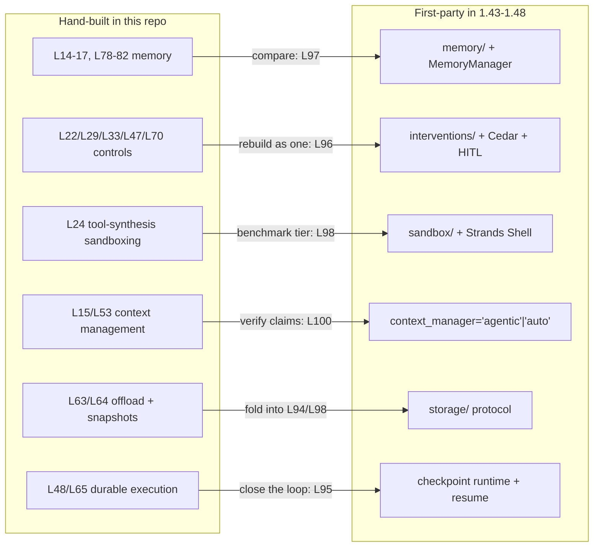
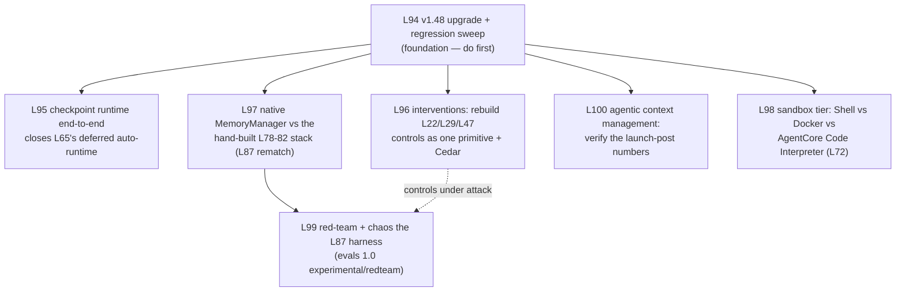

# Impact Evaluation — Ecosystem Delta v1.42 → v1.48 vs the Lesson Plan (L1–L93)

**Date:** 2026-07-18
**Input:** [ecosystem delta report](docs/work/research/reports/2026-07-18_strands-ecosystem-delta-v142-to-v148.md)
(code-level evidence + external coverage). This document evaluates what the delta invalidates,
what it reframes, and how to extend the plan (proposed Tier 22, L94+).

## 1. Verdict in one paragraph

Nothing in the delta breaks the repo's findings; almost everything in it **reframes** them. The
SDK shipped first-party versions of five capabilities this repo built by hand (memory, unified
control, sandboxing, storage, agentic context management). That converts the existing levels from
"how to build X on Strands" into the **mechanism layer under the new primitives** — and it makes
the highest-value next lessons comparative: hand-built vs vended, measured with the eval machinery
this repo already owns (L83–L92). Three recorded claims are stale and need correction; a handful
of recorded baselines are subject to silent drift; the fundamentals (L1–L13, orchestration L41–L50,
ADK patterns L77) are untouched — the delta confirms Swarm/Graph/interrupts are stable.

## 2. Corrections forced on existing docs (applied with this commit)

| Doc | Stale claim | Correction | Status |
|-----|------------|------------|--------|
| `docs/levels/L65-experimental-checkpoint.md` | "checkpoint is TYPES-ONLY" | True at 1.42; wired runtime with `checkpointResume` at 1.43+ (delta §1) | **Fixed** — note added |
| `docs/levels/L39-typescript-sdk.md` | "A2A not supported in TypeScript" | Wrong even at ts v1.4 — module predates it (delta §5) | **Fixed** — note added |
| `LEARNING_PLAN.md` Deferred table | "Managed Harness … still blocked" | AgentCore Harness announced GA at Summit NY 2026 (delta §9, [2]) | **Fixed** — marked GA-announced, SDK surface unverified |
| `docs/levels/L61-token-counting.md` | "the v1.42 path is chars/4" | **L61 was RIGHT** — L94 re-probe confirmed chars/4 is unconditional at 1.48 even with tiktoken installed; the delta report's tiktoken-first claim was a docstring-read, now corrected. | **Resolved (L94)** |

## 3. Baseline-drift risks (no action until re-run, but recorded)

- **strands-evals default judge is now Claude Sonnet 4.6** and reports are always flattened.
  Any *absolute* scores recorded by L35/L52/L91-adjacent runs are not comparable to fresh runs
  without pinning the judge model. Our own `tools/eval_harness.py` is unaffected (custom, judge
  pinned per lesson), which is itself a vindication of building it.
- **strands-agents-tools behavior changes** (0.8.x): `http_request` default timeout, `load_tool`
  confirmation gate, calculator sympify rejection, env-var precedence. Lessons that shell into
  these tools may behave differently after a dep bump — L94's regression sweep covers this.
- **Dependency ranges**: SDK 1.48 pins `litellm <=1.91.1`; our stack runs LiteLLM as an external
  proxy container so runtime is insulated, but `uv sync` conflicts are possible on upgrade.
  `LocalMemoryStore→TestMemoryStore` and mistralai 2.x breaks touch nothing we import.

## 4. What does NOT change

L1–L13 fundamentals; L18–L20 and L41–L46 orchestration (Swarm 9-line diff, GraphBuilder
backward-compatible); L51–L56 methodology levels (Fowler/ThoughtWorks material is
version-independent); L77 ADK patterns (verified cross-model, primitives unchanged); L83–L92
eval methodology (the evals GA kept the classic API — verified in source). The repo's two
theses got *upstream confirmation*: the trust-boundary thesis (tools 0.8.x shipped five releases
of pure attack-surface removal) and the determinism-is-architectural thesis (checkpoint/interrupt/
cancel now a formal stop-reason state machine).

## 5. Proposed extension — Tier 22: The Platform Convergence (L94–L100)

Method unchanged: probe-first, anti-simulation (runtime sentinels, positive/negative controls,
`no_sim_check`), N≥5 multi-run where scores are claimed, cross-model validation for
model-sensitive findings, `/reflect` per level. Each level below names its empirical success
criterion the way `LEARNING_PLAN_agentic_memory_evals.md` did.

### L94 — SDK v1.48 upgrade + regression sweep (foundation, do first)
- **Closes:** the version gap; the L61 discrepancy; upgrade risk from §3.
- **Empirical objective:** bump `strands-agents` to 1.48 (+ tools 0.8.4, agentcore 1.18.1,
  evals 1.0.2), `uv sync` clean, `uv run pytest` green, `no_sim_check` clean, and a smoke pass
  over one lesson per tier.
- **Verify:** (a) re-probe `count_tokens` with and without tiktoken installed — settle whether
  L61's "chars/4" was an environment artifact, then correct whichever doc is wrong, citing the
  probe; (b) confirm the three tracked stop-reason literals and `AgentResult.checkpoint` exist at
  runtime, not just in source. **Guardrail:** any lesson that breaks gets a cited cause (the §3
  behavior list is the suspect pool), not an exclusion — the L27-era `uv sync` lesson applies.

### L95 — Checkpoint runtime end-to-end
- **Closes:** L65's deferred auto-runtime ("needs Temporal" is no longer the only path).
- **Empirical objective:** an agent checkpoints at `after_tools`, the process is killed for real,
  a fresh process resumes via `checkpointResume` and completes without re-running finished work.
- **Verify:** runtime sentinel written before the kill is present after resume; completed tool
  calls are not re-executed (call-count assertion); demonstrate interrupt > checkpoint > cancel
  precedence with all three raised in one run. **Guardrail:** real `kill -9` across OS processes
  (the L79/L82 discipline), and pair with a `SessionManager` since `Checkpoint` carries position
  only — assert that a checkpoint WITHOUT a session manager fails to restore state (negative
  control).

### L96 — Interventions: the control plane unified
- **Closes:** four separately-built control stories (L22 guardrails, L29 steering, L33 Cedar,
  L47/L70 HITL) now have one first-party primitive.
- **Empirical objective:** one `InterventionHandler` set reproduces the L22/L29/L47 behaviors:
  `Deny` a forbidden tool, `Guide` a misdirected call, `Confirm` a high-stakes call via human
  input, `Transform` a malformed argument; plus `CedarAuthorization` enforcing a per-user policy
  in-process (contrast with L33's gateway-side Cedar).
- **Verify:** positive/negative controls per action — the denied call must NOT execute (side-effect
  sentinel absent), the transformed argument must be the executed argument (echo the received
  bytes). **Guardrail:** don't re-use L22's prompt-level checks as the mechanism — the point is
  enforcement below the model. Cross-model: `Guide` acceptance is model-sensitive → second model.

### L97 — Native MemoryManager vs the hand-built stack (the L87 rematch)
- **Closes:** the biggest open question the delta created: does `Agent(memory_manager=...)` match
  the hand-built L78–L82 architecture on outcomes?
- **Empirical objective:** run the L87 capstone eval (identical task, identical judge, N runs,
  permutation significance) three-way: memoryless baseline vs L78-era hand-built stack vs native
  `MemoryManager` with `TestMemoryStore`, then with `BedrockKnowledgeBaseStore`.
- **Verify:** goal-success with CIs for all three arms; inspect the injection mechanism —
  memory arrives as `<memory>` XML in the last user message, so assert prompt-injection behavior
  through memory (a poisoned memory record) and measure whether extraction triggers (default
  every 5 turns) lose in-window facts (sentinel written at turn 1, killed at turn 4). **Guardrail:**
  same L87 rule — arms identical except the memory system. Cross-model: extraction quality is
  model-sensitive → Nova/second model pass.

### L98 — The sandbox tier: Shell vs Docker vs managed
- **Closes:** L24's ad-hoc sandboxing and L72's single-option view; the new three-tier reality
  (in-process Strands Shell, local `DockerSandbox`, cloud AgentCore Code Interpreter).
- **Empirical objective:** one task battery (file ops, grep/sed pipeline, a network call, a
  secret-exfiltration attempt) across all three tiers; measure cold-start, per-command latency,
  and isolation outcomes.
- **Verify:** the marketing claims become measurements: Shell sub-ms cold start vs Docker ~200 ms
  (real timings, p50/p95); the SSRF guard and URL allowlist must actually block a real disallowed
  `curl` (positive control: allowed URL succeeds); the injected-secret must be usable by the tool
  but absent from anything the agent can read (runtime sentinel as the secret). **Guardrail:**
  `strands-shell` is a new dependency — probe-first (`_sandbox/probe_l98_shapes.py`), and the
  exfil attempts are the same real-attack discipline as L89.

### L99 — Red-team and chaos the memory-backed harness
- **Closes:** NEXT_STEPS item 3 (memory safety/privacy evals) using first-party attack machinery
  instead of hand-rolled; extends L89 from one injection to a suite.
- **Empirical objective:** `RedTeamExperiment` (Crescendo, GOAT, PAIR, SequentialBreak) against
  the L87/L97 harness; chaos-resilience evaluators (failure-communication, partial-completion,
  recovery-strategy) under injected tool faults; memory-poisoning arm feeding attacks through the
  memory store.
- **Verify:** the L89 rule generalized — every attack channel proves itself on a deliberately
  vulnerable positive-control agent before a resistance claim is recorded; attack-success rates
  reported with CIs; judge pinned explicitly (Sonnet 4.6 default noted per §3). **Guardrail:**
  `experimental/redteam` namespace — pin the exact evals version in the reflection. Cross-model:
  attack success is model-sensitive by definition → both models.

### L100 — Agentic context management: verify the launch numbers
- **Closes:** L15/L53's manual machinery vs `context_manager="agentic"` and `"auto"`; the repo's
  "verify the marketing" signature applied to the launch post's ~55% token / 68%→98% accuracy
  claims [delta §9, source 1].
- **Empirical objective:** a long-horizon task run three ways (no management, `"auto"`,
  `"agentic"`), measuring tokens, cost, and task accuracy, N≥5.
- **Verify:** report OUR numbers next to the launch post's numbers, whatever they show — an
  honest negative here is as publishable as a confirmation (the L26/L89 tradition). **Guardrail:**
  the `<context-status>` middleware and compression tools must be observed in the trace (the
  model actually called `summarize_context`), not assumed.

### Explicitly deferred (with reasons)
- **AgentCore Managed KB / Web Search / Harness GA / AWS Context** — announcement-level only;
  no verified Python SDK surface yet beyond `KnowledgeBaseClient` (which L97's KB-store arm
  already exercises). Revisit when the AWS Events breakout recordings land (August re-check,
  delta §9) and the SDK surface is probeable.
- **a2a `agent_factory` multi-tenancy** — real bug class, small scope; fold into L96 as an
  iteration (a shared-agent A2A server leaking one caller's context to another is a control-plane
  failure) rather than a standalone level.
- **Unified `Storage` protocol** — too thin alone; exercised implicitly by L95 (session/checkpoint
  persistence) and L98 (offload backends).
- **Judge-reliability meta-eval at the ambiguous boundary** — still open from NEXT_STEPS; not
  displaced by the delta, and L99's pinned-judge discipline feeds it. Keep as its own future level.

## 6. Sequencing and cost profile

1. **L94** first — everything else assumes the new versions (zero-friction, local).
2. **L95, L96** next — zero-friction, local, high doc-debt payoff (they close L65's and the
   control track's open loops).
3. **L97, L99** — the flagship pair; moderate model cost (N-run evals); needs F1-style AgentCore
   Memory/KB provisioning for the KB arms.
4. **L98** — needs `strands-shell` + Docker locally; AgentCore Code Interpreter arm reuses L72.
5. **L100** — cheap, high narrative value (verify-the-marketing).

CI/pre-commit gates (NEXT_STEPS item 1) remain infrastructure work, not a level — unchanged.
