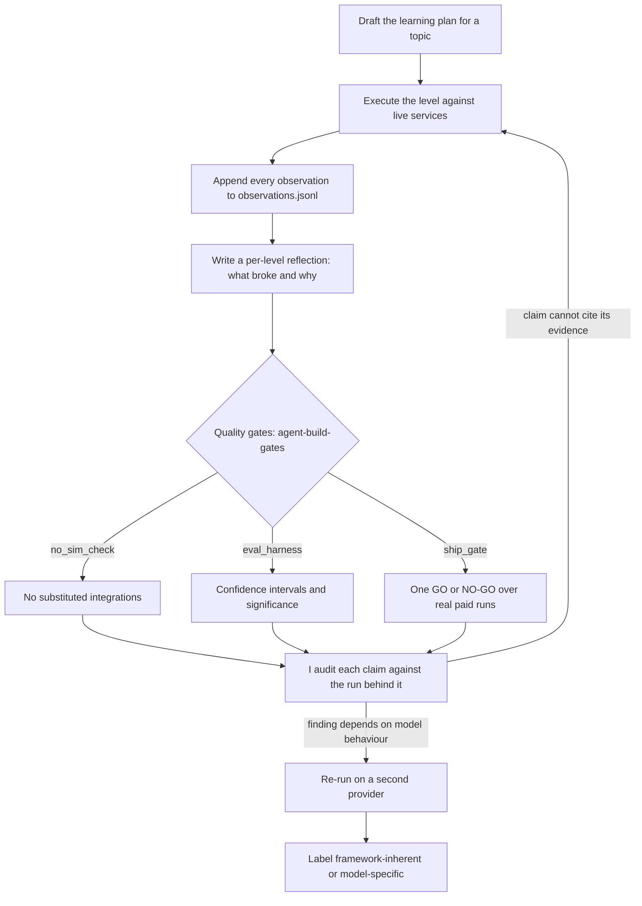

# The method

This repo has two outputs. One is 101 lessons on the Strands Agents SDK. The other is the
way they were built: an AI agent directed through a months-long engineering programme with
evidence standards enforced by tooling rather than trust.

The second one is the part that transfers. It does not depend on Strands, on AWS, or on
which model you use. This document is that method, written down in one place so nobody has
to reconstruct it from 101 reflections.

## The loop

My role is the `Audit` box. Everything upstream of it is the agent's, and everything
downstream is a rule the agent has to satisfy before I accept a finding.

## 1. The instruction set is the product

`CLAUDE.md` is not documentation. It is the steering mechanism, and it is the file I spent
the most time on. It carries three kinds of content, and the split matters:

- **Runtime facts the agent cannot guess.** The proxy runs under Podman, not Docker. Use
  `OpenAIModel` with a `base_url`, not `LiteLLMModel`. Create a fresh `Agent` per thread.
  Each of these cost a debugging session before it became a line in the file.
- **Rules with their reason attached.** "Probe a new AWS service before writing against it"
  is followed by "(Lesson: L33, 8 failures)". A rule without its scar tissue gets rationalised
  away by the next agent that finds it inconvenient.
- **Standards that are checkable.** Anything that can be enforced by a script is, and the
  file points at the script.

The test of an instruction set is whether a fresh agent, given only that file, makes the same
choices. Instructions that get ignored are usually instructions with no consequence attached.

## 2. Structurally un-fakeable, not "please do not fake it"

The single largest failure mode in agent-built work is a lesson that looks complete and never
touched the service it claims to demonstrate. Asking for honesty does not fix this. Making the
work impossible to fake does.

Each lesson has to be un-fakeable by construction:

- **Runtime sentinels.** A value only the real service can produce. A message id assigned by
  SQS. An `ApproximateReceiveCount` that increments because a real queue counted receives.
  If the output could have been typed by hand, the test proves nothing.
- **Real failure.** The durability lessons kill a real process with SIGKILL and resume from
  a checkpoint. A printed `[Simulated crash]` is not a crash.
- **Paired positive and negative controls.** Every evaluator gets an input it must flag and
  an input it must pass. An evaluator that only ever sees passing input is untested.
- **A script that says no.** `agent_build_gates.no_sim_check` scans for substituted integrations and
  fails the build. `agent_build_gates.check_no_aws_ids` blocks account identifiers from tracked files.
  Both run in CI on every push and in the pre-commit hook over staged files.

The discriminator that took the longest to articulate, and which now does most of the work:
**was a real call available and skipped?** A helper that genuinely raises to drive a recovery
path is fault injection, and legitimate. Code that fabricates a success for a call it could
have made is not. That single question separates a deliberately failing test fixture from a
lie, and it is the question to ask of every hit the scanner reports.

## 3. Nothing counts until it is labelled by provider

Agent behaviour varies by model, so a finding from one model is a hypothesis, not a result.
Every model-sensitive finding was re-run on a second provider before I recorded it:
Bedrock Claude Haiku 4.5 for the orchestration patterns, Bedrock Nova Lite for the memory and
evals tracks. Each finding then carries a label:

- **Framework-inherent**: it held on the second model, so it is a property of the framework.
- **Model-specific**: it did not, so it is a property of that model.

This is not bookkeeping. It changed conclusions. The security work found that an explicit
deny-policy defends the memory channel on both Gemini and Nova, so the defence is
framework-inherent. But raw injection susceptibility differs sharply between them, so the
attack-success rate is model-specific and cannot be quoted as a framework number. Without the
second run, those two would have been reported as one finding, and the wrong one.

A capability failure on the weaker model is recorded as a capability failure, not counted
against the framework.

## 4. One run is an anecdote

Every quality claim goes through `agent_build_gates.eval_harness`: at least five runs, Wilson
confidence intervals on the rate, and a permutation test against a frozen baseline before any
regression is called. `agent_build_gates.ship_gate` composes that into a single GO or NO-GO verdict
over real paid runs, and writes the verdict plus the underlying runs to a JSON artifact so the
decision can be re-examined later.

Two things this discipline caught that intuition did not. Setting temperature to 0 does not
make agent runs reproducible once tools and multi-turn state are involved; typed structured
outputs and capped loops did far more for stability than any sampling setting. And trajectory,
meaning which tools were called in what order with what arguments, is where the failures
actually live, not in the final answer, which is why the evals grade the trajectory.

## 5. Keep the negative results

Findings that went the other way are in the repo with the runs behind them. Gemini 2.5 Flash
was robust to a blatant prompt injection I expected to succeed. Adding more retrieval sources
did not improve answer quality. Native memory initially looked worse than the hand-built
stack, and a fair rematch with a comparable store showed full parity, so the first result was
about the test store rather than the abstraction.

An agent-built corpus with no negative results is not a corpus of findings. It is a corpus of
things the agent was willing to claim.

## 6. Test the thing that does the testing

The clearest illustration of the method is the time it caught itself, and it is worth stating
plainly because it went unnoticed for months.

`no_sim_check` is the tripwire the entire anti-simulation standard rests on. It had no
tests. A tripwire with no test proving it fires is exactly the unevidenced claim this repo
bans everywhere else, and it sat that way while enforcing standards on 101 lessons.

Giving it the same paired controls it demands of every evaluator exposed failures in both
directions at once. It fired on comments describing deliberate fault injection, which is why
it was never wired into CI: it reported 133 hits and would have failed on day one. It also
missed `class MockSQSQueue` and `mock_client` entirely, because `\b` does not match before a
capital or an underscore, so the substituted integrations it existed to catch were invisible
to it while their docstrings tripped it.

Repairing it took repo-wide hits from 133 to 56. Triaging the survivors one function at a time
took it to zero and surfaced nine real substituted integrations. The worst was a Bedrock
guardrail that fell back to a five-keyword blocklist whenever the client was missing or the
API errored, so a safety control answered ALLOW when the service was merely unreachable, and
the caller could not tell an approval from an outage.

The lesson generalises past this repo. Enforcement tooling accumulates authority precisely
because nobody checks it, and its false negatives are silent by construction. Measure the
precision and recall of your own gates before you trust a green run, and treat the gate as
code that needs tests rather than as the thing that tests code.

## 7. Keep the exhaust

The scripts written to settle a question are worth more than the answer they produced. An
answer is a sentence someone has to trust. The script is the technique, and it can be re-run.

`_sandbox/` holds 100-odd of these, and they are tracked deliberately rather than swept up.
Four from the gate-repair work show the range:

- `probe_l23_moto_sqs.py` asked whether moto implements SQS `RedrivePolicy` redrive and
  visibility timeouts before the L23 rewrite was allowed to depend on it. It still runs, and
  still prints the receive-count progression that answered the question.
- `triage_no_sim_hits.sh` is the classification record for the anti-simulation triage. Every
  edit is grouped under the verdict that justified it, so the reasoning survives with the
  change instead of living in a commit message.
- `fix_em_dashes_root_docs.sh` and `fix_em_dashes_plan_docs.sh` record which replacements
  needed a comma rather than a colon, and why, including the one ASCII diagram line that had
  to be repadded so the box still aligned.

The rule this follows: **probe before you build, and keep the probe.** `CLAUDE.md` already
requires probing a new AWS service before writing against it, because guessing API shapes cost
more time than probing did (L33, eight failures). Discarding the probe afterwards throws away
the only durable evidence of how the question was settled, and the next person, or the next
agent, has to infer it again from the code that survived.

Scratch directories are where this goes wrong. Work written to `/tmp` disappears, and with it
the demonstration that a capability was checked rather than assumed.

## What is written down where

| Artifact | Where |
|---|---|
| The instruction set that steers the agent | `CLAUDE.md` |
| Raw append-only observation log, roughly 900 entries | `.claude/learnings/observations.jsonl` |
| Per-level write-ups, including what went wrong | `.claude/learnings/reflections/` |
| Probes and one-off scripts, kept so the technique survives | `_sandbox/` |
| The gates, installable, with their tests | `packages/agent-build-gates/` |
| Enforcement on every push | `.github/workflows/gates.yml` |
| Forward work, and the record of what has landed | `NEXT_STEPS_PLAN.md` |
