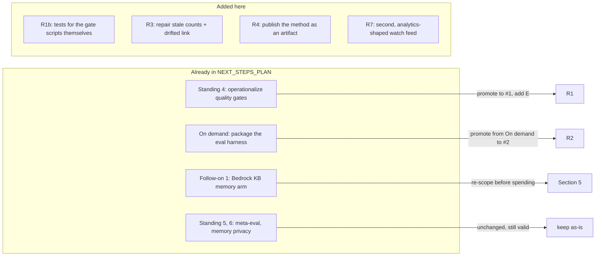

# Mission Assessment (2026-08-26)

An outside read of this repo against **its own stated mission**, not against surface
coverage. Written at HEAD `97e759e` (last commit 2026-07-19, clean tree).

This document does **not** replace `NEXT_STEPS_PLAN.md`, which remains the source of truth
for forward work. It re-prices several items already in that file and adds three that are
not in it. Section 6 maps the two.

Every claim below carries the command that produced it, so it can be re-run and refuted.

---

## 1. The mission being assessed

Verbatim from `README.md`:

> The repo therefore serves two purposes: a reference implementation of Strands patterns I
> can reuse in future projects, and a worked example of directing an AI agent through a
> months-long engineering programme with evidence standards enforced by tooling rather
> than trust.

Call these **P1 (reusable reference implementation)** and **P2 (worked example of
agent-directed engineering with tooling-enforced evidence standards)**.

Both are currently underserved, and for the same structural reason: the value lives in
roughly 14KB of `tools/` plus an undocumented method, and both are buried under 100 lesson
directories.

---

## 2. Headline recommendation

**Stop adding levels.**

L101 adds nothing to P1 or P2. The ladder has already proved the method across 100 levels,
two model providers and a full ecosystem-delta cycle. Marginal return on the next lesson is
near zero; every item in section 4 is worth more.

---

## 3. Evidence

### 3.1 The enforcement claim in P2 does not currently hold

| Check | Command | Result |
|---|---|---|
| CI exists | `ls -la .github` | `No such file or directory` |
| What pytest actually covers | `uv run pytest --collect-only -q` | **21 tests collected, all from `_sandbox/test_normalize_jsonl.py`** |
| Other test files on disk | `find . -path ./.venv -prune -o -name 'test_*.py' -print` | 2 files: the `_sandbox` one above, and `10_production/l27agentcore/test/test_main.py`, which pytest did **not** collect |
| Tests covering the gates | (from the collect list) | **zero** tests exercise `tools/no_sim_check.py`, `tools/eval_harness.py` or `tools/ship_gate.py` |

> **Update, same day.** R1's test half is done for one gate: `tests/test_no_sim_check.py` now carries
> 56 tests, and the suite collects 77. Writing them proved the point of this section immediately, the
> gate had both poor precision (fired on prose describing deliberate fault injection) and poor recall
> (`class MockSQSQueue` and `mock_client` were invisible to it). Repairing it took repo-wide hits from
> 133 to 56 and surfaced six genuine substituted integrations in L23, all since replaced with real
> calls. `eval_harness.py` and `ship_gate.py` remain untested, and there is still no CI.
| Automated guard in place | `cat tools/install_hooks.sh` | one pre-commit hook, `check_no_aws_ids` only, installed by hand per clone |

Three consequences:

1. `README.md` advertises `uv run pytest # tests` as a quality gate. It exercises a
   scratch JSONL normaliser and nothing else in the repo.
2. `no_sim_check.py` is a tripwire with **no test proving it fires**. That is precisely the
   unevidenced claim this repo bans everywhere else. The gate asserting that lessons are
   un-fakeable is itself unverified.
3. "Enforced by tooling rather than trust" is true on one machine, for one of the four
   checks. For every clone, P2's central claim is enforced by trust.

### 3.2 P1 is blocked by packaging, not by content

```
tools/eval_harness.py    6599 bytes
tools/ship_gate.py       4360 bytes
tools/no_sim_check.py    3282 bytes
tools/check_no_aws_ids.py 3042 bytes
tools/models.py          4348 bytes
```

Around 14KB of gate code carries the entire methodological claim. `pyproject.toml` declares
`name = "aws-agent-learning"` with no packaging of `tools/` for external consumption. So
"reuse in future projects" today means copy-paste out of a learning repo, which is the exact
friction P1 exists to remove.

`NEXT_STEPS_PLAN.md` files "Package the eval harness for external use" under **On demand**.
That is mispriced. It is not an optional extra; it is P1.

### 3.3 The front door understates the work

| File | Says | Actual |
|---|---|---|
| `README.md:3` | "93 levels" | L1 to L100 plus L97b |
| `CLAUDE.md:9` | "**Status**: 93 levels (Dec 2025 to Jun 2026)" | Tier 22 (L94 to L100) complete 2026-07-19 |
| `CLAUDE.md:53`, `CLAUDE.md:148` | "`docs/levels/` ... L01-L93" | `ls docs/levels \| wc -l` returns **101** |
| `LEARNING_PLAN.md:10` | "Proposed next tier (L94–L100)" | `NEXT_STEPS_PLAN.md` records "Tier 22 COMPLETE ... all on `origin/main`" |

The public repo (`github.com/snymanpaul/aws_agent_1`) therefore understates itself by eight
levels, and `CLAUDE.md` gives any agent working here a stale map of its own scope.

### 3.4 One external link has drifted

`docs/levels/L43-agent-sops-natural-language-workflow-spe.md:53` links to
`https://docs.aws.amazon.com/aws-mcp/latest/userguide/agent-sops.html`, marked verified.

```
curl -sL -o /dev/null -w '%{http_code} %{url_effective}\n' \
  https://docs.aws.amazon.com/aws-mcp/latest/userguide/agent-sops.html
200 https://docs.aws.amazon.com/agent-toolkit/latest/userguide/
```

The whole `aws-mcp` documentation set was rebranded to **Agent Toolkit for AWS**; that
specific page no longer resolves and the redirect lands on the guide root.

---

## 4. Recommendations, in priority order

### R1. Make the enforcement real (serves P2, closes 3.1)

- Add `.github/workflows/` running, on every push: `tools/check_no_aws_ids.py`,
  `tools/no_sim_check.py` over the repo, and `uv run pytest`.
- Write paired **positive and negative** fixtures for each gate script. `no_sim_check` needs
  a file it must flag and a file it must pass. This is the same positive/negative control
  discipline already applied to every evaluator in the evals track; apply it to the gates.
- Extend `tools/install_hooks.sh` so the local hook runs `no_sim_check` alongside
  `check_no_aws_ids`, matching what CI enforces.
- Keep `ship_gate.py` manual, since it spends money, but document it as a named release step
  rather than folklore.

This is `NEXT_STEPS_PLAN.md` standing item 4, promoted to first position, plus the gate-test
requirement, which is not currently in that file.

### R2. Extract `tools/` as a versioned, installable package (serves P1, closes 3.2)

> **Done, 2026-08-26.** `packages/agent-build-gates` v0.1.0: the four gates with their own
> version, tests and console scripts (`no-sim-check`, `check-no-aws-ids`, `ship-gate`), wired
> into the root as a uv workspace member. Zero third-party dependencies; `ship_gate` sits
> behind a `[strands]` extra. Proven by building the wheel and running both gates from a
> clean venv outside the repo, which is what forced the one real code change: the
> account-id tripwire used to resolve paths against its own location, correct at `tools/`
> and wrong from site-packages. It now resolves against the caller's working directory,
> and has 18 tests it never had before.

Publish the harness, the gate and the tripwires as a small library with its own version and
tests, consumable by other repos without vendoring. The lesson tree becomes the worked
example that exercises it, rather than its container.

This is `NEXT_STEPS_PLAN.md` "On demand" item, repriced to second position, because it is the
literal content of P1.

### R3. Repair the front door (serves both, closes 3.3)

Correct the level counts and tier status in `README.md`, `CLAUDE.md` and `LEARNING_PLAN.md`.
Fix the drifted L43 link to the Agent Toolkit guide. For a repo whose thesis is evidentiary
discipline, a stale headline is the most expensive cheap defect in it.

### R4. Publish the method as its own artifact (serves P2)

P2 is the more original of the two purposes, and no reader will reconstruct it from 100
reflections. The transferable piece is short and already exists in fragments:

- the instruction set that steers the agent (`CLAUDE.md`)
- the anti-simulation bar and what makes a lesson structurally un-fakeable
- the cross-model labelling rule (framework-inherent versus model-specific)
- the statistical gate (Wilson CIs, permutation significance) and the single GO/NO-GO verdict
- the negative results that were kept rather than buried

Write that as one standalone document. It is the part nobody else has, and it is what makes
this repo useful to someone who never touches Strands.

### R5. Reframe the front door from ladder to method (serves both)

The structure and naming signal "tutorial series". The contribution is a way of working.
That mismatch is why the strongest asset in the repo is the least visible one.

### R6. Only then resume levels, and few of them (serves P1)

If lesson work restarts, the data plane is the right next axis, but as three or four
high-value levels rather than another tier of seven:

1. **AgentCore Gateway.** The one platform primitive never built here. L33 depends on it
   conceptually and L75 touched a Gateway ARN, but no level created one. It is also where
   Cedar Policy intercepts tool calls, so it extends the L33 versus L96 comparison directly.
2. **The managed AWS MCP Server**, run under the L56 secure-MCP lens and L50 toxic-flow
   analysis. Note that `.mcp.json` currently declares one server (`graphiti-memory`, local),
   so this repo has MCP theory and no AWS MCP practice.
3. **Trajectory evals (L83) ported to a data agent**, where the trajectory is catalog chosen,
   table resolved, join path taken and filters applied before aggregation. Highest value of
   the three, because ground truth is a checkable row count rather than a judge's opinion.

### R7. Add a second watch feed (serves both)

The 2026-07-18 ecosystem delta is rigorous but SDK-shaped, and says so:

> platform-level additions invisible at the SDK layer of this report

A second, analytics-shaped feed (Glue, Athena, S3 Tables, Lake Formation, and the dated
SageMaker Unified Studio release-notes page) would catch what that one is built to miss.

---

## 5. Spend note

`NEXT_STEPS_PLAN.md` follow-on 1, the authentic `BedrockKnowledgeBaseStore` memory arm, is
billable and teardown-critical, and it has been partly overtaken. AWS Context and AWS Glue
Data Catalog business context are the organisation-scale version of that same question, and
Amazon S3 Annotations plus S3 Metadata offer a cheaper, non-provisioned way to test grounded
retrieval against real object context. Worth re-scoping before spending on it.

---

## 6. Relationship to `NEXT_STEPS_PLAN.md`



Items in `NEXT_STEPS_PLAN.md` not mentioned here (full chaos-resilience evaluators, judge
reliability at the ambiguous boundary, memory privacy and tenant isolation, cloud ADOT
online-eval, the L97b `971` data-hygiene note) are unaffected by this assessment and remain
valid as written.

---

## 7. Provenance

Produced 2026-08-26 by reading this repo directly plus a landscape survey of AWS data
engineering built from primary AWS sources on 2026-08-25. The two supporting documents live
outside this repo, in `~/Code/aws_data_engineering/docs/`:

- `aws-data-engineering-landscape.md`, the grounded survey
- `assessment-aws-agent-1-cross-reference.md`, the layer-by-layer coverage map behind R6
  and R7

Nothing in this file is asserted from model memory. Claims about AWS services are sourced in
those two documents; claims about this repo carry their command in section 3.
