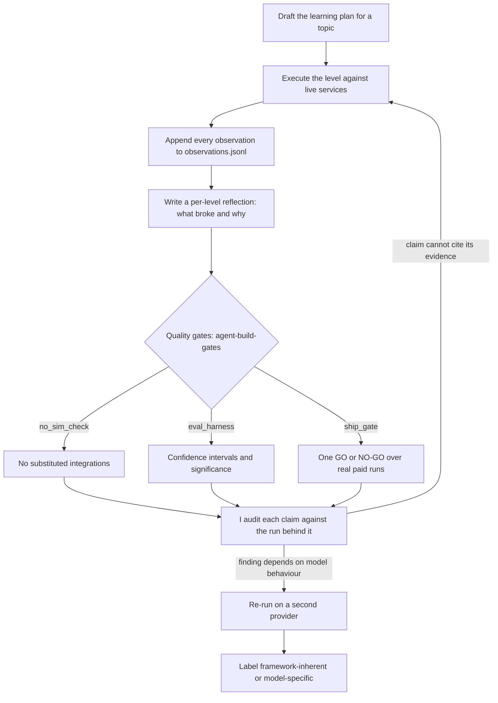

# AWS Strands Agents Learning Project

A worked example of directing an AI agent through a months-long engineering programme, with evidence standards enforced by tooling rather than trust. The evidence is 101 levels on the AWS Strands Agents SDK (L1 to L100, plus L97b), built December 2025 to July 2026, from a basic agent up through multi-agent orchestration, agentic memory, agentic evals, and the AWS AgentCore platform.

**The method is written up in [`METHOD.md`](METHOD.md).** That is the part that transfers, and it does not depend on Strands, on AWS, or on which model you use. The rest of this file is the ladder that produced it.

Every lesson runs live against real services, with no substituted integrations and no hardcoded success paths. `agent_build_gates.no_sim_check` is the gate for that, and the repo now clears it: 0 hits across the 275 Python files it scans, down from 133 when the gate was first tested. CI runs that gate, the AWS-account tripwire and the 129-test suite on every push, so the standard holds for every clone rather than on my machine. Findings that depend on model behaviour were re-run on a second provider before I recorded them as findings.

## How this was built

I did not hand-write 101 lessons, and I am not going to pretend otherwise. The engineering here sits one level up. I used Claude Code as the build harness and taught it, through an iterated instruction set, to draft the learning plan for the topic, execute each level against live services, append every observation to a raw log, and write a per-level reflection covering what broke and why. My role was direction and quality control: setting the anti-simulation bar, auditing claims against the runs behind them, sending back work that could not cite its evidence, and deciding which findings needed validation on a second model before they counted.

The working parts of that method are all in the repo. The instruction set that steers the agent is `CLAUDE.md`. The raw observation log is `.claude/learnings/observations.jsonl`, roughly 900 append-only entries. The per-level write-ups are in `.claude/learnings/reflections/`. The quality gates the agent has to pass are in `packages/agent-build-gates/`, extracted so they can be installed into other projects.



The repo therefore serves two purposes: a reference implementation of Strands patterns I can reuse in future projects, and a worked example of directing an AI agent with evidence standards enforced by tooling rather than trust. [`METHOD.md`](METHOD.md) is the second one in full: the instruction set, what makes a lesson un-fakeable, the cross-model labelling rule, the statistical gate, and the time the method caught its own tooling.

## What came out of it

**Provider portability.** Google's Agent Development Kit (ADK) ships a dedicated class per orchestration pattern. Strands covers the same eight patterns (sequential, coordinator, parallel, hierarchical, generator-critic, iterative refinement, human-in-the-loop, composite) with a few primitives: Graph with conditions and cycles, Swarm, and agents-as-tools. I rebuilt all eight on Strands and ran them on Gemini 2.5 Flash and on Bedrock Claude Haiku. The patterns held on both models. The Bedrock run traces are committed in `artifacts/adk_patterns/`.

**Reproducibility.** Setting temperature to 0 did not make agent runs reproducible once tools and multi-turn state were involved. Typed structured outputs, capped loops, and explicit guard conditions in the control flow around the model did far more for run-to-run stability than any sampling setting.

**Anti-simulation enforcement.** `no-sim-check` flags substitute-object vocabulary, fake-success returns, deferral comments, and a `return True` straight out of an `except`. The tests themselves are built so they cannot pass by accident: runtime sentinels that only the real service can produce, real process crashes for the durability lessons, and paired positive and negative controls on every evaluator.

The gate itself went untested for most of its life, and so were `eval_harness` and `ship_gate`, which decide what counts as a passing run. When I finally gave all three the positive and negative controls they demand of every lesson (129 tests), the anti-simulation gate turned out to be wrong in both directions. It fired on comments describing deliberate fault injection, and it missed `class MockSQSQueue` and `mock_client` completely, because `\b` does not match before a capital or an underscore.

Repairing it dropped repo-wide hits from 133 to 56. Triaging the survivors one function at a time took it to zero and turned up nine real substituted integrations that had been invisible the whole time. The worst was a Bedrock guardrail that silently fell back to a five-keyword blocklist whenever the client was missing or the API errored, so a safety check answered ALLOW when the service was simply unreachable. The discriminator that separated the nine from the noise: was a real call available and skipped? A helper that genuinely raises is fault injection. Code that fabricates a success is not.

**Agentic memory.** The memory track (L78 onward) covers shared cross-agent memory, cross-session persistence on DynamoDB, filtered long-term retrieval on AgentCore Memory, long-horizon dynamics (consolidation, forgetting, conflict), and durable multi-agent resume after a real crash. Stores sit behind hexagonal ports so they are swappable. The capstone measured the effect: 1.00 goal success with memory against 0.00 without, p = 0.0003 by permutation test.

**Trajectory-level evals.** Most of the agent failures I hit showed up in the trajectory, meaning which tools were called, in what order, and with what arguments, rather than in the final answer. The evals track grades tool selection, ordering, and argument correctness (L83) and multi-turn goal success against real state (L84), with Wilson confidence intervals and permutation significance on every claim (L85). These compose into `agent_build_gates.eval_harness` and terminate in `agent_build_gates.ship_gate`, which produces a single audit-reproducible GO/NO-GO verdict over real paid runs.

**Negative results.** Gemini 2.5 Flash was robust to a blatant prompt injection I expected to succeed. Adding more retrieval sources did not improve answer quality. Both are documented with the runs behind them.

## Cross-model validation

Model-sensitive findings were re-run on a second provider: Bedrock Claude Haiku 4.5 for the ADK patterns, Bedrock Nova Lite for the memory and evals tracks. Each finding is labelled framework-inherent (held on the second model) or model-specific (did not). Capability failures on the weaker model are recorded as such rather than counted against the framework.

## Layout

| Area | Levels | Where |
|------|--------|-------|
| Fundamentals: agents, tools, sessions | L1 to L5 | `01_basics/`, `02_intermediate/` |
| Multi-agent: swarm, graph, debate, meta-agents | L6 to L20 | `03_multi_agent/`, `07_advanced_multiagent/` |
| Production: observability, safety, recovery, AgentCore deploy | L21 to L27 | `08_production/`, `10_production/` |
| Platform and orchestration: ReWOO, reflexion, hybrid DAGs, human-in-the-loop | L28 to L50 | `11_platform/`, `12_orchestration/` |
| Quality and evals | L51 to L56, L83 to L92 | `13_quality/` |
| Token economics and state persistence | L57 to L68 | `14_token_economics/`, `13_state_persistence/` |
| AgentCore platform: memory, registry, tools, identity, AG-UI | L66 to L76 | `14_` through `19_agentcore_*/` |
| ADK multi-agent patterns ported to Strands, verified on two models | L77 | `artifacts/adk_patterns/` |
| Agentic memory and evals, cross-model capstone | L78 to L93 | `06_memory/`, `13_quality/` |
| v1.48 ecosystem delta: upgrade sweep, checkpoint runtime, interventions, memory rematch, sandbox tiers, red-team, context management | L94 to L100, plus L97b | `12_orchestration/`, `13_quality/`, `06_memory/` |
| The gates, extracted as an installable package with its own tests | n/a | `packages/agent-build-gates/` |

ReWOO is Reasoning Without Observation, DAG is a directed acyclic graph, and AG-UI is the agent-to-frontend protocol.

Every lesson has its own doc in `docs/levels/` (one file per level, `L01` to `L100`, plus `L97b`). `LEARNING_PLAN.md` is the master index; `LEARNING_PLAN_agentic_memory_evals.md` is the track overview for the memory and evals arc. Each level also has a lessons-learned write-up in `.claude/learnings/reflections/`, including what went wrong.

## Running it

```bash
uv sync                                    # Python 3.13+, uv
uv run python 01_basics/hello_agent.py     # simplest agent
uv run pytest                              # tests
uv run no-sim-check $(git ls-files '*.py')   # anti-simulation gate
sh tools/install_hooks.sh                  # pre-commit tripwires, once per clone
```

Those three checks also run in CI on every push (`.github/workflows/gates.yml`). The lessons themselves do not: they need model credentials, a running proxy and AWS access, and several spend money.

`agent_build_gates.ship_gate` is the release step, kept manual for the same reason. Run it against a candidate before shipping:

```bash
podman start litellm-proxy
uv run ship-gate           # one auditable GO/NO-GO over real paid runs
```

Model access goes through an OpenAI-compatible LiteLLM proxy on `localhost:4000` (mine runs as a Podman container). `tools/get_model` resolves aliases to whatever the proxy serves. The AgentCore levels need AWS credentials with the policies in `10_production/l27_agentcore/iac_policy.json`.

If you are working in this repo with an AI coding agent, `CLAUDE.md` carries the runtime setup and the non-obvious rules. This README is the human overview.

## Where to start

If you came for the Strands patterns, start at [`docs/levels/L01-hello-world-agent.md`](docs/levels/L01-hello-world-agent.md) and use the table above to jump to whichever track you need.

If you came for the method rather than the framework, start with [`METHOD.md`](METHOD.md), then `CLAUDE.md` for the instruction set itself, `packages/agent-build-gates/` for the gates and their tests, and any file in `.claude/learnings/reflections/` for what a level actually cost. `MISSION_ASSESSMENT_2026-08-26.md` is an outside audit of the repo against the two purposes stated above, including where it falls short.

If you find a claim in here that the runs behind it do not support, open an issue. That is the failure mode I care about most.

## Resources

You may find these links handy:

- [Strands Agents documentation](https://strandsagents.com/latest/)
- [Strands SDK on GitHub](https://github.com/strands-agents/sdk-python)
- [Strands samples](https://github.com/strands-agents/samples)
