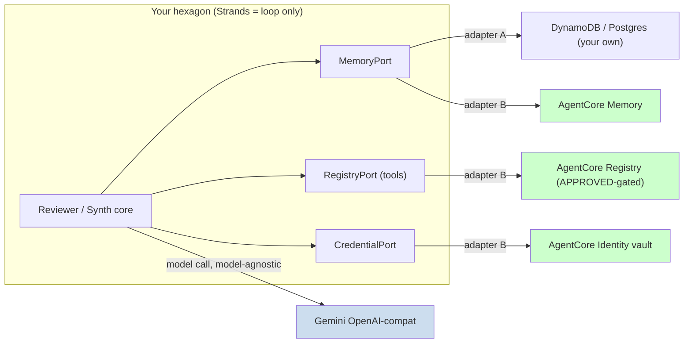
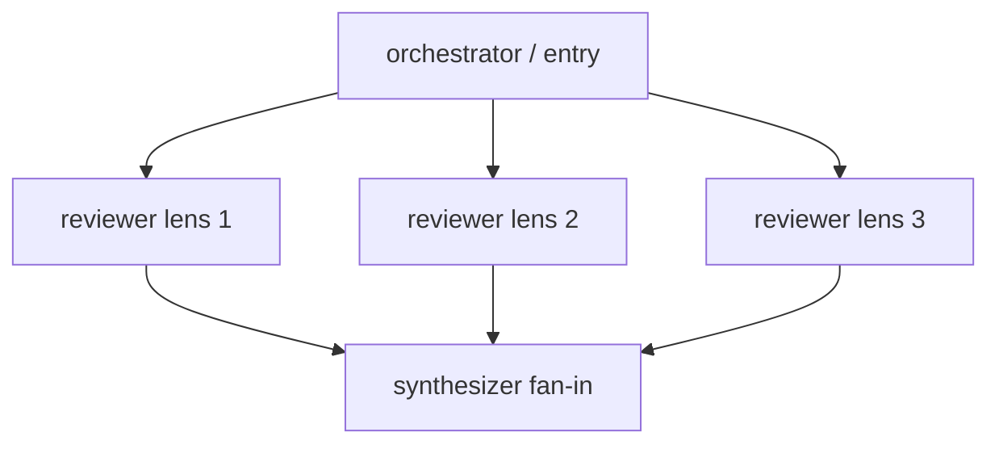

# Strands + Gemini review-gate: five architectural questions, answered empirically

**Scope:** A paid, audit-reproducible review gate built as a 3-lens reviewer "swarm" + a synthesizer, running **Strands Agent + `OpenAIModel` pointed at Gemini's OpenAI-compat endpoint** (not Bedrock). Currently tool-less, single-shot, no memory; strict-hexagonal (ports/adapters).

**Provenance:** Every claim below is grounded in a separate Strands SDK study repo that ran exactly this stack across ~76 progressive levels (Strands + `OpenAIModel`→Gemini, swarm, graph, structured outputs, AgentCore, observability), with an append-only observation log. Citations are `path:line` **into that source repo** — they are provenance, not paths in your tree. Where a behavior was *not* exercised there, it is marked **NOT VERIFIED** rather than guessed.

---

## ⚠️ Transport caveat — read this first

Your stack is `OpenAIModel` → Gemini's OpenAI-compat endpoint. The source repo ran that **same shape** (`OpenAIModel` → LiteLLM proxy → Gemini) **until 2026-06-02**, then pivoted its model helper to route Gemini through the **native `GeminiModel`** (direct to Google AI, no compat layer) — `tools/models.py:99-105`.

Consequences for trusting the evidence below:

- **Pre-pivot evidence** (esp. tool-calling, L50, 2026-03-19) is **direct evidence for your exact path**.
- **Post-pivot evidence** (recent swarm/graph/structured-output runs) is on **native `GeminiModel`**, not the compat shim — the mechanism is identical but the wire path differs.

This is why three items at the end are flagged for one-probe verification on *your* endpoint.

---

## TL;DR

| # | Question | Verdict |
|---|---|---|
| **1** | AgentCore managed services vs own ports; Bedrock-centric? | AgentCore Memory / Gateway / Identity / Registry are **pure boto3 + IAM, model-agnostic** — exercised **live with a Gemini agent**. They drop in *as adapters behind your ports*. The **only** hard Bedrock binding is the model a *deployed AgentCore Runtime container* invokes — and you don't need the Runtime to use the services. |
| **2** | Tools + bounded loop on the Gemini path | `tools=[fn]` + `@tool` on a **plain sync callable** ✓. Bound with `Limits(turns=, output_tokens=, total_tokens=)` — graceful `stop_reason`, per-invocation. Multi-step function-calling **empirically worked through `OpenAIModel`→compat→Gemini** (L50). |
| **3** | Native swarm vs hand-rolled ensemble | Four real primitives. **`Swarm` = shared memory + handoffs = cross-talk** (wrong for independent votes). **`Graph` with no edges between reviewers = true independence + parallel + fan-in synthesizer** (right). **No native majority-vote/consensus primitive** exists — a `consensus_strategy=` param you may have seen is **not real**. |
| **4** | Forced structured output to kill the silent-REVISE bug | `agent(prompt, structured_output_model=Model)` → `result.structured_output`; field validators auto-retry; hard failure raises `StructuredOutputException` (**not** a silent fallback). **But only tested with Claude — the Gemini-compat path is NOT VERIFIED.** No `response_format` anywhere. |
| **5** | Reproducibility + trace for a paid audit gate | `seed`/`thinking_budget`/`reasoning_effort` passthrough is **used nowhere** (the SDK channel exists, unexercised). The repo **never achieved determinism via params** — it used multi-run "noise-floor" gating. Trace: **`StrandsTelemetry` + OpenTelemetry** (full agent/tool spans) or `callback_handler` (lighter per-tool events). AgentCore-native observability is **not** demonstrated for trace capture. |

---

## 1. Architectural fork — AgentCore managed services vs your own ports

**Decisive finding:** AgentCore's managed services are reached over **`boto3` + IAM** against the AgentCore control/data planes — orthogonal to which LLM the agent calls. The source repo proves it by running them *while the agent's model was Gemini 2.5 Flash*:

- `14_agentcore_platform/memory_async_ltm.py:58` — `model = get_model("gemini-2.5-flash")`, then lines 79–82 build an `AgentCoreMemorySessionManager` against a **live** AgentCore Memory resource and drive a Gemini-backed `Agent`. Confirmed: `observations.jsonl:736` — *"Verified on the existing STM memory … bedrock-agentcore 1.12 + Gemini 2.5 Flash."*
- Each service is plain boto3: Registry `bedrock-agentcore-control` / `bedrock-agentcore` (`15_agentcore_registry/agent_registry.py:80-81`); Identity vault (`17_agentcore_identity/workload_identity.py:65`); Code Interpreter wired as a tool on a Gemini agent (`16_agentcore_tools/code_interpreter.py:164`).

So this is **not** "AgentCore *or* hexagonal." Each managed service slots in **as an adapter behind a port**, and works with Gemini:



**Where each AgentCore service stands, empirically:**

- **Tool registry → AgentCore Agent Registry** is real and exercised live: one catalog of `MCP | A2A | CUSTOM | AGENT_SKILLS`, lifecycle `DRAFT → PENDING_APPROVAL → APPROVED`, and **approval gates discovery** (search returns a record only once APPROVED — verified, `observations.jsonl:783`). A genuine governed catalog for a paid gate.
- **Creds → AgentCore Identity token vault** exercised live; the raw secret **never returns from the control plane** (`workload_identity.py:106-108`). Behaved correctly.
- **Persistent gold set → caution.** The repo has **no persistent gold set built on AgentCore.** The eval/dataset work found AgentCore datasets are *standalone curated resources not wired into `evaluate()`* (`observations.jsonl:720`), and **online evaluation is "platform-first"** — it only works if your agent is ADOT-instrumented and exporting to Application Signals (`level-34-reflection.md:85-93`). If "gold set" means a managed eval loop, that's a real adoption cost and is unproven here.

**The one genuine Bedrock binding** is the model a **deployed AgentCore Runtime container** invokes: `10_production/l27agentcore/src/model/load.py:20-28` returns `BedrockModel(model_id="amazon.nova-lite-v1:0")`; runtime IAM grants only `bedrock:InvokeModel` (`cdk/.../agentcore-stack.ts:221-228`). The test account was also a *"channel program account [that] cannot directly invoke Anthropic Claude … Amazon Nova models work for all account types"* (`src/model/load.py:14-15`). **Critically: every Gemini+AgentCore example calls the AgentCore *service APIs* from a local process — the repo never demonstrates a Gemini model running *inside* a deployed Runtime container.** It should work (the container just needs egress to Google's API), but it is **NOT VERIFIED**.

**Recommendation:** adopt AgentCore Memory/Registry/Identity **as adapters behind your own ports** if you want managed persistence/governance/secrets — they're model-agnostic and keep Strands as the loop, fully compatible with Gemini. **Do not** adopt the AgentCore **Runtime** purely for that, since the Runtime is where Bedrock-model and account/region constraints bite. Honest gap: the repo's own "discard the DIY DynamoDB version" verdict (archived at `10_production/_archive_hallucinated_l27/`) was framed as *fixing a hallucinated architecture*, **not** a measured DIY-vs-managed tradeoff — there is **no cost/latency/throughput comparison** to lean on.

---

## 2. Tools + bounded loop on the Gemini-via-OpenAI-compat path

**(a/b) Canonical tools — a plain sync callable wrapping your adapter is exactly the idiom:**

```python
from strands import Agent, tool

@tool
def cohort_country_lookup(country: str) -> dict:        # plain SYNC fn = your adapter
    """Look up FO-semantics for a cohort country.
    Args:
        country: ISO country name
    """
    return adapter.lookup(country)                       # wrap your port here

agent = Agent(model=model, tools=[cohort_country_lookup])
```

This is the L3 pattern verbatim — `01_basics/custom_tools.py:15,29-69` (the `get_company_info` tool is a sync function wrapping a dict lookup), wired via `Agent(model=model, tools=[...])` (`custom_tools.py:148-152`). Docstring + type hints become the tool schema. Pre-built tools work the same: `Agent(model=model, tools=[calculator, current_time])` (`01_basics/agent_with_tools.py:22-39`).

**(c) Bounding the loop — use `strands.types.Limits`** (verified in `14_token_economics/invocation_limits.py`):

```python
from strands.types import Limits
result = agent("…", limits=Limits(turns=3, output_tokens=4000, total_tokens=20000))
# graceful: result.stop_reason ∈ {limit_turns, limit_total_tokens, limit_output_tokens}
```

Each is scoped to **one invocation**, checked at the top of each loop iteration (the in-flight tool finishes, `agent.messages` stays re-invokable), priority `turns > total_tokens > output_tokens` (`invocation_limits.py:16-49`). This is your cost+determinism lever. There is **no native `max_tool_calls` knob** — bound tool volume indirectly via `turns`. Provider `max_tokens` only bounds a single model call, not the loop (`invocation_limits.py:248`).

**(d) Does function-calling work through the compat shim to Gemini? Empirically yes.** Pre-pivot (your exact `OpenAIModel`→proxy→Gemini path), L50 ran a tool-using agent on `gemini-flash` that completed a **multi-step tool chain** (`fetch_report → list_customer_records → send_notification`), with tool firings *counted*, not assumed: `12_orchestration/toxic_flow.py:407-413` + probe counter `_sandbox/probe_l50_injection.py:35-47`, result logged at `observations.jsonl:608,611` (*"gemini-flash follows all three framing types"*). Cross-model portability confirmed at L54 (gemini-flash + gpt-5-nano both 100% on the proxy path, `observations.jsonl:649`).

Caveats actually recorded — **none blame the compat transport itself:**

- LLM tool-following near a refusal boundary is **non-deterministic** (`observations.jsonl:608`) — model behavior, mitigated by probing first.
- **Model retirement breaks calls at runtime** (Gemini 2.0 Flash → 404; `observations.jsonl:733`) — pin a current model id.
- **NOT VERIFIED:** `gemini-2.5-flash` *specifically* over `OpenAIModel`→compat (the proxy-era runs used `gemini-2.0-flash`; current helper uses native `GeminiModel`). The mechanism is identical, but certainty for 2.5 on the compat shim is a one-probe verification.

Error-recovery scaffolding for retries around model/tool calls exists at `08_production/error_recovery.py` (backoff+jitter, failure classification, budget-aware retry, model-fallback chains) — model-agnostic, wraps any callable.

---

## 3. Native multi-agent primitive vs your hand-rolled ensemble

**Four real primitives exist** (all `from strands.multiagent` / A2A — not hand-rolled): agents-as-tools, **`Swarm`**, **`Graph`** (`GraphBuilder`), and **A2A** (remote agents, drop-in as local). AgentCore adds a *registry/catalog* for A2A agents but is **not** an orchestrator.

**The key distinction for independence-vs-debate:**

| Want | Use | Why (verified in the SDK source the repo runs against) |
|---|---|---|
| **Vote independence (no cross-talk)** | **`Graph`**, no edges *between* reviewers | A Graph node sees **only its incoming-edge outputs** (`graph.py:1120-1161`); sibling nodes run as **independent parallel asyncio tasks** and never see each other. |
| **Structured debate (reviewers see each other)** | **debate pattern** or **`Swarm`** | Swarm injects a `handoff_to_agent` tool into every agent and prepends *"Shared knowledge from previous agents"* to each prompt (`swarm.py:540-583,627-699`) — **shared memory by design = maximal cross-talk.** |

Your 3-lens panel maps to a **Graph diamond** — the framework-native replacement for the for-loop:



This exact fan-out/fan-in is demonstrated at `11_platform/a2a_protocol.py:275-289` and runs the branches **in parallel**. Independence is structural: no edges between R1/R2/R3 ⇒ no channel ⇒ no cross-talk (the repo's framing: *"Removing the channel eliminates the toxic flow,"* `observations.jsonl:612`).

**`Swarm` constructor** if you ever want collaborative review (note the loop-guard learned the hard way — coder↔reviewer ping-pong, FAILED 145s → COMPLETED 53s after adding it):

```python
Swarm([a1, a2, a3], entry_point=a1, max_handoffs=10, max_iterations=15,
      repetitive_handoff_detection_window=5, repetitive_handoff_min_unique_agents=3)
```

(`03_multi_agent/swarm_example.py:145-156`; `level-7-reflection.md:34-62`.)

**Does the primitive buy anything over the manual loop?** Concretely:

1. **Automatic parallel scheduling** of independent reviewers.
2. **Automatic fan-in** — the synthesizer node receives all ballots with zero plumbing (replaces external tally wiring).
3. **Built-in safety rails** (`set_max_node_executions`, timeouts).
4. **Free per-node observability** — one `MultiAgentPlugin` hooks every reviewer's lifecycle without touching agent code.
5. **Network transparency** — swap a local reviewer for a remote A2A reviewer with no topology change.

**What it does NOT buy — and a correction:** there is **no native independent-vote/consensus abstraction.** The repo's own independent-voting implementation (a "jury" of N judge models, mean-aggregated) is a **manual loop** (`13_quality/auto_evaluator_reliability.py:280-349`) — same shape as yours. And `LEARNING_PLAN.md:605-609` shows `Swarm(..., consensus_strategy="majority")` / `swarm.collaborate(...)` — **this API does not exist** (real `Swarm.__init__` has no such params; `level-7-reflection.md:25-32` logs it as a corrected hallucination). So if you adopt a primitive, adopt **Graph** for the parallelism/fan-in/observability — keep your vote tally in code.

---

## 4. Forced structured output (killing the silent-REVISE bug)

**The mechanism exists and is exactly what you want** (`05_advanced/structured_outputs.py`):

```python
result = agent("Extract the ballot from: …", structured_output_model=BallotModel)
ballot = result.structured_output      # validated Pydantic instance
```

Pydantic `@field_validator`s raise `ValueError` on bad values and **auto-retry**; exhausting retries raises **`StructuredOutputException`** (`structured_outputs.py:50-55,137-145,222,235`). That directly replaces your regex-parse: a malformed ballot becomes a **catchable exception**, not a silent `REVISE` polluting the gate.

- Use the kwarg form — `agent.structured_output(Model, prompt)` is **deprecated** (`observations.jsonl:474`).
- Strands does **not** expose OpenAI `response_format`; zero usages repo-wide.

**The honest caveat you must weigh:** in the source repo, structured output was tested **only with Claude/haiku** — a co-occurrence search for any file using both `structured_output` and Gemini returned **empty**. Whether `structured_output_model=` holds through **`OpenAIModel` → Gemini OpenAI-compat** (your transport) is **NOT VERIFIED.** This is the highest-value thing to confirm before relying on it for a paid gate. (Strands' structured output is typically implemented as a *forced tool-call* under the hood, so its reliability rides on the Q2 function-calling-through-compat result — which *did* work for Gemini.)

---

## 5. Reproducibility + trace capture for an audit-reproducible paid gate

**Seed / thinking-budget / reasoning-effort passthrough:** the repo passes **no inference params at all** through the Strands model object — `get_model()` sets only `model_id` + `client_args` (`tools/models.py:105-116`); a repo-wide grep for a model constructed with `params=` is **empty**, and `seed`/`thinking`/`reasoning_effort`/`thinking_budget` appear **nowhere**.

The SDK *channel* exists — `OpenAIModel.__init__(..., **model_config)` (an `OpenAIConfig` TypedDict that carries a `params` block) — but it was never exercised, so **treat the exact passthrough as unverified and confirm against your installed SDK version.** The only Gemini-thinking data point is an *observation* of overhead, not control: *"gemini-2.5-flash … a thinking model; ~19 reasoning tokens overhead"* (`observations.jsonl:733`).

**On determinism — the repo's stance matches what your determinism check already found.** It never pinned output with temperature/seed; it treats LLM output as non-deterministic and gates with **multi-run noise floors** instead:

- *"LLMs are non-deterministic — a payload that works in one call may not work in the next … never rely on a single run"* (`observations.jsonl:608`).
- The "compare against `max(baseline, 1)` failures" noise-floor pattern (`observations.jsonl:616,621,652`).
- Direct warning for your compat path: the **proxy layer silently dropped provider metadata** (cache metrics came through as 0 — `level-58-reflection.md`), so seed/thinking-trace control may not survive the shim even if Gemini's native endpoint honors it.

**Net:** for a paid gate, *"reproducible only on identical input"* (what you already observed) is the realistic target this repo's evidence supports. Pinning the thinking trace via params is unproven and should be **probed directly, not assumed**.

**Trace capture — the repo's audit-grade answer is `StrandsTelemetry` + OpenTelemetry, not AgentCore:**

```python
from strands.telemetry import StrandsTelemetry
telemetry = StrandsTelemetry(); telemetry.setup_otlp_exporter()      # spans flow automatically
agent = Agent(model=…, trace_attributes={"request.id": rid, "session.id": sid})
```

This auto-captures each agent/tool span; you add custom attributes for `tool.name/result/success/duration_ms`, `tokens.input/output`, `cost.usd`, and `record_exception` (`08_production/observability.py:41-43,69-79,198-239,431-434`; per-request correlation at `:170-177`). For a lighter per-tool-call stream, `callback_handler` emits `type='tool_use_stream'` events you dedup by `toolUseId` (`13_quality/secure_mcp.py:73-91`; exercised once on gemini-flash, `_sandbox/probe_l56_callback.py:49`).

Two gaps to note:

- **Reasoning/thinking-trace** is only captured as UI events in the AG-UI work (`19_agentcore_agui/agui_native.py:15`), **not** as an audit-grade persisted store; capturing the *reasoning* tokens for audit is something you'll wire yourself.
- **AgentCore-native observability is not demonstrated for trace capture** (AgentCore appears only for deployment; its online-eval needs the full ADOT/Application-Signals stack).

So for your audit requirement: **`StrandsTelemetry` + OTel to a span store you control** is the evidenced path.

---

## Verify before you rely on it (one probe each, on *your* endpoint)

The source repo's gaps line up exactly with the load-bearing parts of your design:

1. **Structured output** through `OpenAIModel` → Gemini-compat (repo tested Claude only).
2. **`seed` / `thinking_budget` / `reasoning_effort`** actually honored through the compat shim for `gemini-2.5` (repo never set them; proxy was observed to drop provider metadata).
3. **`gemini-2.5-flash` multi-step function-calling** over the compat shim specifically (repo proved it for `gemini-2.0` pre-pivot; current helper uses native `GeminiModel`).

---

## Recommendation summary

- **Q1:** Keep Strands as the loop. If you want managed persistence/governance/secrets, wrap **AgentCore Memory/Registry/Identity as adapters behind your ports** — model-agnostic, Gemini-compatible. **Skip the AgentCore Runtime** (that's where Bedrock binding lives).
- **Q2:** `@tool` on plain sync adapters; bound with `Limits(turns=…)`. Function-calling over the compat shim is proven for Gemini.
- **Q3:** Replace the for-loop with a **Graph diamond** for independent votes (parallel + fan-in + free observability). Use **Swarm/debate** only if you want cross-talk. Don't expect a built-in vote/consensus primitive.
- **Q4:** Switch the ballot to `structured_output_model=` so parse failures raise instead of silently becoming REVISE — after verifying it on the Gemini-compat path.
- **Q5:** Treat "reproducible on identical input" as the achievable bar; capture audit traces via `StrandsTelemetry` + OTel; probe whether `seed`/`thinking_budget` survive the compat shim before claiming determinism.
