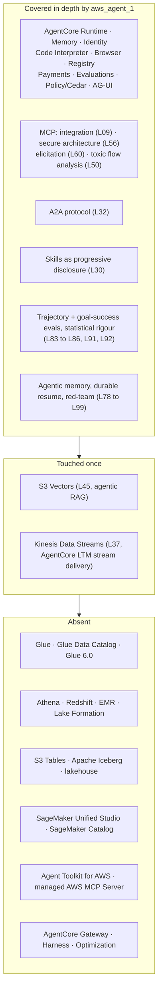

# Assessment: `aws_agent_1` cross-referenced against the AWS data engineering landscape

**Date:** 2026-08-25
**Subject repo:** `/Users/paulsnyman/Code/aws_agent_1` (HEAD `97e759e`, last commit 2026-07-19, clean tree)
**Reference:** [`aws-data-engineering-landscape.md`](./aws-data-engineering-landscape.md)

All findings below are `[P]`: read from repo bytes or from a command run against the repo
in this session. Commands that produced counts are quoted so they can be re-run.

---

## 1. What the repo actually is

A 100-level (L1 to L100, plus L97b) progressive lab on the **AWS Strands Agents SDK and
the Bedrock AgentCore platform**, built Dec 2025 to Jul 2026, with an unusually strict
evidence regime:

- Anti-simulation gate (`tools/no_sim_check.py`) flagging stub/fake/mock vocabulary,
  fake-success returns and assume-good `except` defaults
- Statistical rigour on eval claims (Wilson CIs, permutation significance) in
  `tools/eval_harness.py`, terminating in a single GO/NO-GO `tools/ship_gate.py`
- Cross-model validation as a gate: findings are labelled framework-inherent or
  model-specific after a second-provider re-run (Bedrock Haiku, Bedrock Nova Lite)
- ~900-entry append-only `observations.jsonl` plus per-level reflections
- A pre-commit tripwire (`check_no_aws_ids.py`) blocking AWS account identifiers from
  tracked files

Dependency spine (`pyproject.toml`): `strands-agents[otel,a2a,cedar]>=1.48`,
`strands-agents-evals>=0.1.14`, `bedrock-agentcore>=1.12`, `strands-shell>=0.3.1`,
`temporalio`, `ag-ui-*`, `chromadb`, `lancedb`, `graphiti-core[falkordb]`.

This is a **control-plane and runtime** repo. The question is how it lines up with the
data plane described in the landscape doc.

---

## 2. Coverage map



### 2.1 Evidence for the absence claim

Absence is the highest-risk kind of claim, so it was proved with a broad search over all
tracked text, not a narrow one. Command:

```
git grep -ril "<term>" -- '*.md' '*.py' '*.json' '*.yaml' '*.toml'
```

| Term | Files | What the hits actually are |
|---|---:|---|
| `athena`, `s3 tables`, `iceberg`, `lake formation`, `lakeformation`, `data catalog`, `lakehouse`, `datazone`, `sagemaker unified`, `quicksight`, `firehose`, `duckdb`, `redshift` | **0 each** | genuinely absent |
| `glue` | 2 | both are "Strands powers Amazon Q, Kiro, **AWS Glue** agents", a provenance claim about Strands, not work against Glue |
| `emr` | 1 | incidental |
| `parquet` | 1 | incidental |
| `msk` | 2 | incidental |
| `etl` | 6 | all metaphorical ("revisit when building any pipeline ... ETL") in L31 and L46 reflections |
| `kinesis` | 13 | real, but all L37: streaming **AgentCore memory events** to a Kinesis Data Stream, plus its `_sandbox` probes |
| `agent toolkit`, `agent-toolkit` | 0 | absent |

So: two genuine data-plane touches in 100 levels (L45 S3 Vectors, L37 Kinesis), and both
are agent-infrastructure uses of a data service rather than data engineering.

### 2.2 AgentCore surface, repo vs the current 13 services

Landscape doc section 6.4 lists Harness, Runtime, Memory, Gateway, Identity, Code
Interpreter, Browser, Observability, Payments, Evaluations, Optimization, Policy,
Registry.

| Service | Repo status |
|---|---|
| Runtime | L10, L27 (`BedrockAgentCoreApp`, deployment) |
| Memory | L66 (async LTM filter), L37 (stream delivery), L80, L97/L97b (native vs hand-built rematch) |
| Identity | L74 (workload identity, vaulted secrets) |
| Code Interpreter | L72 |
| Browser | L73 |
| Observability | L21, L34, OTel deps present |
| Payments | L69 (x402) |
| Evaluations | L34, L35, L91 |
| Policy | L33 (Cedar at the Gateway), L96 (Cedar in-process, unified interventions), L99 (deny-policy defends the memory channel) |
| Registry | L71 |
| Config bundles / AG-UI | L75, L44, L76 |
| **Gateway** | **No level.** Appears only as the enforcement point inside L33 and as an ARN in L75. Never built against. |
| **Harness** | **No level.** Registered in `LEARNING_PLAN_v148_impact.md` as "AgentCore Harness announced GA at Summit NY 2026 ... SDK surface unverified" |
| **Optimization** | **Absent** (newer than the repo's last delta pass) |

---

## 3. What transfers directly, and is genuinely ahead

Four things in this repo are the correct prerequisites for the agentic data stack, not
merely adjacent to it.

**3.1 The MCP security spine.** L09 (integration), L56 (secure MCP architecture), L60
(elicitation) and L50 (toxic flow analysis, unsafe data paths) are exactly the lens the
landscape doc's three MCP tiers require. Landscape section 6.2 documents AWS's own
default-deny posture (read-only default, `--allow-write` gating, creator-only mutation,
single-statement query enforcement). The repo already reasons in that idiom.

**3.2 Skills as an architecture, not a prompt trick.** L30 built progressive disclosure
by hand: XML menu of names and descriptions, agent activates by name, full instructions
injected on activation, skill stays active for the session. AWS has since shipped that
same shape twice over, as Agent Toolkit agent skills (loaded on demand so they "do not
consume unnecessary context") and as preview **skill assets in Glue Data Catalog**, which
make the pattern catalog-native. L30 is the mechanism layer under both.

**3.3 Trajectory-level evaluation.** L83 (tool selection, ordering, argument
correctness), L84 (multi-turn goal success against real state), L85 (Wilson CIs,
permutation significance). A data agent's failure mode is almost entirely trajectory:
wrong catalog, wrong table, wrong join path, unfiltered scan. This is the single most
transferable asset in the repo, and the data plane makes it *easier* to ground because
ground truth is a checkable row count rather than a judge's opinion.

**3.4 The first-party-ization thesis, already written.** From
`SESSION_2026-07-19-reflection.md`:

> The delta shipped SDK-native versions of five things this repo hand-built (memory,
> interventions, sandbox, storage, agentic context management), turning the hand-built
> levels into the mechanism layer under the new primitives.

The landscape doc is the next chapter of that same thesis on a different axis. What AWS
absorbed between June and August 2026 is **skills** (Agent Toolkit, Glue skill assets),
**context** (AWS Context knowledge graph, Glue business context and semantic search,
S3 Annotations) and **the MCP client wiring itself** (managed AWS MCP Server replacing
per-service self-hosted servers). The thesis holds; the axis moved from runtime to data.

---

## 4. Gaps, ordered by consequence

**4.1 The whole data plane.** Nothing in the repo touches a catalog, a table format, or a
query engine. Every agent in it reasons over documents, memory records, or synthetic
tasks. The landscape doc's entire storage, engine and governance layers are unexercised.

**4.2 No AWS MCP server has ever been wired.** `.mcp.json` contains exactly one server:

```json
{ "mcpServers": { "graphiti-memory": { "command": "npx", "args": ["-y", "mcp-remote", "http://localhost:8000/mcp/"] } } }
```

L09 and L56 built MCP understanding against local and third-party servers. Neither the
managed AWS MCP Server, nor `awslabs/mcp` servers, nor the Knowledge MCP server has been
run. So the repo has MCP theory and no AWS MCP practice.

**4.3 Agent Toolkit for AWS is entirely unregistered.** Zero hits for "agent toolkit"
across tracked files, despite it going GA in May 2026, before the repo's own July delta
pass. The only trace is a now-drifted link (section 5). This matters because the Toolkit's
`aws-data-analytics` plugin is the exact bridge between this repo and data engineering
work, and because its skills encode AWS's own opinionated defaults, including "Default to
S3 Tables unless the environment says otherwise".

**4.4 AgentCore Gateway is the one missing platform primitive.** It is also the one that
matters most for data work: it converts APIs, Lambda functions and existing services into
MCP tools, and it is where AgentCore Policy intercepts every tool call. L33 depends on
Gateway conceptually and L75 touched a Gateway ARN, but no level ever built one.

**4.5 The delta discipline has no data axis.** The 2026-07-18 ecosystem delta report is
rigorous, but scoped to the SDK. It explicitly parks the platform announcements:

> The AWS News Blog Summit New York index [2] (2026-06-17) and Amazon's own framing piece
> [8] name **platform-level additions invisible at the SDK layer of this report**:
> AgentCore **Managed Knowledge Base** ..., **AgentCore Harness GA**, and **AWS Context**.

That is an honest, self-declared blind spot rather than a miss. But it means AWS Context,
which is the single most consequential item for agent-plus-data work, is logged as a name
and never analysed. The landscape doc fills precisely that hole.

---

## 5. Drift found since the last commit (37 days)

| Item | Repo state | Current state |
|---|---|---|
| `docs/levels/L43-...md:53` links to `https://docs.aws.amazon.com/aws-mcp/latest/userguide/agent-sops.html`, marked verified with a checkmark | assumed live | `curl -L` now resolves to `https://docs.aws.amazon.com/agent-toolkit/latest/userguide/` (HTTP 200 at the guide root, the specific page no longer resolves). The whole `aws-mcp` doc set was rebranded to Agent Toolkit for AWS. |
| Harness "SDK surface unverified" | open question | Now documented as a first-class AgentCore service: managed agent loop, single API call, isolated microVM with filesystem and shell, explicitly aimed at "code generation, **data analysis**, and deep research", and able to load all Agent Toolkit skills "with one line of code" |
| AWS Context "named, not analysed" | placeholder | Still "coming soon", but the design contract is now public: Iceberg-published context, agentic search APIs **and MCP tools**, per-call IAM and Lake Formation inheritance |
| AgentCore service count | 10 to 11 studied | 13 services, with Optimization new |

Data-plane changes in the same window (Glue 6.0 GA on 2026-08-21, trusted identity
propagation in SMUS on 2026-08-19, data profiling and anomaly detection on 2026-08-18,
Spark Connect on EMR on 2026-08-04) would not have been caught by this repo's delta
process at all, because that process watches the SDK feed. That is the structural finding,
not an oversight.

---

## 6. Assessment

**Fit: high, on one axis only.** `aws_agent_1` is a strong control-plane foundation with a
methodology that is better than most production teams'. Against the landscape doc it is
roughly 80 percent of the agent interface layer, 0 percent of the storage, engine and
governance layers, and the two layers meet at exactly the components the repo never built
(Gateway, the managed AWS MCP Server, catalog-native skills).

**The methodology is the asset, and it transfers cleanly.** Anti-simulation, positive and
negative controls, cross-model labelling, permutation significance, a paid audit-
reproducible ship gate. Data engineering suits these better than the agent work did:
runtime sentinels are natural (a row count, a manifest version, a snapshot id), ground
truth is checkable rather than judged, and negative controls are trivial to construct.

**The main risk is not staleness, it is axis lock-in.** The repo's watch process is
SDK-shaped, so a data-plane wave passes it invisibly. Anything built on top of this work
should add a second watch on the analytics feed (Glue, Athena, S3 Tables, Lake Formation,
SMUS release notes), because that is now where the agent-relevant surface is moving.

**One correction to carry forward.** The repo's framing of Strands as the substrate needs
a peer now. For data work the managed AWS MCP Server plus the `aws-data-analytics` plugin
is the path AWS is steering toward, and it is framework-agnostic by design (Claude Code,
Kiro, Cursor, Codex). Strands remains the right choice for authoring agents; it is no
longer the only or default way to reach AWS data services from an agent.

---

## 7. Recommended bridge, if this work continues

Sequenced so each step reuses machinery that already exists in `aws_agent_1`.

1. **Wire the managed AWS MCP Server and the `aws-data-analytics` plugin**, then run
   L56's secure-MCP lens and L50's toxic-flow analysis over it. Deliverable: which tool
   calls are read-only, where the write boundary sits, what CloudTrail actually records.
   Reuses: L09, L50, L56.
2. **Build an AgentCore Gateway level.** Turn one internal data API or Lambda into MCP
   tools, put Cedar Policy in front of it, and re-run L96's intervention taxonomy
   (Deny / Guide / Confirm / Transform) at the Gateway rather than in-process. This closes
   the one platform gap and directly extends the L33 versus L96 comparison already made.
3. **Rematch L30 against catalog-native skills.** Hand-built skills plugin versus Glue
   Data Catalog skill assets, using the exact L97 / L97b rematch protocol (test the
   abstraction with a fair store before declaring the native version worse). Preview
   feature, so expect gaps and record them as such.
4. **Port the trajectory evaluator (L83) to a data agent.** Trajectory becomes catalog
   chosen, table resolved, join path taken, filters applied before aggregation. Ground
   truth is a known-correct query. This is the highest-value single item.
5. **Extend `ship_gate.py` with a bytes-scanned budget.** Athena and Glue runs are metered
   on data scanned, not just tokens. The gate already handles a token and latency cost
   gate; the analytics skills report "cost and data scanned" per query, so the signal is
   available.
6. **Add the analytics watch.** A second delta feed alongside the SDK one, covering Glue,
   Athena, S3 Tables, Lake Formation and the SMUS release notes page, which is dated,
   granular and machine-readable.

Deferred item worth revisiting first: the `NEXT_STEPS_PLAN.md` follow-on
"Authentic `BedrockKnowledgeBaseStore` memory arm" is now partly overtaken. AWS Context
and Glue business context are the organisation-scale version of that question, and S3
Annotations plus S3 Metadata give a cheaper, non-provisioned way to test grounded
retrieval against real object context.
