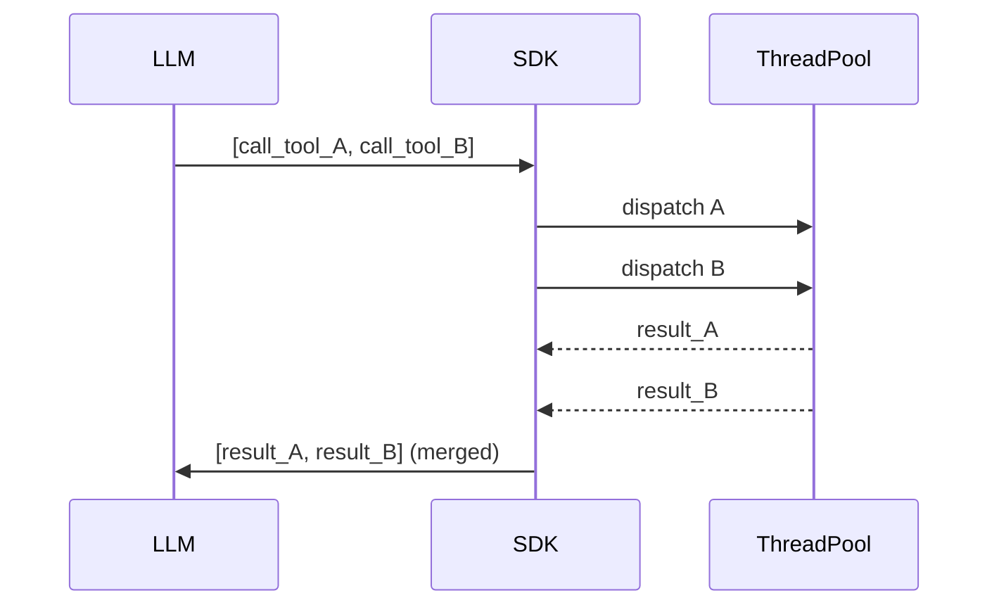

# L28: SDK Advances — Concurrency, MCP Tasks, Hooks

**Code:** `11_platform/sdk_advances.py`
**Reflection:** [`level-28-reflection.md`](../../.claude/learnings/reflections/level-28-reflection.md)

### Level 28: SDK Advances — Concurrency, MCP Tasks, Hooks
**Goal:** Parallel tool execution, MCP Tasks, simpler hook API, declarative agent config

**Depends on:** L9 (MCP), L21 (hooks/observability)
**Unlocks:** L29 (Steering uses plugins API), L30 (Skills uses plugins API)

SDK v1.26 (Feb 11) + v1.27 (Feb 19, 2026).

```
# Parallel tool execution
agent = Agent(tools=[A, B, C], concurrent_invocation_mode=ON)
  → LLM returns [call_A, call_B] in same response
  → SDK dispatches both to thread pool simultaneously
  → results merged before next reasoning step

# Hook registration (simplified API)
agent.add_hook(event="before_tool_call", handler=my_fn)
  # event options: before_tool_call | after_tool_call | before_model | after_model

# Declarative config (experimental)
agent = config_to_agent({ model: "...", prompt: "..." })
  → same as Agent() constructor but driven by dict/JSON
```



**Implementation file:** `11_platform/sdk_advances.py`

**Key Concepts:**
- `concurrent_invocation_mode=True`: independent tools no longer block each other
- `add_hook()` replaces verbose manual hook registration from L21
- MCP Tasks = async work units (vs Resources = data, Prompts = templates); min dep 1.23.0
- `config_to_agent()`: declarative JSON/dict agent creation (experimental)
- Breaking change (pre-v1.25): `max_parallel_tools` removed — SDK manages thread pools

**Sources:**
- [sdk-python releases](https://github.com/strands-agents/sdk-python/releases) ✓
- [v1.27.0 notes](https://newreleases.io/project/github/strands-agents/sdk-python/release/v1.27.0) ✓

---
