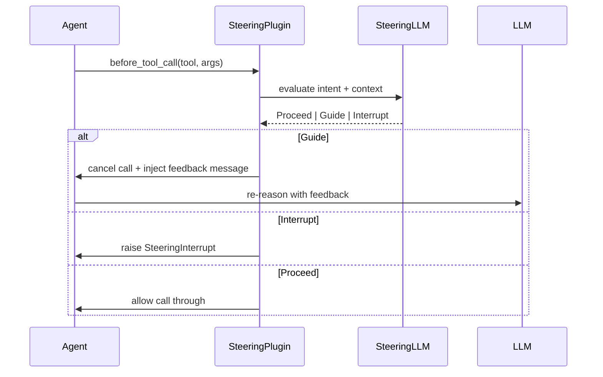

# L29: Strands Steering

**Code:** `11_platform/steering.py`
**Reflection:** [`level-29-reflection.md`](../../.claude/learnings/reflections/level-29-reflection.md)

### Level 29: Strands Steering
**Goal:** Inject context-aware guidance at lifecycle points without modifying agent code

**Depends on:** L28 (plugins API), L22 (Safety — know what you're steering away from)
**Unlocks:** L30 (both use plugins=[...])



```
# Setup
handler = LLMSteeringHandler(system_prompt="<behavioral policy>")
agent = Agent(tools=[...], plugins=[handler])

# Handler fires at two lifecycle points:
#   before_tool_call  → validate intent before execution
#   after_model       → validate output before returning to user
# LedgerProvider tracks history + timing for context-aware decisions
```

**Implementation file:** `11_platform/steering.py`

**Key Concepts:**
- Two lifecycle injection points: before-tool (validate call), after-model (validate output)
- Three actions: Proceed (pass through), Guide (cancel + inject feedback), Interrupt
- `LedgerProvider` tracks tool call history + timing for context-aware decisions
- vs L22 Safety: L22 = hard block, L29 = contextual guidance that steers behavior
- vs Graph/Swarm: Steering = dynamic guardrails without restructuring the agent

**Sources:**
- [Steering docs](https://strandsagents.com/docs/user-guide/concepts/plugins/steering/) ✓
- [Plugins overview](https://strandsagents.com/docs/user-guide/concepts/plugins/) ✓

---
