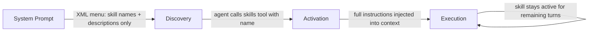

# L30: Skills Plugin

**Code:** `11_platform/skills_plugin.py`
**Reflection:** [`level-30-reflection.md`](../../.claude/learnings/reflections/level-30-reflection.md)

### Level 30: Skills Plugin
**Goal:** On-demand specialized knowledge for agents — progressive disclosure without prompt bloat

**Depends on:** L28 (plugins API), L15 (Context Management — why bloat is a problem)
**Unlocks:** Better pattern for any agent handling multiple knowledge domains



```
# Define skills
skill = Skill(name="...", description="...", instructions="full step-by-step guide")
plugin = AgentSkills(skills=["./skills/dir/", skill])  # mix files + programmatic

# At runtime:
#   1. Discovery: agent sees XML menu with names only (lean)
#   2. Activation: agent calls skills("invoice-processing")
#   3. Execution: full instructions loaded into context, persist for session
agent = Agent(plugins=[plugin], tools=[file_read, shell])
```

**Implementation file:** `11_platform/skills_plugin.py`

**Key Concepts:**
- Three phases: Discovery (XML menu in system prompt) → Activation (skills tool call) → Execution
- Skills ≠ Tools: skills = instruction packages, tools = executable functions
- Progressive disclosure keeps context lean; activated skills persist across turns
- vs L15 context management: Skills are a structural solution to context bloat
- Use case: agents handling PDF, data analysis, code review without loading all instructions

**Sources:**
- [Skills docs](https://strandsagents.com/docs/user-guide/concepts/plugins/skills/) ✓

---
