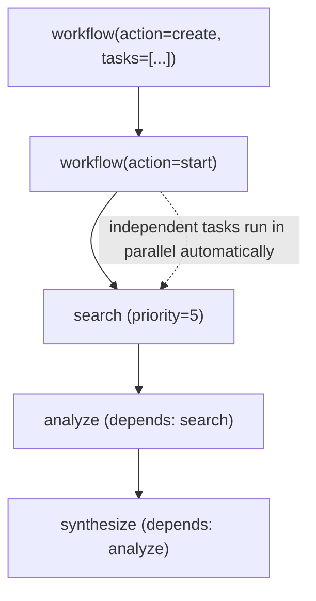

# L31: Workflow Pattern

**Code:** `11_platform/workflow_pattern.py`
**Reflection:** [`level-31-reflection.md`](../../.claude/learnings/reflections/level-31-reflection.md)

### Level 31: Workflow Pattern
**Goal:** Deterministic DAG-based pipelines with automatic parallel execution and dependency resolution

**Depends on:** L6 (Agents-as-Tools), L7 (Swarm), L8 (Graph) — understand all patterns before choosing
**Unlocks:** L32 (A2A agents can be workflow tasks)



```
# Lifecycle actions: create → start → status | pause | resume | delete
# Tasks: { task_id, description, dependencies[], priority }
# Dependencies are edges in the DAG — engine resolves execution order
# Independent tasks (no shared deps) run in parallel automatically

# Pattern selector:
#   freeform collaboration   → Swarm (L7)
#   agent decides at runtime → Graph (L8)
#   fixed deterministic DAG  → Workflow (L31)  ← this level
```

**Implementation file:** `11_platform/workflow_pattern.py`

**Key Concepts:**
- Workflow = pre-defined DAG in `strands_tools` (not core SDK)
- vs Graph (L8): Graph = agent decides path at runtime; Workflow = fixed DAG, deterministic
- vs Swarm (L7): Swarm = autonomous handoff; Workflow = explicit task order + dependencies
- Parallel execution of independent tasks is automatic
- Pattern decision tree: freeform → Swarm; structured decisions → Graph; fixed pipeline → Workflow

**Critical Gotcha — Task Tool Inheritance:**
- Tasks with no `tools` key (or `tools: []`) inherit ALL parent agent tools
- If parent has `workflow`, tasks get it too → LLM creates recursive sub-workflows
- Fix: specify `"tools": ["calculator"]` (or any real non-workflow tool) in every task
- `"tools": []` does NOT prevent inheritance — empty list is falsy in Python check

**Sources:**
- [Workflow docs](https://strandsagents.com/docs/user-guide/concepts/multi-agent/workflow/) ✓
- [Multi-agent patterns](https://strandsagents.com/docs/user-guide/concepts/multi-agent/multi-agent-patterns/) ✓

---
