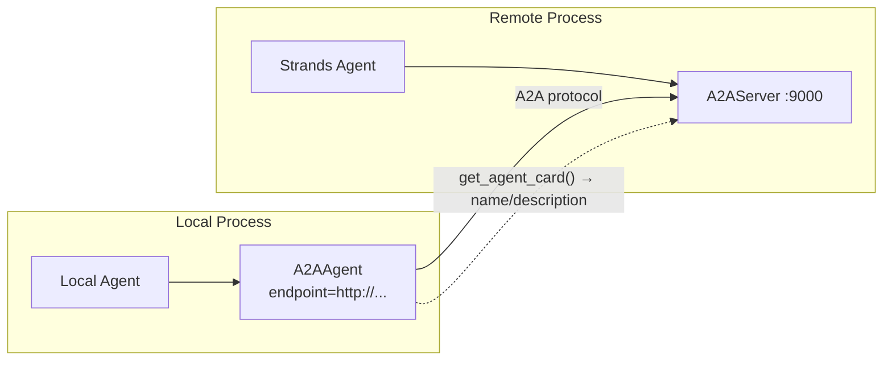

# L32: A2A Protocol

**Code:** `11_platform/a2a_protocol.py`
**Reflection:** [`level-32-reflection.md`](../../.claude/learnings/reflections/level-32-reflection.md)

### Level 32: A2A Protocol
**Goal:** Expose Strands agents as network services; consume remote agents as local objects

**Depends on:** L31 (Workflow patterns), L8 (Graph — A2AAgent works as graph node)
**Unlocks:** Distributed agent architectures; remote specialist agents



```
# SERVER side
server_agent = Agent(name="...", description="...", tools=[...])
A2AServer(agent=server_agent).serve()   # exposes /a2a endpoint

# CLIENT side (same API as local Agent)
remote = A2AAgent(endpoint="http://host:9000")
result = remote("natural language task")

# Graph integration: A2AAgent is just another node
graph.add_node("remote-specialist", remote)

# Install extras:
#   pip install strands-agents[a2a]           # server + client
#   pip install strands-agents-tools[a2a_client]  # tool-based client
```

**Implementation file:** `11_platform/a2a_protocol.py`

**Key Concepts:**
- A2A = open standard for agent discovery, communication, collaboration
- `A2AAgent` handles: card resolution, HTTP client, protocol messages, response parsing
- `get_agent_card()` for discovery (name/description caching)
- Works as node in Graph workflows — transparently mix local + remote agents
- Extras: `strands-agents[a2a]` (server+client), `strands-agents-tools[a2a_client]` (tool)
- Not yet supported in TypeScript SDK

**Sources:**
- [A2A Protocol docs](https://strandsagents.com/docs/user-guide/concepts/multi-agent/agent-to-agent/) ✓

---
