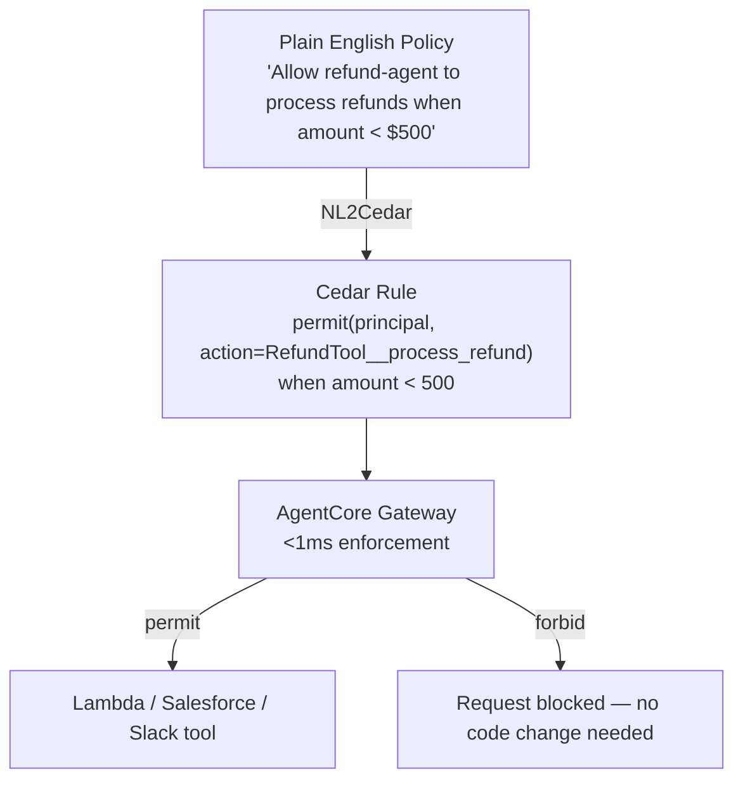

# L33: AgentCore Policy

**Code:** `11_platform/agentcore_policy.py`
**Reflection:** [`level-33-reflection.md`](../../.claude/learnings/reflections/level-33-reflection.md)

### Level 33: AgentCore Policy
**Goal:** Define agent governance boundaries in natural language; Cedar enforcement at the Gateway

**Depends on:** L22 (Safety & Guardrails), L27 (AgentCore Deployment)
**Unlocks:** L34 (Evaluations — measure what policy protects)

GA March 3, 2026.



```
# Policy authoring (natural language, no Cedar syntax needed):
#   "Allow principal X to perform action Y when condition Z"
#   "Forbid all principals from deleting records"
#
# Three elements: WHO (principal) + WHAT (action) + WHEN (conditions)
# Semantics: Forbid always wins. Default deny — at least one permit must match.
# Conditions: numeric (<, >, =), string (equals, contains), boolean, existence
# Scope: any tool — Lambda, API, SaaS integration — no agent code changes
```

**Implementation file:** `11_platform/agentcore_policy.py`

**Key Concepts:**
- NL2Cedar: plain English → Cedar; enforced by Gateway (<1ms, thousands req/sec)
- Controls: Lambda tools, Salesforce, Slack, any API integration — no agent code changes
- L22 = in-process code guardrails; L33 = infrastructure policy layer (complementary)
- Permit / Forbid semantics; conditions support numeric, string, boolean, existence checks

**Sources:**
- [Policy GA](https://aws.amazon.com/about-aws/whats-new/2026/03/policy-amazon-bedrock-agentcore-generally-available/) ✓
- [Writing policies in natural language](https://docs.aws.amazon.com/bedrock-agentcore/latest/devguide/policy-natural-language.html) ✓

---
