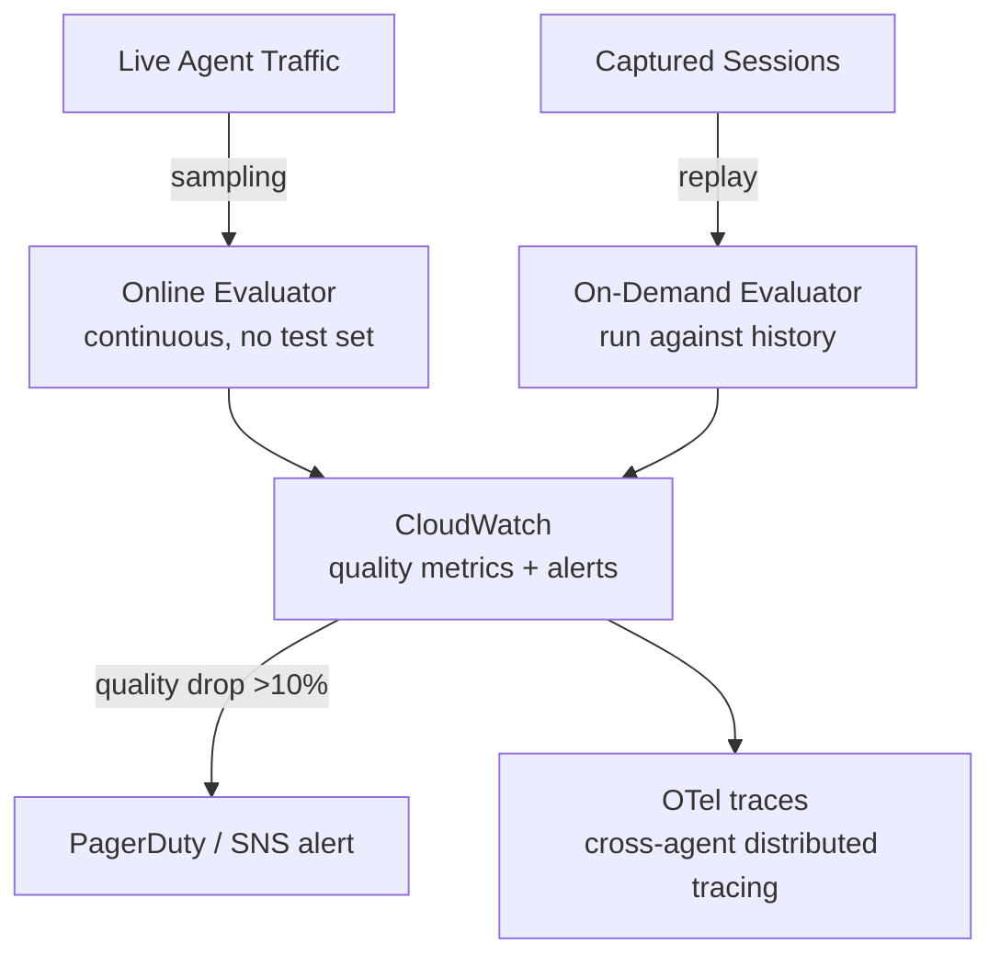

# L34: AgentCore Evaluations

**Code:** `11_platform/agentcore_evaluations.py`
**Reflection:** [`level-34-reflection.md`](../../.claude/learnings/reflections/level-34-reflection.md)

### Level 34: AgentCore Evaluations
**Goal:** Measure agent quality on live production traffic via AgentCore's cloud-side evaluation service

**Depends on:** L21 (Observability), L27 (AgentCore), L33 (Policy — know what you're evaluating against)
**Unlocks:** L35 (Evals SDK — local complement to cloud evaluations)

Preview (not GA in all regions).



```
# Evaluator types:
#   Built-in: Builtin.Helpfulness | Builtin.Faithfulness | Builtin.Safety
#   Custom:   LLM-as-judge with domain-specific rubric

# Two modes:
#   Online    → samples live traffic continuously (no test set required)
#   On-demand → runs against previously captured sessions

# L21 vs L34:
#   L21 = what happened (metrics, traces, latency)
#   L34 = how well (semantic quality, helpfulness, goal success)
```

**Implementation file:** `11_platform/agentcore_evaluations.py`

**Key Concepts:**
- Built-in evaluators + custom LLM evaluators for domain quality
- Online vs on-demand; CloudWatch dashboards for tokens/latency/error rates/quality
- vs L35 Evals SDK: L34 = cloud/production sampling, L35 = local/CI testing
- Extends L21: L21 = metrics/traces (what happened), L34 = semantic quality (how well)

**Sources:**
- [Evaluations docs](https://docs.aws.amazon.com/bedrock-agentcore/latest/devguide/evaluations.html) ✓

---
