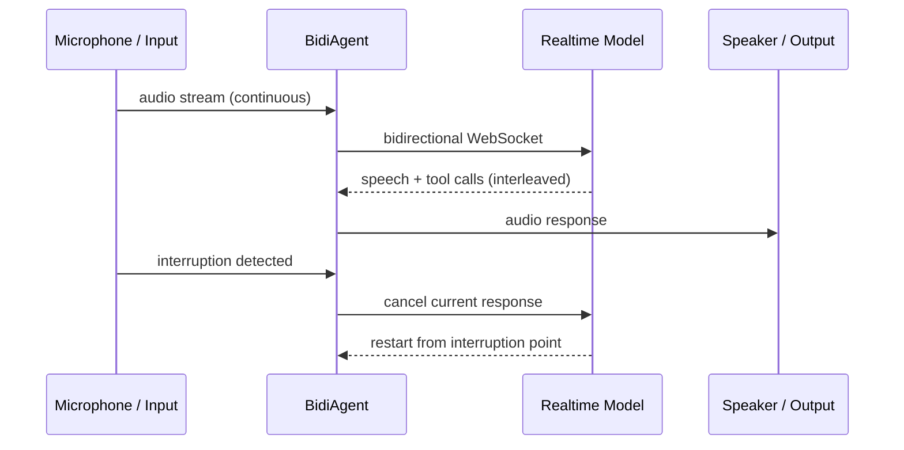

# L36: Bidirectional Streaming

**Code:** `11_platform/bidi_streaming.py`
**Reflection:** [`level-36-reflection.md`](../../.claude/learnings/reflections/level-36-reflection.md)

### Level 36: Bidirectional Streaming
**Goal:** Real-time voice and text conversations with automatic interruption handling

**Depends on:** L5 (Sessions — multi-turn state), L1-3 (basic agent patterns)
**Unlocks:** L40 (Edge Strands — voice on device)



```
# Provider options:
#   BidiNovaSonicModel      → AWS Nova Sonic (8-min session max)
#   BidiOpenAIRealtimeModel → OpenAI Realtime (60-min session)
#   BidiGeminiLiveModel     → Gemini Live

# Setup pattern:
#   model  = BidiNovaSonicModel()
#   agent  = BidiAgent(model, system_prompt="...")
#   io     = BidiAudioIO()  # or custom I/O handler
#   await agent.run(inputs=[io.input()], outputs=[io.output()])

# Deployment targets: Lambda, Fargate, EKS, Docker, Kubernetes
# Module: strands.experimental.bidi
```

**Implementation file:** `11_platform/bidi_streaming.py`

**Key Concepts:**
- Three providers: Nova Sonic (8-min max), OpenAI Realtime (60-min), Gemini Live
- Natural speech interruptions handled automatically; tools execute concurrently during voice
- Custom I/O handlers: deploy to Lambda, Fargate, EKS, Docker, Kubernetes
- Status: `strands.experimental.bidi`
- General-purpose (not edge-only); edge voice uses this as foundation (L40)

**Sources:**
- [Bidirectional streaming quickstart](https://strandsagents.com/docs/user-guide/concepts/bidirectional-streaming/quickstart/) ✓

---
