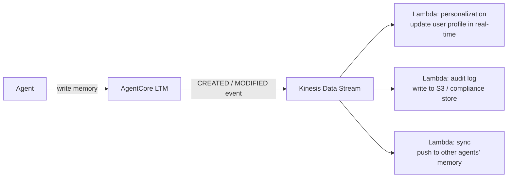

# L37: AgentCore LTM Streaming + Kinesis

**Code:** `11_platform/ltm_streaming.py`
**Reflection:** [`level-37-reflection.md`](../../.claude/learnings/reflections/level-37-reflection.md)

### Level 37: AgentCore LTM Streaming + Kinesis
**Goal:** Event-driven memory pipelines via Kinesis push — eliminate polling for LTM changes

**Depends on:** L14-17 (Memory Architecture), L27 (AgentCore Deployment)
**Unlocks:** Real-time personalization, audit, cross-agent memory sync patterns

GA March 12, 2026.



```
# Event payload modes:
#   METADATA_ONLY  → record ID + timestamp + event type (lightweight)
#   FULL_CONTENT   → complete memory record (heavier, more useful downstream)

# Event types: CREATED | MODIFIED
# Each Kinesis record: { eventType, memoryId, timestamp, [fullContent] }

# Lambda handler pattern:
#   for each record in event.Records:
#     decode kinesis data → parse JSON payload
#     branch on eventType → CREATED or MODIFIED handler
#     act: update cache, write audit log, notify downstream

# Availability: 15 AWS regions (GA March 12, 2026)
```

**Implementation file:** `11_platform/ltm_streaming.py`

**Key Concepts:**
- Kinesis Data Stream as push event bus for LTM (vs polling)
- Episodic Memory GA: structured episodes (context/reasoning/actions/outcomes) + pattern learning
- Extends L14-17: custom memory layers → managed AgentCore LTM with streaming events
- Use cases: real-time personalization updates, compliance audit logs, cross-agent memory sync

**Sources:**
- [LTM Streaming GA](https://aws.amazon.com/about-aws/whats-new/2026/03/agentcore-memory-streaming-ltm/) ✓
- [Memory record streaming docs](https://docs.aws.amazon.com/bedrock-agentcore/latest/devguide/memory-record-streaming.html)
- [Hands-on walkthrough](https://dev.classmethod.jp/en/articles/agentcore-memory-kinesis-streaming/)

---
