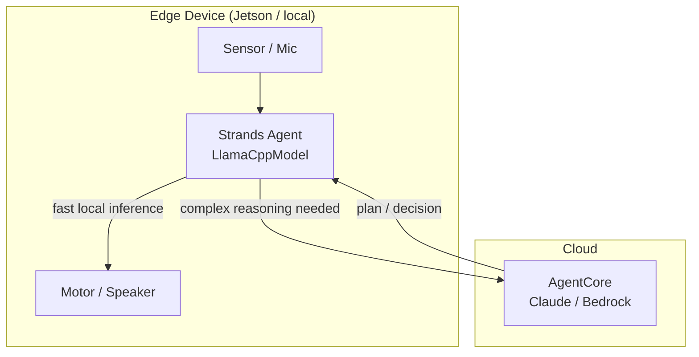

# L40: Edge Strands + Cloud Orchestration

**Code:** `11_platform/edge_strands.py`
**Reflection:** [`level-40-reflection.md`](../../.claude/learnings/reflections/level-40-reflection.md)

### Level 40: Edge Strands + Cloud Orchestration
**Goal:** Run agents on edge devices with local models (llama.cpp server), cloud delegation for complex reasoning

**Depends on:** L36 (Bidirectional Streaming — voice on edge), L27 (AgentCore — cloud side)
**Unlocks:** (terminal — end of learning path)

GA December 3, 2025.



```
# LlamaCppModel connects to a RUNNING llama.cpp HTTP server — does NOT load models directly
#   base_url = "http://localhost:8080"   # llama.cpp server must be started separately
#   model_id = "default"                 # as registered in the server
#   Supports: GBNF grammar constraints, structured output, prompt caching

# Cloud delegation pattern:
#   edge agent handles: sensor reads, local actuation, fast loop (50Hz for robots)
#   cloud agent handles: multi-step planning, reasoning, memory retrieval

# Robotics extension (Strands Labs):
#   GR00T VLA model → visual-language-action for SO-100/101 arms
#   robots-sim      → physics-based 3D testing (Libero environments) before real hardware
#   Bidi (L36) + Edge (L40) = voice-controlled robots with cloud reasoning
```

**Repos:** [strands-labs/robots](https://github.com/strands-labs/robots) · [strands-labs/robots-sim](https://github.com/strands-labs/robots-sim)
**Implementation file:** `11_platform/edge_strands.py`

**Key Concepts:**
- `LlamaCppModel` requires a running llama.cpp HTTP server at base_url
- Supports GBNF grammar constraints, structured output, prompt caching
- NVIDIA Jetson: edge VLA (GR00T) runs at 50Hz for robot control
- Strands Labs Robots: natural language → SO-100/101 arms via GR00T + LeRobot
- Robots Sim: physics-based 3D testing (Libero environments) before real hardware
- L36 bidi streaming + L40 edge = voice-controlled robots with cloud reasoning

**Sources:**
- [llama.cpp provider](https://strandsagents.com/docs/user-guide/concepts/model-providers/llamacpp/) ✓
- [strands-labs/robots](https://github.com/strands-labs/robots) ✓
- [strands-labs/robots-sim](https://github.com/strands-labs/robots-sim) ✓

---
