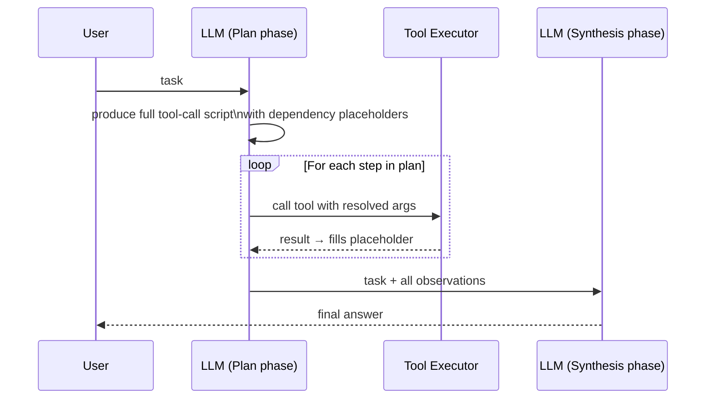

# L41: Custom Orchestration — ReWOO

**Code:** `12_orchestration/rewoo.py`
**Reflection:** [`level-41-reflection.md`](../../.claude/learnings/reflections/level-41-reflection.md)

### Level 41: Custom Orchestration — ReWOO
**Goal:** Override the default ReAct loop with a plan-first (ReWOO) strategy for deterministic, auditable execution

**Depends on:** L11 (Reflection — understand loop-level vs prompt-level), L6-8 (multi-agent patterns)
**Unlocks:** L42 (Reflexion is the adaptive complement to ReWOO)

**What makes this different from L11:**
L11 reflection = prompt-level self-critique (agent talks to itself). ReWOO = replacing the *execution loop itself*. You override how Strands dispatches tool calls, not just what the LLM says.



```
# Pseudocode
plan = llm.plan(task)           # one LLM call: full script of steps + placeholders
results = {}
for step in plan.steps:
    args = resolve_placeholders(step.args, results)
    results[step.id] = execute_tool(step.tool, args)
answer = llm.synthesize(task, results)  # one LLM call: final answer from all evidence
```

**Key Concepts:**
- Plan-then-execute vs interleaved ReAct (observe after every step)
- Dependency placeholder resolution between steps
- When to use: ordered dependencies, audit trail requirements, policy gates before mutations
- When NOT to use: tasks where mid-flight observations should change the plan
- Strands custom orchestrator hook: override `_run_loop()` or use `before_tool_call` plugin

**Sources:**
- [AWS ML Blog — custom orchestration](https://aws.amazon.com/blogs/machine-learning/customize-agent-workflows-with-advanced-orchestration-techniques-using-strands-agents/) ✓
- [samples/02-samples/15-custom-orchestration-airline-assistant](https://github.com/strands-agents/samples/blob/main/02-samples/15-custom-orchestration-airline-assistant/src/reWoo-reAct_singleTurn.ipynb) ✓

---
