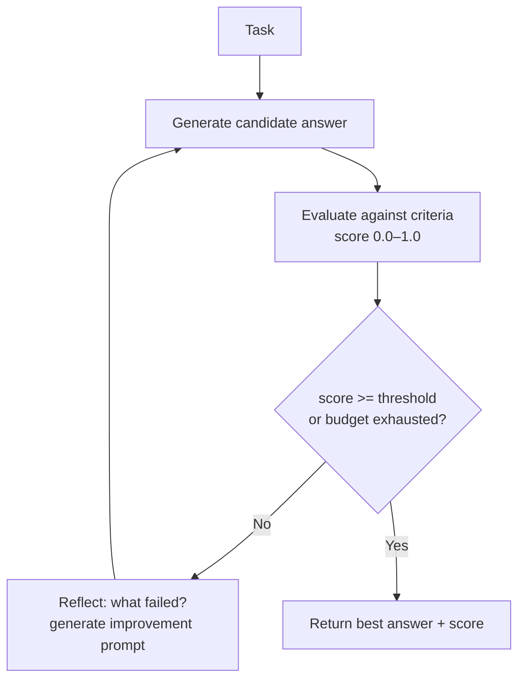

# L42: Custom Orchestration — Reflexion

**Code:** `12_orchestration/reflexion.py`
**Reflection:** [`level-42-reflection.md`](../../.claude/learnings/reflections/level-42-reflection.md)

### Level 42: Custom Orchestration — Reflexion
**Goal:** Override the loop with self-critique cycles that iterate until an objective quality threshold is met

**Depends on:** L41 (custom orchestration — know how to override the loop)
**Unlocks:** Principled quality gates for any level's output

**What makes this different from L11:**
L11 = one critique pass in a prompt chain. Reflexion = structured loop with objective stopping criteria, score tracking, and retry budget. The agent can fail gracefully when budget is exhausted.



```
# Pseudocode
budget = max_iterations (e.g. 3)
best = None
for attempt in range(budget):
    candidate = agent.generate(task + reflection_context)
    score = evaluator.score(candidate, criteria)
    best = candidate if score > best.score else best
    if score >= threshold: break
    reflection_context = critic.reflect(candidate, score, criteria)
return best
```

**Key Concepts:**
- Objective stopping criteria (score threshold, not just "LLM says it's done")
- Retry budget prevents infinite loops
- Reflection context accumulates across attempts — each try improves on previous failure
- Cost/latency tradeoff: deliberation depth vs response time
- vs ReWOO: ReWOO = no mid-flight adaptation; Reflexion = iterative adaptation

**Sources:**
- [AWS ML Blog — custom orchestration](https://aws.amazon.com/blogs/machine-learning/customize-agent-workflows-with-advanced-orchestration-techniques-using-strands-agents/) ✓

---
