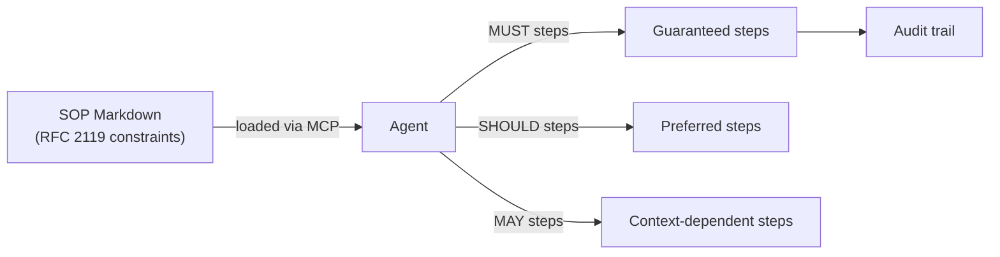

# L43: Agent SOPs — Natural Language Workflow Specs

**Code:** `12_orchestration/agent_sops.py`
**Reflection:** [`level-43-reflection.md`](../../.claude/learnings/reflections/level-43-reflection.md)

### Level 43: Agent SOPs — Natural Language Workflow Specs
**Goal:** Define reusable, portable agent workflows in markdown using RFC 2119 constraints; share across agents and IDEs

**Depends on:** L22 (Safety — SOPs are a production reliability tool), L9 (MCP — SOPs ship via MCP Server)
**Unlocks:** Structured approach to the "prompt engineering is high-maintenance" problem

**What it solves:**
Model-driven reasoning is unpredictable at production scale. Agent SOPs use `MUST` / `SHOULD` / `MAY` to constrain agent behaviour without rewriting code. Decoupled from any specific agent — the same SOP runs in Kiro, Claude Code, or Cursor.



```
# Pseudocode — SOP structure
sop:
  name: "Deploy Web App"
  parameters:
    - name: framework
      constraint: MUST be one of [react, vue, nextjs]
  steps:
    - id: 1
      action: generate CDK infrastructure
      constraint: MUST complete before any deployment step
    - id: 2
      action: run security checks
      constraint: SHOULD run; MAY skip if --fast flag set
    - id: 3
      action: create CI/CD pipeline
      constraint: MAY create if user requests
```

**Key Concepts:**
- RFC 2119 semantics: MUST = non-negotiable, SHOULD = strong preference, MAY = optional
- SOPs are portable: same file works in any MCP-compatible IDE
- Parameterised inputs allow reuse across contexts
- vs Skills plugin (L30): Skills = inject instructions at runtime; SOPs = constrain the entire task workflow
- vs Agent Steering (L29): Steering = dynamic guardrails per tool call; SOPs = static workflow contract

**Sources:**
- [Introducing Strands Agent SOPs](https://aws.amazon.com/blogs/opensource/introducing-strands-agent-sops-natural-language-workflows-for-ai-agents/) ✓
- [strands-agents/agent-sop](https://github.com/strands-agents/agent-sop) ✓
- [AWS MCP Server — Deployment SOPs](https://docs.aws.amazon.com/aws-mcp/latest/userguide/agent-sops.html) ✓

---
