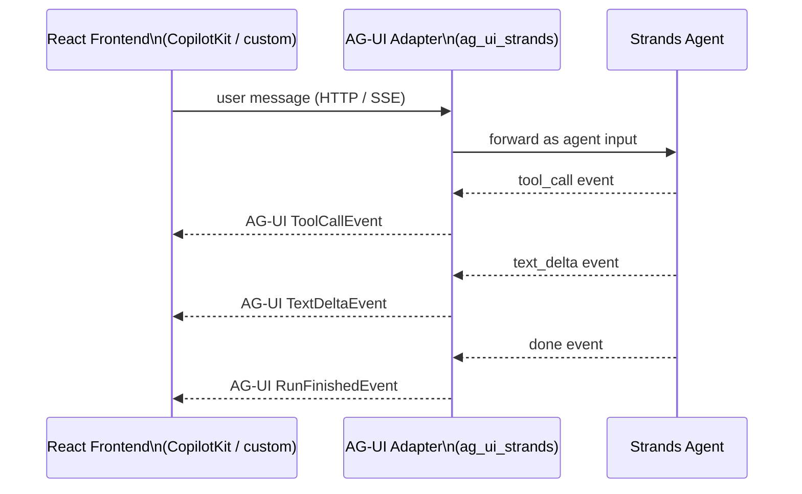

# L44: AG-UI — Agent-to-Frontend Protocol

**Code:** `12_orchestration/agui_protocol.py`
**Reflection:** [`level-44-reflection.md`](../../.claude/learnings/reflections/level-44-reflection.md)

### Level 44: AG-UI — Agent-to-Frontend Protocol
**Goal:** Connect a Strands agent to a live frontend using the AG-UI event protocol; stream agent state to a React UI without custom WebSockets

**Depends on:** L32 (A2A — understand agent protocols; AG-UI is the UI complement)
**Unlocks:** Production-quality agent UIs without bespoke state-sync infrastructure



```
# Pseudocode
adapter = AGUIStrandsAdapter(agent)  # wraps Strands agent in AG-UI event emitter
server = AGUIServer(adapter, port=8000)

# Frontend consumes standard AG-UI SSE stream:
# EventSource("/agent") → receives RunStarted, TextDelta, ToolCall, RunFinished events
# Same frontend works with any AG-UI-compatible backend (swap Strands for LangGraph etc.)
```

**Key Concepts:**
- AG-UI = open event standard (like A2A but agent→UI instead of agent→agent)
- Events: `RunStarted`, `TextDelta`, `ToolCallStart`, `ToolCallEnd`, `RunFinished`, `StateSnapshot`
- `ag_ui_strands` is the official Strands adapter (in `ag-ui-protocol/ag-ui` repo)
- Replaces: custom WebSocket handlers, manual SSE wiring, polling loops
- Stack: Strands agent → AG-UI adapter → SSE → React + CopilotKit (or any AG-UI consumer)

**Sources:**
- [AG-UI Protocol docs](https://docs.ag-ui.com/) ✓
- [AWS Strands + AG-UI — CopilotKit blog](https://www.copilotkit.ai/blog/aws-strands-agents-now-compatible-with-ag-ui) ✓
- [ag-ui-protocol/ag-ui](https://github.com/ag-ui-protocol/ag-ui) — includes `integrations/aws-strands/` ✓

---
