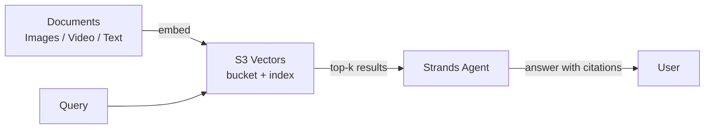

# L45: Agentic RAG with Amazon S3 Vectors

**Code:** `12_orchestration/s3_vectors_rag.py`
**Reflection:** [`level-45-rag-series.md`](../../.claude/learnings/reflections/level-45-rag-series.md)

### Level 45: Agentic RAG with Amazon S3 Vectors
**Goal:** Build a multimodal retrieval-augmented agent using S3 Vectors — AWS's native billion-scale vector store — replacing the local ChromaDB from L13

**Depends on:** L13 (RAG — understand retrieval fundamentals before scaling them)
**Unlocks:** Production RAG without self-managed vector infrastructure

**Why this supersedes L13:**

| Dimension | L13 (ChromaDB) | L45 (S3 Vectors) |
|-----------|---------------|-----------------|
| Scale | Single-machine | Billion vectors, managed |
| Modalities | Text only | Text + images + video |
| Infra | Local process | AWS-managed, no ops |
| Cross-session memory | Explicit persistence | Native, durable |
| Cost model | Free (local) | Pay-per-query |



```
# Pseudocode
# Ingest
s3v = S3VectorsClient(bucket="my-vectors")
for doc in corpus:
    embedding = embed_model.encode(doc.content)  # text or multimodal
    s3v.put_vectors(key=doc.id, vector=embedding, metadata=doc.metadata)

# Query
agent_tool:
    def retrieve(query: str) -> list[str]:
        q_vec = embed_model.encode(query)
        results = s3v.query_vectors(vector=q_vec, top_k=5)
        return [r.metadata["text"] for r in results]
```

**Key Concepts:**
- S3 Vectors: native AWS vector store (no separate DB), announced re:Invent 2025
- Multimodal embeddings: same index holds text chunks, image embeddings, video keyframes
- Agentic RAG pattern: agent decides *when* and *what* to retrieve (vs naive always-retrieve)
- Cross-session memory: vectors persist across agent restarts automatically

**Sources:**
- [Build multi-modal agents with Strands + S3 Vectors — DEV.to](https://dev.to/aws/dev-track-spotlight-build-multi-modal-ai-agents-with-strands-agents-and-amazon-s3-vectors-dev332-4jp5) ✓
- [strands-agents/samples: 05-agentic-rag](https://github.com/strands-agents/samples) ✓

---
