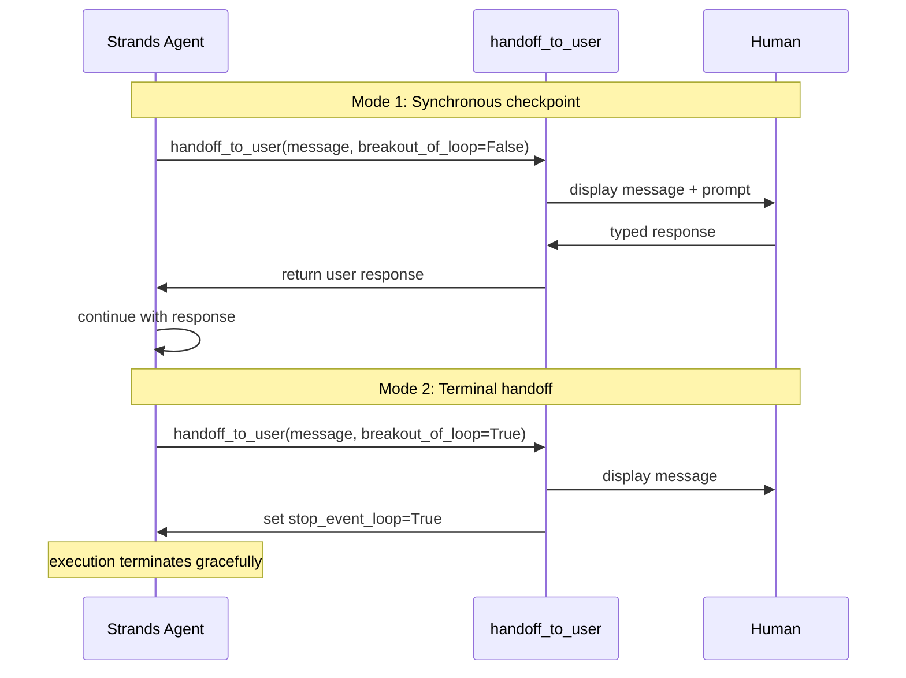

# L47: Human-in-the-Loop — Checkpoints and Handoffs

**Code:** `12_orchestration/hitl_checkpoints.py`
**Reflection:** [`level-47-reflection.md`](../../.claude/learnings/reflections/level-47-reflection.md)

### Level 47: Human-in-the-Loop — Checkpoints and Handoffs
**Goal:** Use Strands' built-in `handoff_to_user` tool for synchronous human checkpoints and terminal handoffs; understand the autonomy spectrum and when each mode applies

**Depends on:** L23 (Error Recovery — graceful failure), L22 (Safety — know what needs human oversight)
**Unlocks:** Production pattern for high-stakes agent actions with documented Strands SDK support

**Strands built-in: `handoff_to_user` from `strands_tools`**

The SDK ships with a `handoff_to_user` tool. Two modes (from source):

| Parameter | Behaviour | When to use |
|-----------|-----------|-------------|
| `breakout_of_loop=False` | Pauses agent, waits for user input, returns response to agent, continues | Mid-workflow approval: "Type 'confirm' to proceed" |
| `breakout_of_loop=True` | Sets `stop_event_loop=True`, terminates agent gracefully | Final handoff: "Task complete. Please review results." |



```
# From strands_tools/handoff_to_user.py — the actual built-in tool
from strands import Agent
from strands_tools import handoff_to_user

agent = Agent(tools=[handoff_to_user])

# Mode 1: checkpoint — agent pauses, waits, continues
# agent calls: handoff_to_user(message="...", breakout_of_loop=False)
# → user types response → agent receives it → continues

# Mode 2: terminal — agent hands off and stops
# agent calls: handoff_to_user(message="...", breakout_of_loop=True)
# → stop_event_loop=True → graceful termination
```

**Autonomy spectrum** (Deloitte, 2026): "humans in the loop, on the loop, and out of the loop—will emerge based on task complexity, business domain, workflow design, and outcome criticality."

| Mode | Strands support | Description |
|------|----------------|-------------|
| Human-in-the-loop | `breakout_of_loop=False` | Agent pauses at checkpoint, waits for human input |
| Human-out-of-the-loop | `breakout_of_loop=True` | Agent completes task, hands off result to human |
| Human-on-the-loop | Not built-in | Async review queue (requires external infrastructure: SQS, DynamoDB) |

**Confidence-based routing** (Orkes pattern): Route to human review when agent confidence is below threshold. In Strands, the agent itself decides whether to call `handoff_to_user` based on its own assessment — the LLM calls the tool when it encounters a decision it cannot make with sufficient confidence.

**Anthropic design principle** (from "Building Effective Agents"): "Agents can then pause for human feedback at checkpoints or when encountering blockers." Also: "it's also common to include stopping conditions (such as a maximum number of iterations) to maintain control."

**Key Concepts:**
- `handoff_to_user` is a built-in strands_tools tool — not something to build from scratch
- Two modes: synchronous checkpoint (`breakout_of_loop=False`) vs terminal handoff (`breakout_of_loop=True`)
- True "on-the-loop" (agent continues while human reviews asynchronously) is not built into Strands — requires external queue infrastructure
- The LLM decides when to call `handoff_to_user` based on its assessment of uncertainty or risk
- vs Steering (L29): Steering = automated policy evaluation before tool calls; HITL = explicit human judgment requested by the agent
- Anthropic: human oversight is a design feature, not a binary choice — "agents are built to accept human input at multiple touchpoints while maintaining operational independence between interventions"

**Sources:**
- `strands_tools/handoff_to_user.py` ✓ — built-in Strands tool; two modes (`breakout_of_loop`); synchronous checkpoint and terminal handoff
- [Anthropic: Building Effective Agents](https://www.anthropic.com/research/building-effective-agents) ✓ — "pause for human feedback at checkpoints or when encountering blockers"; stopping conditions for agent control
- [Orkes: Human-in-the-Loop in Agentic Workflows](https://orkes.io/blog/human-in-the-loop/) ✓ — definition: "strategically inserting a person into an automated workflow at the moments that matter most"; confidence-based routing pattern
- [Deloitte: AI Agent Orchestration 2026](https://www.deloitte.com/us/en/insights/industry/technology/technology-media-and-telecom-predictions/2026/ai-agent-orchestration.html) ✓ — autonomy spectrum: "humans in the loop, on the loop, and out of the loop"
- [LangGraph interrupt docs](https://docs.langchain.com/oss/python/langgraph/interrupts) — reference implementation of async `interrupt()` pattern (LangGraph-specific, not Strands)

---
