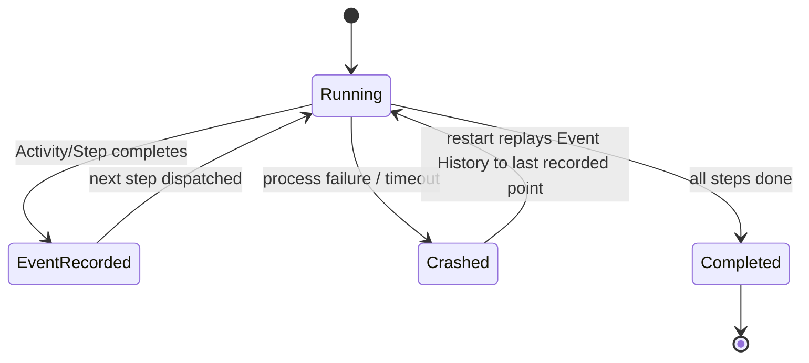

# L48: Durable Execution — Long-Running Agents That Survive Crashes

**Code:** `12_orchestration/durable_execution.py`
**Reflection:** [`level-48-reflection.md`](../../.claude/learnings/reflections/level-48-reflection.md)

### Level 48: Durable Execution — Long-Running Agents That Survive Crashes
**Goal:** Understand the two primary platform approaches to durable execution for long-running agents (Temporal and AWS Step Functions), how they differ from Strands' native session persistence, and when each is the right choice

**Depends on:** L5 (Sessions — understand what Strands session managers do and don't persist), L23 (Error Recovery — understand failure modes)
**Unlocks:** Long-running multi-day agent workflows; production reliability for agentic pipelines

**The architecture selection question** (StackAI, p.6): *"Will the task finish in one sitting, or does it need to run for minutes or hours with checkpoints?"* — one of five questions for choosing the right workflow architecture. StackAI (p.15): "Runtimes and orchestration layers are maturing too. **Checkpointing**, tracing, and policy enforcement are becoming standard building blocks. The direction is to make agents behave more like dependable software, even as the model does more of the reasoning."

**What Strands SessionManager does (and doesn't do):** Strands' `SessionManager` persists conversation history and agent state across process restarts — `FileSessionManager` for local dev, `S3SessionManager` for production. This is *conversation-level* persistence. Step-level execution checkpointing (resume at step 27 of 30 tool calls after a crash) is not a built-in Strands feature.

**Approach 1 — Temporal: Durable Execution as platform**

From the Temporal blog: *"We call this Durable Execution."* If the application crashes, it picks up where it left off when restarted. Key mapping to AI agents:

| AI Agent concept | Temporal primitive | What you get |
|---|---|---|
| LLM call / tool invocation | Activity | Automatic retry on failure, rate limiting handled |
| Agent orchestration loop | Workflow | State in workflow variables, event-sourced |
| Checkpointing | Event History | Implicit — no code needed |
| Memory | Workflow variables | Durable by design |
| Human-in-the-loop | Signals & Updates | First-class primitive |

*"Checkpointing keeps the application from having to start from the beginning and rerun previous steps in the workflow... As the developer, you are not responsible for implementing any part of this protocol."*

**Approach 2 — AWS Step Functions Standard Workflows**

AWS-native alternative (from the docs):
- Duration: up to **1 year**
- Execution semantics: **exactly-once** (a state never runs more than once unless `Retry` is specified)
- State internally persists between every state transition
- Automatically handles idempotency for duplicate execution names
- Suited for non-idempotent actions (payments, cluster creation, approvals)
- Express Workflows (at-least-once, 5-minute max) require idempotent steps



```
[*] --> Running
Running --> EventRecorded: Activity/Step completes
EventRecorded --> Running: next step dispatched
Running --> Crashed: process failure / timeout
Crashed --> Running: restart replays to last Event
Running --> Completed: all steps done
Completed --> [*]
```

```
# Temporal model — pseudocode (from Temporal blog)
# LLM calls are Activities: automatic retry + event-sourced state
workflow research_agent(task):
    results = {}
    for step in plan:
        result = Activity(llm_call(step))   # retried on failure automatically
        results[step.id] = result           # state in workflow vars (durable)
        # Event History updated after each Activity
        # crash here → replay Event History on restart → resume from here
    return synthesize(results)

# Step Functions model — pseudocode
state_machine (Standard Workflow):
    steps: [extract, validate, draft, submit]   # each is a State
    execution_semantics: exactly-once            # non-idempotent actions safe
    max_duration: 1 year
    state_persists: between every transition     # built-in durability
```

**Key Concepts:**
- Strands `SessionManager` = conversation/state persistence (not step-level execution checkpointing)
- Temporal = wrap LLM calls as Activities, orchestration as Workflow; crash recovery via event replay; zero checkpoint code
- Step Functions Standard Workflows = AWS-native exactly-once execution, state persists between transitions, 1-year duration
- Idempotency: Standard Workflows handle automatically; Express Workflows require idempotent steps because at-least-once
- Architecture decision: "will the task run for minutes or hours with checkpoints?" — determines whether session persistence (Strands) is sufficient or a durable execution platform (Temporal / Step Functions) is needed

**Sources:**
- [Temporal: Durable Execution meets AI](https://temporal.io/blog/durable-execution-meets-ai-why-temporal-is-the-perfect-foundation-for-ai) ✓ — Activities for LLM calls; Workflows for orchestration; crash recovery via event sourcing; HITL via Signals; "you never have to think about checkpoints"
- [AWS Step Functions: Standard vs Express Workflows](https://docs.aws.amazon.com/step-functions/latest/dg/concepts-standard-vs-express.html) ✓ — exactly-once semantics; state persists between transitions; 1-year duration; idempotency handling documented explicitly
- [StackAI: The 2026 Guide to Agentic Workflow Architectures](https://www.stackai.com/blog/the-2026-guide-to-agentic-workflow-architectures) ✓ — "checkpointing...becoming standard building blocks" (p.15); architecture selection question "will the task run for minutes or hours with checkpoints?" (p.6)
- Strands `SessionManager` source ✓ — `FileSessionManager` (local), `S3SessionManager` (production); conversation/state persistence; concurrency limitation on `FileSessionManager`

---
